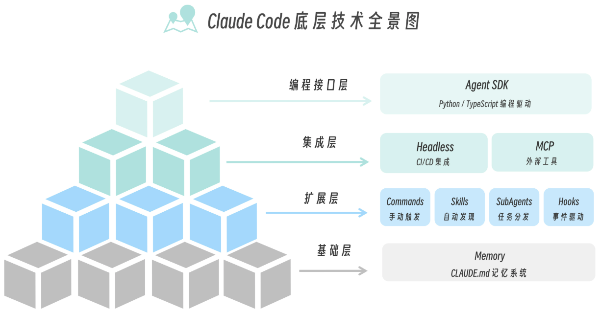
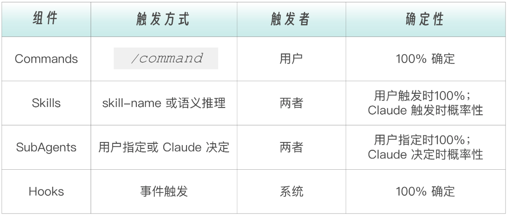
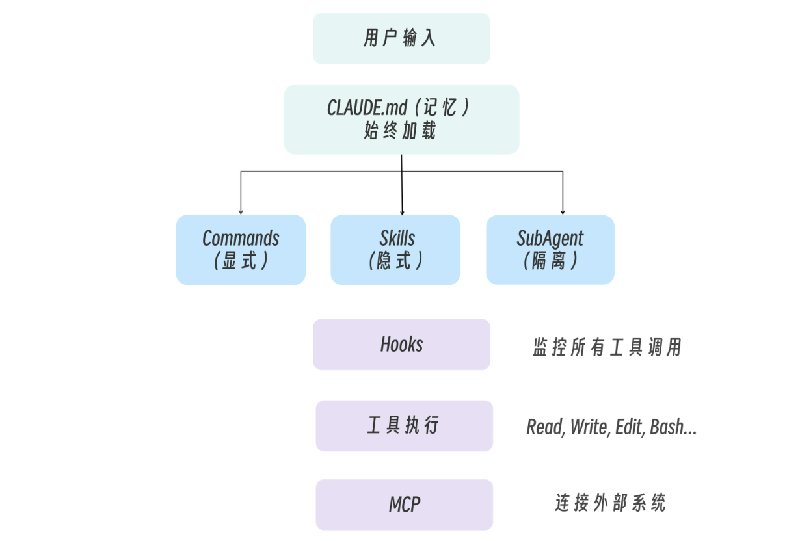
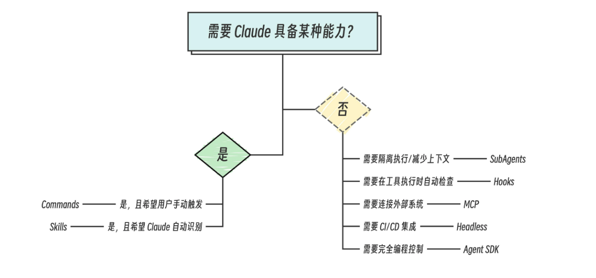
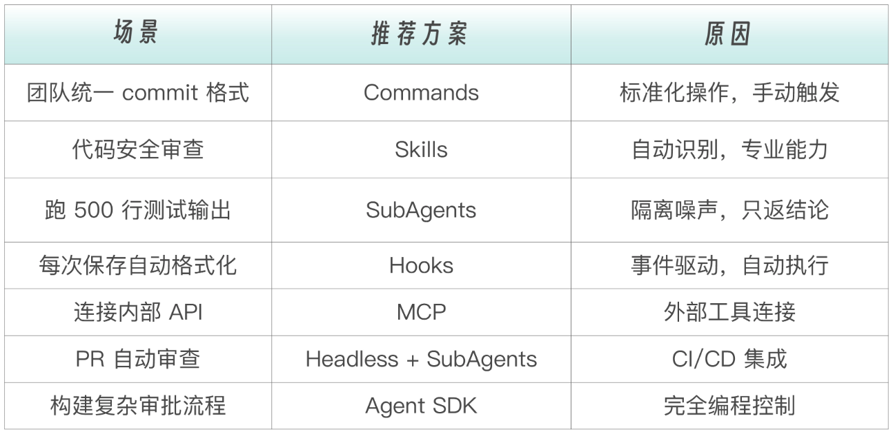
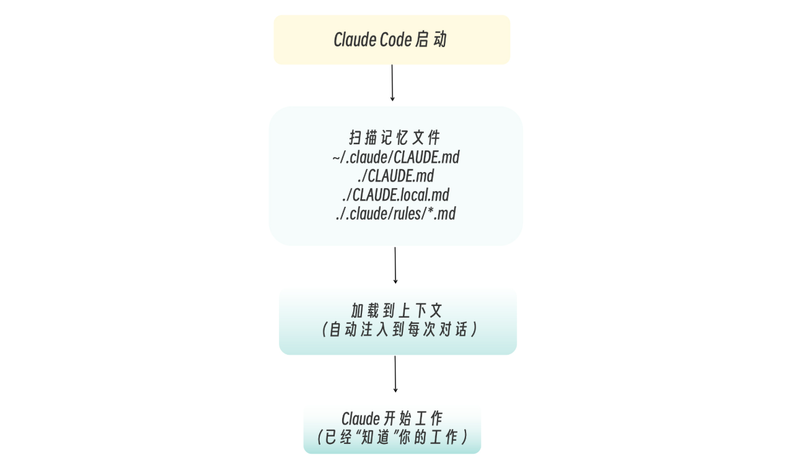
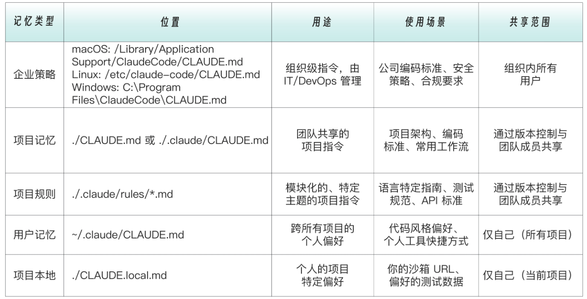
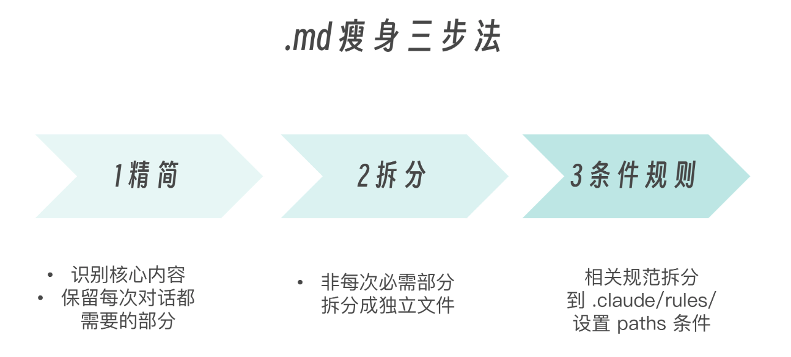

# Claude Code 基础

## claude code 的核心点

核心点：

- Memory：解决 Agent 每次对话都“从零开始”、不理解项目背景的问题，让 AI 真正记住你的代码结构、约束和上下文。
- Sub-Agents：解决单一 Agent 角色混乱、上下文污染、又写代码又做审查的问题，通过职责拆分实现关注点分离。
- Skills：解决 Prompt 不可复用、经验无法沉淀、团队能力难以传承的问题，把个人技巧变成可组合的工程资产。
- MCP：MCP 协议 是 Claude Code 连接外部数据库、API 和服务的标准化协议，就像给 AI 装上了能无限扩展能力的“万能插座”。
- Hooks：解决 Agent 执行过程不可控、缺乏检查点、容易“越权操作”的问题，在关键节点引入自动校验和人工兜底。
- Headless：解决 Agent 只能在 IDE 里交互、无法进入自动化流程的问题，让 AI 能在 CI/CD 中无人值守地运行。
- Agent SDK：解决只会用对话的方式使用 Agent，难以嵌入现有系统和工作流的问题，用代码驱动 Agent，构建可编排的工程流程。


## claude code 的底层技术全景




### 基础层：Memory（记忆系统）

风础层也可以称为是Claude Code的长期记忆系统，它的核心文件是 CLAUDE.md。记忆系统可以分几个层级：

```yaml
~/.claude/CLAUDE.md           # 全局（所有项目共用）
    ↓
项目根目录/CLAUDE.md           # 项目级（当前项目）
    ↓
项目根目录/.claude/rules/*.md  # 模块级（特定目录）
```

记忆系统相当于：比如入职一家新公司，第一天你会收到一份新员工手册，告诉你：公司的代码风格是什么，Git 提交信息怎么写，项目的架构是怎样的，有哪些不能碰的“禁区”等。


### 扩展层：四大核心组件

#### Commands（斜杠命令）

斜杠命令是 Claude Code 内置或用户自定义的一系列核心能力，其触发方式是用户手动输入: `/command`

```yaml
比如用户输入: /review
       ↓
Claude 执行: 根据 .claude/commands/review.md 的指令审查代码
Commands 适合标准化操作，比如：团队统一的 commit 格式、固定的部署流程等。
```


#### Skills（技能）

Skills 则代表着 AI 的一系列专属能力组合，其触发方式是 Claude Code 自动判断（语义推理）或者用户指定是否激活相应技能。Skills 可以是 Claude Code 内置的，也可以由用户自己设定。

```yaml
比如用户输入: 帮我看看这段代码有没有安全问题
       ↓
Claude 思考: 这是代码安全审查任务 → 激活 security-review Skill
       ↓
Claude 执行: 按照 Skill 中定义的流程审查代码
```


Skill 与 Tool 的区别：

- Tools 是外部能力接口，Skills是模型内部的“行为模式 + 触发逻辑”
- 如果 Tool 是函数调用，Skill 就是把 if-else、prompt、策略和调用顺序，全部折叠进一个文档的整体封装，是对一个专有能力集的全面定义
- 如果说 Tool 解决的是我能不能做，那么 Skill 解决的就是我该不该做、怎么做、做到什么程度


什么时候该用 Skill？什么时候该用 Commands？

- Commands 是显式、可复用、可审计、通过斜杠命令固定触发的操作指令集，是相对固化的标准流程
- 而当一个能力具备强烈的“领域感”（安全、架构、性能）、判断依赖上下文而非关键词 ，执行路径可能变化 ，需要“像专家一样行事”时，就用 Skill，而不是 Command

拿刚才的例子来说：当用户输入“帮我看看这段代码有没有安全问题”。Claude 的隐式判断流程是这样的：

1️⃣ 这是代码吗？ ——是
2️⃣ 这是哪一类代码？ ——Node.js 后端
3️⃣ 上下文是否涉及用户输入？ ——是
4️⃣ 是否存在鉴权逻辑？ ——是
5️⃣ 是否值得深入做安全审查？ ——是

做完这些判断之后，就会自动激活 security-review Skill。


在 Skill 内部，是“像专家一样”的行为说明，它不会跑固定 checklist，而是根据语言选择重点、根据上下文跳过无关项、在发现高风险点时主动深挖、在安全风险低时明确告诉你“为什么没问题” —— 这不是流程执行，这是专家判断


#### SubAgents（子代理）

SubAgents（子代理）用于独立完成专项任务。其触发方式可以由 Claude 决定或用户指定。

```yaml
主 Claude: 这个任务需要跑大量测试，让我创建一个子代理来处理
       ↓
子代理（test-runner）: 执行测试，只把结果汇报给主 Claude
```


SubAgents 本质上解决的是一个在 Agent 系统规模化之后必然出现的问题：单一Agent的上下文、 权限与职责无法无限膨胀

因此，把复杂任务拆解为多个拥有独立上下文、明确职责和受限权限的子代理， 已经成为多智能体系统中的一种工程共识。


#### Hooks（钩子）

钩子是在特定事件触发时自动执行的脚本，其触发方式是事件自动触发


```yaml
事件: Claude 即将执行 Edit 工具
       ↓
Hook: 自动检查是否有安全敏感内容
       ↓
结果: 如果发现问题，阻止执行并警告
```

Hooks 适合自动化检查: 如格式化、安全检查、日志记录等


### 集成层：连接外部世界

集成层，负责链接外部世界。包含 Headless（无头模式）和 MCP（Model Context Protocol）两大技术


####  Headless（无头模式）

无头模式让 Claude Code 在没有人工交互的情况下运行，适合 CI/CD 集成 ——自动代码审查、自动修复、自动生成变更日志等。


GitHub Actions 中
- name: Auto-fix code issues
  run: claude --headless "Fix all linting errors in src/"


#### MCP（Model Context Protocol）

MCP 让 Claude 连接外部工具和服务，可以把任何外部系统变成 Claude 可调用的工具

```yaml
Claude → MCP → 数据库
Claude → MCP → Jira
Claude → MCP → 自定义 API
```


### 编程接口层：Agent SDK

当配置式的扩展不够用时，可以用代码来驱动 Claude。这种方式适合构建自定义 Agent，完全控制执行流程、自定义工具、复杂工作流。

```python
from claude_sdk import ClaudeSDKClient

client = ClaudeSDKClient()

# 执行任务
result = client.query(
    prompt="Review this code for security issues",
    tools=["Read", "Grep"],
    max_turns=10
)
```


### claude code 组件能力组合

在真实开发中，上面的 claude code 组件能力不是孤立存在的，它们相互协作，共同完成复杂任务


#### 触发方式

首先看这些组件是怎么被激活的？不同的触发方式决定了它们的使用场景




确定性很重要，要设计一个生产系统：

- 如果需要“每次都必须执行”的操作（比如代码格式化），你需要 100% 确定性  ——选择 Commands 或 Hooks
- 如果希望 Claude “智能判断何时使用”（比如识别到安全问题时自动深入分析），你可以接受概率性  ——选择 Skills
- 如果任务可能很重，你希望“既可以手动触发，也可以让 Claude 自己决定”，你需要可控性  ——选择 SubAgents


#### 数据流向

数据是怎么在系统中流动的？一个典型请求的生命周期：




比如当用户输入“帮我修复 src/api.js 中的安全漏洞”之后，Claude 可能的处理流程如下：

```yaml
1. Memory 层：Claude 首先加载 CLAUDE.md，了解到这是一个 Node.js 项目，团队要求所有安全修复必须附带测试。

2. 扩展层分发：
  1. 用户没有输入斜杠命令，所以 Commands 不参与。
  2. Claude 识别出“安全漏洞”关键词，激活 security-review Skill。
  3. Skill 指示 Claude 创建一个子代理来执行测试。

Hooks 监控：Claude 准备执行 Edit 工具修改代码时，Hooks 自动运行预检查脚本，确保没有引入新的安全问题。

工具执行：通过 Read、Edit 等工具完成代码修改。

MCP 连接：如果配置了 Jira MCP，还可以自动更新相关的 ticket 状态。
```

Memory 是基础设施，始终存在；扩展层是能力中心，按需激活；Hooks 是守门人，监控一切。


#### Plugins: 打包容器

当开发了一套好用的 Commands、Skills、Hooks 组合，想要分享给团队或社区时，就需要 Plugins。

Plugins 不是一种新能力，而是打包机制。就像 npm 包把一堆 JavaScript 文件打包在一起，Plugin 把一组相关的 Claude Code 扩展打包在一起。

```yaml
my-plugin/
├── commands/           # 斜杠命令
│   └── review.md
├── skills/             # 技能
│   └── security-check/
│       └── SKILL.md
├── agents/             # 子代理
│   └── test-runner.md
├── hooks/              # 钩子
│   └── pre-edit.sh
└── plugin.json         # 插件配置
```


### claude 组件选型策略

可以参照下面决策：



下面一些选型示例：

> 问题 1：我希望团队成员都用统一的 commit message 格式

- 这是一种“能力”吗？是的，是生成规范 commit message 的能力
- 希望手动触发还是自动识别？手动触发更合适，因为不是每次对话都需要 commit
- **答案**：适合用 Commands （创建一个 /commit 命令）


> 每当 Claude 要修改代码时，我想自动检查是否符合我们的安全规范

- 这是一种“能力“吗？不是，这是一种“检查机制”
- 需要在工具执行时自动检查？ 对，在 Edit 工具执行前检查
- **答案**：适合用 Hooks （创建一个 pre-Edit hook）


> 我想让 Claude 能够查询我们内部的知识库

- 这是一种“能力”吗？ 不完全是，这是“连接外部数据源”
- 需要连接外部系统？ 知识库是一个外部系统
- **答案**： 适合用 MCP （创建一个知识库 MCP server）


其他：




### claude 组件组合

真实世界的问题很少能用单一技术解决。Claude Code 的强大之处在于组件可组合，每个组件做好自己的事，组合起来完成复杂任务。


假设想实现这样一个流程：每当有人提交 PR，自动进行代码审查，发现问题就评论，没问题就通过。这需要组合多种技术：

```yaml
1. Headless 模式在 CI 中触发
   └── GitHub Actions 监听 PR 事件，调用 claude --headless

2. 调用 code-review SubAgent
   └── 隔离审查任务，避免污染主流程上下文

3. SubAgent 使用 security-check Skill
   └── 自动识别安全相关代码，应用专业审查规则

4. Hooks 记录审查日志
   └── 每次工具调用都记录，便于审计和调试

5. 结果通过 MCP 发送到 Slack
   └── 审查完成后通知相关人员
```

这五个步骤涉及五种不同的技术，但组合在一起就是一个完整的自动化流程


## claude 记忆系统与 CLAUDE.md

### claude code 记忆系统基本原理

当启动 Claude Code 时，“记忆系统初始化”过程如下：




CLAUDE.md 就是 claude code 存储记忆的文件，每次对话都加载，应该尽可能精简。把“每次都需要”的内容放这里，把“偶尔需要”的内容放到 Skills 或文档里。


### claude code 五层记忆架构




### 分类组织

Rules是按主题组织的规则文件，**支持条件作用域**（也就是视情况来确定是否加载该记忆内容），适合场景包括CLAUDE.md 变得太长时，不同文件类型需要不同规范时。

> .claude/rules/*.md

```yaml
.claude/
└── rules/
    ├── typescript.md      # TypeScript 规范
    ├── testing.md         # 测试规范
    ├── api-design.md      # API 设计规范
    └── security.md        # 安全规范
```


**条件作用域：**

> .claude/rules/testing.md

````markdown
---
paths:
  - "src/**/*.test.ts"
  - "tests/**/*.ts"
---

# 测试规范

## 命名
- 单元测试: `*.test.ts`
- 集成测试: `*.integration.test.ts`

## 结构

使用 Arrange-Act-Assert 模式：

```typescript
describe('OrderService', () => {
  describe('createOrder', () => {
    it('should create order when stock is available', async () => {
      // Arrange
      const mockProduct = createMockProduct({ stock: 10 });

      // Act
      const order = await orderService.createOrder(mockProduct.id, 1);

      // Assert
      expect(order.status).toBe('created');
    });
  });
});
```

## 覆盖率要求
- 业务逻辑: > 80%
- 工具函数: > 90%
- 路由/控制器: 可以较低
````

关键是 `paths` 字段让这个规则只在编辑测试文件时生效，不会浪费其他场景的上下文空间


### 编写高效的 CLAUDE.md

CLAUDE.md 写得好不好，直接决定了 Claude 是靠谱同事，还是每次都要重新培训的实习生

下面是一些 CLAUDE.md 编写要遵循的核心原则，了解怎么写，才值得每次都被加载进上下文


#### 核心原则1：少即是多

CLAUDE.md 的每一行，都会在每一次对话开始时被自动注入上下文。这意味着一件事：冗余不是无害的，而是持续消耗的。所以**保持精简不是建议，而是必须**


#### 核心原则2：具体优于泛泛

看看一个常见，但是几乎没有任何效果的写法：

```markdown
# 项目规范

## 代码质量

请写出高质量的代码。代码应该是可读的。使用有意义的变量名。
保持代码整洁。遵循最佳实践。不要写重复的代码。
```

这些话没有一句是错的，但问题在于 Claude 本来就知道这些。它们不会改变 Claude 的任何决策，只会白白占用上下文空间。这些话对人类尚且含糊，对模型来说，更是几乎等于什么都没说


真正有价值的 CLAUDE.md，应该长这样：

````markdown
# 项目规范

## TypeScript
- 使用 `interface` 定义对象结构，`type` 用于联合类型
- 禁止 `any`，使用 `unknown` + 类型守卫
- 函数参数 > 3 个时，使用对象参数

## 错误处理
```typescript
// 业务错误
throw new BusinessError('ORDER_NOT_FOUND', '订单不存在');

// 验证错误（Zod 自动抛出）
const data = orderSchema.parse(input);
````

两者的差异非常明确。后者不是模糊要求“要高质量”，而是给出了如何做才算高质量；不是“注意错误处理”，而是具体的错误模型；不是抽象描述，而是可直接模仿的代码形态


#### 核心原则3：关键三问题 WHY / WHAT / HOW

一份真正“能用”的 CLAUDE.md，通常都在回答三个问题。不是一次性回答，而是**在关键地方给出明确指引**


**WHY —— 为什么要这样做？**


```markdown
## 为什么使用 Zod？

- TypeScript 只有编译时类型检查
- API 输入需要运行时验证
- Zod 可以同时生成 TS 类型和验证逻辑
- 错误信息自动生成，对用户友好
```

这一部分的作用，不是让 Claude “记住一个库”，而是让它理解背后的决策逻辑。当 Claude 明白了为什么 ，它在面对相似但不完全相同的场景时，才更可能做出一致的判断。


**WHAT —— 具体要做什么，不要做什么？**

```markdown
## 数据库操作规范

- 所有查询通过 Prisma ORM
- 复杂查询封装在 `src/repositories/`
- 禁止在 controller/service 中直接写 SQL
- 事务使用 `prisma.$transaction()`
```

这一部分的重点是边界。什么是允许的，什么是禁止的，决策应该发生在哪一层？对 Claude 来说，这比“最佳实践”四个字重要得多。


**HOW —— 按什么步骤去做？**


```markdown
## 创建新 API 端点

1. 在 `src/schemas/` 创建请求/响应 Zod schema
2. 在 `src/routes/` 添加路由定义
3. 在 `src/controllers/` 实现请求处理
4. 在 `src/services/` 实现业务逻辑
5. 在 `tests/` 添加测试用例
````

示例参考: `src/routes/orders.ts`

当步骤清晰、路径明确、还有参考文件时，Claude 才会稳定复用同一套工作流 ，而不是每次自由发挥


#### 核心原则4：渐进式披露

CLAUDE.md 的职责是定义默认决策，而不是承载全部知识，不要把一切都塞进 CLAUDE.md

对于非核心、但可能被用到的内容，正确的做法是引用，而不是复制


一份渐进式的 CLAUDE.md 示例：


````markdown
# 项目规范

## 核心
[精简的核心规范]

## 详细文档
- 数据库设计: 见 `docs/database.md`
- API 规范: 见 `docs/api-spec.md`
- 部署流程: 见 `docs/deployment.md`
````

这样做有两个好处：

- CLAUDE.md 保持轻量，启动成本低 。
- 当 Claude 需要进一步的细节信息时，可以按需读取引用文件。


### 记忆管理

要查看当前记忆，在 Claude Code 中输入：`/memory`，就会显示当前加载的所有记忆内容和来源。

编辑记忆的命令参数如下：

```shell
/memory edit         # 编辑项目级 CLAUDE.md
/memory edit user    # 编辑用户级记忆
/memory edit local   # 编辑本地级记忆
```

也可以通过自然语言指令，让 Claude 帮你更新记忆！


你：请记住，我们项目使用 pnpm 而不是 npm

Claude：好的，我可以将这个信息添加到项目的 CLAUDE.md 中。要我现在更新吗？


### CLAUDE.md 实战

参考 `01-Memory` 目录


### CLAUDE.md 瘦身

CLAUDE.md 会在每一次对话开始时自动加载。这意味着它并不适合承载所有信息，而只适合存放每次都必须知道的内容。当记忆过多、层级混乱，Claude 的行为反而会变得迟钝甚至不稳定


当 Claude 响应明显变慢，经常出现上下文长度警告，而且 Claude “忘记”对话早期的内容时，可以采用 “.md瘦身三步法”：精简 → 拆分 → 条件规则。




### Auto Memory 自动记忆

Claude Code 本身拥有自动记忆功能，随着项目的演进和对话的深入，会在 `~/.claude/projects/memory/` 目录下自动生成 Auto Memory，用于记录模型在项目中学习到的模式、调试经验与结构认知。

这意味着，Claude Code 的“记忆”并不是单一文件，而是一种多层叠加的上下文注入架构：有些是人为编写的长期规则，有些是组织级强制策略，还有一些是模型自动沉淀的经验笔记。CLAUDE.md 决定“系统被告知什么”，而 Auto Memory 决定“系统在实践中学到了什么”。记忆因此成为一种结构化的工程能力，而不是简单的对话缓存。

