# Claude Code 子代理

## SubAgents 子代理

### 为什么需要 SubAgents

一个场景：

- 让 Claude Code 帮你跑一个测试套件，结果输出了 500 行日志
- 然后让它分析一下代码结构，又输出了 200 行
- 接着你想让它改一个 bug...

这时候，对话上下文已经被各种“中间过程”塞满，真正重要的信息被淹没在茫茫的输出海洋里

这就是为什么 Claude Code 越用越“健忘”，并不是模型退化了，而是对话上下文，已经被一次次中间过程污染了。这些中间过程，**对“当下执行”是必要的，但对“后续决策”是噪声**。

这正是子代理要解决的核心问题：把“高噪声的执行过程”隔离出去

只有子代理，在系统层面天然拥有一个独立的上下文窗口。它是 Claude Code 里唯一一个，结构上允许“执行完即丢弃”的东西。

子代理，通过上下文隔离，让专业的Agent做专业的事儿，不是为了让 Claude 做得更多，而是为了让 Claude 记得更少，但记得对。


比如 openclaw，它本质上就是一个面向工程任务的 Agent 执行框架，它同样强调：

- 把执行过程和决策上下文拆开
- 用清晰的角色与能力边界，承载高噪声任务
- 执行完即回收，只保留结构化结果

换句话说，它解决的并不是“模型更聪明”，而是工程系统如何避免上下文被执行细节淹没。


### 什么是 SubAgents

一句话定义：子代理相当于一个“专职小助手”，带着自己的规则、工具权限、上下文窗口，去完成某一类任务，然后把“结果摘要”带回来。可以把它理解成：把一个大脑拆成多个岗位角色，每个岗位只做一件事，并且有明确的权限边界

既然是 Sub-Agent，那肯定要先有主 Agent。Claude Code 的主 Agent 就是当前操作的主对话。而主对话 vs 子代理，就是老板和员工的关系。

一家公司的老板（主对话）需要完成一个复杂的项目，有两种工作方式：

- 方式一：**事必躬亲**： 亲自去调研市场（输出 200 行分析）、亲自写代码（输出 500 行日志）、亲自测试（又是 300 行）、亲自写文档...最后脑子里塞满了各种细节，已经记不清最初的目标是什么了

- 方式二：**专人专岗**：安排一个市场专员去调研，只需要他给你一份 1 页的报告；安排一个测试工程师去跑测试，只需要他告诉你结果是“通过”还是“有 3 个失败”；安排一个技术文档专员去写文档……每个人带着明确的任务出去，完成后只把结论带回来

子代理就是后一种方式。它让主对话保持清洁，不被过程噪声污染。


### 子代理的核心价值

子代理的工程价值，本质上就是三件事：**隔离、约束、复用**


#### 隔离

**隔离，解决的是上下文污染问题**。当大量对当前执行有用、但对后续决策毫无价值的日志、搜索结果和中间推理，不应该进入主对话的长期记忆；子代理天然拥有独立上下文，执行完即丢弃，只把结论带回来，让 Claude 记得更少、但记得对


比如一个示例：

> 主对话上下文

```md
┌─────────────────────────────────────────┐
│ 用户：帮我分析一下这个 bug                 │
│        ↓                                │
│ Claude：好的，让我看看...                 │
│        ↓                                │
│ [子代理去执行，产生 500 行日志]             │
│        ↓                                │
│ [子代理返回：发现 3 个相关文件]             │
│        ↓                                │
│ Claude：我发现问题在这三个文件...           │
└─────────────────────────────────────────┘
```


子代理的上下文（独立的，执行完就释放）：

```md
┌─────────────────────────────────────────┐
│ 任务：查找 bug 相关文件                    │
│        ↓                                │
│ [搜索输出 500 行日志]                     │
│        ↓                                │
│ [分析过程...]                            │
│        ↓                                │
│ 结论：3 个相关文件                        │
└─────────────────────────────────────────┘
```

主对话只看到子代理所返回的结论 ，不需要承载 500 行的搜索过程。这意味着你的对话不会因为一次大搜索就把 token 配额用光，重要的讨论内容不会被中间输出淹没，Claude 在后续对话中能更好地“记住”关键信息。


#### 约束

**约束，解决的是行为不可控问题**。通过工具权限边界，把“我希望你别这么做”变成“你物理上做不到”，让代码审查只能读、修 bug 才能写，角色职责不再依赖提示词自觉。

子代理可以有精确的工具权限控制：

```md
# 只读型子代理（代码审查）：它只能看，不能改任何东西
tools: Read, Grep, Glob


# 开发型子代理（bug 修复）：它可以读写文件和执行命令
tools: Read, Write, Edit, Bash


# 研究型子代理（技术调研）：它可以读本地文件和搜索网络
tools: Read, WebFetch, WebSearch
```

比如让 Claude 帮你审查代码，只希望它看，不希望它动手改。如果没有权限边界，Claude 可能在审查过程中顺手帮你“修”了一些它认为有问题的代码。这不是你想要的行为。

有了子代理，就可以创建一个 code-reviewer 角色，明确规定它只有 Read, Grep, Glob 权限。这样它再怎么想“插手”，也改不了任何东西。


#### 复用

**复用，解决的是经验无法沉淀的问题**。当子代理被定义成文件、放进版本控制后，好的使用方式就从一次性对话，变成了可共享、可迭代的工程资产。

子代理的配置保存在文件中，有这样几个好处：

- **版本控制**：放进 git，团队共享
- **跨项目复用**：好用的配置可以复制到其他项目
- **渐进优化**：根据实际使用情况不断调整 prompt，持续优化改善


一个 agent 示例

```yml
.claude/agents/
├── test-runner.md # 测试运行专员
├── code-reviewer.md # 代码审查专员
├── log-analyzer.md # 日志分析专员
└── bug-fixer.md # Bug 修复专员
```

这些配置文件就像公司里的“岗位说明书”，每个岗位职责清晰、权限明确。


**隔离、约束、复用**，这三点分别对应着三个经典的软件工程命题：**内存管理、安全边界、组织效率**。这三点合在一起，标志着 Claude Code 的使用方式，从“对话技巧”，正式跨入“工程系统”。


### Claude 内置 SubAgent

Claude Code 内置了一系列子代理，当你问 Claude：“解释这个Github代码库”时，在不知不觉间，Claude Code 就会自动调用内置子代理。

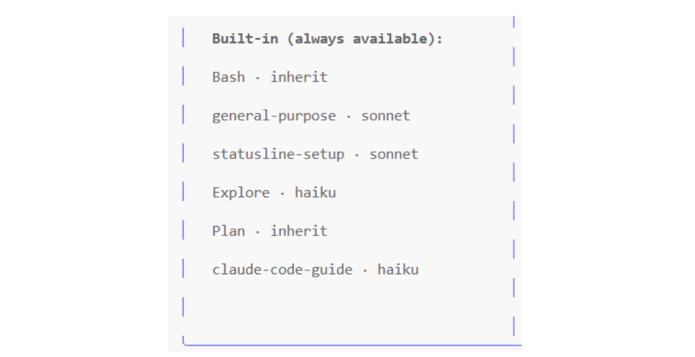


下面简单介绍几个子代理：


#### Explore 子代理

**Explore 子代理**负责“翻项目、找位置”，专注快速只读搜索，把成百上千行 grep 和分析过程吞进去，只告诉你结论在哪里。

```md
┌────────────────────────────────────────────────────────┐
│  Explore（探索者）                                      │
├────────────────────────────────────────────────────────┤
│  特点：快速、只读                                        │
│  用途：搜索和分析代码库                                   │
│  模式：quick / medium / very thorough 三档              │
│  工具：Read, Grep, Glob（不能写）                        │
└────────────────────────────────────────────────────────┘
```

当你问 Claude “这个项目的认证逻辑在哪里”时，它会自动派出 Explore 子代理去搜索，而不是在主对话中一行行地执行 grep 命令。


#### Plan 子代理

**Plan 子代理**负责“动手前先想清楚”，在真正修改代码之前，收集上下文、梳理依赖、生成实施路径，避免一上来就盲目修改。

```md
┌─────────────────────────────────────────────────────────┐
│  Plan（规划者）                                          │
├────────────────────────────────────────────────────────┤
│  特点：规划模式专用                                       │
│  用途：在制定实施计划前收集项目上下文                        │
│  限制：子代理不能再生成子代理（防止无限嵌套）                 │
└─────────────────────────────────────────────────────────┘
```

当你让 Claude 进入规划模式时，它会用 Plan 子代理来收集信息，设计实施方案。


#### General-purpose 子代理

**General-purpose 子代理**则是“能探索、能修改、能推进”的全能型员工，适合需要多步骤协作的复杂任务。

```md
┌────────────────────────────────────────────────────────┐
│  General-purpose（通用型）                              │
├────────────────────────────────────────────────────────┤
│  特点：全能型，处理复杂多步骤任务                           │
│  用途：同时需要探索和修改的任务                            │
│  工具：完整工具集                                        │
└────────────────────────────────────────────────────────┘
```

当任务比较复杂，需要多种能力配合时，就可以使用这个通用型子代理。

这些子代理的共同点只有一个：把高噪声过程留在子代理里，让主对话只保留决策信息。


### 什么时候使用子代理

并不是所有任务都值得动用子代理。一个最直观的判断标准是：**主对话到底需不需要承载执行过程本身**


#### 高噪声输出的任务

第一类非常适合用子代理的是**高噪声输出的任务**。这类任务的共同特点是：执行过程中会产生大量中间信息，但主对话真正关心的，往往只有一个结论

例如跑一次测试会输出几百行日志，但你只想知道通过还是失败；扫描日志和错误栈时，真正有价值的可能只是一两条关键错误；在整个代码库里做搜索，最终只需要知道相关文件在哪里；生成一份长报告，主对话只需要摘要。

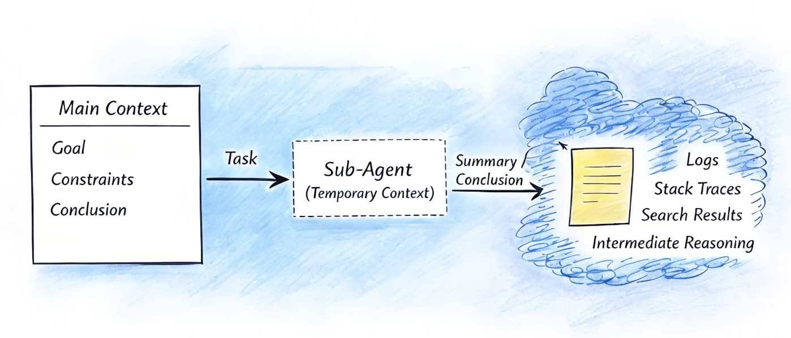

这些场景中，执行过程本身就是噪声，用子代理把过程隔离起来，只把结论带回来，是最自然、也最干净的做法。


#### 角色边界非常明确的任务

第二类适合用子代理的是**角色边界必须非常明确的任务**。有些事情，你只希望 Claude “看”，而不希望它“动手”；有些操作，只能在特定目录、特定范围内发生；还有一些敏感操作，本身就需要和其他任务隔离开来。

如果没有子代理，这些约束只能靠提示词和使用者的心理预期维持。而一旦通过子代理定义工具权限，边界就从不稳定变成了明确的“系统级约束”。没有写权限，就无法修改文件；没有执行权限，就无法运行命令。正因为边界被落实为能力边界，而不是行为约定，子代理才成为解决安全性和可控性问题的可靠手段。


#### 可以并行展开的研究型任务

第三类适合用子代理的是**可以并行展开的研究型任务**。当需要同时调研认证逻辑、数据库设计和 API 接口，或者对比几种技术方案、从多个视角分析同一个问题时，这些探索之间往往是相互独立的。与其在主对话里来回切换，不如让多个子代理各自去完成自己的探索，再把结果汇总回来。子代理在这里的价值，不只是隔离上下文，更是天然的并行加速器。

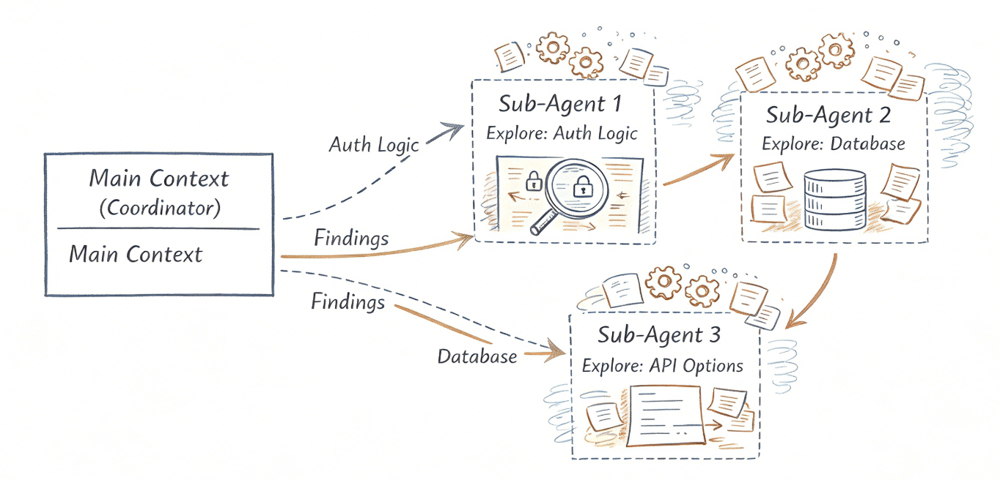


#### 可以拆成清晰阶段的流水线式任务

第四类适合用子代理的是**可以拆成清晰阶段的流水线式任务**。比如先定位代码位置，再做代码审查，然后进行修改，最后跑测试验证。

```md
Explore（找位置）
    ↓
Reviewer（指出问题）
    ↓
Fixer（修复）
    ↓
Test-runner（验证）
```

这类任务的关键在于每一个阶段的目标、权限和输出都是明确的。用子代理把每一段责任固定下来，不但让流程更清晰，也让每一步的上下文更加干净。这不是为了复杂化流程，而是为了避免不同阶段的信息互相污染。

当然，也有一些情况并不适合使用子代理。如果任务需要频繁来回确认需求、不断调整方向，那子代理这种“派出去干活再回来汇报”的模式反而会拖慢节奏；如果任务的各个阶段高度耦合，每一步都强依赖上一阶段的详细过程，那强行隔离上下文只会增加认知负担；还有非常简单的小任务，启动子代理本身就有开销，直接在主对话中完成，反而更高效。


### 子代理不能生成子代理

一条关键约束：**子代理不能生成子代理**。也就是说，code-reviewer 子代理不能在执行过程中再派出一个 security-scanner 子代理。

- 所有编排必须由主对话完成 ：如果你需要“先审查再修复”，必须由主对话依次调用两个子代理，而不是让第一个子代理去调用第二个
- 流水线的“调度中心”只有一个 ：就是主对话本身
- 如果需要在子代理内复用知识 ：用 skills 字段预加载（而非再嵌套一个子代理）


### 子代理配置文件解释

子代理使用 Markdown + YAML frontmatter 格式，示例：

```md
---
name: code-reviewer
description: Review code for security issues and best practices. Use after code changes.
tools: Read, Grep, Glob
model: sonnet
---


你是一个代码审查专家。

当被调用时：

1. 首先理解代码变更的范围
2. 检查安全问题
3. 检查代码规范
4. 提供改进建议

输出格式：
## 审查结果
- 安全问题：[列表]
- 规范问题：[列表]
- 建议：[列表]
```

`---` 里面定义的是子代理的元数据和配置，下方的 Markdown 正文就是子代理的系统提示词。子代理**只会收到**这段系统提示词和基本环境信息（如工作目录），不会继承主对话的完整系统提示词。


`---` 中的配置信息完整字段如下：其中 name 和 description 是必填字段，其余均为可选

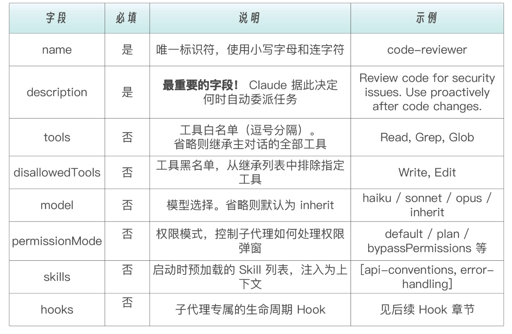


#### description

description 字段决定了 Claude 何时自动调用子代理；这是配置中最重要的设计决策。

```md
# 写的太模糊，Claude 不知道什么时候该用它
description: A code reviewer


# 好的 description：说明做什么 + 什么时候用
description: Review code changes for quality, security vulnerabilities, and best practices. Use proactively after code is modified or when user asks for code review.

优点：说明了做什么 （审查代码质量、安全、规范）和什么时候用 （代码修改后，或用户请求时）。“Proactively” 这个关键词会鼓励 Claude 在合适的时机主动委派任务。
```


#### tools vs disallowedTools：白名单与黑名单

控制子代理能使用哪些工具有两种方式：

- 方式一：白名单 (tools) — "只能用这些"。适合：需要严格限制的场景（如只读审查）
  ```md
  tools: Read, Grep, Glob
  ```
- 方式二：黑名单 (disallowedTools) — “继承所有，但排除这些”。适合：需要大部分工具但排除少数危险工具的场景
  ```md
  disallowedTools: Write, Edit
  ```

两者的选择取决于想要的表达方式：如果子代理只需要少数几个工具，用白名单更清晰；如果子代理需要大部分工具但排除个别，用黑名单更简洁。**不要同时使用两者**，选一种即可。

工具权限应遵循最小权限原则——只开放必要的工具，能用 Read 完成的任务，就不要给 Edit。以下是根据用途划分的典型工具组合：

```md
只读型（审计/检查）     研究型（信息收集）        开发型（读写改）
├── Read                ├── Read                ├── Read
├── Grep                ├── Grep                ├── Write
└── Glob                ├── Glob                ├── Edit
                        ├── WebFetch            ├── Bash
                        └── WebSearch           ├── Glob
                                                └── Grep
```


#### permissionMode：权限模式

permissionMode 控制子代理在执行过程中遇到需要权限的操作时如何处理。子代理会继承主对话的权限上下文，但可以通过此字段覆盖行为：

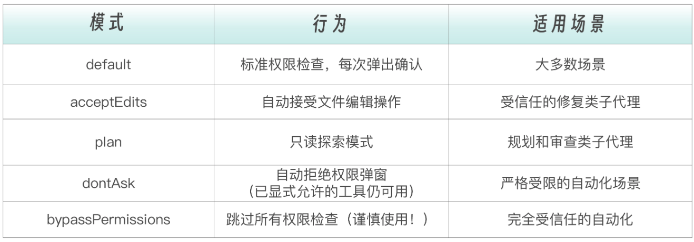

举例：如果希望子代理能跑 git diff 但绝不能修改文件，可以这样配置：

```md
---
name: code-reviewer
tools: Read, Grep, Glob, Bash
permissionMode: plan          # 强制只读模式，即使有 Bash 也无法写入
---
```

这比单纯依赖 prompt 约束更可靠。permissionMode: plan 是系统级 的只读保障。


#### model：模型选择与默认值

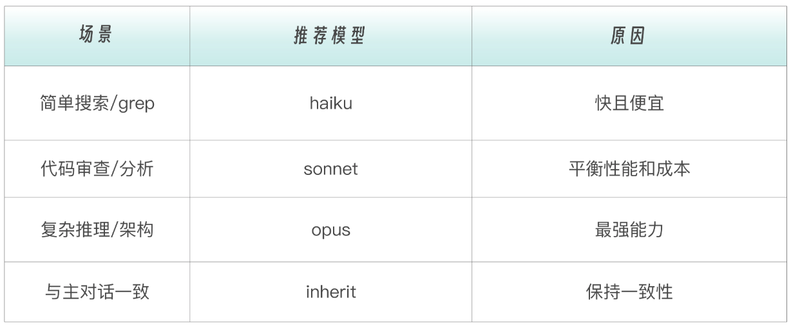


#### skills：为子代理预加载知识

skills 字段允许你在子代理启动时，把指定 Skill 的完整内容注入到子代理的上下文中。这意味着子代理不需要在执行过程中发现和加载 Skill，知识已经在它的脑子里了。

```md
name: impact-analyzer
description: Analyze impact scope of code changes on the full call chain.
tools: Read, Grep, Glob, Bash
skills:
  - chain-knowledge        # 链路拓扑和 SLA 约束
  - recent-incidents       # 近期事故记录
```

子代理不会 自动继承主对话中可用的 Skill。如果你希望子代理拥有某个 Skill 的知识，必须在这里显式列出


#### hooks：子代理专属的生命周期 Hook

子代理可以在自己的 frontmatter 中定义 Hook——这些 Hook 只在该子代理运行期间生效 ，子代理结束后自动清理。

```md
---
name: db-reader
description: Execute read-only database queries.
tools: Bash
hooks:
  PreToolUse:
    - matcher: "Bash"
      hooks:
        - type: command
          command: "./scripts/validate-readonly-query.sh"
---
```

上面的例子中，db-reader 虽然拥有 Bash 工具，但每次执行 Bash 命令前都会被 Hook 拦截验证——只有 SELECT 查询能通过，INSERT/UPDATE/DELETE 等写操作会被阻止。这比不给 Bash 工具更灵活（允许读操作），又比无约束的 Bash 更安全。

总结：**子代理不仅可以控制有哪些工具，还可以控制工具能做什么操作**


### 子代理的存放位置与优先级

子代理可以被设置为不同的作用层级。当多个作用层级存在同名子代理时，高优先级的会覆盖低优先级的。

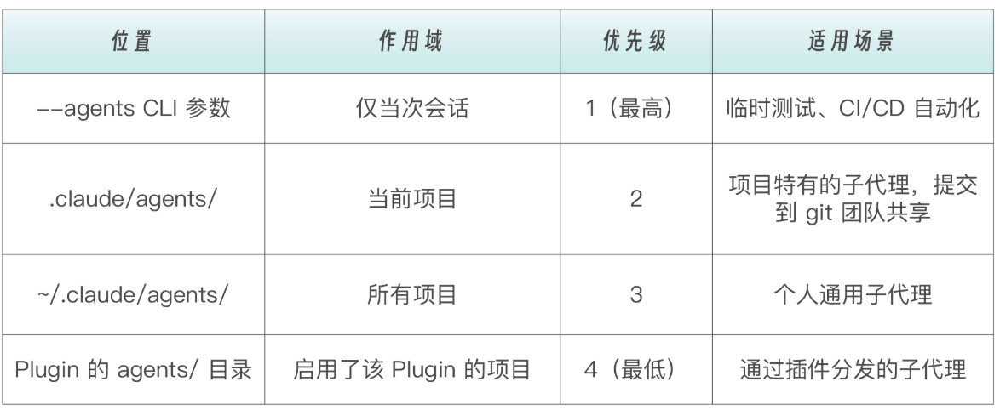

其中，项目级的适合项目特有的角色，比如针对特定框架的测试运行器，如下：

```yml
project/
└── .claude/
    └── agents/
        ├── test-runner.md
        └── code-reviewer.md
```

用户级的，子代理适合通用角色，比如日志分析器、通用代码审查器等：

```yml
~/.claude/
└── agents/
    ├── general-reviewer.md
    └── log-analyzer.md
```


### 创建子代理

**方式一 ：交互式创建**

在 Claude Code 中：

```md
步骤 1：输入 /agents
步骤 2：选择 "Create new agent"
步骤 3：选择存放位置（User-level 或 Project-level）
步骤 4：选择 "Generate with Claude" 并描述功能
步骤 5：选择需要的工具
步骤 6：选择模型
步骤 7：保存
```

这种方式简单直观，Claude 会帮你生成初始的 prompt


**方式二 ：手写配置文件**

直接创建 .claude/agents/your-agent.md 文件。其优势是更精细的控制，方便版本管理，可以从其他项目复制


**方式三：CLI 参数临时创建**

通过 --agents 参数，可以在启动 Claude Code 时传入 JSON 格式的子代理定义。这种方式创建的子代理仅在当前会话中存在，不会保存到磁盘。这种方式特别适合CI/CD 自动化时在流水线中临时创建任务专用的子代理


### 子代理的运行模式

子代理不只是“派出去，等回来”这么简单。它可以在前台或后台运行

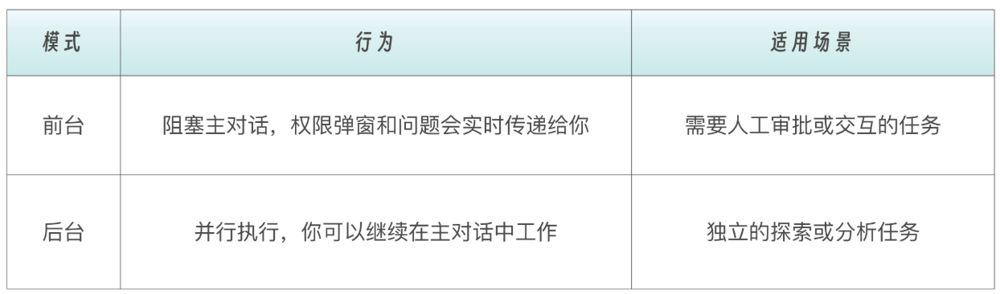

Claude 会根据任务自动选择前台或后台。也可以通过手动控制

- 对 Claude 说 “run this in the background”
- 正在运行的前台子代理可以按 Ctrl+B 切换到后台


## Multi-Agent 工程

### 什么时候该用多 Agent？

先从单 Agent 起步，优先通过引入工具扩展能力； 只有当系统确实触及单 Agent 的架构边界时， 才考虑采用多 Agent 的设计模式

这不是保守，而是工程智慧。每增加一个 Agent，你就增加了一层调试复杂度、一份 token 成本、和一个潜在的失败点。但当你的任务真的跨越了单 Agent 的能力边界时，正确的多 Agent 架构会带来巨大性能提升

> Anthropic 的多 Agent 研究系统在内部评测中，比单 Agent Claude Opus 4 性能提升了 90.2%


#### 两个核心触发条件

**条件一：上下文管理挑战**

当多个能力领域的专业知识无法舒适地塞进单一 prompt 中时，需要策略性地分发上下文，而不是把所有东西堆在一起。

当 Agent 的上下文窗口接近满载时，模型在任务完成上的表现会显著下降，进入所谓的 dumb zone（迟钝区）

此时，可以使用 Multi-Agent


**条件二：分布式开发需求**

当多个团队需要独立拥有和维护各自的 Agent 能力时。比如安全团队维护审计 Agent，测试团队维护测试 Agent，各团队可以独立迭代而不互相干扰。此时，可以使用 Multi-Agent

单 Agent 的困境：

```md
┌─────────────────────────────────────────────────┐
│ System Prompt:                                  │
│   - 你是代码专家（200行指令）                      │
│   - 你也是测试专家（150行指令）                    │
│   - 你还是安全审计专家（180行指令）                 │
│   - 你同时是文档撰写专家（100行指令）               │
│   ...                                           │
│   Token 爆炸，模型注意力分散                       │
└─────────────────────────────────────────────────┘
```


### Multi Agent 四种核心设计模式

#### 模式一：Sub-Agents（子代理委派 / 集中式编排）

Sub-Agents 的核心设计思想是一个 Supervisor Agent 充当老板，将任务分解后委派给专门的 Sub-Agent。每个 Sub-Agent 解决一个特定的任务。

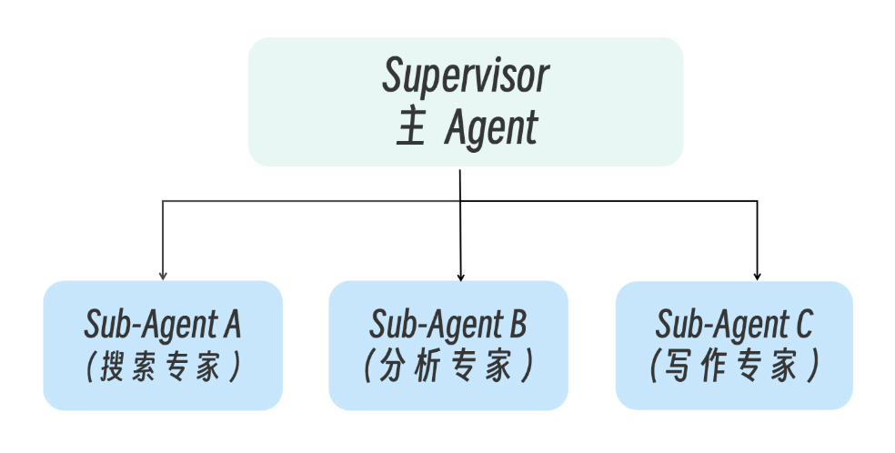

在 Sub-Agent 架构中，上下文隔离能力非常强，每个 Sub-Agent 都拥有独立的上下文窗口，从根本上避免了信息相互污染。Sub-Agent 本身通常设计为无状态组件，专注于完成被委派的单次任务，而整体对话状态与流程控制则由 Supervisor 统一维护。

这种结构天然支持并行执行，多个 Sub-Agent 可以同时展开工作，从而显著提升复杂任务的吞吐效率。用户并不直接与各个 Sub-Agent 交互，而是始终通过 Supervisor 间接沟通，由其负责任务拆解、结果汇总与最终输出。


在 Anthropic 的真实生产系统中，Research 功能采用的就是一种典型的 Sub-Agent 架构：

```md
LeadResearcher（Claude Opus 4）分析查询、制定策略
    ↓
并行派出 3-5 个 SubAgent（Claude Sonnet 4），各自独立搜索
    ↓
每个 SubAgent 执行 3+ 个并行工具调用
    ↓
CitationAgent 处理引用和来源归属
    ↓
结果汇聚回 LeadResearcher 综合输出
```

> 工程评测显示，并行化的 Sub-Agent 执行方式可将复杂查询的整体研究时间最多缩短约 90%，但其代价是相较普通对话约 15 倍的 token 消耗；在高价值研究任务中，这一成本换来了高达 90.2% 的整体性能提升。


为了在不同复杂度任务中控制资源消耗，Anthropic 在 Prompt 层引入了明确的**努力分配规则**。简单来说就是：对简单问题仅启用单个 Agent 和有限次数的工具调用，而在复杂研究场景下则调度更多 Sub-Agent 全面并行执行。


#### 模式二：Skills（技能 / 渐进式能力加载）

LangChain把Skills也视为一种多智能体模式。其实此时仍然是单个 Agent（或SubAgent），但通过SKILL.md 文件（或类似配置）实现能力的渐进式加载 。Agent 一开始只知道技能的名称和描述，当判断需要某个技能时，才加载完整的指令。

这是一种“准多 Agent”方案——用更轻量的 prompt 切换替代完整的 Agent 切换。

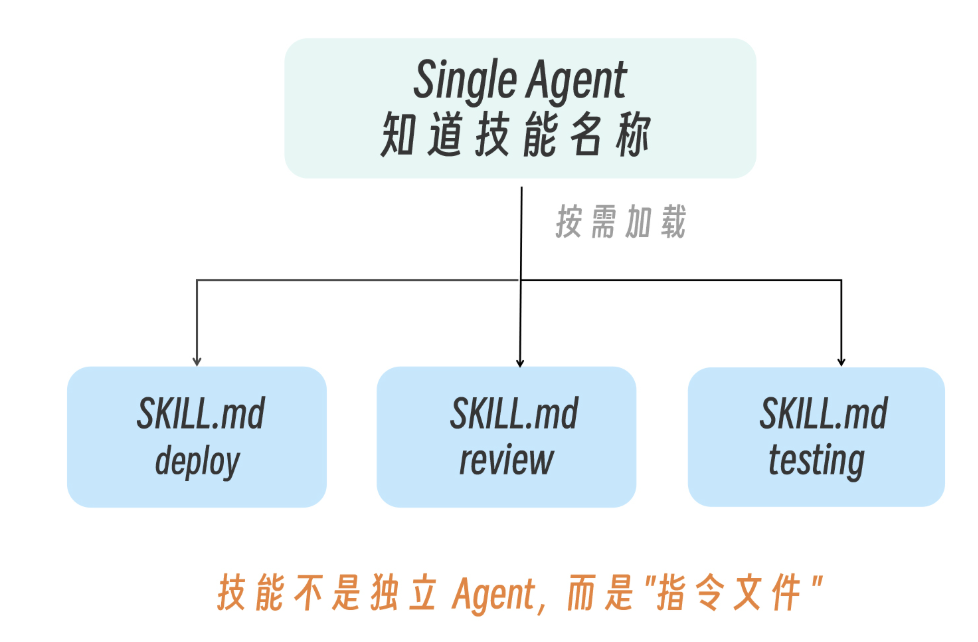

在 Skills 模式下，系统仍然由单一 Agent 负责全部推理与执行，所有技能共享同一个上下文窗口，因此在上下文隔离能力上相对较弱，但换来的好处是对话状态可以自然连续地保留在同一个 Agent 内部，无需额外的状态协调机制。

由于不存在多个 Agent 的并行调度，整体执行过程以顺序方式展开，并行能力相对有限，但在多数交互式场景下已经足够。用户始终与同一个 Agent 直接交互，交互路径最短，体验也最为流畅。


```yml
.claude/skills/           
├── deploy/
│   └── SKILL.md          # 部署技能的完整指令
├── review-pr/
│   └── SKILL.md          # PR 审查技能的指令
└── database-migration/
    └── SKILL.md          # 数据库迁移技能的指令
```

Skills 模式特别适合那些能力种类繁多、但单次任务只需要调用少量能力的场景，例如需要同时支持十余种操作模式的编码助手，或在写作、设计、排版等多种创意形态之间切换的创意工具。在这类系统中，Agent 可以在保持连续对话体验的前提下，按需加载对应技能，避免在一开始就引入过多指令。

这种模式的复杂度最低，执行路径清晰、因果关系明确。但对话上下文会随着历史交互逐步累积，后续调用的 token 成本可能持续膨胀；相应地，这种模式在首次调用时几乎没有额外调度开销，响应延迟最低，同时也为用户提供了最自然、最直观的交互体验。


#### 模式三：Handoffs（交接 / 状态驱动的 Agent 切换）

Handoffs的核心思想是活跃的 Agent 根据对话状态动态切换 。Agent A 完成自己的阶段后，通过调用 handoff() 工具将控制权（和上下文）传递给 Agent B。

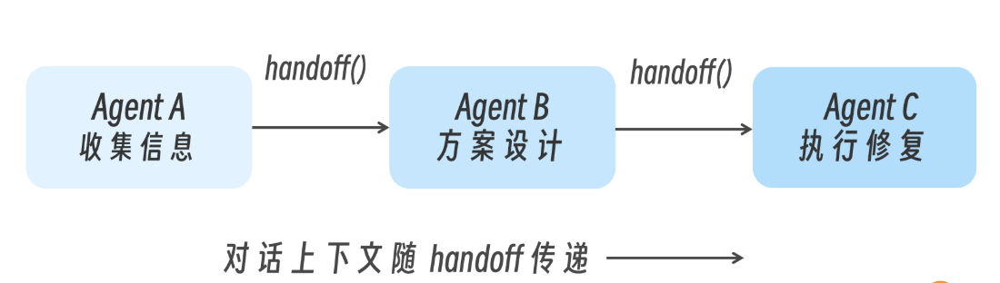

在 Handoffs 模式下，不同 Agent 之间通过显式的交接机制完成角色切换，上下文并非整体共享，而是可以根据需要选择性地传递。


Handoffs的典型应用是客服工单流程：

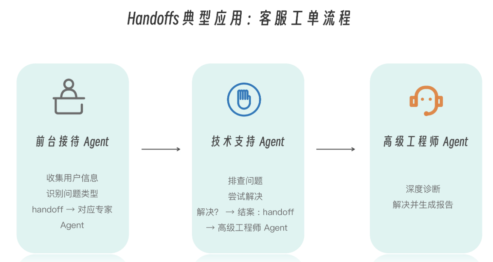

Sub-Agent和Skills这两种模式都是Claude Code原生的，很容易理解，但是Hand-off 如何实现？

其实，在 Claude Code 中并不存在一个底层 API 叫 handoff()， Handoffs 是通过 Prompt + 状态约束 + 工程结构模拟出来的。

换句话说：**Handoffs 是一种工程模式，不是一个框架特性**。


在 Claude Code 中实现 Handoffs 的三大工程要素：

- 明确的阶段状态（State）。需要显式定义流程阶段
- 每个阶段都是一个“角色约束的 Agent 视角”，比如：阶段一：信息收集（前台接待）；阶段二：技术诊断；阶段三：执行与修复
- 显式的阶段完成条件（Handoff Trigger）。这是 Handoffs 能稳定运行的核心。每个阶段都必须有完成条件（Exit Criteria），否则就会“卡在阶段里出不来


Handoffs 模式最适用于具有明确阶段划分的流程型场景 ，例如从信息收集到问题诊断再到解决方案输出的多阶段客服或工单系统，尤其适合那些需要在满足前置条件后才能逐步解锁能力的业务流程。

Handoffs 模式的严格的顺序执行限制了并行能力，在涉及多个领域或多源查询时效率最低，但在强调流程完整性和交互自然度的场景中，往往是体验最优、可控性最强的方案。


#### 模式四：Router（路由器 / 并行分发与合成）

Router 模式的核心在于**对输入进行语义拆分与职责分流**。系统首先由 Router 对用户请求进行分类和分解，然后将子查询并行分发给各自负责的专业 Agent，最后再将多个结果统一合成为一个对用户友好的响应。

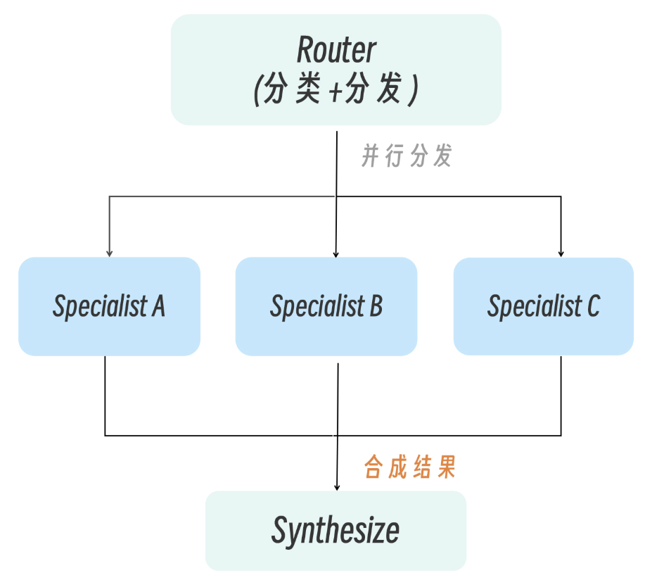

这种架构天然适合处理跨多个知识域或数据源的查询，例如在企业知识库场景中，用户一次提问可能同时涉及政策文档、业务数据和实时指标，Router 可以将“退货政策”交由政策文档 Agent 处理，将“销售数据”交由数据分析 Agent 处理，并在上层完成结果整合后统一返回。


在 Claude Code 中，Router 通常以下面三种形态之一存在：

- 主 Agent 中的一段路由决策逻辑（最常见）
- 一个可调用的 Tool（Router-as-Tool）
- 一个轻量的 Sub-Agent（只负责分类，不负责执行）

本质都是同一件事：**先判断“这是什么问题”，再决定“交给谁处理”**

Router模式的工程优势在于极强的并行能力和清晰的职责边界，各处理分支彼此独立、上下文完全隔离，既有利于扩展，也便于独立观测和调试。

其代价在于该模式通常是无状态的，无法充分利用历史对话上下文来减少重复计算；在需要连续对话的场景中，往往需要将 Router 作为一个工具嵌入到有状态的主 Agent 中，以在并行效率和对话连续性之间取得平衡。


### Multi Agent 几种模式的性能、成本、可控性对比

LangChain 对这四种模式做了实际的性能量化测试，分别从单任务请求的模型调用次数、重复请求的效率，和复杂问题的Token消耗三个方面进行了对比：


**场景一：单任务请求（如“帮我修改函数支持分页查询”）**

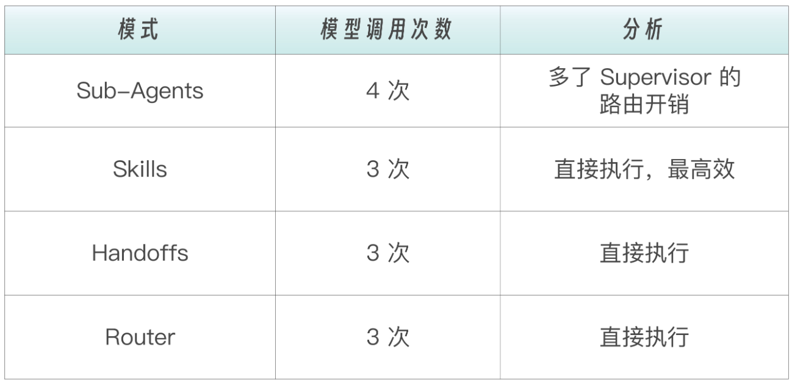


**场景二：重复请求效率（第二轮相同类型的请求）**

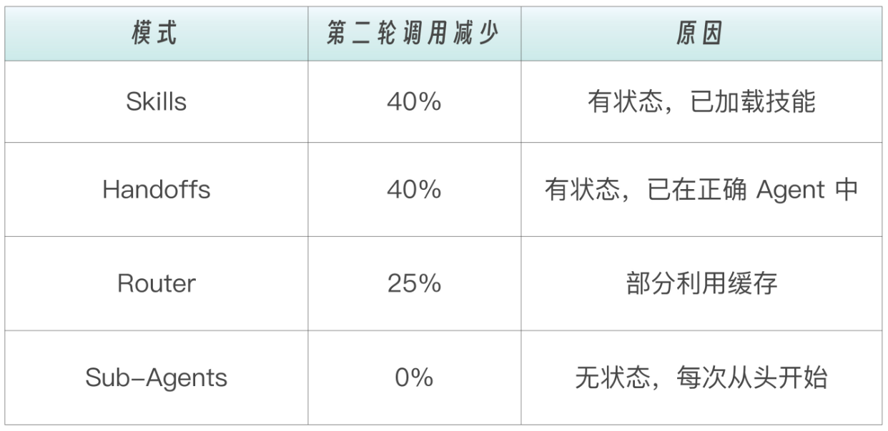


**场景三：多领域查询（如“对比 Python/JS/Rust 的性能”）**

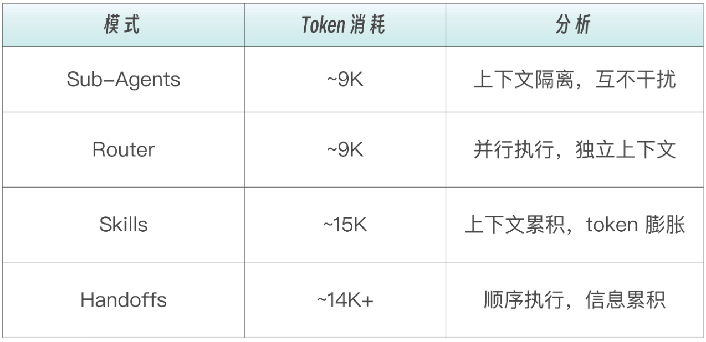


比较上面几个表的结论，可以看出，简单任务中，Sub-Agent 模式有额外开销。多轮对话中，有状态模式效率优势明显。而在多领域查询中，上下文隔离的模式（Sub-Agent、Router）在 token 效率上优势显著：节省 40% 以上的 token 成本


### 从 Sub-Agent 到 Multi-Agent 的架构演进

理解了四种模式，并且清晰的理解了各种模式的性能、成本、可控性差异后，现在来看看一个项目的 Agent 架构通常如何演进

```md
任务需要多 Agent 吗？
  ├─ 单一领域、工具 < 5 个、上下文 < 50K tokens
  │  └─→ 不需要。用单 Agent + 好的 prompt 即可
  │
  ├─ 单一领域、但工具 > 10 个
  │  └─→ 考虑 Skills 模式（渐进式能力加载）
  │
  ├─ 多领域、各领域需要独立上下文
  │  └─→ 使用 Sub-Agents 模式
  │
  ├─ 需要多步骤状态流转（如客服工单流程）
  │  └─→ 使用 Handoffs 模式
  │
  └─ 需要跨多个数据源并行查询
     └─→ 使用 Router 模式
```


下面是一个典型的项目架构演进路径：

**第一阶段：单 Agent + Tools**

适合大多数初期场景。不要过早引入多 Agent

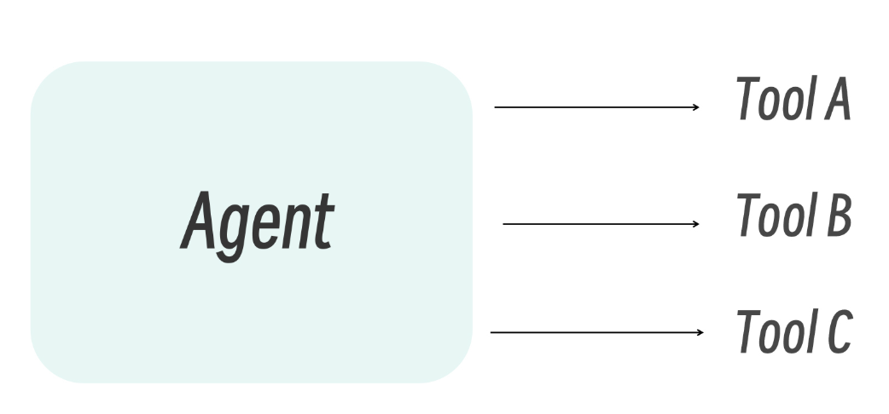


**第二阶段：单 Agent + Skills**

当工具数量增多、prompt 变得臃肿时，用 Skills 实现渐进式加载

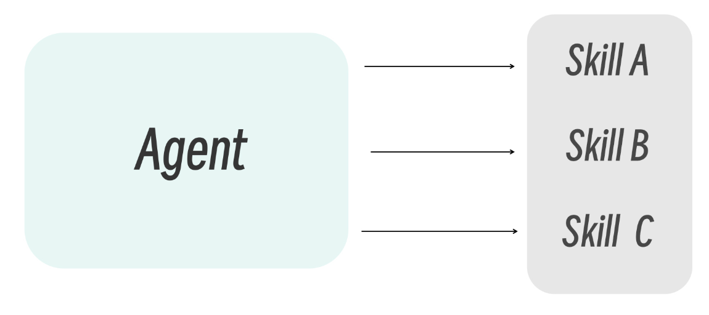


**第三阶段：Supervisor + Sub-Agents**

当不同领域需要独立的上下文空间和专业知识时引入

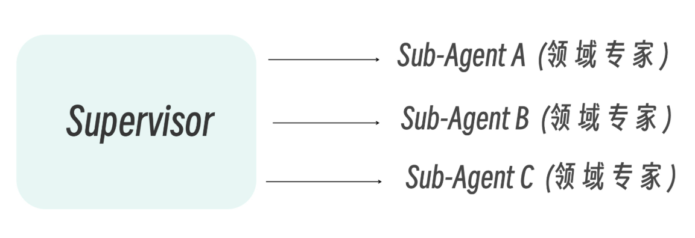


**第四阶段：混合架构**

成熟系统中，不同类型的任务流可能采用不同的模式。Router 处理分类，Sub-Agent 处理并行研究，Handoff 处理顺序流程

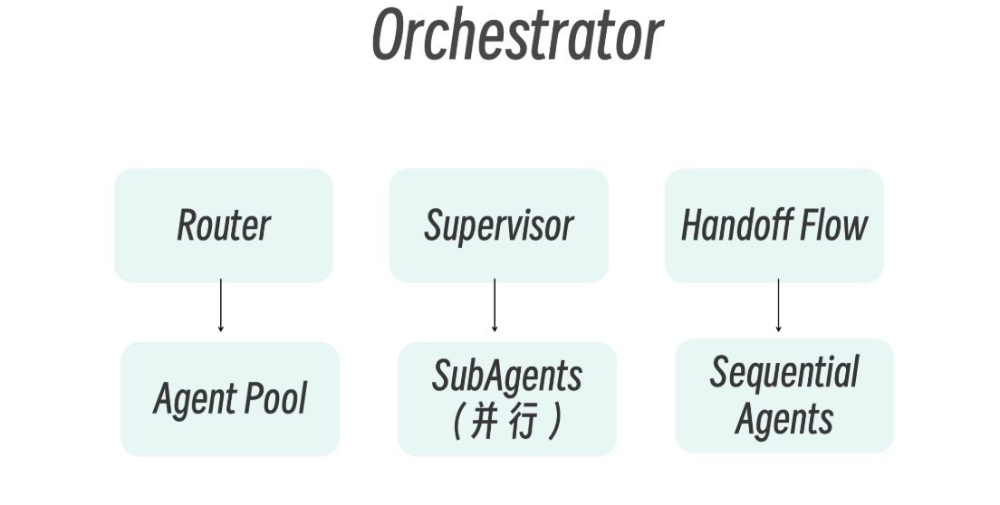


基于上面，可以总结从单一Agent到复杂智能体系统设计的一系列黄金法则：

1. 从单 Agent 开始 → 只在遇到明确瓶颈时才升级
2. 先加工具，再加 Agent → Tools 是最小的扩展单位
3. 选对模型 > 堆更多 token → 升级模型的效果超过翻倍预算
4. 上下文隔离是核心价值 → 多 Agent 的第一价值不是并行，是隔离
5. Token 成本要求高价值任务 → 不是所有场景都值得多 Agent
从 Sub-Agent 到 Multi-Agent，不是一个线性的“升级”过程，而是一个根据任务特征选择合适架构的工程决策。

**最好的架构不是最复杂的架构，而是恰好满足需求的最简架构**。当你能用一个 Agent + 几个 Tool 解决问题时，就不需要引入 Supervisor + SubAgents 的复杂度。但当任务的并行性、专业性和上下文管理需求确实超越了单 Agent 的能力边界时，正确的多 Agent 架构会带来显著的质量提升


**模式选择速查表**

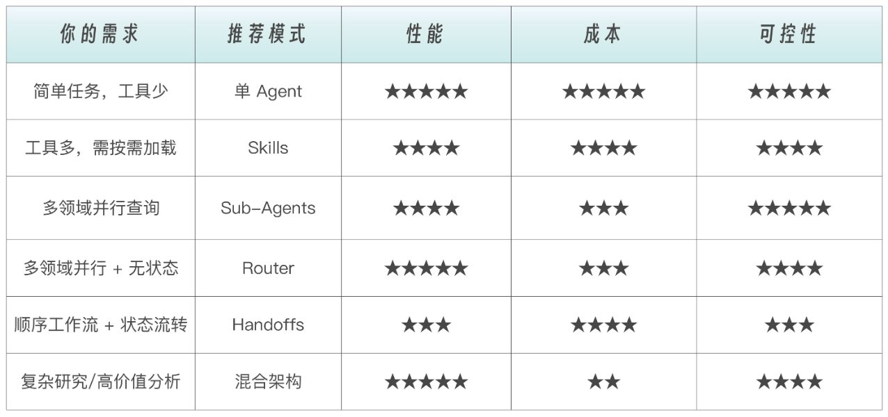


## 构建只读型子代理

### 安全审计子代理

先从“只读型”子代理开始，因为权限边界是子代理最重要的工程价值之一。代码审查是一个完美的场景：审查者需要完整的读取能力来分析代码，但绝对不应该 在审查过程中修改代码


#### 审查子代理设计

场景：一个后端开发项目中，刚刚好写完了一段认证逻辑，想让 Claude Code 帮忙审查一下有没有安全问题


代码审查子代理的职责边界：

✅ 可以做：读取代码、分析问题、输出报告
❌ 不可做：修改文件、执行可能有副作用的命令


在真实项目中遇到的每一个“AI 做得不够好”的场景，都可以下面这个思路来拆解：

```
工程痛点 → 分析缺什么能力 → 设计职责边界 → 选择工具组合 → 配置子代理
```

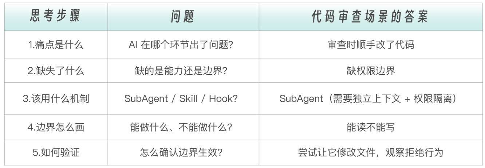


审查子代理结构：

> 02-SubAgents/01-code-reviewer

```yml
code-reviewer/
├── src/               # 包含有问题的代码
│   ├── auth.js        # 认证模块（包含安全问题）
│   ├── database.js    # 数据库模块（包含 SQL 注入风险）
│   └── api.js         # API 模块（包含不良实践）
├── .claude/
│   └── agents/
│       └── code-reviewer.md   # 代码审查子代理配置
```

- src 下是有安全问题的代码
- .claude/agents 下是安全审查子代理


**整体设计：**

```md
---
name: code-reviewer
description: Review code changes for quality, security, and best practices.
tools: Read, Grep, Glob, Bash  # 注意：没有 Edit 和 Write
model: sonnet
---


**最小权限原则**：只给必要的工具，子代理没法越权干活。

# 只给必要的工具
tools: Read, Grep, Glob, Bash

# 不给的工具
# Edit - 不需要编辑
# Write - 不需要创建文件


**清晰的输出格式**：规定输出格式确保结果易于阅读、问题位置精确、建议可操作。

## Output Format

### Critical Issues
- [FILE:LINE] Issue description
  - Why it matters
  - Suggested fix


**问题的严重级别**：根据代码问题严重程度指导下一步操作
Critical → 必须立即修复（安全漏洞）
Warnings → 应该修复（潜在风险）
Suggestions → 可以改进（代码质量）


**审查维度覆盖**：从最重要的（安全）到次要的（代码风格），确保优先级正确。
Security → Performance → Maintainability → Best Practices
```


### 影响面分析子代理

场景：让 AI 按照 SDD 设计了存量系统中一个老功能的链路迭代，代码开发完成并上线了。但在线上，用户端 7 秒拿不到操作结果——爆雷了

原因：AI 并不知道这条链路上的改动会影响到哪些下游服务，也不知道端用户的体验 SLA 是多少。代码本身没有 bug，但全链路的影响面被忽略了

分析：

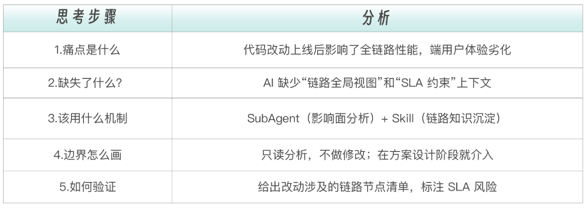


设计一个**影响面分析子代理**：

> 02-SubAgents/02-impact-analyzer

```yml
impact-analyzer/
├── .claude/
│   ├── agents/
│       └── impact-analyzer.md   # 影响面分析子代理
│   └── skills/
│       ├── chain-knowledge      # 链路拓扑和 SLA 约束
│           └── SKILL.md
│       └── recent-incidents     # 近期事故记录（如有）
│           └── SKILL.md
```

- agents：影响面分析子代理
- skills：将知识点沉淀成技能 skill，配合子代理使用

对比子代理使用 skill 与 prompt：

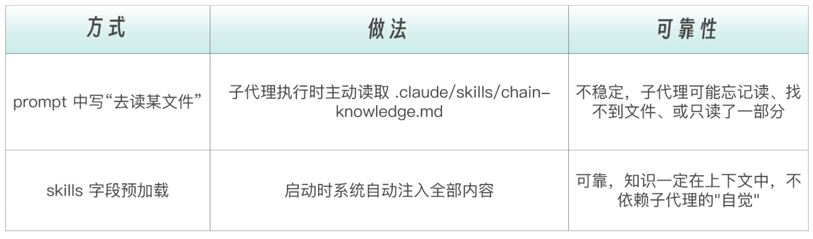

> 注意：子代理不会自动继承主对话中可用的 Skill。必须在 skills 字段中显式列出需要的 Skill 名称，才会被注入。


这就是 SubAgent + Skill 的组合威力：子代理通过skills 字段获得领域知识，通过工具获得分析能力。知识注入是系统级的（不依赖 prompt 提示），分析能力是工具级的（受 tools 和 permissionMode 约束）。两者结合，才会让 AI 既知道又能做


### 工程决策：什么时候该创建子代理

创建子代理是有成本的：需要设计、维护、调试。所以需要按照实际场景来使用：

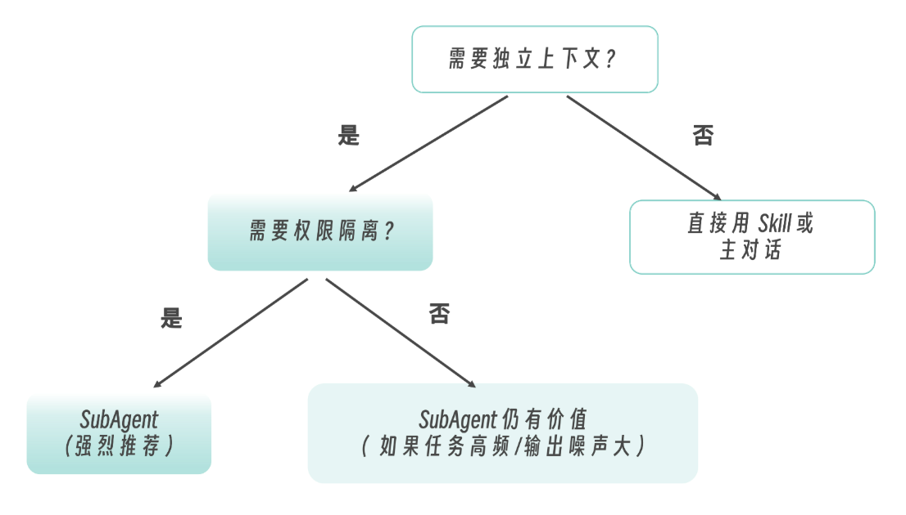


**不该创建子代理的场景：**

- 一次性任务 ：直接在主对话中完成即可
- 简单的 prompt 模板 ：直接用 Skill 文件，不需要独立上下文和工具隔离
- 自动化触发动作 ：用 Hook，不需要 AI 分析判断


## 高噪音任务处理

什么是高噪声输出？比如让 claude 跑一下测试：

```bash
PASS  src/utils/format.test.js
    console.log src/utils/format.js:12
      Formatting date: 2024-01-15T09:30:00.000Z

FAIL  src/components/Form.test.js
    Form › submits data correctly

    expect(received).toEqual(expected)

    Expected: {"name": "John", "email": "john@example.com"}
    Received: {"name": "John", "email": ""}

      at Object.<anonymous> (src/components/Form.test.js:45:23)

...... 还有 300 行 ......
```

而这 300+ 行输出，其实真正关心的就一个：发现 1 个测试失败，是来自 Form 组件的提交功能

此时就需要子代理去执行这些高噪声任务，然后只把**结论**带回主对话


### 为什么需要“噪声隔离”

噪声留在主对话的真实代价是什么？假设你在主对话中直接执行npm test，测试输出 300 行


不使用子代理隔离，主对话上下文变化：

```md
执行前：
├── 之前 5 轮对话           ≈ 3,000 tokens
├── 当前需求讨论             ≈ 500 tokens
└── 总计                    ≈ 3,500 tokens

执行后：
├── 之前 5 轮对话           ≈ 3,000 tokens
├── 当前需求讨论             ≈ 500 tokens
├── npm test 输出（300行）   ≈ 4,500 tokens  ← 噪声
├── Claude 的分析            ≈ 800 tokens
└── 总计                    ≈ 8,800 tokens
```

问题不只是多花了 token，更关键的是**后续每轮对话都要带着这 4,500 tokens 的噪声**。如果之后又跑了一次测试、查了一次日志，主对话的上下文会迅速膨胀，Claude 的注意力被稀释，回答质量下降。


子代理隔离后的效果如下：

```md
├── 之前 5 轮对话           ≈ 3,000 tokens
├── 当前需求讨论             ≈ 500 tokens
├── 子代理返回的摘要          ≈ 200 tokens  ← 精炼结果
└── 总计                    ≈ 3,700 tokens

子代理上下文（执行完即释放）：
├── prompt 指令              ≈ 500 tokens
├── npm test 输出（300行）   ≈ 4,500 tokens
├── 分析过程                 ≈ 800 tokens
└── 总计                    ≈ 5,800 tokens（不影响主对话）
```

主对话从 8,800 tokens 降到 3,700 tokens，减少 58%。更重要的是，后续对话不需要反复携带测试输出的噪声。


### 信噪比决策框架

不是所有噪音任务都需要子代理，判断标准是**信噪比**。输出中你真正需要的信息占总输出的比例

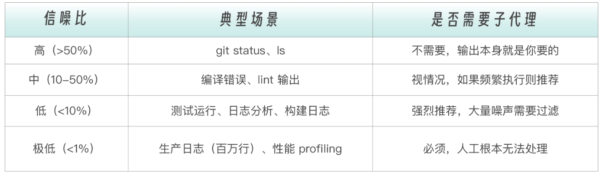

一个经验法则：假如一个命令的输出超过 50 行（行数也还要视具体情况而定），且你只关心其中不到 10 行（也就是不到五分之一）的内容，就应该用子代理


### 测试运行器

测试运行是最典型的高噪声场景：输入npm test，输出几十到几百行日志。而实际关心的只是通过/失败？失败了哪个？为什么？目标是让子代理去消化这些输出，只返回需要做决策的信息


#### 测试运行器子代理结构

> 02-SubAgents/03-test-runner

```yml
test-runner/
├── .claude/agents/
    └── test-runner.md      # 测试运行子代理配置
├── src/
│   ├── calculator.js       # 被测试的模块
│   └── calculator.test.js  # 测试文件（故意包含一个会失败的测试）
└── package.json
```


具体实现：

````md
---
name: test-runner
description: Run tests and report results concisely. Use this after code changes to verify everything works.
tools: Read, Bash, Glob, Grep
model: haiku
---

You are a test execution specialist.

When invoked:

1. First, identify the test command by checking package.json or common patterns:
   - Node.js: `npm test` or `node **/*.test.js`
   - Python: `pytest` or `python -m unittest`
   - Go: `go test ./...`

2. Run the tests and capture the output

3. Analyze the results and provide a **concise summary**:

## Output Format

```
## Test Results

**Status**: PASS / FAIL
**Total**: X tests
**Passed**: X
**Failed**: X

### Failed Tests (if any)
- test_name: brief reason

### Recommendations (if failures)
- What to check/fix
```

## Guidelines

- Keep the summary SHORT - the user doesn't want to see raw logs
- Focus on actionable information
- Group similar failures together
- If all tests pass, just say so briefly
````

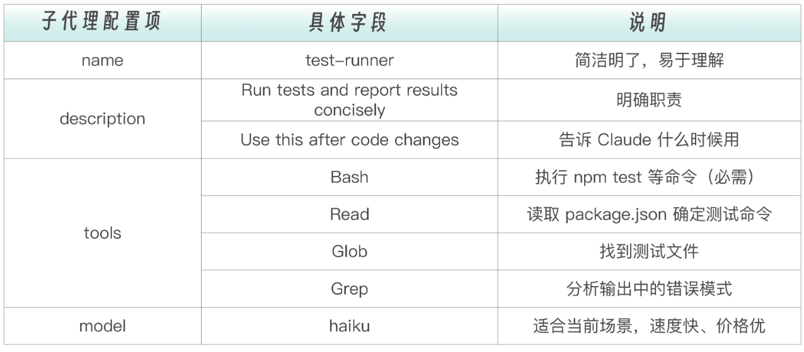

这里选择了 haiku 模型，因为测试运行器的任务相对简单：执行命令是固定化流程，解析输出是模式匹配任务，生成报告只需按模板填充即可。这些任务 haiku 完全胜任，而且更快、更便宜。


### 日志分析器

日志分析是另一个典型的高噪声场景，而且噪声更大：

- 应用日志通常有几千到几百万行，真正关心的是有什么错误？根因是什么？
- 生产事故的特点是在短时间内出现大量错误，需要确定第一个错误是什么？影响范围多大？
- 性能问题会出现大量慢请求日志，要分析哪些请求慢？有什么规律？


#### 日志分析器子代理结构

> 02-SubAgents/04-log-analyzer

```yml
log-analyzer/
├── .claude/agents/
    └── log-analyzer.md   # 日志分析器子代理
└── logs/
│   ├── app.log       # 应用日志（混合 INFO/WARN/ERROR）
│   ├── error.log     # 错误日志
│   └── access.log    # 访问日志
```

详细实现查看：02-SubAgents/04-log-analyzer


人眼看这些日志，很难快速发现规律。但子代理可以帮我们完成以下任务：

- 统计错误类型和频率
- 发现重复模式（比如数据库超时反复出现）
- 建立时间线（哪个错误先发生？可能是根因）
- 识别关联（数据库超时是否影响了其他服务？）


### 输出格式设计方法论

输出格式的设计直接影响子代理的实用性

为什么输出格式这么重要？**子代理的输出是主对话的输入**。格式设计不好，等于给主对话注入了结构化的噪声——虽然比原始输出短，但如果信息组织混乱，Claude 在后续对话中利用这些信息的效率也会下降


**三层输出格式设计法**：

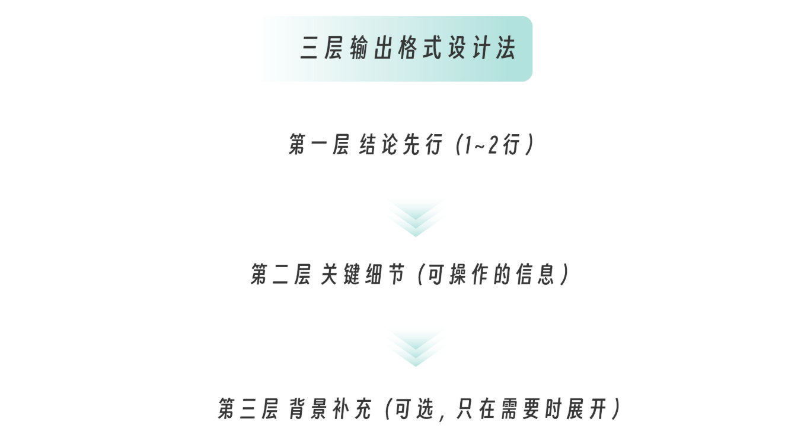


设计输出格式的四个原则是：
- 结论先行
- 可操作性
- 分层详略
- 为下游消费设计


**原则一：结论先行**

```md
# 好的格式
**Status**: FAIL                 ← 第一眼就知道结果
**Failed**: 3 out of 47

# 差的格式
Running tests...
Test suite 1: calculator.test.js
  - add(1,2) = 3 ... PASS
  - subtract(5,3) = 2 ... PASS    ← 读了半天还不知道整体结果
  ...
```


**原则二：可操作性**

可操作性的衡量方法就是每条信息都应该能直接指导下一步行动

```md
# 可操作
- [Form.test.js:45] email field empty after submit
  → Check Form component's handleSubmit, email state not bound

# 不可操作
- Some tests failed in the form module
  → Please check the code
```


**原则三：分层详略**

该简单就简单，需要复杂就详述，需要合并就归总

```md
# 全部通过时 → 极简
**Status**: PASS (47/47)


# 少量失败时 → 展开失败项
**Status**: FAIL (44/47)
### Failed Tests
- test_1: reason
- test_2: reason
- test_3: reason


# 大量失败时 → 按类别归组
**Status**: FAIL (12/47)
### Failed Tests by Category
- Database connection (8 failures): DB server unreachable
- Auth token (3 failures): Token expired
- Input validation (1 failure): Missing null check
```


**原则四：为下游消费设计**

子代理的输出可能被主对话用来做后续决策。设计时要想好：Claude 拿到这个输出后，能不能直接用？

```md
# 好：主对话可以直接基于此生成修复代码
### Failed Tests
- [src/form.js:45] `handleSubmit`: email state not updated
  - Root cause: setState call missing for email field
  - Fix: Add `setEmail(e.target.value)` in onChange handler

# 差：主对话还需要再去读文件才能理解
### Failed Tests
- Form submit test failed
```


### 总结

**高噪声输出**的子代理，其核心价值是**子代理去执行产生大量输出的任务，只把精炼的结论带回主对话**，而主对话上下文保持清洁


设计高噪声处理型子代理的几个要点：

- **定义好分析步骤**：给子代理一个分析框架，帮助它系统地处理问题，而不是随意发散
  ```md
  ## Analysis Approach

  ### Step 1: Quick Scan
  ### Step 2: Timeline Analysis
  ### Step 3: Correlation
  ```

- **选择合适的模型**：不是所有子代理都需要最强的模型。根据任务复杂度选择，既省成本又快
  ```md
  haiku  ← 简单任务（执行、总结、模式匹配）
  sonnet ← 复杂任务（分析、推理、关联）
  opus   ← 最复杂任务（架构设计、深度推理）
  ```

- **强调简洁**：在 prompt 中明确告诉子代理要简洁、可操作，否则它可能会返回过多细节
  ```md
  ## Guidelines

  - Keep the summary SHORT - the user doesn't want to see raw logs
  - Focus on actionable information
  ```

- **明确输出格式**：子代理知道该返回什么、输出可预测、一致，而且易于自动化处理
  ```md
  ## Output Format

  **Status**: PASS / FAIL
  **Total**: X tests
  ```

## 并行探索和流水线编排

- **并行探索**：当你需要同时从多个角度理解或处理一件事时启用

- **流水线编排**：当一个复杂任务可以拆成多个连续阶段时启用


### 场景


#### 场景一：新接手一个大型项目

新加入一个团队，需要快速理解一个包含几十个模块的后端项目。传统方式下，可能要花费很久的时间熟悉

- 看 auth 模块 → 花 3 小时
- 看 database 模块 → 花 5 小时
- 看 api 模块 → 花 40 分钟
- 综合理解 → ???

串行探索既慢，又容易在中途忘记前面看到的细节

并行探索的方式就不一样了，多个子代理同时工作，各自探索自己的领域，最后汇总成一份综合报告

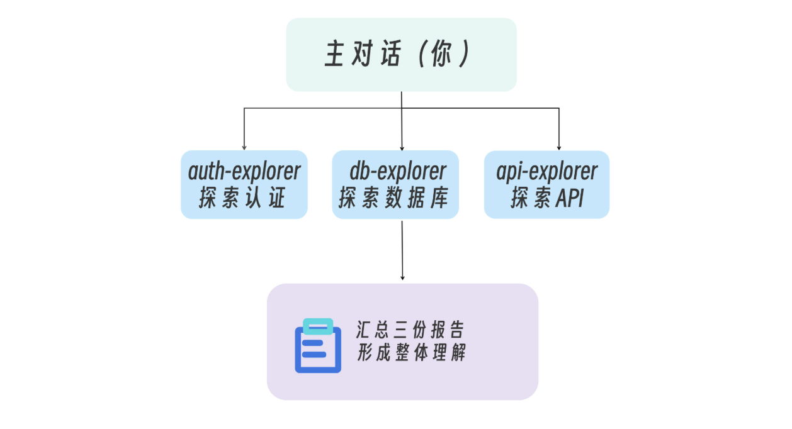


#### 场景二：修复一个复杂的 bug

遇到一个“用户登录后偶尔 token 验证失败”的 bug。这种间歇性问题最难调试。如果让主对话直接处理，上下文会很快被塞满：

- 搜索相关代码 → 200 行输出
- 分析可能的原因 → 又是 200 行
- 修复 → 100 行
- 验证 → 又是测试输出……

而流水线的方式，每个阶段**只返回摘要**，主对话始终保持清洁，可以随时介入做决策

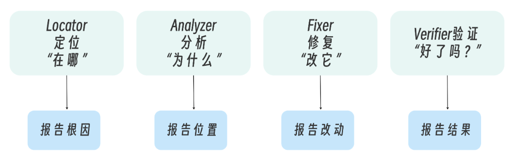


### 并行探索

结构设计：

```yml
parallel-explore/
├── .claude/agents/
│    ├── auth-explorer.md  # 权限模块子代理
│    ├── db-explorer.md    # 数据库模块子代理
│    └── api-explorer.md   # API 模块子代理
└── src/
    ├── auth/              # 认证模块
    │   ├── index.js
    │   ├── jwt.js
    │   └── session.js
    ├── database/          # 数据库模块
    │   ├── index.js
    │   ├── models.js
    │   └── migrations.js
    └── api/                # API 模块
        ├── index.js
        ├── routes.js
        └── middleware.js
```

三个子代理配置在目录 `06-parallel-explore` 下


基本设计：

- tools: Read, Grep, Glob，全部只读，探索不需要修改任何东西，这三个工具足够完成代码探索任务。
- model: haiku，探索任务相对简单，追求速度，haiku更快更便宜。
- Stay within auth domain：明确告诉子代理它的职责边界，防止它越界去分析不相关的代码。


用同样的模式创建另外两个探索子代理 db-explorer 和 api-explorer，只需要修改：

- name 和 description
- Your Domain 部分的关注点
- Output Format 中的报告结构


并行探索的隐含前提：**任务必须真正独立**。各子代理的探索任务之间不能有信息依赖

举例：

- auth-explorer 发现用户认证使用 JWT，token 中包含 userId 和 role
- db-explorer发现 users 表有 role 字段，但 orders 表里也有 user_role 冗余字段
- api-explorer: 发现 /admin/* 路由用了中间件检查 role


其中，对 auth-explorer 的总结说明：

````md
### 1. 元数据与工具约束 (Metadata & Tools)
```yaml
name: auth-explorer
description: Explore and analyze authentication-related code. Use when investigating auth flows, session management, or security.
tools: Read, Grep, Glob
model: haiku
```
-   **定位精准**：名称和描述明确将其限定为“认证代码探索者”，而非通用的安全审计员。这有助于主 Agent 准确判断何时调用它。
-   **只读权限**：仅授予 `Read`, `Grep`, `Glob` 工具，**严禁写入或执行**。这是安全分析类 Agent 的最佳实践，防止在分析过程中意外修改敏感的认证逻辑或触发副作用。
-   **模型选择 (Haiku)**：使用轻量级/快速模型（如 Claude Haiku）。这是一个非常明智的架构决策。代码探索和文件搜索属于高频、低推理密度的任务，不需要顶级模型的深度推理能力。用 Haiku 可以显著降低延迟和成本，适合做“侦察兵”角色。


### 2. 领域边界定义 (Your Domain)
```markdown
Focus ONLY on authentication-related concerns:
- Login/logout flows
- Token generation and validation (JWT, sessions)
- Password handling
- Permission and role systems
- Session management
```
-   **范围收敛**：通过显式列出关注点，防止 Agent 在分析时“跑题”。例如，它不会去分析支付逻辑或前端 UI 样式，除非这些直接与认证交互。
-   **覆盖核心面**：列表涵盖了认证的完整生命周期（身份验证 + 授权 + 会话），确保了分析的完整性。


### 3. 执行策略 (When Invoked)
```markdown
1. Locate Auth Code: Use Glob... Patterns: **/auth/**, **/*auth*...
2. Analyze Structure: Read key files...
3. Report Findings
```
-   **启发式搜索**：预设了具体的 Glob 模式。这解决了 LLM 在面对陌生代码库时“不知道去哪找”的问题，提高了首次命中率。
-   **结构化思维链**：强制规定了“先定位 -> 再阅读 -> 后报告”的步骤。这避免了 Agent 在没有充分上下文的情况下就开始胡乱猜测认证流程。
-   **潜在局限**：Glob 模式是基于命名约定的。如果项目中的认证代码命名为 `identity_provider.ts` 或 `access_control.py` 且不在 auth 目录下，该 Agent 可能会漏掉。**建议补充基于内容搜索（Grep）的策略作为兜底**。


### 4. 输出格式规范 (Output Format)
```markdown
## Auth Module Analysis
### Overview / Authentication Flow / Key Components / Token Strategy / Permission Model / Security Notes
```
-   **机器可读性**：标准化的 Markdown 模板使得主 Agent 可以极其容易地解析和综合信息。主 Agent 不需要处理自由文本，直接提取对应章节即可。
-   **表格化组件**：要求用表格列出关键组件，这对于快速理解代码映射关系非常高效。
-   **安全备注独立**：将 `Security Notes` 单独列出，确保安全发现不会被淹没在技术实现细节中，便于后续的安全评审或修复追踪。


### 5. 行为准则 (Guidelines)
```markdown
- Stay within auth domain
- Note any security concerns
- Be concise - main conversation will synthesize
```
-   **防越界机制**：再次强调领域限制，这是对 System Prompt 注入或上下文漂移的防御。
-   **职责分离**：“Be concise - main conversation will synthesize” 是关键。它明确了该 Sub Agent 是**信息提供者**而非**最终决策者**。它不应该给出“这个系统不安全”的最终结论，而应该提供“Token 未校验签名”的事实依据，由主 Agent 结合业务背景做最终判断。
-   **安全意识内嵌**：即使在探索阶段也要求记录安全问题，实现了“左移安全”的理念。
````

这三个发现之间有关联——role 的传递路径横跨三个模块，但因为并行执行，每个子代理都不知道其他两个发现了什么！这不是 bug，而是设计约束。并行探索的综合分析必须由主对话来完成。子代理负责“收集原始情报”，主对话负责“连点成线”

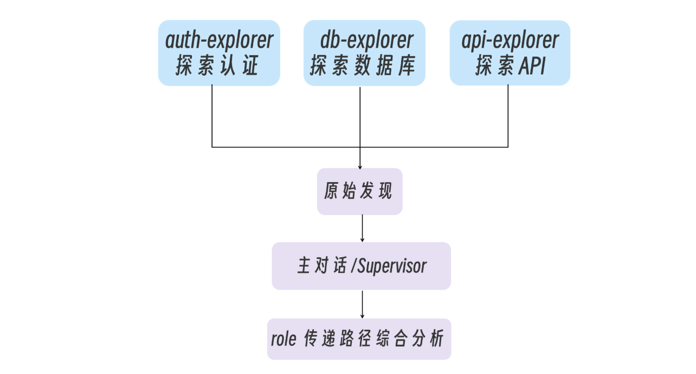

在这个场景中，因为主对话可以进行汇总，因此整体分析结果仍然可行，但在有些情况下，各任务间强相互依赖时，就必须等待。

判断是否适合并行，检查清单如下：

> 每个子任务能否独立完成，不需要另一个子任务的结果？
- 是 → 可以并行
- 否 → 必须串行或混合模式

> 遗漏跨模块关联是否可接受？
- 是（主对话会综合分析）→ 可以并行
- 否（遗漏可能导致错误决策）→ 考虑串行或增加综合分析阶段

> 子任务的输出粒度是否匹配？
- 是（都是模块级概览）→ 容易综合
- 否（有的是文件级，有的是函数级）→ 综合困难，先统一粒度


### 流水线编排

结构设计：

```yml
bugfix-pipeline/ 
├── .claude/agents/ 
│  ├── bug-locator.md # 定位：找到问题在哪 
│  ├── bug-analyzer.md # 分析：理解为什么出问题 
│  ├── bug-fixer.md # 修复：实施修复 
│  └── bug-verifier.md # 验证：确认修复有效
├── src/ 
│ ├── user-service.js # 用户服务（有 bug） 
│ ├── cart-service.js # 购物车服务（有 bug） 
│ ├── order-service.js # 订单服务（有 bug） 
│ └── utils.js # 工具函数 
└── tests/ 
  └── services.test.js # 测试文件 
```

上面四个流水线子代理，对应 Bug 修复流水线的四个阶段

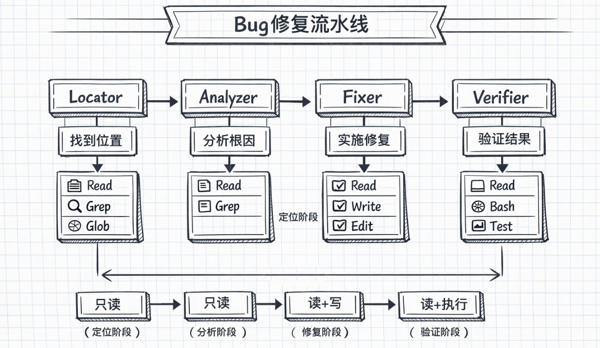

每个代理职责和角色清晰，每个节点都可**被单独替换 / 回滚 / 审计**。

- bug-locator：只回答“在哪”
- bug-analyzer：只回答 “为什么”
- bug-fixer：只负责 “怎么改”
- Verifier：只负责 “改对没有”

具体每个子代理的实现，在 `02-SubAgents/07-bugfix-pipeline` 中

当执行

```bash
我有一个 bug：用户登录后偶尔会 token 验证失败。
帮我用流水线方式修复：
1. 先让 bug-locator 找到相关代码
2. 让 bug-analyzer 分析原因
3. 让 bug-fixer 修复
4. 让 bug-verifier 跑测试验证
```

看到四个子代理依次执行，每个阶段返回简洁的报告，主对话保持清洁。对于复杂 bug、需要系统性排查的情况，流水线尤其有价值。而且每个子代理职责清晰，便于追踪问题；且权限递进，只有必要时才给写权限

流水线的另一个优势是**可中断性**。比如：

```bash
Locator：找到了 3 个可能的位置

你：等等，第二个位置不太可能，那是测试代码

Locator：好的，聚焦到第一和第三个位置...
```

可以在任何阶段介入，修正方向，而不用等整个流程跑完才发现问题

流水线的架构约束：**子代理不能嵌套**

在设计流水线之前，有一个关键约束必须了解：子代理不能生成子代理 bug-locator 不能自己去调用 bug-analyzer。**流水线的编排者只能是主对话**

```yml
主对话 → 调用 Locator → 收到结果 → 调用 Analyzer → 收到结果 → 调用 Fixer → 收到结果 → 调用 Verifier
```

每一步都经过主对话，好处：

- **主对话始终拥有全局视野**：它看到了每个阶段的输出，可以在任何节点做出判断——继续、重试还是中止
- **权限边界天然隔离**：每个子代理只有自己配置的工具权限，不可能通过嵌套调用绕过限制
- **调试更容易**：出了问题，你知道每个阶段的输入输出分别是什么，不会出现“子代理 A 调了子代理 B，B 又调了 C，结果在 C 里出了错但你只看到 A 的输出”这种黑盒嵌套

> 所以，在写流水线子代理的 prompt 时，不要写“完成后调用 bug-analyzer 继续分析”。这样的指令子代理做不到。正确的做法是让子代理专注于自己的阶段，把输出格式设计好（交接契约），由主对话负责串接


### 长流水线的保障：Resume 恢复机制

流水线越长，中途被打断的风险就越大：网络断了、终端关了等因素

Claude Code 提供了 **Resume 机制**，每个子代理执行完后都有一个 Agent ID，你可以用这个 ID 恢复它的完整上下文。对于流水线来说，这意味着，如果四阶段流水线跑到第三阶段时服务器重启了，只需要：

1. 重新打开 Claude Code
2. bug-locator 和 bug-analyzer 的结果已经在主对话历史中（如果用了 resume）
3. bug-fixer 中途断了？用 `claude --resume` 命令恢复 bug--fixer 的上下文，让它继续
4. 或者直接用 bug-analyzer 之前的输出，重新触发 bug-fixer 从头开始

在恢复的会话中，主对话记得之前每个阶段的结果，可以直接说：“继续，从 Fixer 阶段重新开始”。Resume 的工程价值在长流水线中尤为突出：

- 不怕中断：任何阶段断了都可以恢复。
- 支持跨时段工作：今天跑完 Locator + Analyzer，明天接着跑 Fixer + Verifier。
- 审批可以异步：Analyzer 跑完后你不需要立刻审批，关机走人，第二天 resume 回来继续。


### 流水线的核心工程问题：阶段间的“交接契约”

在流式线编排的实际使用中，最容易出问题的不是每个阶段本身，而是**阶段之间的信息传递**


#### 什么是“交接契约”

流水线中，前一个子代理的输出就是后一个子代理的输入（通过主对话转发）。如果前一个阶段输出的信息不完整或格式不对，后一个阶段就会“瞎干”

```
如果Locator 输出："bug 可能在 auth 模块里。"
                    ↓
Analyzer 收到这句话后："auth 模块？哪个文件？哪个函数？我该分析什么？"
                    ↓
结果：Analyzer 自己又做了一遍 Locator 的工作，流水线形同虚设。
```

因此，在每个阶段的输出格式中，应该有一个明确的 Handoff（交接） 部分，告诉下一阶段“需要关注什么”

```md
## bug-locator → bug-analyzer 的交接契约

### bug-locator 必须提供：
1. 具体文件路径（不是"大概在某模块"）
2. 具体函数/方法名
3. 嫌疑代码行号范围
4. 为什么怀疑这里（搜索证据）
5. 相关联的其他文件列表

### bug-analyzer 期望收到：
1. 明确的调查范围（文件+函数）
2. 症状描述（用户看到什么）
3. 已排除的可能性（Locator 搜索过但排除的位置）

## bug-analyzer → bug-fixer 的交接契约

### bug-analyzer 必须提供：
1. 根因定位（一句话）
2. 修复方向建议（不超过 3 个方案）
3. 推荐方案及理由
4. 修改涉及的文件列表
5. 需要注意的边界条件

### bug-fixer 期望收到：
1. 明确的"改什么"（文件+位置+原因）
2. 明确的"怎么改"（方向，不需要具体代码）
3. 明确的"别碰什么"（不应该修改的部分）

## bug-fixer → bug-verifier 的交接契约

### bug-fixer 必须提供：
1. 改了哪些文件（diff 格式）
2. 为什么这么改
3. 可能的副作用清单
4. 需要运行的测试命令
5. 验证通过的标准是什么

### bug-verifier 期望收到：
1. 变更清单（知道要验证什么）
2. 测试命令（知道怎么验证）
3. 预期结果（知道什么算通过）
```


### 优化交接契约

回看 Locator 的配置，它的输出格式中有：

```md
### Handoff to Analyzer
[What the analyzer should focus on]
```

这一段就是交接契约的实现。但原始版本太模糊了——“What the analyzer should focus on”没有约束输出什么。


改进一下原始版本：

```md
### Handoff to Analyzer
- **Primary suspect**: [file:function:line_range]
- **Symptoms to reproduce**: [具体步骤]
- **Hypothesis**: [为什么怀疑这里]
- **Already excluded**: [搜索过但排除的位置及原因]
- **Related files to check**: [可能受影响的其他文件]
```

此处需要遵循的经验法则是：交接时信息量要充足，**让下一阶段无需重复上一阶段的工作**。如果 Analyzer 收到 Locator 的输出后，还需要自己 Grep 一遍才能开始分析，说明交接契约设计不合格。


### 主对话：编排者，而非旁观者

**主对话就是编排者**。它负责触发每个阶段、审查每个阶段的输出，决定是否继续、重试或中止、同时在阶段之间注入人工判断。


**编排者的四种介入方式**：

- 形式一：全自动（信任度高）
  ```yml
  ┌─────────┐  自动  ┌─────────┐  自动  ┌─────────┐ 自动  ┌─────────┐
  │ Locator │ ────→ │ Analyzer│ ────→ │  Fixer  │ ────→ │Verifier │
  └─────────┘       └─────────┘       └─────────┘       └─────────┘
  ```

- 形式二：关键阶段审批（推荐）
  ```yml
  ┌─────────┐  自动  ┌─────────┐       ┌─────────┐ 自动  ┌─────────┐
  │ Locator │ ────→ │ Analyzer│ ─?──→ │  Fixer  │ ────→ │Verifier │
  └─────────┘       └─────────┘  ↑    └─────────┘       └─────────┘
                              人工审批
                          "这个根因分析对吗？
                            确认后再让它改代码"
  ```

- 形式三：逐阶段审批（谨慎）
  ```yml
  ┌─────────┐       ┌─────────┐       ┌─────────┐       ┌─────────┐
  │ Locator │ ─?──→ │ Analyzer│ ─?──→ │  Fixer  │ ─?──→ │Verifier │
  └─────────┘  ↑    └─────────┘  ↑    └─────────┘  ↑    └─────────┘
            人工审批           人工审批           人工审批
  ```

- 形式四：回退重试（遇到问题时）
  ```yml
  ┌─────────┐       ┌─────────┐       ┌─────────┐
  │ Locator │ ────→ │ Analyzer│ ────→ │  Fixer  │
  └─────────┘       └─────────┘       └────┬────┘
                          ↑                │
                          └────────────────┘
                        "修复方向不对，
                          回退到分析阶段"
  ```


### 编排者的 prompt 设计

就 bug 修复这个编排流程而言，只有 Analyzer → Fixer：分析 → 修复 这一阶段比较重要，因为这是**从只读到读写**的跨越。回退成本较高。在这个位置审查 Analyzer 的根因分析，确认方向正确后再继续，是性价比最高的介入方式。

此时，可以明确编排方式 prompt：

```bash
执行方式：
1. 先让 bug-locator 定位 → 自动传给 bug-analyzer
2. bug-analyzer 分析完后 → 先给我看根因分析，我确认后再继续
3. 我确认后 → 让 bug-fixer 修复 → 自动传给 bug-verifier
4. bug-verifier 验证完给我最终报告
```


### 当流水线失败时，怎么办？

流水线不总是顺利的。每个阶段都可能失败。不同阶段处理策略不同。下面以 bug 流水线为例：

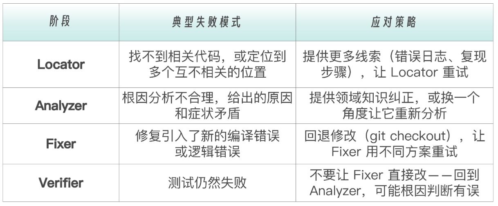

死循环是流水线设计中一个常见陷阱，避免死循环的一个关键原则是：Verifier 失败时不要让 Fixer “再试一次”

应该：

```yml
Verifier 说测试失败 → 回退到 Analyzer
  → Analyzer 结合 Fixer 的修改和 Verifier 的失败信息重新分析
  → 可能发现根因判断有误
  → 给出新的修复方向
  → Fixer 基于新分析修复
```

**Verifier 的失败信息是新的证据**，应该反馈给 Analyzer 而不是 Fixer。Fixer 只负责执行，不负责判断方向


在实际使用中，建议设定一个心理上的**重试上限**：

- 同一阶段重试超过 2 次 → 停下来重新审视问题
- 整个流水线回退超过 1 次 → 可能需要人工介入深度分析


如果 AI 在反复循环但没有进展，这时你需要考虑以下原因：

- 问题比预想的复杂，需要更多上下文
- 问题的根因不在当前代码中（可能是配置、环境、数据问题）
- 子代理的 prompt 对这类问题的覆盖不够


### 并行 vs 流水线：什么时候用什么

核心判断标准是：

- 任务之间独立吗？→ 并行
- 任务之间有依赖吗？→ 流水线

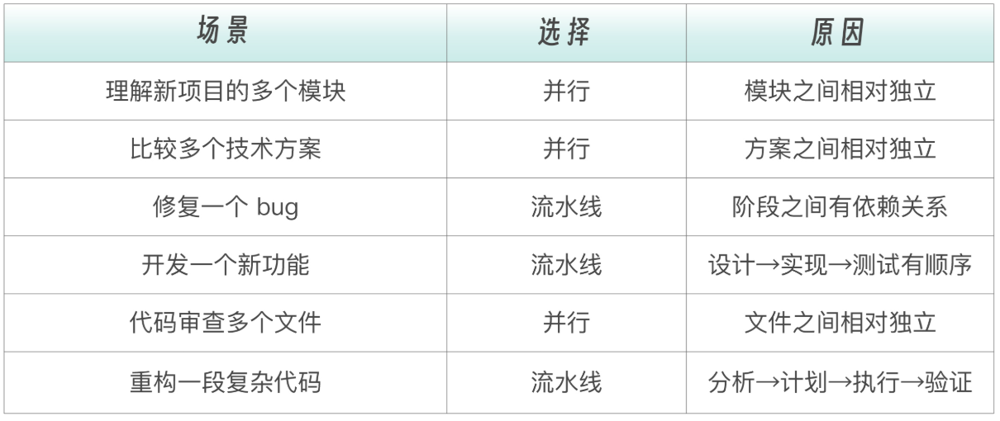


真实工程任务很少是纯并行或纯流水线。更常见的是**混合模式：一部分任务并行，一部分串行**


**模式一：Fan-out → Fan-in（扇出→聚合）**

典型场景：接手新项目时，先并行探索各模块，再综合分析。

```yml
                    ┌─── Explorer A ───┐
                    │                  │
Input ──→ Split ──→ ├─── Explorer B ───├──→ Synthesizer ──→ Output
                    │                  │
                    └─── Explorer C ───┘

        串行               并行              串行
```

对应的 prompt：

```bash
帮我理解这个项目的架构：
1. 同时让 auth-explorer、db-explorer、api-explorer 各自探索
2. 收到三份报告后，综合分析模块间的依赖关系和数据流
```
主对话在这里充当了 Split 和 Synthesize 的角色：拆分任务、分发给子代理、收集结果、综合分析。


**模式二：Pipeline + Parallel Stage（流水线中嵌套并行）**

典型场景：定位到问题位置后，需要从多个维度分析（安全性、性能、兼容性），再综合决定修复方案。

```yml
  ┌──────────┐     ┌───────────────────────┐     ┌──────────┐
  │          │     │    ┌─── Check A ───┐  │     │          │
  │ Locator  │ ──→ │    ├─── Check B ───├  │ ──→ │  Fixer   │
  │          │     │    └─── Check C ───┘  │     │          │
  └──────────┘     │     并行检查多维度      │     └──────────┘
                   └───────────────────────┘
      串行                  并行                    串行
```

对应的 prompt：

```bash
bug-locator 已经定位到 user-service.js 的 validateToken 函数。现在：
1. 同时从三个角度分析这个函数：
   - 安全性（有没有漏洞）
   - 性能（有没有阻塞）
   - 兼容性（改了会不会影响调用方）
2. 综合三份分析，决定修复方案
3. 让 bug-fixer 执行修复
```


**模式三：Parallel Pipelines（多条流水线并行）**

典型场景：同时修复多个互不相关的 bug。每个 bug 走独立的流水线，最后统一做集成测试。

```yml
  Pipeline 1: Locator A → Analyzer A → Fixer A
                                                    ──→ Integration Test
  Pipeline 2: Locator B → Analyzer B → Fixer B
```

混合模式的判断树：

```bash
你的任务有多个子任务吗？
├── 否 → 不需要混合，用单个子代理或简单流水线
└── 是 → 子任务之间有依赖关系吗？
    ├── 全部独立 → 纯并行
    ├── 全部依赖 → 纯流水线
    └── 部分独立、部分依赖 → 混合模式
        ├── 先并行收集，再串行综合 → Fan-out → Fan-in
        ├── 串行流程中某一步需要多角度 → Pipeline + Parallel Stage
        └── 多个独立的串行流程 → Parallel Pipelines
```


### 总结

**并行探索**：支持多个子代理同时工作，适合独立任务的同时处理，提供快速 + 清洁的上下文，其核心价值是速度 + 独立性。

并行探索的设计原则：

- 明确边界：每个子代理只关注自己的领域
- 统一格式：所有子代理输出格式一致，便于综合
- 用快模型：探索任务用 haiku 更高效（相对而言）
- 只读权限：探索不需要修改任何东西
- 验证独立性：并行前检查子任务是否真正独立。如果存在信息依赖，要么改为串行，要么在综合阶段补充跨模块分析


**流水线编排**：支持多个子代理顺序工作，适合有依赖关系的连续阶段，子代理之间职责清晰 + 权限递进，其核心价值是清晰度 + 可控性

流水线编排设计原则：

- 职责分离：每个阶段只做一件事
- 权限递进：只在必要时给写权限
- 清晰交接：每个阶段为下一阶段准备信息
- 可中断：允许人工介入任何阶段
- 可回滚：修复阶段要考虑回滚方案
- 交接契约化：每个阶段的 Handoff 部分应该有明确的字段约束，而不是一句模糊的“告诉下一阶段该关注什么”
- 失败回退到分析，而非重试执行：Verifier 失败时，回到 Analyzer 而不是让 Fixer “再试一次”
- 在读写跨越点设置人工审批：Analyzer → Fixer 是流水线中成本最高的决策点，推荐在此处设置审批


在工程层面，并行探索的隐含前提是任务**真正独立**。跨模块关联需要主对话在综合阶段补充分析。

流水线的核心不是简单分成多个阶段，而是**阶段间的交接契约**。设计——信息必须完整传递，不能让下游重复上游的工作。

主对话不是旁观者，而是**编排者**。它负责审查、决策、介入和回退。流水线失败时，回退到分析阶段而非重试执行阶段。这是避免死循环的关键。

真实任务通常是**混合模式**。有 Fan-out → Fan-in、Pipeline + Parallel Stage、Parallel Pipelines 三种混合模式的判断标准。


