# Skill 技能


## SKILL.md 结构与触发机制


### 什么是 Skill

在真实的工程团队里，很少有人能够把所有规范背下来

代码风格指南十几页，Git 提交规范三四种类型，API 设计有版本约定，安全审查有检查清单，部署流程有风险控制条款……这些规则并不复杂，但数量一多，就不可能长期驻留在脑中。人类工程师的做法很简单：需要时再查阅

如果把 Claude 当作真正的工程助手，它也会面临同样的问题。最直接的做法，是把所有团队规范写进 CLAUDE.md，让模型每次对话都读取这些内容。短期看这是可行的。但当知识规模扩大到几十页甚至上百页时，每一次对话都在为“可能用不到的知识”支付上下文成本。这不仅消耗 tokens，更重要的是，它会稀释模型的注意力。真正需要用到的规则，反而淹没在冗余信息里

这正是 Skill 需要解决的问题


Skill 并不是简单的“能力扩展机制”，它本质上是一种按需加载的认知结构。与其把所有知识常驻在上下文中，不如把它们封装成可独立触发的能力单元。当模型判断当前任务涉及某个特定领域时，再加载对应的知识与操作流程

Skill 更精确的定义：**Skill 是一种可被语义触发的能力包，它包含领域知识、执行步骤、输出规范与约束条件，并在需要时渐进式加载到主 Agent 的认知空间中**


Agent 生态中的四大支柱：

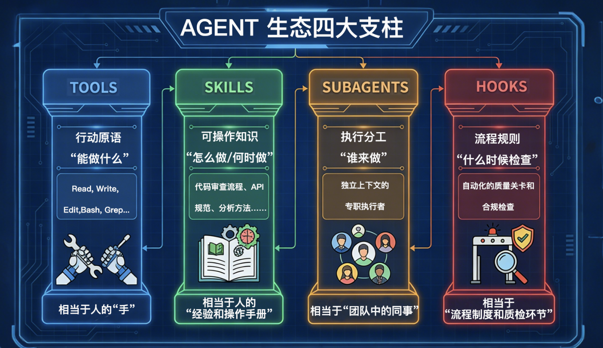

- **Tools 是行动原语**。它回答的是**能做什么**。读文件、改代码、执行 Bash 命令等，这些是操作层面的能力，类似人的双手
- **SubAgents 是执行分工**。它回答的是**谁来做**。当任务复杂到需要独立上下文时，子代理承担专职职责，类似团队中的同事
- **Hooks 是流程规则**。它回答的是**什么时候检查**。它们在关键节点自动触发质量校验或合规约束，类似企业中的质检流程
- 而 Skill 回答的，是另外一个非常关键的问题：**怎么做，以及何时做**，它不是工具，也不是分工机制。它是一种可操作知识结构

Skill 解决的核心问题是：**在有限的上下文窗口中，让 Agent 在正确的时刻拥有正确的领域知识**


### Skill 的核心生态位：可操作知识

一份 API 设计指南放在 Wiki 上，是静态文本。不包含触发条件，不定义执行流程，不规定输出结构，也不会自动校验质量。它等待人去阅读


而一个 Skill，则是一段具备语义入口的标准操作程序。通过 description 告诉模型：在什么情况下应该加载这项能力。在正文中定义执行步骤，将抽象原则转化为可执行流程。通过模板约束输出格式，确保结果标准化。可以限制可调用工具的范围，防止越权操作。甚至可以通过 hooks 在完成后自动执行验证逻辑


把文档封装为 Skill，它就不再是参考资料，而成为一种可被调用的行为模式。从工程视角看，这是对上下文资源的优化；但从系统设计视角看，这是一种更深层的变化


过去的软件体系中，调度权始终掌握在人类手中。工程师写 Prompt、编排 Workflow、定义调用顺序。模型只是执行者。Skill 的真正突破点，**在于它把能力的“语义定义权”交给模型**

人不再编排具体执行路径，而是定义能力的边界与含义。模型根据 description 理解能力语义，并在运行时决定是否加载、何时加载


### Skill 是组织的 SOP 体系

如果把 Claude Code 的技术栈映射到企业组织结构，会发现一种高度对称的关系：

- Tools 对应员工的操作工具
- SubAgents 对应岗位分工
- Hooks 对应质量与合规流程
- CLAUDE.md 类似企业文化与通用规章
- MCP Servers 像外部合作伙伴
- Plugins 是对外打包的解决方案。
- 而 Skill，正是企业的 SOP 体系

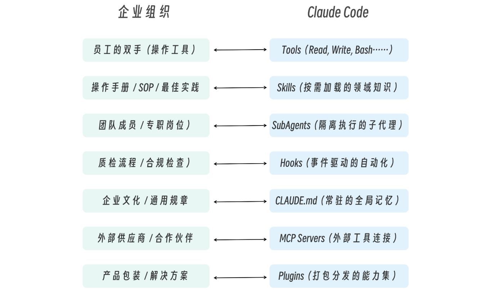

一个成熟的企业不会要求员工背诵全部操作手册。相反，它建立标准操作程序，在具体任务发生时按需查阅，并按照步骤执行，输出标准化结果。当新员工进行代码审查时，他不会即兴发挥。他会参考《代码审查 SOP》，按步骤检查，最后输出符合模板的报告

Claude 在加载 code-review Skill 时，所做的事情，本质上是同一个过程。从这个角度看，Skill 不再只是技术机制，而是一种企业经验的结构化表达方式。

当组织的“做事方式”被封装为可语义调用的能力单元，经验就不再依附于老员工的记忆，也不再散落在文档系统中。它变成模型可以理解、选择和继承的结构。

对于企业来说，**把专业流程、领域知识和行动判断封装成可复用的能力单元，然后让智能体按需加载和调用，这是一种让通用模型具备专业化、按需调用能力的通用设计模式**。类似 Skill 的模块化能力已经被用于数据分析、校验、报告生成等任务，把自然语言指令转化成结构化的专业工作流；也有技术方案将企业组件库、开发规范等封装成“技能包”，让模型自动发现、理解并正确应用这些业务能力


### Skill 触发机制

在 Claude Code 中，Skill 默认情况下支持两种触发方式：

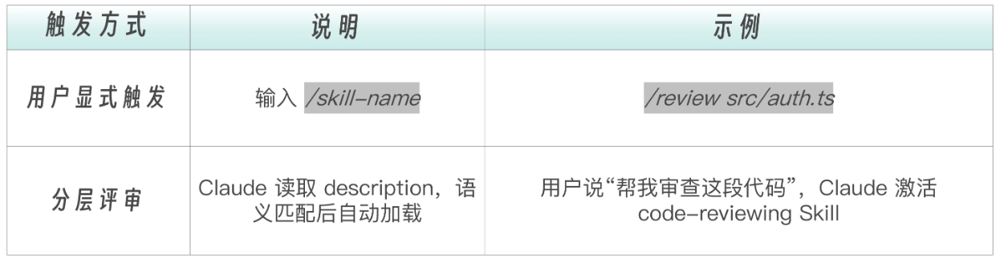

这是 Skill 最重要的设计特性：**同一个 Skill 既可以作为斜杠命令使用，也可以让 Claude 自动判断何时需要**

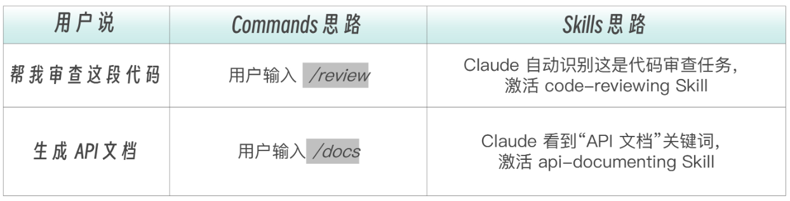

两种方式调用的是同一个 Skill，执行的是同样的指令。

和 Sub-Agents 类似，Skill 的触发机制**靠 LLM 语义推理，而非精确匹配**。Claude 读取所有 Skill 的 description，通过语义理解判断当前对话是否匹配某个 Skill


当用户发送消息时，Claude 的处理流程如下图所示：

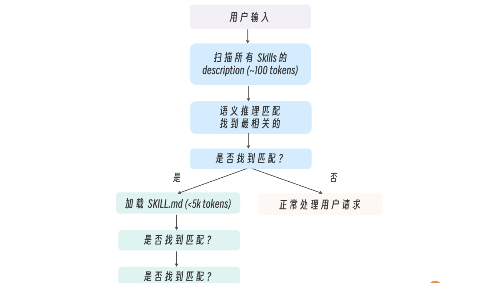


假设有 5 个 Skill，每个 SKILL.md 约 1000 tokens：

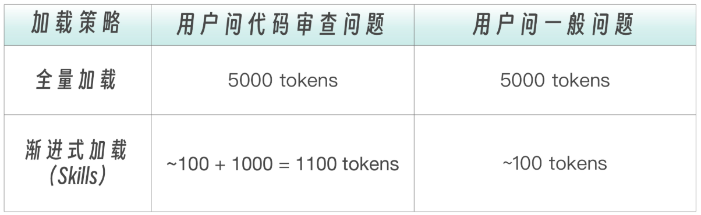

可以看到，**渐进式加载时Token的节省比例高达78% ~ 98%**。这就是为什么 Skill 采用“渐进式披露”而非“一次性加载”


当用户请求可能匹配多个 Skill 时，Claude 会：

1. 评估每个 Skill 的 description 与用户请求的相关性
2. 选择最相关的那个
3. 如果不确定，可能会询问用户或使用通用方式处

> 注意：设有 disable-model-invocation: true 的 Skill，其 description 不会加载到上下文。Claude 完全看不到它，只有用户 /name 才能触发


另外，可以采用三种方式来控制 Claude 对 Skill 的访问。

- 全局禁用：在 /permissions 中 deny Skill 工具
- 精确控制：Skill(commit) 精确匹配，Skill(deploy *) 前缀匹配
- 逐个控制：给 Skill 加 disable-model-invocation: true frontmatter


好的 Skill 设计**遵循“导航页 + 详情页 ”模式**

```yml
SKILL.md                    ← 导航页：概述 + 引用（< 500 行）
├── reference.md            ← 详情页：详细 API 文档
├── examples.md             ← 详情页：使用示例
└── scripts/validate.sh     ← 工具：可执行脚本
```

> 注意： SKILL.md 应该被控制在 500 行以内。如果过于复杂，应该将详细参考资料移到独立文件，并在 SKILL.md 中进行引用（也就是常说的渐进式加载）


Skill 的存放位置决定了谁能使用它，以及优先级顺序：

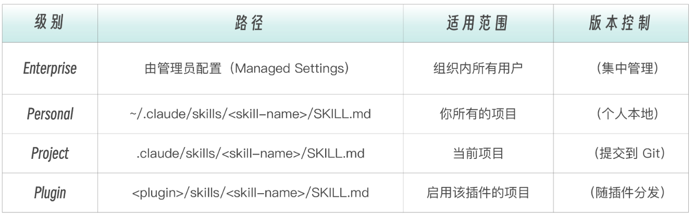

同名优先级：Enterprise > Personal > Project。Plugin Skill 使用 plugin-name:skill-name 命名空间，不与其他级别冲突。

当在子目录（如 `packages/frontend/`）中工作时，Claude Code 会自动发现该目录下的 `.claude/Skill/`。这种 monorepo 的 Skill 自动发现机制让 monorepo 中的每个 package 都可以有自己的 Skill


### Skill 的两大类型：参考型和任务型

从工程角度，Skill 内容分为两类：参考型和任务型。参考型 Skill 影响“怎么做”，任务型 Skill 决定“做什么”

在写 description 时需要明确它属于哪种类型：

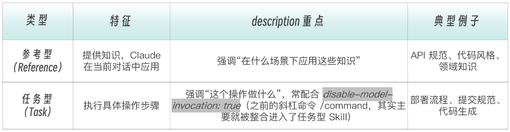


参考型 skill 自动选择是否使用

```yaml
---
name: api-conventions
description: API设计模式，适用于此代码库。在编写或审查API端点时使用。
---
```


任务型 skill 通常由用户手动触发

```yaml
---
name: deploy
description: 部署应用程序到生产
disable-model-invocation: true
---
```


参考型 Skill 更像组织的行为规范层。它定义例如 API 设计标准、代码风格、错误处理约定。这类 Skill 通常由模型根据语义自动判断是否加载，不主导行动，而是塑造行动的方式

任务型 Skill 则更像组织的操作流程层。它定义一次明确的行动：部署、发布、迁移、生成报告等。这类行为具有边界和风险，通常需要显式触发，因此常配合 disable-model-invocation 使用


### Skill 文件结构

> 完整示例在：03-Skill/01-reference-skill


在Claude Code中，每个 Skill 独占一个目录。其标准的目录和文件结构如下：`.claude/Skill/<skill-name>/SKILL.md`


```yaml
.claude/Skill/api-conventions/     # skill 目录，名称即 skill 名
└── SKILL.md                        # 主文件（必需）
```

配置：

````markdown
---
name: api-conventions
description: API design patterns and conventions for this project. Covers RESTful URL naming, response format standards, error handling, and authentication requirements. Use when writing or reviewing API endpoints, designing new APIs, or making decisions about request/response formats.
allowed-tools:
  - Read
  - Grep
  - Glob
---

# API Design Conventions

These are the API design standards for our project. Apply these conventions whenever working with API endpoints.

## URL Naming

- Use plural nouns for resources: `/users`, `/orders`, `/products`
- Use kebab-case for multi-word resources: `/order-items`, `/user-profiles`
- Nested resources for belongsTo relationships: `/users/{id}/orders`
- Maximum two levels of nesting; beyond that, use query parameters
- Use query parameters for filtering: `/orders?status=active&limit=20`

## Response Format

All API responses must follow this structure:

```json
{
  "data": {},
  "error": null,
  "meta": {
    "page": 1,
    "limit": 20,
    "total": 100
  }
}
```

- `data`: 成功时返回的业务数据
- `error`: 错误时返回错误对象 `{ code, message, details }`，成功时为 `null`
- `meta`: 分页和元信息，列表接口必须返回

## HTTP Status Codes

- 200: 成功返回数据
- 201: 成功创建资源
- 400: 请求参数错误
- 401: 未认证
- 403: 无权限
- 404: 资源不存在
- 422: 业务逻辑错误
- 500: 服务器内部错误

## Authentication

- All endpoints require Bearer token unless explicitly marked as public
- Public endpoints must be documented with `@public` annotation
- Token format: `Authorization: Bearer <jwt-token>`

## Versioning

- API version in URL path: `/api/v1/users`
- Breaking changes require new version
````

Skill 主要有三个部分：

- YAML frontmatter，是通过`---`包裹的元数据
- Markdown 正文，是技能的具体说明
- 辅助文件：`.claude/Skill/<skill-name>/SKILL.md`。每个 Skill 在自己的目录中，可以包含辅助文件（当前 skill 暂时没有）


这是一个典型的参考型 Skill：

- 没有执行步骤 ：不是先做A再做B，而是“遵循这些规范”
- 没有输出模板 ：不要求 Claude 输出固定格式的报告
- 没有设 disable-model-invocation：Claude 可以自动判断何时需要
- 只读工具 ：allowed-tools 限制为 Read/Grep/Glob，因为规范查阅不需要改代码


Claude 选择是否激活一个 Skill，完全依赖于阅读 description。这不是关键词匹配，而是语义理解。**description 是 Skill 的灵魂，因为它不是给人看的文档，而是给 Claude 看的触发器**


**好的 description 与差的对比**

```yaml
description: 处理PDF文件

很明显，问题在于太模糊，“handles”是什么意思？读取？转换？合并？Claude 不知道什么时候该用它。用户说“帮我处理这个 PDF”时，Claude 可能不确定这个 Skill 是否合适。


description: 从PDF文件中提取文本和表格，填写表格，合并文档。当处理PDF文件或用户提及PDF、表格或文档提取时使用。

为什么这版更好？因为它列出了具体动作（extract, fill, merge）；包含了用户可能说的关键词（PDF, forms, document extraction）；明确说明了触发场景（“Use when…”）
```


description 书写公式：**description = [做什么] + [怎么做] + [什么时候用]**

几个套用公式的示例：

```markdown
# 代码审查 Skill
description: 审查代码的质量、安全性和最佳实践。检查错误、性能问题和风格违规。当用户请求代码审查、希望获得代码反馈、提及审查更改或询问代码质量时使用。


# API 文档 Skill
description: 从代码生成API文档。提取端点、参数和响应模式。当用户想要记录API、创建API参考、生成端点文档或需要帮助处理OpenAPI/Swagger规范时使用。

# 数据库查询 Skill
description: 查询数据库并分析结果。支持SQL生成、查询优化和结果解释。当用户询问数据、想要运行查询、需要数据库信息或提及表/模式时使用。
```


有多个 Skill 时，确保 description 有明确区分：

```markdown
# ❌ 容易冲突
name: unit-testing
description: 编写代码测试

name: integration-testing
description: 编写代码测试


# ✅ 明确区分
name: unit-testing
description: 编写和运行针对单个函数的单元测试。用于单独测试单个函数或方法，模拟依赖关系，并验证函数行为。

name: integration-testing
description: 编写和运行系统组件的集成测试。用于测试多个组件如何协同工作、测试API端点端到端或验证数据库交互。
```


### Skill Frontmatter 字段详解

Claude Code Skill 支持的完整 frontmatter 字段如下：

```yaml
---
name: my-skill-name                # 可选：Skill 标识符（省略则用目录名）
description: What this does        # 推荐：触发器（最重要！）
argument-hint: "[issue-number]"    # 可选：自动补全时的参数提示
disable-model-invocation: true     # 可选：禁止 Claude 自动触发
user-invocable: false              # 可选：对用户隐藏 /skill-name
allowed-tools:                     # 可选：限制可用工具
  - Read
  - Grep
  - Glob
model: sonnet                      # 可选：指定执行模型
context: fork                      # 可选：在子代理中隔离执行
agent: Explore                     # 可选：context: fork 时的代理类型
hooks:                             # 可选：作用域为此 Skill 的 Hooks
  PreToolUse:
    - matcher: Write
      hooks:
        - type: command
          command: "echo 'Write called in skill'"
---
```

- name 字段：最大 64 字符，只能使用小写字母、数字、连字符，推荐使用动名词形式：code-reviewing、api-documenting、bug-fixing。如果省略了这个字段，则自动使用目录名（.claude/Skill/code-reviewing/ → name 为 code-reviewing）

- description 字段：这是最重要的字段。它决定 Skill 何时被触发。这个字段应该包含两部分信息：这个 Skill 做什么，以及什么情况下使用它。如果省略了这个字段，系统会使用 Markdown 正文的第一段作为 description
  > 注意：所有 Skill 的 description 会被加载到上下文中供 Claude 判断选择，默认总预算为 15,000 字符。如果你的 Skill 很多，导致 description 被截断，可以运行 /context 查看警告，并通过环境变量 SLASH_COMMAND_TOOL_CHAR_BUDGET 调大预算

- argument-hint 字段：自动补全提示，为用户提供参数格式提示，在输入 /skill-name 时系统会自动补全

- disable-model-invocation 和 user-invocable 这两个字段组合起来控制“谁能触发这个 Skill”

  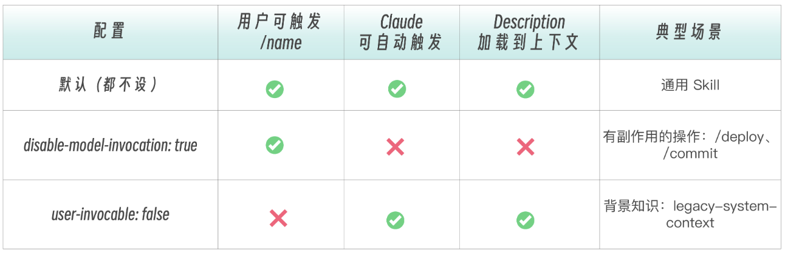

  > 凡是带副作用的Skil，也就是有系统性影响的 Skill：比如部署、发消息、改配置，一定要设 disoble-model-invocation：true

- allowed-tools 字段用来限制 Skill 被激活时 Claude 能使用的工具。Skill 支持的工具包括：

  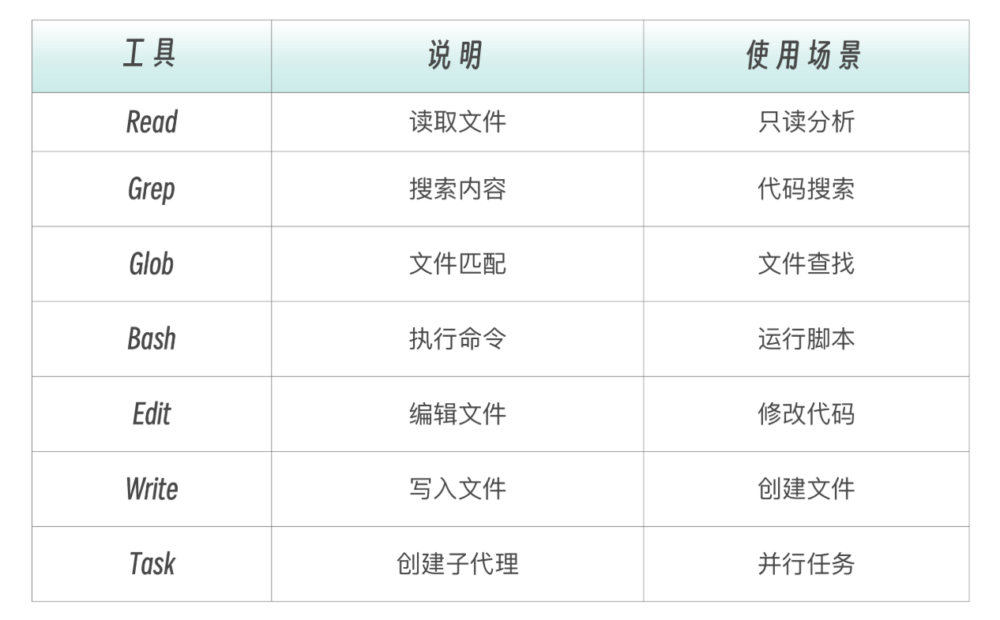
  
  还可以更精细地控制 Bash 命令：
  ```yaml
  allowed-tools:
    - Bash(git:*)      # 只能执行 git 命令
    - Bash(npm test:*) # 只能执行 npm test 相关命令
  ```
  
- context、agent、model：Skill 的执行环境

  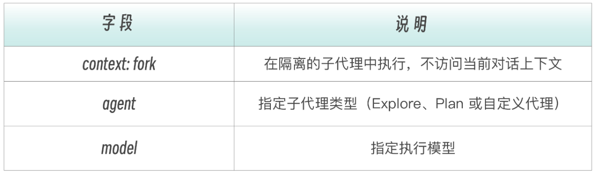
  
- hooks：Skill 级别的 Hooks，可以为 Skill 定义仅在其生命周期内生效的 Hooks


### 总结

Skill 重点：

- **Skill 是可由用户或 Claude 触发的能力包**，Claude 通过语义推理决定何时激活，但目前已经脱离了 Claude Code本身，形成了 Agent 通用技能生态。
- **Skill 的 description 不是文档，而是触发器**，其构建公式为：做什么 + 怎么做 + 什么时候用
- **Claude Code 采用渐进式加载**来节省 token。description 常驻上下文，全文仅在触发时加载


什么时候用参考型 Skill，什么时候用任务型 Skill？什么时候必须手动触发？

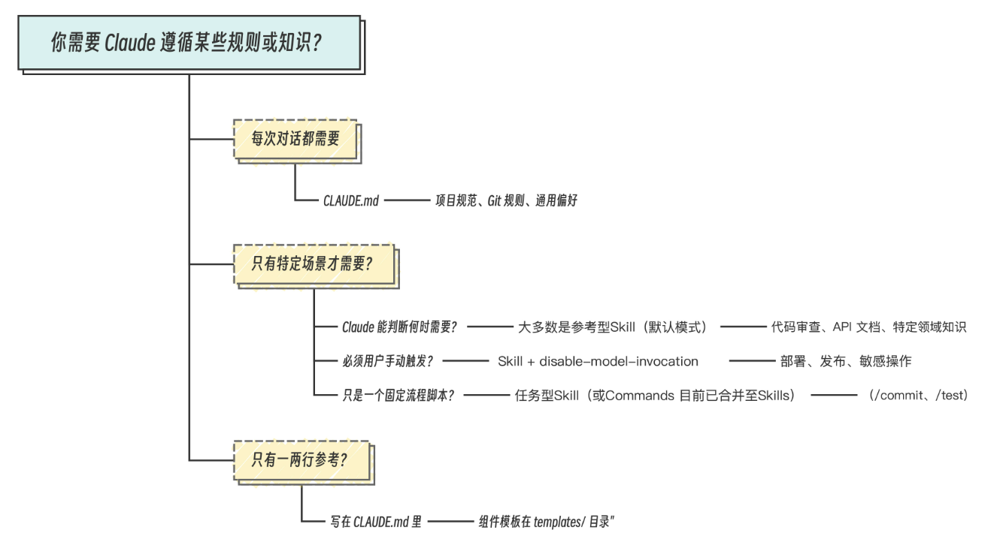

简而言之，CLAUDE.md 放`Claude 每次都该知道的少量规则（< 100 行）`；Skill 放`特定场景下的详细指令和知识”（可以很长，按需加载）`。**如果犹豫放 CLAUDE.md 还是 Skill，那么就放 Skill，并在 CLAUDE.md 里加一行引用**。


## 任务型 Skill

早期，斜杠命令 `/Comands` 和 Skill 是两个独立组件。但在新版 Claude Code 中，Commands 已合并到 Skill，成为 Skill 的子集

`/command` 整合进入 Skill 后，任务型 Skill 基本等同于 `/command`


在 Claude Code 里，令行禁止几乎可以直接翻译为：`disable-model-invocation: true` 。也就是说，没有用户触发，Claude 绝不主动执行


任务型 Skill 的价值：**把重复的对话模式，变成可复用的快捷方式**


### 任务型 Skill 的核心机制

简单来说，任务型 Skill 就是设了 `disable-model-invocation: true` 的 Skill


```yaml
# 参考型——Claude 自动选择是否使用，也可手动触发
name: api-conventions
description: API design patterns for this codebase. Use when writing or reviewing API endpoints.


# 任务型——必须用户手动触发
name: deploy
description: Deploy the application to production
disable-model-invocation: true
```


Claude Code 有两种类型的命令。**内置命令** 是 Claude Code 自带的，用于控制会话和工具，无法修改。 **自定义命令** 是创建的任务型 Skill，用于执行特定的工作流程，完全可掌控


任务型 Skill 可以放在两个目录下：

```yaml
.claude/skills/<name>/SKILL.md      # 推荐：Skills 目录（完整能力）
.claude/commands/<name>.md           # 兼容：Commands 目录（简单命令）
```

两个的区别：

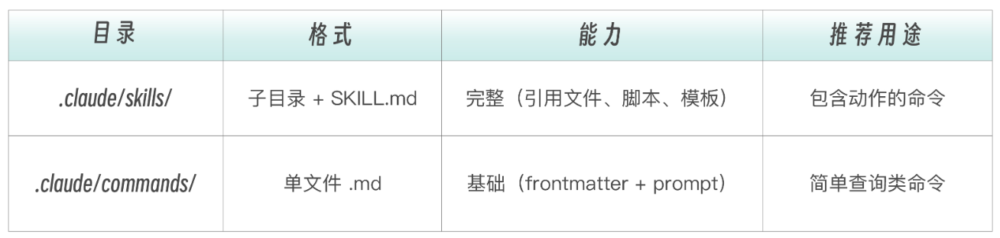


### 通过 ARGUMENTS 给 Skill 传参

当通过 `/skill-name args` 调用 Skill 时，`args` 会通过 `$ARGUMENTS` 注入到 Skill 内容中


例子，有 `fix-issue` 这个 skill，如下：

```markdown
---
name: fix-issue
description: Fix a GitHub issue
disable-model-invocation: true
---

Fix GitHub issue $ARGUMENTS following our coding standards.

1. Read the issue description
2. Understand the requirements
3. Implement the fix
4. Write tests
5. Create a commit
```

当运行 `/fix-issue 123` 时，Claude 收到的内容是“Fix GitHub issue **123** following our coding standards…”

> 注意，传参并不仅仅限于任务型Skill


Skill 支持两种**参数传递** 方式：

- **单参数** ——`$ARGUMENTS` 接收所有参数

  ```markdown
  ---
  description: Quick git commit
  argument-hint: [commit message]
  disable-model-invocation: true
  ---
  
  Create a git commit with message: $ARGUMENTS
  
  ```

- **多参数** —— `$1`，`$2` 接收位置参数

  ```markdown
  ---
  description: Create a pull request
  argument-hint: [title] [description]
  disable-model-invocation: true
  ---
  
  Title: $1
  Description: $2
  ```

  用法示例：

  ```bash
  /commit fix login bug           # $ARGUMENTS = "fix login bug"
  /pr-create "Add auth" "JWT"     # $1 = "Add auth", $2 = "JWT"
  ```

  可以用 `$ARGUMENTS[N]` 或简写 `$N` 访问特定位置的参数

  ```markdown
  ---
  name: migrate-component
  description: Migrate a component from one framework to another
  ---
  
  Migrate the $0 component from $1 to $2.
  Preserve all existing behavior and tests.
  ```

  上面，执行 `/migrate-component SearchBar React Vue`，`$0` 被替换 为SearchBar, `$1` 为 React, `$2` 为Vue


> 如果 Skill 中根本就没有定义 `$ARGUMENTS`，而在调用Skill的时候又偏偏传递了参数进去。Claude Code 会自动在内容末尾追加 `ARGUMENTS: <用户输入>`，确保参数不会丢失


### `!command` 动态上下文注入

前置知识：Claude Code  中输入 `! + 命令`，相当于：**直接在当前终端环境执行一条 shell 命令**

```bash
!ls
!pwd
!git status
!npm test
!python main.py
```


Skill 中那么多文字和信息，其实归根结底还是 Prompt，需要 Claude Code（工具）发给 Claude 或者 GLM/Qwen 等模型来处理。而模型启动时并不知道和当前技能相关的上下文，这一功能刚好可以解决该问题


当用户输入 `/pr-create "Add auth"` 时，模型收到的只是 Prompt 文本。它并不知道：

- 当前在哪个分支
- 有哪些 commit 待合并
- 改了哪些文件


如果不预注入上下文，其实模型也会**先花多轮工具调用** 去收集这些信息，任务虽然还是能完成，但浪费 token 和时间。

而 `!command` 是 Skill 文件的**预处理器** ——在文件内容发送给模型 **之前** ，先在 shell 中执行这些预设的命令，然后**把它们的输出结果内联替换到 Prompt 中** ，再去执行新的命令。


示例：

```markdown
## Current Context (Auto-detected)

Current branch:
!`git branch --show-current`

Recent commits on this branch:
!`git log origin/main..HEAD --oneline 2>/dev/null || echo "No commits ahead of main"`

Files changed:
!`git diff --stat origin/main 2>/dev/null || git diff --stat HEAD~3`
```


Claude 实际收到的 Prompt（替换后）：

```markdown
## Current Context (Auto-detected)

Current branch:
feature/auth

Recent commits on this branch:
a1b2c3d Add JWT middleware
d4e5f6g Add login endpoint
g7h8i9j Add user model

Files changed:
 src/auth/middleware.ts | 45 +++
 src/auth/login.ts     | 82 +++
 src/models/user.ts    | 34 +++
 3 files changed, 161 insertions(+)
```

这样，Claude **启动**`/pr-create "Add auth"` **时就拥有了完整上下文** ，可以直接生成 PR 标题和描述，无需额外再进行多一次工具调用


执行流程如下：

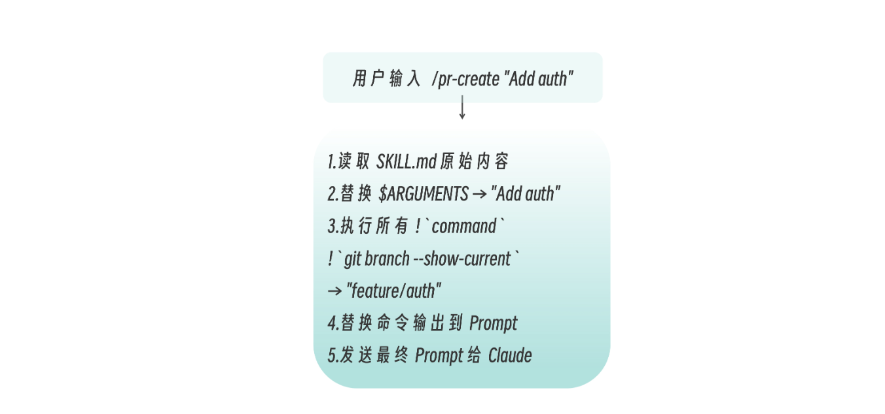


`!command` 可以与 `$ARGUMENTS` 组合，在动态注入时使用参数值

```markdown
---
description: Show git blame for a file
argument-hint: [file path]
disable-model-invocation: true
allowed-tools: Bash(git:*)
---

Analyze the git history for: $ARGUMENTS

File blame:
!`git blame $ARGUMENTS 2>/dev/null | head -30 || echo "File not found"`

Recent changes:
!`git log --oneline -5 -- $ARGUMENTS 2>/dev/null || echo "No history"`
```

`$ARGUMENTS` 参数会先被替换，再执行 `!command`。这意味着用户输入会进入 shell 命令。因此**务必在** `allowed-tools`**中严格限制可执行范围**


动态注入的工程价值和优势：

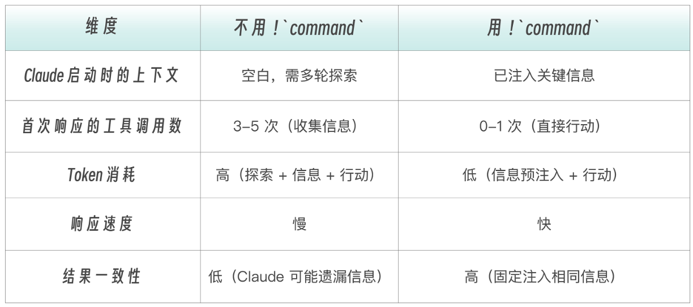


### Skill 内的 Hooks

任务型 Skill 通常执行的是有**副作用(side-effect）** 的操作：提交代码、部署应用、修改文件。这类操作需要自动化的安全网


Hooks 配置很简单，只需要在 frontmatter 的 `hooks` 字段中定义：

```markdown
---
description: Safe deployment command
disable-model-invocation: true
allowed-tools: Bash(git:*), Bash(npm:*), Bash(ssh:*)
hooks:
  PreToolUse:
    - matcher: Bash
      hooks:
        - type: "command"           
          command: echo "About to run: $TOOL_INPUT" >> /tmp/deploy.log
  PostToolUse:
    - matcher: Edit
      hooks:
        - type: "command"           
          command: npx prettier --write "$FILE_PATH"
---

Deploy the application to staging environment.
```

Skill 内的 Hooks 不是一条一条平铺写的，而是按**事件 → 匹配规则 → 要执行的命令列表**一层一层包起来。也就是一个三层树形结构，而不是一行一个 Hook。这是为了支持**多事件 × 多工具 × 多动作** 的组合扩展


Skill 中常用 Hook 模式如下：

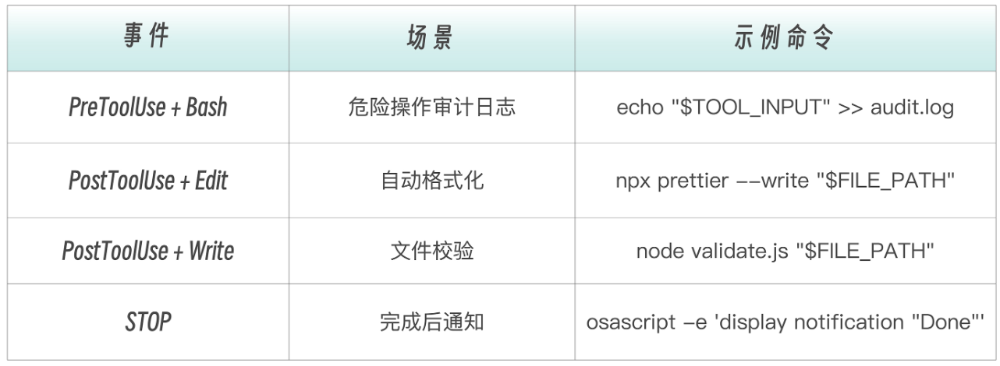

- PreToolUse：工具执行前触发
- PostToolUse：工具成功执行后触发
- Stop：Claude 正常完成一轮回复时触发

还有其他的 Hook 执行时机，但上面三个最常用


Skill Hooks与全局 Hooks 的区别如下：

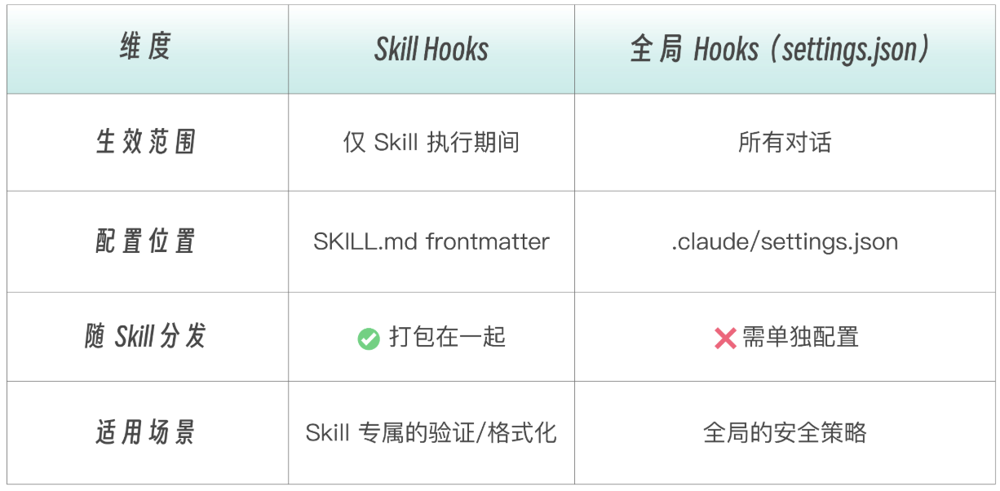


### 任务型 Skill 设计方法论

设计一个 Skill 时，可以按照七步清单：

1. 动作是什么？ → 命名（commit、deplo，y、review）
2. 谁能触发？   → disable-model-invocation: true
3. 需要什么权限？→ allowed-tools 精确到命令级
4. 启动时需要什么上下文？→ `!command` 预注入
5. 执行过程需要什么安全网？→ hooks
6. 输出量大不大？→ 大则 context: fork
7. 用什么模型？ → model（简单 haiku，复杂 sonnet）


任务型 Skill的几个重要设计原则：

- **单一职责原则** ：一个命令做一件事

  ```yaml
  ✅ /commit, /push, /review
  ❌ /git-all-in-one
  ```

- **清晰命名原则** ：从命令名就能知道它做什么

  ```yaml
  ✅ /test:unit, /deploy:staging, /pr-create
  ❌ /do-stuff, /cmd1, /x
  ```

- **有意义的参数提示** ：让使用者了解如何传参

  ```yaml
  ✅ argument-hint: [commit message]
  ✅ argument-hint: [source file] [target directory]
  ❌ argument-hint: [args]
  ```

- **权限最小化原则** ：严格控制每个任务的权限边界

  ```yaml
  # ✅ 精确授权——只允许 git 的特定子命令
  allowed-tools: Bash(git status:*), Bash(git add:*), Bash(git commit:*)
  
  # ❌ 过于宽泛——等于授权所有 shell 命令
  allowed-tools: Bash(*)
  ```


权限范围的设计经验：

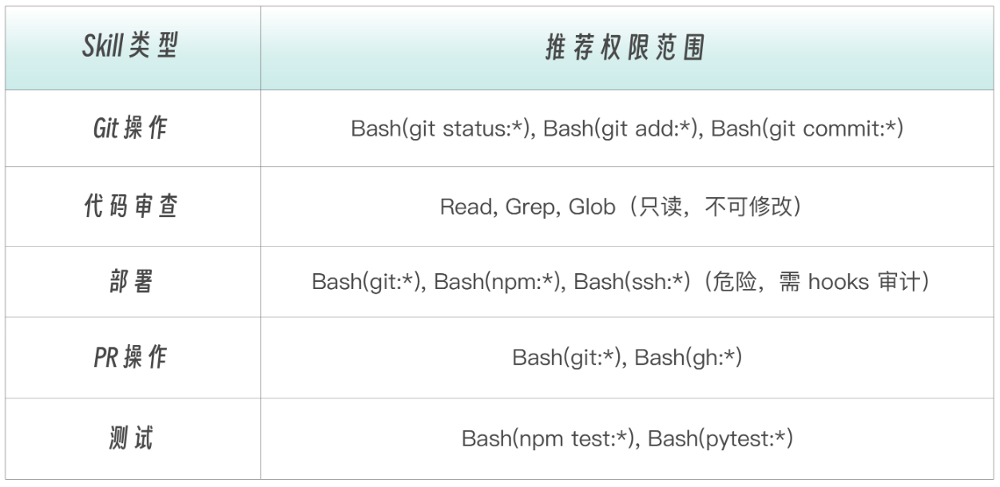


### 实战：团队标准命令集

> 实战项目在：03-Skills/02-team-standards

可以在 `.claude/commands` 下，也可以在 `.claude/skills` 下，同名 skill 在 skills 下的优先级高。更加推荐直接放在 skills 下


### 总结

- **任务型 Skill =**`disable-model-invocation: true`。这个字段决定了 Skill 是“知识提供者”还是“动作执行者"。任务型绝不让 Claude 自作主张触发

- `!command` **动态上下文注入**。让 Claude 启动时就拥有完整上下文，减少 3-5 次工具调用，提升响应一致性

- **Skill 内 Hooks 提供执行期间的安全网** ，仅在 Skill 生命周期内生效，随 Skill 一起分发

- **七步设计清单** ：动作 → 触发 → 权限 → 上下文 → 安全网 → 隔离 → 模型。尤其要强调的原则是**权限最小化原则，**`allowed-tools` 应该精确到命令级，不要随便用 `Bash(*)`
- **Skill 的价值在于积累**。团队标准化流程就是把最佳实践固化为 Skill


## 渐进式披露架构设计

在真实场景中，专业能力往往很复杂，比如一个财务分析 Skill，它需要包含财务指标计算公式、不同行业的基准数据、各种报表模板、分析脚本以及案例示例

如果把这些全部塞进一个 SKILL.md，会有两个问题：

- **Token 爆炸**：每次激活都要加载几千 tokens

- **信息噪声**：用户问“收入增长率怎么算”，Claude 却要阅读关于成本分析、现金流、资产负债表的全部内容


**渐进式披露（Progressive Disclosure** ，即渐进式的加载**）** 就是解决这个问题的架构模式。但渐进式披露的意义远不止节省 token。从企业本体论的视角看，它是**知识管理（Knowledge Management）在 AI 架构中的技术映射**。如何让正确的知识在正确的时刻到达正确的执行者手中


### 渐进式披露的设计哲学

用图书馆来类比渐进式披露的设计哲学：走进一个图书馆找资料时，不会一次把所有书都读一遍。而是先看目录找到相关分类，再选一本具体的书，最后翻到需要的章节深入阅读。信息是逐层展开的，而不是一次性全部载入大脑


Skill 的渐进式披露设计也是一样：

- 第一层只扫描 description 作为“目录”
- 第二层在触发时加载 SKILL.md 主文件作为“章节”，
- 第三层再按需加载被引用的具体文件作为“附录”。

结构化分层替代信息堆叠，让系统在规模变大时依然高效、可控

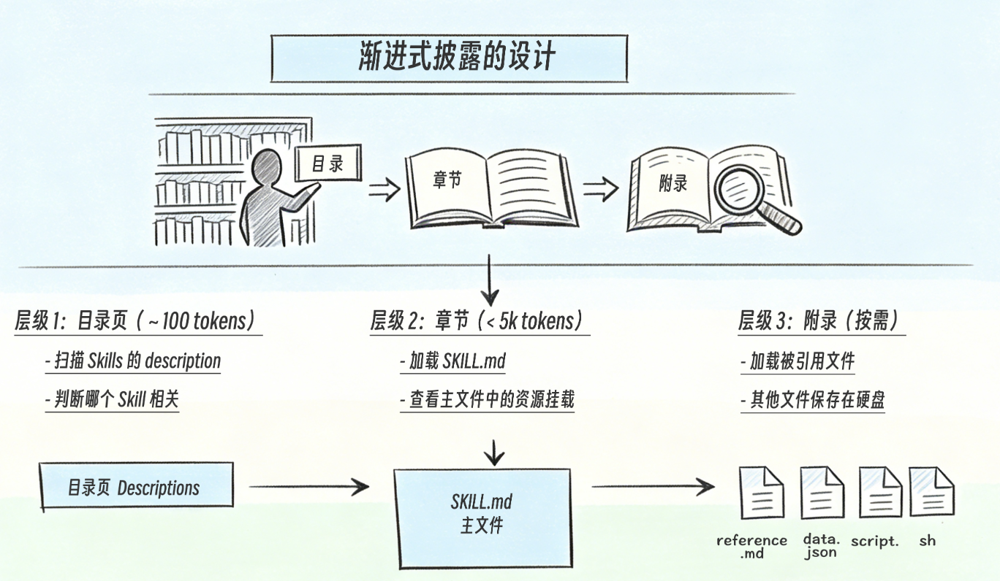


### 上下文窗口是稀缺资源

**上下文窗口是 LLM 的“工作记忆”。** 人类的工作记忆大约能同时处理 7±2 个信息块（Miller’s Law）。LLM 的上下文窗口虽然大得多（最新的到 1M），但也是**有限的稀缺资源** ，而且有一个更严重的问题：**注意力稀释效应**


注意力稀释效应：是指上下文越长，LLM 对每个信息片段的关注度越低。一个 5000 token 的上下文中的关鍵指令，比一个 50000 token 上下文中的同样指令，会被更准确地执行。


**渐进式披露的本质**：以最小的 token 投入获得最高的任务完成质量——这就是知识的**投资回报率（Knowledge ROI）**

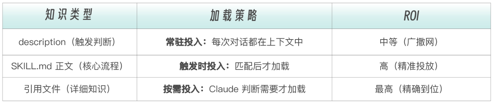


### Skill 的三层渐进式架构详解

例子：财务分析 Skill。当用户提出与收入、成本、利润、增长率、毛利率、ROE/ROA 或整体财务表现相关的问题时，会被激活，先在主文件中完成问题识别和分析路径判断，再按需加载对应的公式说明、行业基准数据或报告模板，必要时调用脚本进行确定性计算，最后输出结构清晰、口径一致的分析结果


Skill 的三层渐进式的架构设计：

**层级 1：目录页（Entry Point）**

这是 Skills 系统扫描阶段读取的内容——**只有 description**

```yaml
---
name: financial-analyzing
description: Analyze financial data, calculate ratios, and generate reports. Use when the user asks about revenue, costs, profits, margins, financial metrics, or needs financial analysis.
---
```

目录页的设计原则是，description 足够丰富，让 Claude 能准确判断相关性。但不要太长，因为**所有 Skill 的 description 共享 15,000 字符的总预算** 。如果 Skill 数量多导致 description 被截断，可以通过 `SLASH_COMMAND_TOOL_CHAR_BUDGET` 环境变量调整


> ！注意：
>
> description 的预算机制决定了一个项目不应有过多的 Skill。如果一个项目需要 20+个 Skil，应该考虑是否有些可以合井，或者用子目录分层
>
> description 是一种 token 投资。每多一个字符的 description，就多占一个字符的常驻上下文


**层级 2：章节（Main Content）**

章节指的是 SKILL.md 的正文部分——**激活后才加载** 

```markdown
# Financial Analysis Skill

## Quick Start
基础的财务分析流程...

## Available Analyses

### Revenue Analysis
For detailed formulas, see `reference/revenue.md`

### Cost Analysis
For detailed formulas, see `reference/costs.md`

### Profitability Analysis
For detailed formulas, see `reference/profitability.md`

## When to Load Additional Resources
- 需要具体公式 → 加载对应的 reference/*.md
- 需要行业基准 → 加载 data/benchmarks.json
- 需要报告模板 → 加载 templates/*.md
```

这一部分的设计原则是主文件提供“路线图”，通过文件引用指向详细内容，然后Claude 根据用户请求决定加载哪些具体内容


**层级 3：附录（On-Demand Resources）**

只有当 SKILL.md 中引用了这些文件，Claude 才会去读取这一类文件

```yaml
.claude/skills/financial-analyzing/    # 标准 Skill 目录
├── SKILL.md                           # 主文件（总是加载）
├── reference/                         # 参考资料
│   ├── revenue.md                     # 收入分析公式
│   ├── costs.md                       # 成本分析公式
│   └── profitability.md               # 盈利分析公式
├── templates/                         # 报告模板
│   ├── quarterly_report.md
│   └── annual_report.md
├── data/                              # 数据文件
│   └── industry_benchmarks.json
└── scripts/                           # 分析脚本
    ├── calculate_ratios.py
    └── generate_report.sh
```

这一部分内容的设计原则是文件名要有描述性（`revenue.md` 而非 `ref1.md`）。Claude 根据文件名判断是否需要加载

所有辅助文件都在 Skill 自己的目录内，随 Skill 一起分发。相关内容放在一起，并按功能域组织子目录。例如脚本有自己独立存放的目录（scripts），Claude 可以执行它，但不需要去“理解”（这样也就节省了Token）


### 财务分析 Skill：项目设计细节

财务分析 Skill 结构如下：

> 在 03-Skills/03-financial-skill 下

```yaml
.claude/skills/financial-analyzing/
├── reference/
│   ├── revenue.md                   # 收入分析
│   ├── costs.md                     # 成本分析
│   └── profitability.md             # 盈利分析
├── templates/
│   └── analysis_report.md           # 分析报告模板
├── scripts/
│   └── calculate_ratios.py          # 比率计算脚本
└── SKILL.md                         # 主 Skill 文件
```


主文件 SKILL.md 设计如下：

````markdown
---
name: financial-analyzing
description: Analyze financial data, calculate financial ratios, and generate analysis reports. Use when the user asks about revenue, costs, profits, margins, ROI, financial metrics, or needs financial analysis of a company or project.
allowed-tools:
  - Read
  - Grep
  - Glob
  - Bash(python:*)
---

# Financial Analysis Skill

You are a financial analyst. Help users analyze financial data, calculate key metrics, and generate insightful reports.

## Quick Reference

| Analysis Type | When to Use | Reference |
|--------------|-------------|-----------|
| Revenue Analysis | 收入、营收、销售额相关 | `reference/revenue.md` |
| Cost Analysis | 成本、费用、支出相关 | `reference/costs.md` |
| Profitability | 利润、毛利率、净利率相关 | `reference/profitability.md` |

## Analysis Process

### Step 1: Understand the Question
- What financial aspect is the user asking about?
- What data do they have available?
- What format do they need the answer in?

### Step 2: Gather Data
- Request necessary financial data from user
- Or read from provided files/sources

### Step 3: Calculate Metrics
For specific formulas and calculations:
- Revenue metrics → see `reference/revenue.md`
- Cost metrics → see `reference/costs.md`
- Profitability metrics → see `reference/profitability.md`

To run calculations programmatically:
```bash
python scripts/calculate_ratios.py <data_file>
```

### Step 4: Generate Report
Use the template in `templates/analysis_report.md` for structured output.

## Output Guidelines

1. Always show your calculations
2. Explain what each metric means
3. Provide context (industry benchmarks when available)
4. Give actionable recommendations

## Important Notes

- Never make up financial data
- Ask for clarification if data is incomplete
- Flag any unusual numbers that might be errors
````


这个 Skill 包括一个 Quick Reference 表格，让 Claude 快速定位需要哪个参考文件。使用相对路径指向资源，进行清晰的文件引用，并通过脚本调用说明告诉 Claude 如何使用计算脚本。同时只允许 Read、Grep、Glob 和特定的 Bash 命令


上面的 SKILL.md 设计，本质上是一个**路由器**，根据用户请求的类型，将 Claude 导向不同的资源文件：

```yaml
用户请求 → SKILL.md（路由判断）  →  目标资源
                │
                ├─ "收入相关"  →  reference/revenue.md
                ├─ "成本相关"  →  reference/costs.md
                ├─ "利润相关"  →  reference/profitability.md
                ├─ "要报告"    →  templates/analysis_report.md
                └─ "要计算"    →  scripts/calculate_ratios.
```

这个路由的**关键设计技巧** 是 Quick Reference 表格。用最少的 token（3 行表格 ≈ 50 tokens）告诉 Claude 五个方向的路由。如果没有这个表格，Claude 需要阅读整个 SKILL.md 的 Step 3 才能知道“收入问题去找 revenue.md”。这就是**信息密度** 的差异


好的路由表格应该：

- 用“用户可能说的关键词”作为路由条件（而非“文件内容的技术名称”）
- 每个路由条目一行，不要超过 10 个条目（超过就需要分层）
- 高频路由放前面


上面的财务分析 skill，具体例子的执行过程：

```yaml
问题一：毛利率怎么计算？

1.扫描 Skills → 发现 financial-analyzing 匹配
2.加载 SKILL.md → 看到 “Profitability → see reference/profitability.md”
3.加载 reference/profitability.md → 找到毛利率公式
4.回答用户


问题二：帮我分析 data 目录中的财务数据，生成一份完整的分析报告，放到当前目录跟目录下

Claude 加载过程：

1. 扫描 Skills，发现 financial-analyzing 匹配
2. 加载 SKILL.md
3. 分析任务需要，加载所有 reference/*.md
4. 需要报告格式，加载 templates/analysis_report.md
5. 需要计算 ，执行 scripts/calculate_ratios.py
```

场景对比：

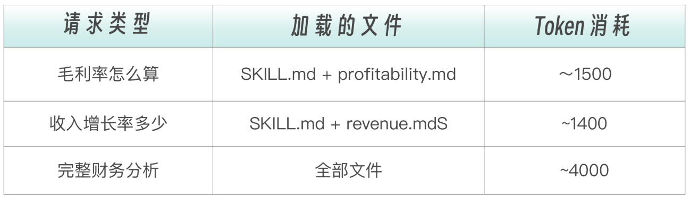

渐进式披露的价值：大部分请求只需要部分资源，平均节省 50-80% tokens


### 渐进式的设计模式与最佳实践

#### 文件组织模式

首先是**文件组织模式** ，有两种模式：

- 按功能分类
- 按使用频率分类

如果 Skill 有多种类型的资源（知识+模板+脚本），用功能分类；如果只有不同深度的知识文档，用频率分类


按功能分类（更推荐）：

```yaml
.claude/skills/my-skill/
├── SKILL.md           # 入口 + 路由（< 500 行）
├── reference/         # 知识库（公式、规范、基准）
├── templates/         # 输出模板（报告、代码骨架）
├── examples/          # 示例集（输入输出样本）
├── scripts/           # 可执行脚本（计算、生成、验证）
└── data/              # 静态数据（JSON、CSV
```


按使用频率分类（适合知识型 Skill）：

```yaml
.claude/skills/my-skill/
├── SKILL.md           # 核心内容（高频，总是加载）
├── QUICKREF.md        # 快速参考（高频，常被加载）
├── DETAILED.md        # 详细说明（中频，按需加载）
└── ADVANCED.md        # 高级用法（低频，很少加载）
```


#### 主文件设计原则

然后是**主文件设计原则** 。主文件应该控制在 **500 行以内**（官方建议：Keep SKILL.md under 500 lines. Move detailed reference material to separate files.）

应该提供路线图，用 Quick Reference 表格做个快速路由，而非让 Claude 逐行扫描


什么内容放主文件，什么内容放引用文件？答案是**高频内容内联，低频内容外链。** 最常用的信息直接放在主文件（80/20 法则——80% 请求只需 20% 内容）；偶尔用到的详细信息放在引用文件，用**契约式引用**


什么是**契约式引用**？

SKILL.md 引用辅助文件时，不要只写一个路径，要写一个**契约** ，让 Claude 知道什么时候该加载、加载后能得到什么

```markdown
# ❌ 弱引用（Claude 不知道何时该加载）
See `reference/revenue.md` for more details.


# ✅ 契约式引用（Claude 清楚加载条件和预期内容）
## Revenue Analysis
When the user asks about revenue growth, ARPU, or revenue composition:
→ Load `reference/revenue.md` for calculation formulas and industry benchmarks
```


契约式引用三要素包括：

- **触发条件** ：什么情况下应该加载（“当用户问到 X 时”）

- **文件路径** ：去哪里找

- **内容预期** ：加载后能得到什么（“计算公式和行业基准”）


引用文件命名要清晰，切忌模糊，重复

```markdown
# 好的命名
reference/revenue.md           # 清晰表明内容
reference/profitability.md     # 清晰表明内容
templates/quarterly_report.md  # 清晰表明用途


# 差的命名
reference/ref1.md              # 不知道是什么
docs/misc.md                   # 太模糊
file.md                        # 毫无信息
```


#### 脚本

脚本适合封装**复杂但确定性的逻辑** 。脚本的好处是 Claude Code可以直接执行它，而不需要“理解”"每一行代码，因此可以减少 Token 消耗（不需要把逻辑放在 prompt 中），便于测试和维护（独立的代码文件）

```markdown
# 适合脚本
- 财务比率计算（公式固定）
- 数据格式转换（规则明确）
- 文件批量处理（重复性高）


# 不适合脚本
- 开放性分析（需要判断）
- 创意性任务（需要灵活性）
- 交互式决策（需要反馈）
```


脚本不仅能做计算，还能**生成可视化结果** 。Claude 官方提供了一种强大的模式：Skill 中的脚本生成交互式 HTML 文件，在浏览器中打开


代码库可视化 Skill 的示例：

```yaml
.claude/skills/codebase-visualizer/
├── SKILL.md                    # 指令：调用 visualize.py
└── scripts/
    └── visualize.py            # 生成交互式目录树 HTML
```


SKILL.md 只需要告诉 Claude 运行脚本：

```markdown
---
name: codebase-visualizer
description: Generate an interactive tree visualization of your codebase. Use when exploring a new repo or understanding project structure.
allowed-tools: Bash(python *)
---

Run the visualization script from your project root:

\```bash
python ~/.claude/skills/codebase-visualizer/scripts/visualize.py .
\```

This creates `codebase-map.html` and opens it in your default browser.
```


流程：用户请求 → Skill 激活 → Claude 执行脚本 → 生成 HTML → 浏览器打开

**这体现了渐进式披露的极致。Claude 只需要知道“运行什么命令”（10 tokens），而非“如何生成 HTML”（2000+ tokens）**


### 内容拆分工程方法论

一个根本问题：面对一坨知识，怎么决定什么放 SKILL.md、什么放引用文件、什么放脚本？


知识拆分决策树：

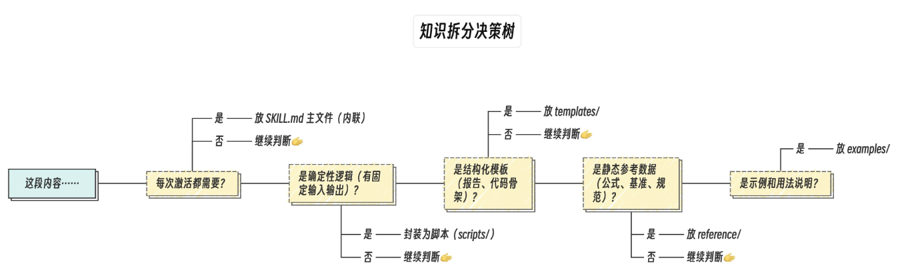

这棵决策树背后真正体现的，是：**核心语义内联，确定逻辑外包，结构独立，数据延迟，示例分离** 等大原则


官方建议 SKILL.md 控制在 **500 行以内**，超过 500 行时的重构信号和对策如下：

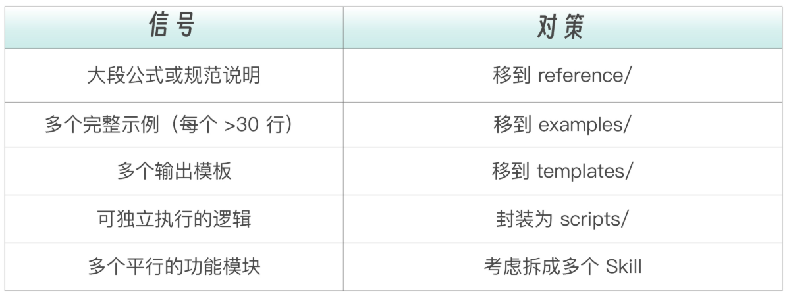


拆分决策树和目录结构不是随意设计的。它们映射到**企业知识管理的经典范式**：

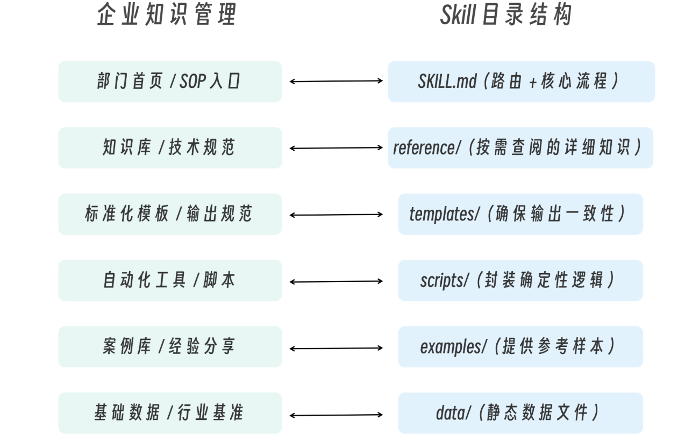

1. **SKILL.md = 部门 SOP 首页** 。好的 SOP 首页不会把所有操作细节都列出来。它提供概览和导航，让使用者快速找到需要的章节。SKILL.md 的 Quick Reference 表格就是这个导航
2. **reference/ = 知识库** 。企业知识库的特点是内容丰富但使用频率低，按需查阅而非每次通读。Skill 的 reference 文件同理。只有 Claude 判断需要时才加载
3. **templates/ = 标准化输出** 。企业用模板确保报告、邮件、文档的格式一致。Skill 的模板同理。Claude 不需要每次都“创造”一个报告格式
4. **scripts/ = 自动化工具** 。企业用脚本和工具自动化重复性操作。这里的关键洞察是，**脚本把“知识”变成了“行动“** 。它是 Skills（知识层）和 Tools（行动层）的桥梁


这引出了一个重要话题：Skills 和 Tools 到底是什么关系？它们如何协作？下面继续探讨


### Skills 与 Tools 的本质关系

#### 第一层关系：Skills 约束 Tools

Skills 通过 allowed-tools 约束 Tools **，**实现 **最小权限原则**

```yaml
allowed-tools:
  - Read          # 允许读取
  - Grep          # 允许搜索
  - Glob          # 允许查找
  # 没有 Write、Edit、Bash → 不允许修改
```

这不是简单的权限控制。这是**知识约束行动** 的范式。一个代码审查 Skill “知道”审查只需要看代码不需要改代码，所以它只给 Claude 只读工具。一个文档生成 Skill “知道”需要创建新文件但不应修改旧文件，所以它给 Write 但不给 Edit。


#### 第二层关系：Skills 编排 Tools

Skill 中的 `scripts/` 目录存放的脚本，本质上是**预编译的 Tool 调用序列**

```markdown
# scripts/calculate_ratios.py
# 这个脚本 = Read(data_file) + 计算逻辑 + Print(results)
# Claude 不需要理解计算逻辑，只需要：
#   1. Bash("python scripts/calculate_ratios.py data.json")
#   2. 读取输出结果
```


没有脚本时，Claude 需要自己组合多个 Tool 调用来完成任务：

手动编排（没有脚本）：
1. Read(data.json) → 获取数据
2. Claude 内部计算 → 消耗推理 token
3. 可能出错 → 需要多轮修正


有脚本时，Claude 只需一次 Tool 调用：

脚本编排（有脚本）：
1. Bash(python calculate.py data.json) → 直接获得结果


**脚本是“预编译”的知识**。它把人类专家的领域逻辑固化为代码，让 Claude 不需要在运行时“重新发明轮子”。


#### 第三层关系：Tools 反哺 Skills

`!command` 语法展示了反向关系：**Tools 的输出反哺 Skills 的上下文**

```markdown
---
name: pr-summary
description: Summarize changes in a pull request
---

## Context
- PR diff: !`gh pr diff`           # Tool 输出 → 注入 Skill 上下文
- Changed files: !`git diff --name-only`
```

这是 Tools 反哺 Skills 的预处理模式：Shell 命令在 Skill 加载之前执行，输出直接注入 SKILL.md 内容，Claude 收到的是**已经包含实时数据的知识**


####  Skills × Tools 共生公式

上述三层关系做个总结可以得到下面的 Skills × Tools 共生公式：

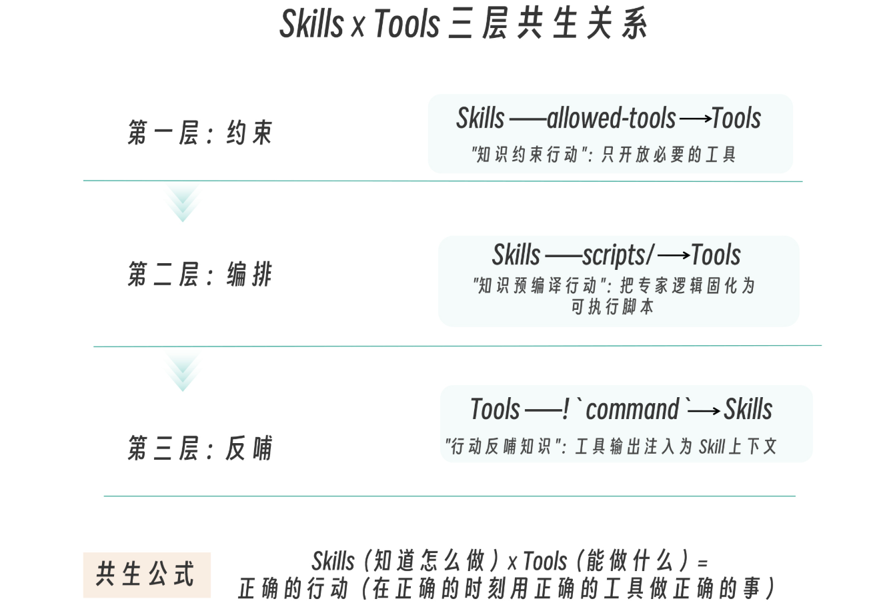


### 总结

**渐进式披露**是 Skills 的核心架构模式：按需加载，节省 tokens


**三层架构是**：目录页（description）→ 章节（SKILL.md）→ 附录（引用文件）


**SKILL.md 是路由器，**通过Quick Reference 表格用最少 token 完成路由判断。引用文件的“契约式”写法，即**契约式引用会**告诉 Claude 何时加载、加载什么、得到什么。这里有一个 **500 行法则** ，超过就该重构。把参考、模板、示例移到辅助文件。通过**脚本**来封装确定性逻辑，Claude 执行但不需要理解脚本中的内容


如果与之前的子代理一起，那么有两种上下文管理策略，分别是**Skill的渐进式披露（按需加载）+ 子代理隔离（纯净上下文）**它们互相补充，解决不同的问题。两种上下文管理策略表的对比：

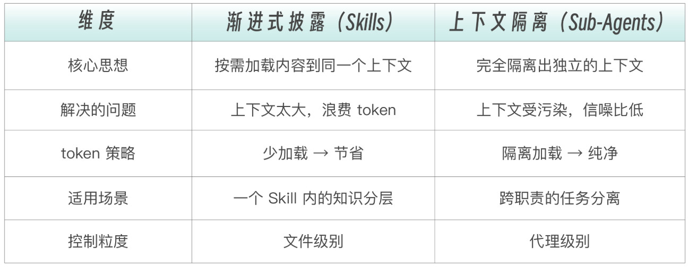

**组合使用** ：一个子代理可以通过 `skills` 字段预加载 Skill，而该 Skill 内部仍然用渐进式披露组织内容。两种策略是互补的


## Skill 与 SubAgent 的结合

Skills 单独使用已经很强，但它真正的威力在于**与 SubAgent 组合**。把一个通用的 Agent 打造成领域专家


### 两个组合方向：谁包含谁

Skills 解决的是“怎么做”的问题，本质是知识注入。它让同一个 Agent 学会新的能力，就像给一个员工发了一本操作手册，员工还是那个人，只是掌握了更多方法与规范

SubAgents 解决的是“谁来做”的问题，本质是任务委托。它创建一个独立的执行者去完成某件事，就像把任务交给另一位同事，对方拥有自己的上下文、职责边界和决策空间

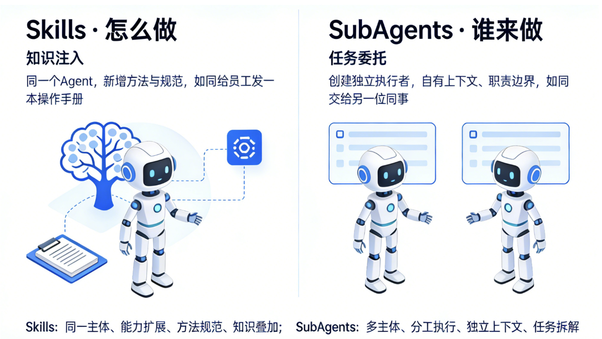


当把两者组合时，本质上只有两个组合方向：

- 是 SubAgent 内部加载 Skills
- 还是由主 Agent 通过 Skills 去编排和调用 SubAgents


#### SubAgent 包含 Skill（`skills` 字段）

这种方式，子代理通过 `skills` 字段给它预加载领域知识。**SubAgent 是老板，Skill 是工具书**

比如一个 api 文档生成子代理：

```markdown
---
name: api-doc-generator
description: Generate API documentation by scanning Express route files.
tools: [Read, Grep, Glob, Write, Bash]
skills:
  - api-generating           # ← 关键：预加载 Skill 作为领域知识
---

You are an API documentation specialist.

## Your Mission
Generate or update API documentation for Express.js routes.
```


这种情况下，Claude Code 的执行流程如下：

```bash
Claude 主对话: "用 api-doc-generator 为 src/ 生成 API 文档"

主对话                              SubAgent (api-doc-generator)
  │                                    │
  ├─ 创建子代理 + 注入 Skill ──────────→ │
  │                                    ├─ 上下文中已有：角色定义 + SKILL.md 全文
  │                                    ├─ 按 SKILL.md 步骤执行任务
  │                                    ├─ 使用 Skill 提供的脚本和模板
  │                                    ├─ 生成文档
  │  ←──────── 返回结果摘要 ──────────── │
  ├─ 继续对话                          （子代理结束）
```


SubAgent 包含 Skill是最常见的情况，适用场景包括子代理需要特定领域的专业知识来完成任务，同一个 Skill 可以被不同角色的 SubAgent 复用，以及需要长期维护的专家型 Agent


#### Skill 包含 SubAgent（`context: fork`）

这种方式，Skill 自带任务指令，通过 `context: fork` 配置自动“派遣”一个子代理去执行。**Skill 是老板，SubAgent 是执行者**


```markdown
---
name: deep-research
description: Research a topic thoroughly in the codebase
context: fork           # ← 关键：让 Skill 在独立子代理中执行
agent: Explore          # ← 子代理类型（内置子代理或者自定义的子代理）
---

Research $ARGUMENTS thoroughly:

1. Find relevant files using Glob and Grep
2. Read and analyze the code
3. Summarize findings with specific file references
```


此时的 Claude Code 执行流程如下：

```bash
用户: /deep-research authentication flow

主对话                              子代理（Explore）
  │                                    │
  ├─ 创建隔离上下文 ───────────────────→ │
  │                                    ├─ 收到任务："Research authentication flow..."
  │                                    ├─ Glob/Grep 搜索相关文件
  │                                    ├─ Read 分析代码
  │                                    ├─ 生成结构化摘要
  │  ←──── 返回结果摘要 ──────────────── │
  ├─ 继续对话（上下文干净）            （子代理结束）
```

子代理**看不到** 之前的对话历史，因此 `SKILL.md` 的内容成为子代理的任务指。

`agent` 字段决定子代理类型，有三个内置的值：`Explore`（只读探索）、`Plan`（规划）、`general-purpose`（通用，省略 `agent` 时默认使用)；以及使用自定义的 subagent


这种应用方式的适用场景是：

- 研究型任务（深度探索代码库，不污染主对话）
- 重型生成（批量生成文档，中间过程不需要用户看到）
- 以及安全隔离（Skill 的操作不应影响主对话状态）


> 注意：context：fork只适合有明确指令的任务型 Ski。如果 Skill是参考型的内容 （如“API设计规范“），没有具体任务，子代理收到规范但不知道该做什么，会直接返回空结果


两个方向的对比：

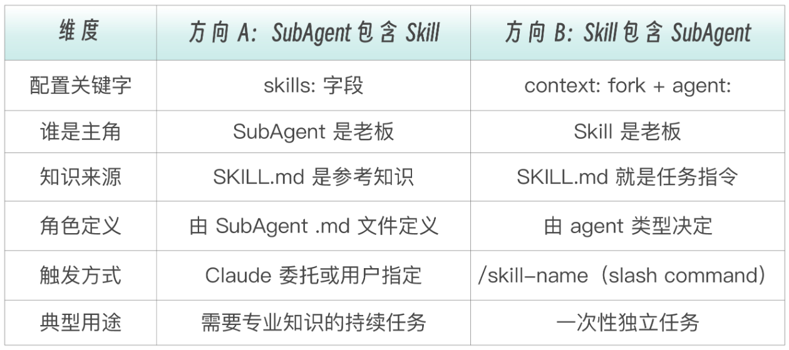


### 构建 Skill：API 文档专家

一位 API 文档专家，当写文档时，需要：

- **识别技术栈** （Express? FastAPI? Spring?）→ PATTERNS.md
- **遵循规范** （字段命名、格式要求）→ STANDARDS.md
- **参考案例** （不确定时看例子）→ EXAMPLES.md
- **使用模板** （保证一致性）→ templates/
- **批量处理** （几十个端点不可能手写）→ scripts/


一个生产级的 Skill 的完整架构应该包含这些组件：

```markdown
.claude/skills/api-generating/          # 标准 Skill 目录
├── templates/
│   ├── index.md                        # 模板：API 索引页
│   ├── endpoint.md                     # 模板：端点文档
│   └── openapi.yaml                    # 模板：OpenAPI 规范
├── scripts/
│   ├── detect_routes.py                # 脚本：路由检测
│   └── validate_openapi.sh             # 脚本：规范验证
├── SKILL.md                            # 入口：路由 + 核心逻辑
├── PATTERNS.md                         # 知识：框架识别模式
├── STANDARDS.md                        # 规范：文档编写标准
└── EXAMPLES.md                         # 示例：输入输出案例
```


每个组件都有明确的职责：

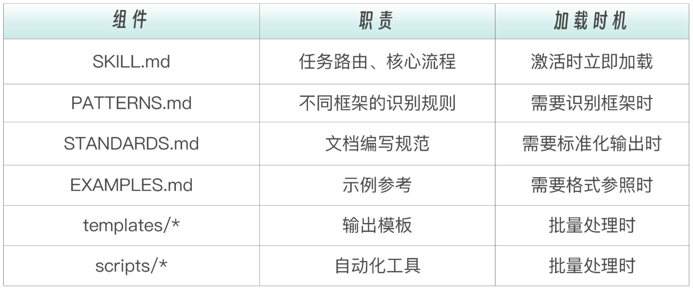


这些都是长期的经验积累之后内化的结果，一个生产级 Skill 所希望做到的，就是把这些专家经验形式化


> 对应的示例在：03-Skills/05-api-generating


### 三种组合模式

两个组合方向是基础构件。实战中还衍生出三种组合模式


#### 模式一：SubAgent 预加载 Skills

一个子代理预加载一个或多个 Skill，用领域知识增强自己的能力。这是最常见的模式。

```yaml
---
name: api-doc-generator
skills:
  - api-generating              # 预加载 API 文档生成知识
---
```


配置了Skill的子代理好比一个经过培训的专业技师。**而同一个 Agent，注入不同的 Skill，就变成不同的专家。这就是组合的力量。**

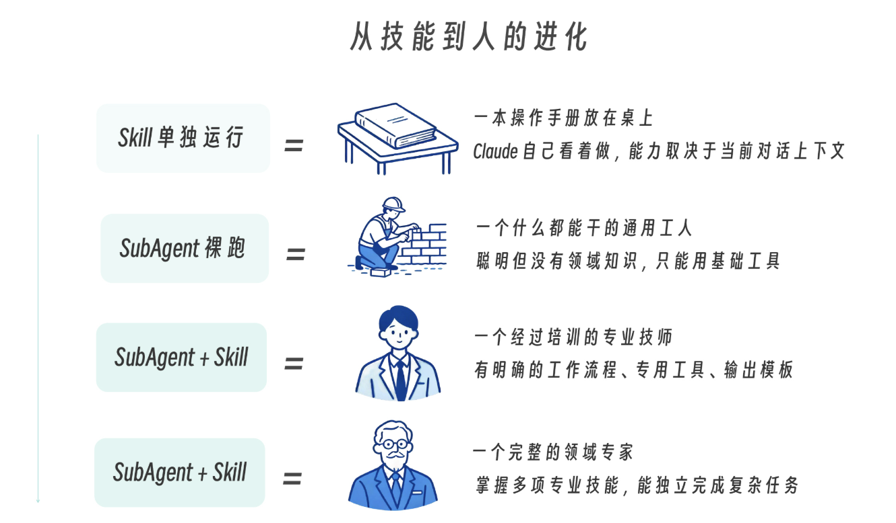


单独用Skill到组合使用的进化路线：

> 具体代码在：03-Skills/06-agent-skill-combo

```yaml
api-generator                           agent-skill-combo
─────────────                           ─────────────────
Skill 独立运行                           Skill + SubAgent 组合

SKILL.md（6 组件全展示）                  SKILL.md（精简为 3 组件）
┌─────────────────────────────┐        ┌──────────────────────────────────────┐
│ Quick Reference             │        │ 工作流程 — MANDATORY                  │
│ Process: Step 1-4          │   →    │ Step 1: Route Discovery（脚本）       │
│ Automation: 可选            │       │ Step 2: Route Analysis（分析）        │
│ 6 个引用文件                │       │ Step 3: Documentation Generation    │
└─────────────────────────────┘        └──────────────────────────────────────┘

无 SubAgent 定义                         新增 SubAgent 定义
                                       ┌──────────────────────────────────────┐
                                       │ api-doc-generator.md                 │
                                   │ skills: [api-generating]            │
                                       │ "You are an API doc specialist."     │
                                       └──────────────────────────────────────┘

无测试目标                               新增 Express 测试路由
                                       ┌─────────────────────────────────────┐
                                       │ users.js  — 标准 CRUD（5 条路由）      │
                                       │ orders.js — 含链式路由（5 条路由）      │
                                       │ 共 10 条路由，验证覆盖率                │
                                       └─────────────────────────────────────
```


agent-skill-combo 和 api-generator 有点不一样了，skill 从原来的 6 个组件精简为 3 个组件。因为 SubAgent 已经有了角色定义，Skill 只需提供工作流程和工具：

```yaml
api-generator（完整展示）            agent-skill-combo（实战精简）
├── SKILL.md                       ├── SKILL.md          ← 强化工作流程
├── PATTERNS.md                    ├── scripts/
├── STANDARDS.md                   │   └── detect-routes.py
├── EXAMPLES.md                    └── templates/
├── templates/ (3 files)               └── api-doc.md
└── scripts/ (2 files)
```

精简原则是参考型知识（PATTERNS、STANDARDS、EXAMPLES）在主对话场景中有用，但 SubAgent 场景下通常只需要执行流程。Skill 和 Sub-Agent 的职责划分：**Skill 负责 HOW，SubAgent 负责 WHO/WHAT**


**然后是SubAgent 的角色定义。** SubAgent 的 `.md` 文件只定义角色和使命，具体的工作流程由 Skill 提供。其中 `skills: [api-generating]` 这一行，就是把"操作手册"交到 SubAgent 手里的那一刻

```yaml
---
name: api-doc-generator
description: Generate comprehensive API documentation by scanning Express route files.
model: sonnet
tools: [Read, Grep, Glob, Write, Bash]
skills:
  - api-generating           ← 预加载 Skill
---
```


完整结构如下：

```yaml
agent-skill-combo/
├── .claude/
│   ├── agents/
│   │   └── api-doc-generator.md     # SubAgent：角色 + 使命（WHO/WHAT）
│   ├── skills/
│   │   └── api-generating/
│   │       ├── SKILL.md              # Skill：工作流程 + 规则（HOW）
│   │       ├── scripts/
│   │       │   └── detect-routes.py  # 路由检测脚本（处理链式路由）
│   │       └── templates/
│   │           └── api-doc.md        # 文档模板
│   └── settings.local.json           # 权限预配置
├── src/
│   └── routes/
│       ├── users.js                  # 标准 CRUD（5 条路由）
│       └── orders.js                 # 含链式路由（5 条路由）
├── docs/api/                         # 生成的文档（输出目录）
└── README.md
```


#### 模式二：Skill + context: fork

Skill 自带任务指令，Skill 包含 SubAgent，通过 `context: fork` 派一个子代理去执行。这种模式的**适用场景是一个独立完整的任务，不需要与主对话交互，执行完把结果送回来就行**

```markdown
---
name: codebase-research
description: Deep research into codebase topics
context: fork # 关键点！
agent: Explore
---

Research $ARGUMENTS thoroughly...
```


> 示例在：03-Skills/07-skill-fork-demo


结构如下：

```yaml
skill-fork-demo/
├── .claude/
│   └── skills/
│       └── code-health-check/
│           └── SKILL.md              # context: fork + agent: general-purpose
├── src/
│   ├── app.js                        # 含硬编码密钥
│   ├── routes/
│   │   ├── products.js               # 含 SQL 注入、缺少 try/catch
│   │   └── categories.js             # 含未使用函数、重复逻辑
│   └── utils/
│       └── db.js                     # 含 eval() 使用
└── README.md
```

项目中，想做一次代码质量扫描，但不想让大量中间文件内容污染主对话。这正是 `context: fork` 的典型场景。**Skill 自己派一个子代理去做，做完把报告送回来**


`SKILL.md` 设计如下：

```markdown
---
name: code-health-check
description: Perform a comprehensive code health check on a directory.
context: fork                    # ← 关键：在隔离子代理中执行
agent: general-purpose           # ← 子代理类型
allowed-tools: [Read, Grep, Glob] # ← 只读，不修改代码
---

# Code Health Check

Analyze the codebase at `$ARGUMENTS` and produce a structured health report.

## Checks to Perform
1. File Organization - 文件大小、目录结构
2. Error Handling - try/catch、错误传播
3. Security Basics - 硬编码密钥、eval()、SQL 注入
4. Code Quality - 重复代码、未使用变量

## Output Format
Return a structured report:
- Overall health score (A/B/C/D/F)
- Issues found (categorized by severity: CRITICAL/WARNING/INFO)
- Top 3 recommendations
```


项目的 `src/` 中故意埋了多个安全和质量问题：

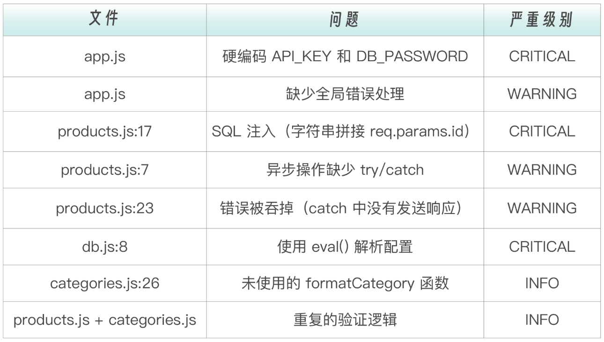


输入 prompt： /code-health-check src/ 后，执行流程如下：

```bash
/code-health-check src/
  │
  ├─ SKILL.md 被激活（context: fork）
  │
  ├─ 自动创建 general-purpose 子代理
  │
  ├─ 子代理在隔离上下文中：
  │   ├─ Glob 扫描 src/ 下所有 .js 文件
  │   ├─ Read 每个文件
  │   ├─ Grep 搜索 eval(), hardcoded secrets 等模式
  │   └─ 生成健康报告
  │
  └─ 返回报告到主对话（主对话上下文干净）
```


模式二的适用场景总结如下：

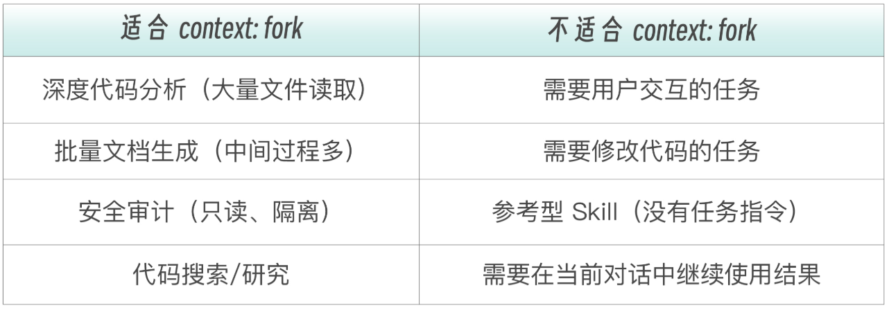


#### 模式三：流水线中的 Skill 分工

模式一的自然延伸：多个子代理各自预加载不同的 Skill，按阶段串联执行。每个阶段的输出作为下一阶段的输入。这种模式是和复杂的多阶段任务（之前子代理部分也介绍过类似的示例），但此处每个阶段需要通过 Skill 来配备不同的专业知识


> 对应项目：03-Skills/08-skill-pipeline


整体结构如下：

```yaml
skill-pipeline/
├── CLAUDE.md                              ← 流水线编排指令
├── .claude/
│   ├── agents/
│   │   ├── route-scanner.md               ← 阶段 1: 路由扫描专家 (haiku)
│   │   ├── doc-writer.md                  ← 阶段 2: 文档编写专家 (sonnet)
│   │   └── quality-checker.md             ← 阶段 3: 质量检查专家 (haiku)
│   ├── skills/
│   │   ├── route-scanning/
│   │   │   ├── SKILL.md                   ← 扫描工作流程
│   │   │   └── scripts/scan-routes.py     ← 路由扫描脚本
│   │   ├── doc-writing/
│   │   │   ├── SKILL.md                   ← 文档生成工作流程
│   │   │   └── templates/endpoint-doc.md  ← 文档模板
│   │   └── quality-checking/
│   │       ├── SKILL.md                   ← 质量检查工作流程
│   │       └── rules/doc-standards.md     ← 质量标准规则
│   └── settings.local.json
├── src/routes/
│   ├── products.js                        ← 7 条路由（含链式路由）
│   └── categories.js                      ← 5 条路由
└── docs/                                  ← 生成的文档输出
```


一个完整的 API 文档流程可以拆分为三个阶段，每个阶段需要不同的专业能力：

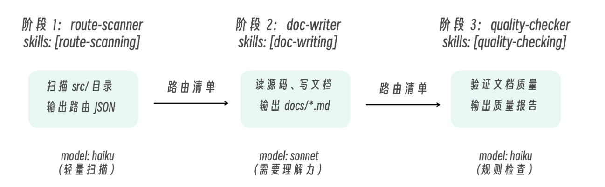


**阶段 1：Route Scanner。** 对应 Skill `route-scanning/SKILL.md`：包含扫描脚本 `scan-routes.py`，输出 JSON 格式的路由清单。

> .claude/agents/route-scanner.md

```markdown
---
name: route-scanner
model: haiku                    # 轻量任务用 haiku
tools: [Read, Grep, Glob, Bash]
skills:
  - route-scanning              # 预加载扫描知识
---

You are a route scanning specialist. You are Stage 1 of a documentation pipeline.
```


**阶段 2：Doc Writer。** 对应 Skill `doc-writing/SKILL.md`：包含文档模板 `endpoint-doc.md`，按模板生成标准化文档

> .claude/agents/doc-writer.md

```markdown
---
name: doc-writer
description: Pipeline Stage 2 - Generate API documentation from a route manifest.
model: sonnet
tools: [Read, Write, Glob]
skills:
  - doc-writing
---

You are a documentation writing specialist. You are Stage 2 of a documentation pipeline.
```


**阶段 3：Quality Checker。** 对应 Skill `quality-checking/SKILL.md`：包含质量标准规则 `doc-standards.md`，逐项检查文档质量

> .claude/agents/quality-checker.md

```markdown
---
name: quality-checker
description: Pipeline Stage 3 - Validate generated API documentation against quality standards.
model: haiku
tools: [Read, Grep, Glob]
skills:
  - quality-checking
---

You are a documentation quality specialist. You are Stage 3 of a documentation pipeline.
```


流水线的编排逻辑写在 `CLAUDE.md` 中：

```markdown
# API Documentation Pipeline

This project uses a 3-stage pipeline to generate and validate API documentation.

## Pipeline Stages

When the user asks to run the documentation pipeline, execute these stages **in order**:

### Stage 1: Route Scanning
Use the `route-scanner` agent to scan the source directory.
Pass the source directory path as the task.
Collect the route manifest (JSON) from its output.

### Stage 2: Documentation Generation
Use the `doc-writer` agent to generate documentation.
Pass the route manifest from Stage 1 as input context.
Collect the documentation manifest from its output.

### Stage 3: Quality Validation
Use the `quality-checker` agent to validate the generated docs.
Pass the documentation manifest from Stage 2 as input context.
Report the quality verdict to the user.

## Important

- Each stage must complete before the next begins
- Pass the output of each stage as input to the next
- If Stage 3 reports NEEDS_REVISION, show the issues to the user
```


编排的关键在于每个阶段的输出是下一阶段的输入。Claude 主对话扮演“项目经理”角色，依次调用三个专家


使用

```bash
# 运行完整流水线
> 对 src/ 目录运行文档流水线


# 或者分阶段手动运行
> 用 route-scanner 扫描 src/ 目录的路由
> 用 doc-writer 根据上面的路由清单生成文档
> 用 quality-checker 验证 docs/ 目录下生成的文档
```


对于流水线模式的设计，需要注意下面几个要点：

**要点一：定义清晰的阶段间接口**

每个阶段的 SKILL.md 都明确写了输出格式。

- 阶段 1 输出 JSON 路由清单
- 阶段 2 输出文件列表 + 路由覆盖数
- 阶段 3 输出 PASS/NEEDS_REVISION 报告

这些就是阶段间的“接口合约”


**要点二：每个 Skill 只关注一件事**

- `route-scanning` 只扫描路由，不生成文档
- `doc-writing` 只生成文档，不检查质量
- `quality-checking` 只检查质量，不修改文档

**单一职责** 让每个 Skill 更简洁、更可测试、更可复用。


**要点三：编排逻辑集中管理**

流水线的顺序、数据传递逻辑都放在 `CLAUDE.md` 中。如果要调整流程（比如跳过阶段 3），只需修改 `CLAUDE.md`，不需要动 Skill 或 SubAgent

> 编排逻辑更推荐放在 workflows 下
>
>  .claude/workflows/
>     feature-pipeline.js   # 推荐放这里：负责编排顺序、并行、重试、汇总


#### 三种模式对照

| 维度          | 模式一                        | 模式二                    | 模式三                             |
| ------------- | ----------------------------- | ------------------------- | ---------------------------------- |
| SubAgent 数量 | 1                             | 1（自动创建）             | N                                  |
| Skill 数量    | 1 或多                        | 1                         | N                                  |
| 谁是老板      | SubAgent                      | skill                     | CLAUDE.md 编排                     |
| 触发方式      | 用户指定 SubAgent             | /command                  | 用户说“运行流水线”                 |
| 上下文隔离    | 子代理隔离                    | context: fork 隔离        | 每阶段独立隔离                     |
| 核心特征      | 单个 SubAgent + 一/多个 Skill | Skill 自动派子代理执行    | 多个 SubAgent 串联，各带不同 Skill |
| 典型用途      | 需要专业知识的独立任务        | 一次性分析/研究，隔离任务 | 多阶段复杂流程任务                 |

### 总结

两个组合方向：

- SubAgent 包含 Skill（`skills` 字段）
- Skill 包含 SubAgent（`context: fork`）


三种组合模式：

- 模式一：SubAgent 预加载 Skills
- 模式二：Skill + context: fork
- 模式三：流水线中的 Skill 分工


最后，一句话：**SubAgent 定义“是谁、做什么”，Skill 定义“怎么做、用什么做”。两者各有所长，组合才完整**


## Skill 架构定位与高级能力


### Skill 在 Claude Code 架构中的位置

如果把 Claude Code 五层架构看作一栋工程化系统大厦，可以按“能力分层解耦”的方式理解：

- LLM 是底座计算核心，相当于 CPU + Runtime，负责推理与控制循环（agentic loop）
- 第一层 Tool Layer 是最底层的执行接口层，类似操作系统的 syscall 或基础设施 API，定义“系统可调用的原子能力”
- 第二层 Knowledge Layer 是策略与操作规约层，Skills 本质是结构化 SOP 注入机制，解决“在什么上下文下，以什么步骤调用哪些工具”
- 第三层 Agent Layer 是执行编排层，SubAgents 提供隔离执行单元，Agent Teams 提供多单元协作拓扑，解决复杂任务拆解与职责分离
- 第四层 Automation Layer 是事件驱动控制层，Hooks 像 middleware 或 pipeline 拦截器，在关键节点注入自动化校验与约束逻辑
- 第五层 Distribution Layer 是能力封装与交付层，Plugins 将前述能力模块化、版本化，实现跨项目与跨组织复用

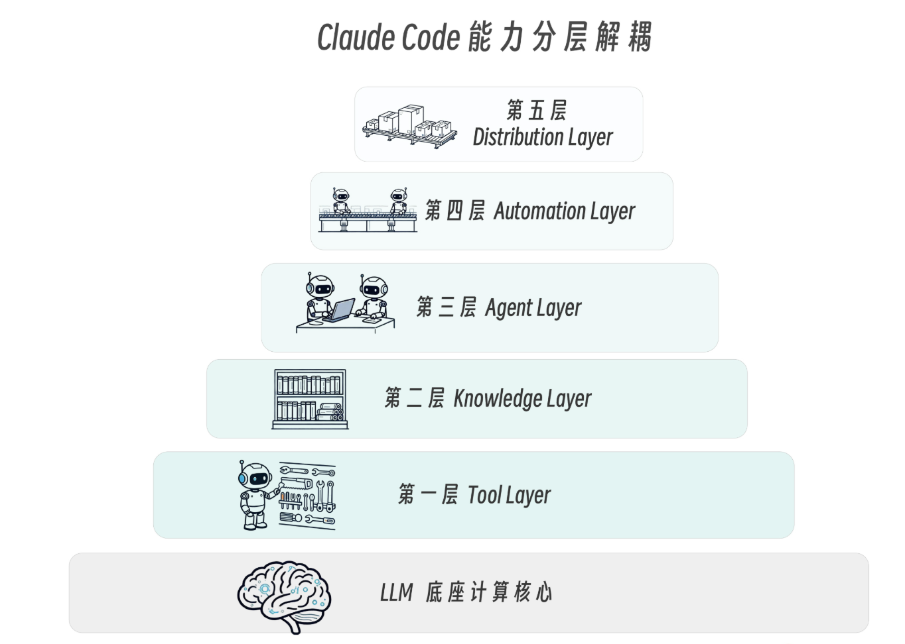

Skills 处于知识层这个“承上启下”的位置：工具层（能做什么）之上，智能体层（谁来做）之下。这个位置不是偶然的，它揭示了 Skills 的本质角色：

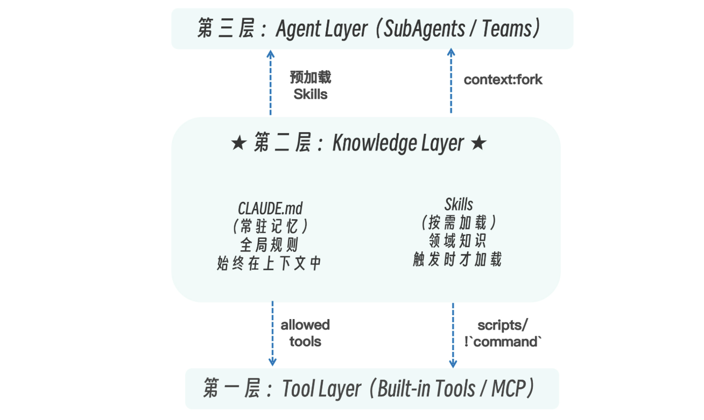

Skills 在系统中呈现出三种结构方向：

- 向下，通过 `allowed-tools` 和 `scripts/` 对 Tools 进行约束与编排，本质上是用知识来规范行动边界，相当于“知识约束行动”
- 向上，为 SubAgents 提供预加载的专业知识，使子代理在决策前就具备特定领域能力，本质上是“知识服务决策”
- 在平行维度上，Skills 与 CLAUDE.md 形成互补关系：Skills 是按需加载的专业知识模块，而 CLAUDE.md 是常驻的通识背景，两者分别承担“专业能力增强”和“基础认知框架”的角色


**这就是为什么 Skills 要设计成“按需加载”而非“全量加载”**。如果 Skills 像 CLAUDE.md 一样常驻，就退化成了 CLAUDE.md 的一部分，失去了“精准投放知识”的架构优势。渐进式披露不是“省 token 的技巧”，而是**知识层架构的必然要求**


### 三级进化：从 SOP 到组织智能

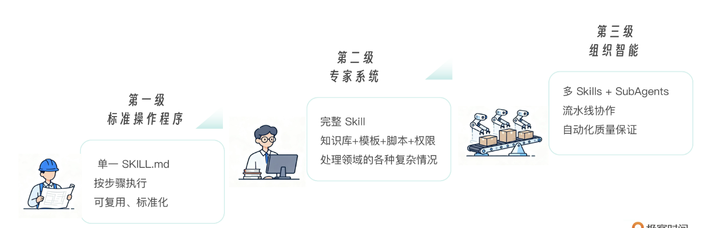


三级进化还不仅仅只是结构上的升级，更关键的问题是：**每一次升级到底解决了什么新的复杂性？**

企业知识管理的成熟，本质上不是把文档写得更多，而是解决“规模化”“变体处理”“协作复杂度”这三类不断上升的问题。从一个人照章执行，到一个专家应对复杂情况，再到一个团队协作完成系统级任务。每往上一级，系统面对的不确定性和协作复杂度都会跃迁

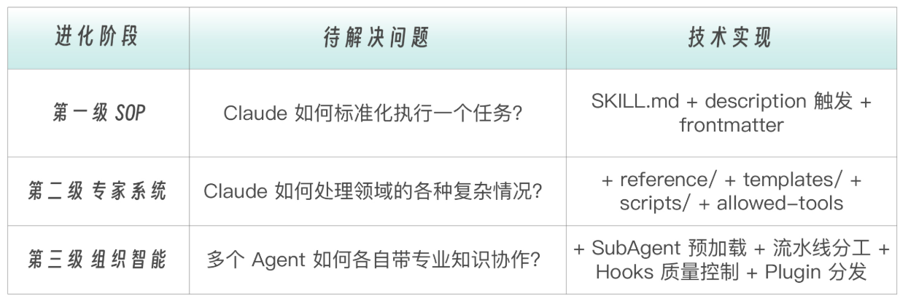

具体来说：

- **第一级是SOP阶段。** 一个 Skill 解决一个标准化任务。一个单一 SKILL.md，把流程写清楚，步骤可复现，行为可预测。就像企业里新写一份操作手册，照着做就行。

- **第二级专家系统阶段。** 在单一流程之上引入知识库、模板、脚本和权限控制，能够处理同一领域的各种复杂和边界情况。一个 Skill 通过渐进式披露组织丰富的领域知识，配合脚本和模板，成为完整的领域能力包。就像一个资深专家，不只有一份手册，还有工具箱、案例库、行业标准。

- **第三级上升到组织智能** 。多个 Skills 与 SubAgents 配合。分析子代理加载分析 Skill、审查子代理加载审查 Skill、测试子代理加载测试 Skill。形成流水线式的团队协作。加上 Hooks 的自动化质量控制和 Plugin 的打包分发，就构成了完整的“组织智能”。就像一家成熟的企业，每个部门有自己的 SOP，部门间有标准化交接流程，质检自动化运行。

这就是 Skills 的终极价值：它不仅仅是节省 token 或给 Claude 一份参考。Skills 是把人类组织中积累了几十年的知识管理经验：SOP、专家系统、组织学习技术化映射到 AI Agent 架构中


> 大多数项目在第二级就能满足需求。**不需要为了“高级”而过度设计**，选择与问题复杂度匹配的级别


### Skill 设计的四种模式

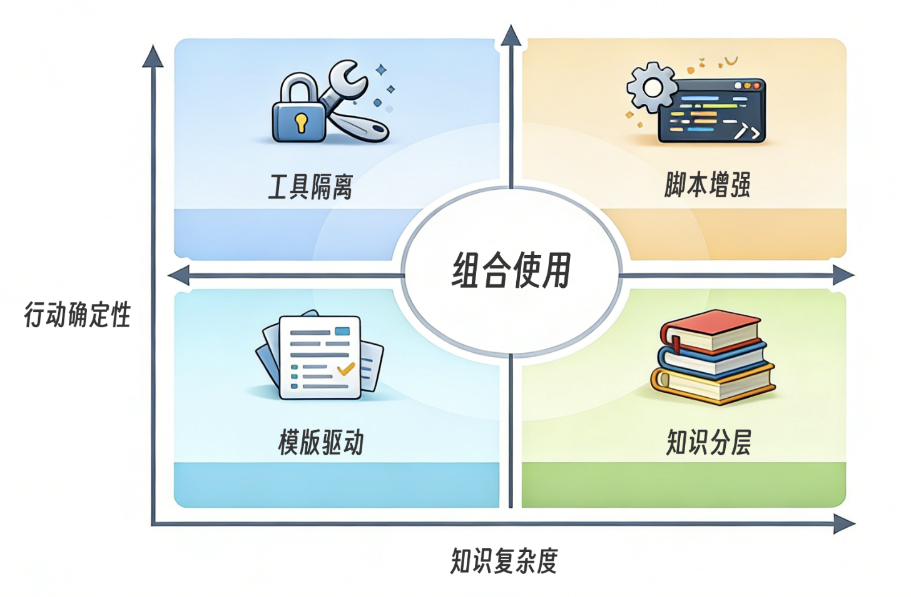


#### 模板驱动模式

模板驱动模式核心是用模板强约束输出结构，让结果稳定、可对比、可自动解析。适用于报告生成、文档输出等需要格式一致性的场景。它解决的是“输出不稳定”的问题，本质是把自然语言生成转化为结构化接口

```yaml
.claude/skills/report-generating/
├── SKILL.md              # 路由 + 流程
└── templates/
    ├── weekly_report.md   # 周报模板
    ├── incident.md        # 事故报告模板
    └── review.md          # 评审报告模板
```


`SKILL.md` 的关键写法：

```markdown
## Output Rules
- ALWAYS use the template from `templates/` that matches the request type
- Fill ALL placeholders — do not leave {placeholder} unfilled
- Do NOT add sections beyond what the template defines
```

模板驱动的价值在于把输出格式标准化，使结果具备一致性、可比较性和可自动处理能力。它将“生成内容”与“结构定义”分离，让 Skill 更易维护，也让后续流程更加稳定可靠。

如果模板过于复杂（例如超过 100 行），通常意味着职责混乱，应拆分为多个更小、更单一用途的模板；如果模板中开始出现逻辑判断或条件分支，说明边界被打破。逻辑应放在 SKILL.md 中，模板只负责呈现格式，不负责决策


#### 脚本增强模式

脚本增强模式的核心是把计算、匹配、数据转换等确定性逻辑交给脚本执行，而不是让 Claude 推理完成。适用于公式计算、正则匹配、指标统计等场景。它解决的是“结果不稳定”的问题，本质是把概率型推理替换为确定性执行

```yaml
.claude/skills/data-analyzing/
├── SKILL.md              # 路由 + 流程
└── scripts/
    ├── parse_csv.py       # 数据解析
    ├── calculate.py       # 指标计算
    └── visualize.py       # 生成图表 HTML
```

如果在 SKILL.md 里开始写公式，让 Claude 去计算或反复推理数值结果，那就应该停下来思考，这种确定性计算应当下沉到脚本中完成。Claude 负责判断和理解，脚本负责计算和执行

脚本不应依赖额外的外部安装环境（例如运行时需要再执行 pip install），优先使用标准库，若确有依赖，必须在说明文档中明确声明；脚本不应包含交互式输入，必须是一次性可执行、无人工干预的流程；同时也不要把所有逻辑都塞进脚本，只有确定性、可计算、可验证的逻辑才适合放入脚本，涉及判断、语义理解或策略决策的部分应保留给 Claude 处理


#### 知识分层模式

知识分层模式的核心是按使用频率组织知识，高频内联，中低频按需加载。适用于规则多、领域复杂的 Skill。解决的是“上下文膨胀”的问题，本质是通过渐进加载控制认知复杂度

```yaml
.claude/skills/security-reviewing/
├── SKILL.md              # 核心检查清单（高频，~200 行）
├── QUICKREF.md           # 常见漏洞速查（中频）
├── OWASP_TOP10.md        # OWASP 详细标准（低频）
├── reference/
│   ├── xss.md            # XSS 防护详解（按需）
│   ├── sqli.md           # SQL 注入详解（按需）
│   └── auth.md           # 认证问题详解（按需）
└── examples/
    ├── good_auth.md      # 正确实现示例（按需）
    └── bad_patterns.md   # 反模式示例（按需）
```

分层策略：

```yaml
总是加载（SKILL.md 内联）
  ← 80% 的请求只需要这些
  ← 控制在 500 行以内

触发时加载（Quick Reference）
  ← 用户问到特定方向时加载
  ← 契约式引用："When user asks about X → load Y"

按需加载（reference/ + examples/）
  ← Claude 判断需要时才读取
  ← 文件名要有描述性
```


#### 工具隔离模式

工具隔离模式的核心是通过 allowed-tools 明确能力边界，限制 Skill 可以调用的工具。适用于需要安全控制或职责划分的场景。它解决的是“越权风险”的问题，本质是把安全约束前置为结构设计

```yaml
# 审计类 Skill：只读
allowed-tools: [Read, Grep, Glob]

# 生成类 Skill：只写不改
allowed-tools: [Read, Grep, Glob, Write]

# 分析类 Skill：只读 + 脚本
allowed-tools: [Read, Grep, Glob, Bash(python:*)]

# 执行类 Skill：受控执行
allowed-tools: [Read, Bash(npm test:*), Bash(pytest:*)]
```


工具隔离模式的价值不在于“能做什么”，而在于**明确“不能做什么”** 

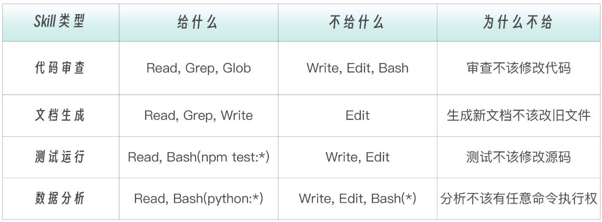


#### 组合使用

四种模式不是互斥的，一个成熟的 Skill 通常组合使用多种模式

实际的生产级 Skill 通常组合多种模式。这类以之前构建的 API 文档生成器为例：

```yaml
api-generator = 模板驱动 + 脚本增强 + 知识分层 + 工具隔离
├── SKILL.md               ← 知识分层（路由器，500 行以内）
├── PATTERNS.md            ← 知识分层（按需加载）
├── templates/endpoint.md  ← 模板驱动（标准化输出）
├── scripts/detect.py      ← 脚本增强（确定性路由检测）
└── allowed-tools          ← 工具隔离（Write 但不给 Edit）
```


组合决策树：

```yaml
Skill 需要……
│
├─ 标准化输出格式？    → 加 templates/（模板驱动）
├─ 确定性计算/匹配？   → 加 scripts/（脚本增强）
├─ 知识量 > 500 行？  → 拆分 reference/（知识分层）
└─ 安全边界控制？      → 配置 allowed-tools（工具隔离）
```


### 权限体系与安全设计

在能力不断增强的同时，一个问题开始变得不可回避：**当 Skill 变成组织级能力时，如何确保它“强大而不失控”？**

- 在第一级 SOP 阶段，风险很小——它只是执行固定步骤
- 在第二级专家系统阶段，Skill 已经可以调用多种工具、加载大量知识
- 到了第三级组织智能阶段，多个 Skills 与 SubAgents 协作，自动触发、流水线运行，如果没有清晰的权限分层，系统很容易出现“能力越强，风险越大”的问题


Skill 的权限设计不是附加功能，而是组织智能能够落地的前提。权限设计本质上是在回答三个问题：

- 这个 Skill **能做什么？**
- 这个 Skill **什么时候能被触发？**
- 这个 Skill **在什么边界内运行？**

这三问，构成了完整的 Skill 三层权限体系

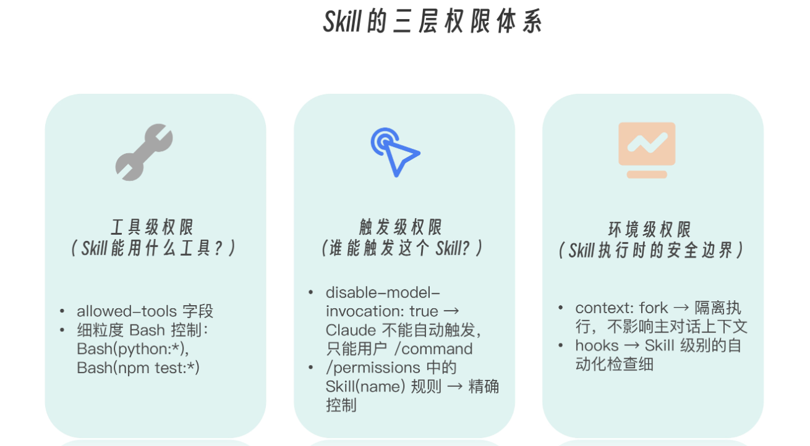


设计一个生产级 Skill 时，可以按照下面 Skill 安全设计清单逐项检查：

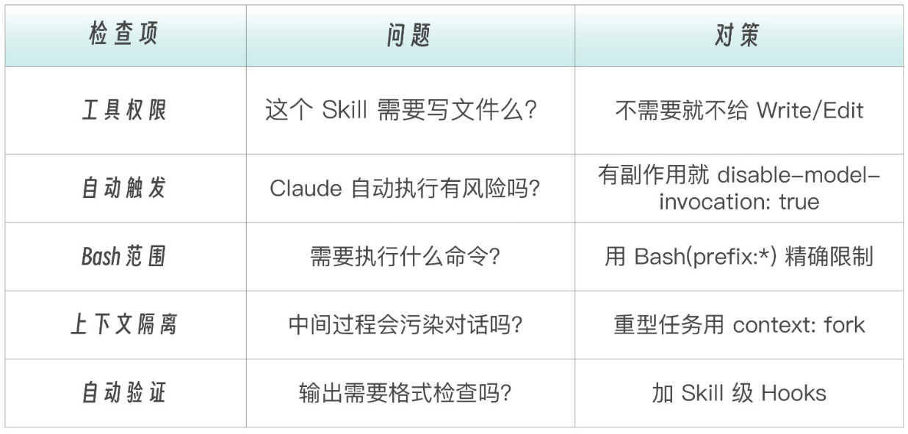


### 总结

从 Claude Code 的五层架构来看，Skills 位于知识层的核心位置：向下约束工具能力，向上服务智能体决策，与 CLAUDE.md 构成常驻认知与按需专业知识的双轨体系


从企业本体论来看，Skills 是组织 SOP、专家经验与协作流程的技术化映射：

- SOP 解决可执行问题：单一 Skill
- 专家系统解决复杂变体问题：Skill 渐进式披露、配合 reference、template、scripts、allowed-tools
- 组织智能解决规模协作问题：Skill + SubAgent


从工程方法论来看，四种设计模式

- 模板驱动
- 脚本增强
- 知识分层
- 工具隔离

分别控制表达结构、确定性执行、上下文规模与安全边界。它们不是技巧，而是职责分离的体现。成熟的 Skill 不是“写得多”，而是边界清晰、结构可扩展、行为可治理

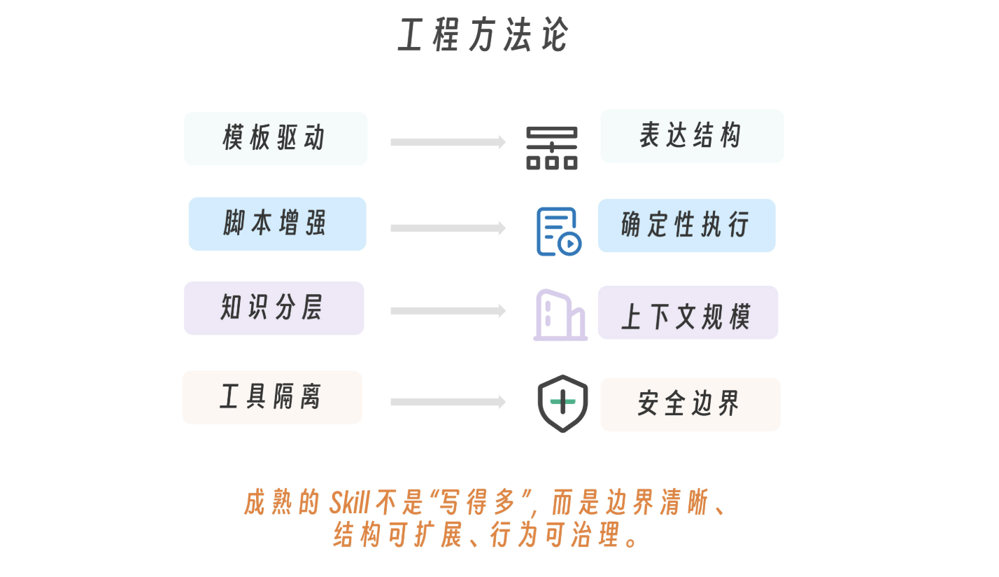


从安全治理角度看，三层权限体系（工具级、触发级、环境级）明确回答了三个问题：

- 能做什么？
- 谁能触发？
- 在什么边界内运行？


