# Claude Code 核心机制与组件


## Hooks 事件驱动自动化

Hooks，是 Claude Code 三大扩展机制中唯一能**拦截和修改** Claude 行为的机制，也是工程化实践中安全防线的最后一道闸门


### Hooks 的本质——AI 时代的中间件

```yaml
请求 → 中间件1 → 中间件2 → 中间件3 → 处理函数
                    ↓
              认证、日志、限流
```

中间件在请求到达最终处理函数之前插入检查和处理，实现横切关注点（Cross-cutting Concerns）。这些逻辑不属于任何一个业务功能，但又必须贯穿所有请求。认证要每个接口都检查，日志要每个操作都记录，限流要每个入口都控制


Claude Code 的 Hooks 机制与此异曲同工，但它针对的不是 HTTP 请求，而是 **AI Agent 的工具调用**

```yaml
用户请求 → Claude 决策 → [PreToolUse Hook] → 工具执行 → [PostToolUse Hook] → 响应
                              ↓                            ↓
                         权限检查、拦截             格式化、验证、日志
```


**Hooks 是 AI 助手的中间件：拦截、监控、增强每一次交互**

中间件解决的核心问题是“业务代码不应该操心安全和日志”，Hooks 解决的核心问题也一样。**Claude 不应该操心格式化和权限检查，它只管写好代码就行**。安全防线、质量守卫、审计日志，交由 Hooks 在“幕后”自动完成


和 Commands 和 Skills 相比，**Hooks 是三者中唯一能拦截和修改 Claude 行为的机制**。这三者构成了一个完整的控制谱系：


### Hook 事件

Claude Code 支持差不多 30 种事件，涵盖：会话级、用户轮次级、工具调用级、 生命周期/异步/显示相关等四大类


按照能否阻止 claude 来划分，整个事件体系分为三大阵营：

- **控制点：能阻止的事件**（如：PreToolUse、UserPromptSubmit、Stop、SubagentStop 等）：可以通过它们改变 Claude 的执行路径，拦截危险操作、拒绝不合理的输入、强制 Claude 继续修复。它们是 Hooks 系统的肌肉。
- **接管点：替代默认行为的事件**（如：PermissionRequest）：它不是简单地阻止，而是接管了原本由用户手动处理的权限弹窗，脚本可以自动批准或拒绝权限请求，替代人类的决策。它是 Hooks 系统的自动驾驶。
- **观察点：不能阻止的事件**（如：SessionStart、PostToolUse、PostToolUseFailure、Notification 等）：只能在这些时刻做记录、做反馈、做后处理，但不能改变已经发生的事情。它们是 Hooks 系统的眼睛

工具执行前可以拦截，因为操作还没发生，拦截不会造成不一致状态。工具执行后不能拦截，因为操作已经完成。不能“取消”一个已经写入磁盘的文件。但可以观察它、记录它、反馈它


在实际中，最常用的就 3 个，基本涵盖了 80% 以上的自动化需求：

- PreToolUse（守门员）
- PostToolUse（质量守卫）
- Stop（质量门控）


### Hook 配置

Hooks 可以在多个位置配置，每个位置有不同的作用域和共享策略。**Hooks 可以直接定义在子代理的 frontmatter 中** ，只在该子代理执行期间生效。这比在全局 settings.json 中配置更精准


hook 的配置位置：

- **用户级** （`~/.claude/settings.json`：个人习惯。比如自己的日志格式、桌面通知方式。这些配置只影响你自己，不需要和团队同步
- **项目级** （`.claude/settings.json`：团队约定。比如代码格式化规则、敏感文件保护列表。这些配置应该提交到 git，让团队所有成员共享
- **本地覆盖** （`.claude/settings.local.json`：当需要在本地临时覆盖团队配置时使用，比如调试时关闭某个 Hook
- **子代理 frontmatter**：子代理专属的 Hook。比如 `db-reader` 的 SQL 注入检查。这个检查只和数据库操作相关，不应该影响其他场景


一个 hook 配置：

```json
{
  "hooks": {
    "PreToolUse": [
      {
        "matcher": "Bash",
        "hooks": [
          {
            "type": "command",
            "command": "./hooks/block-dangerous.sh"
          }
        ]
      }
    ],
    "PostToolUse": [
      {
        "matcher": "Write",
        "hooks": [
          {
            "type": "command",
            "command": "prettier --write $CLAUDE_FILE_PATH"
          }
        ]
      }
    ]
  }
}
```


基本结构为：三层嵌套

```yaml
hooks                            
├── PreToolUse                     ← 第一层：事件类型（什么时候触发）
│   └── [第一组规则]
│       ├── matcher: "Bash"      ← 第二层：匹配器（针对哪个工具）
│       └── hooks: [...]         ← 第三层：Hook 列表（执行什么）
│           └── type: "command"
│           └── command: "..."
└── PostToolUse
    └── [第二组规则]
        ├── matcher: "Write"
        └── hooks: [...]
```


**Matcher 匹配**用于指定 Hook 应用于哪些工具。支持四种匹配模式：

```yaml
# 精确匹配单个工具
"matcher": "Write"

# 匹配多个工具（用竖线分隔）
"matcher": "Edit|Write|MultiEdit"

# 匹配所有工具
"matcher": "*"

# 空匹配（用于生命周期事件）
"matcher": ""
```

精确匹配是最常用的模式。通常知道要保护的是哪个工具。竖线分隔适合“同类工具组”的场景，比如 `Edit|Write|MultiEdit` 都涉及文件修改，用同一个保护策略。通配符 `*` 要谨慎使用，它会匹配所有工具，适合审计日志这类无差别记录的场景


### Hook 执行类型

当一个 Hook 被触发后，其具体执行方式有四种，前三种能力和代价逐级递增，第四种面向远程服务场景


#### Command 类型：执行 Shell 脚本

这是最常用、最可靠的类型。`command`可以是任何 shell 命令或脚本路径

Command 类型的优势在于**确定性** ——同样的输入永远产生同样的输出，不存在 LLM 的随机性。一个正则表达式匹配 `rm -rf /`，要么匹配到，要么没匹配到，没有“可能”“大概”的中间地带

```json
{
  "type": "command",
  "command": "./hooks/check-security.sh",
  "timeout": 30000
}
```

`timeout` 指定超时时间（毫秒），默认 60 秒


#### Prompt 类型：LLM 评估

当规则无法用确定性脚本表达时，就需要 LLM 的判断力。Prompt 类型会用一个小型 LLM（通常是 Haiku）来评估当前情况。比如“这段代码是否有安全隐患”。这种判断需要理解代码语义，不是简单的模式匹配能解决的。但 Prompt 类型只能“看一眼就判断”，无法主动去读取更多文件来辅助决策

```json
{
  "type": "prompt",
  "prompt": "Evaluate if this task was completed correctly. Check for any errors or incomplete work."
}
```


#### Agent 类型：子代理评估

这是最强大也最“重”的评估方式。**Agent Hook 会启动一个子代理** ，这个子代理可以使用 Read、Grep、Glob 等工具来验证条件。不只是“看一眼就判断”，而是可以“翻代码确认”。比如验证“所有公共 API 都有文档注释”，需要子代理实际遍历代码文件才能做出准确判断

```json
{
  "type": "agent",
  "prompt": "Verify that all unit tests pass. Run the test suite and check the results. $ARGUMENTS",
  "timeout": 120
}
```


#### HTTP 类型：远程服务

不在本地执行逻辑，而是把事件数据以 POST 请求发送到远程 HTTP 端点，由远程服务返回决策结果。适合团队共享审计服务、集中式安全扫描等场景


#### 选择策略

四种类型的选择策略：**能用 command 的不用 prompt，能用 prompt 的不用 agent，需要对接远程服务时用 http** 。确定性规则永远比 LLM 判断更可靠，LLM 判断比子代理执行更快


### PreToolUse：工具执行前的守门员

PreToolUse 能**阻止**工具执行。PreToolUse Hook 可以做三件事：

- **允许** （allow，放行）
- **拒绝** （deny，拦截）
- **修改** （updatedInput，改写输入参数后再执行）

第三种能力特别有趣，不仅能“放行或拦截”，还能“偷偷改参数”。比如用户要执行 `rm -rf ./tmp/test`，可以把它改成 `rm -rf ./tmp/test --dry-run`，先看看会删什么再说


要写出有效的 PreToolUse Hook，需要理解它的通信协议。脚本从 stdin 读入什么数据、向 Claude 返回什么决策


每个 Hook 脚本通过 stdin 接收一个 JSON 对象，包含做出判断所需的全部上下文：

```json
{
  "session_id": "abc123",
  "transcript_path": "/path/to/transcript.jsonl",
  "cwd": "/project/root",
  "permission_mode": "default",
  "hook_event_name": "PreToolUse",
  "tool_name": "Bash",
  "tool_input": {
    "command": "rm -rf ./tmp/test"
  }
}
```

这些字段清晰反映：**谁** 在执行（session_id），**在哪里** 执行（cwd），**什么权限** 模式（permission_mode），要执行**什么工具** （tool_name），**什么参数** （tool_input）。有了这些信息，脚本就能精准判断这个操作是否安全


Hook 脚本通过退出码和 stdout JSON 告诉 Claude 下一步做什么。`exit 0` 表示放行，`exit 2` 表示阻止，其他非零退出码表示脚本出错但不阻止

这个区分很重要：**脚本出错不应该阻止正常工作流**。安全检查脚本因为 `jq` 没安装而报错退出码 1，这不应该阻止 Claude 执行一个完全安全的命令。只有退出码 2 才表示“检查过了，这个操作确实危险”


需要更精细的控制时，通过 stdout 输出 JSON 决策。官方推荐的 `hookSpecificOutput` 格式支持四种响应方式：

- **允许执行**：检查通过，放行（`exit 0` 就等于默认允许，输出 JSON 让意图更明确）

  ```json
  {
    "hookSpecificOutput": {
      "hookEventName": "PreToolUse",
      "permissionDecision": "allow"
    }
  }
  ```

- **拒绝执行**：发现危险操作，直接拦截。`permissionDecisionReason` 会反馈给 Claude

  ```json
  {
    "hookSpecificOutput": {
      "hookEventName": "PreToolUse",
      "permissionDecision": "deny",
      "permissionDecisionReason": "This command is not allowed"
    }
  }
  ```

- **交给用户确认**：操作不是明确的“安全”或“危险”，而是“需要人类判断”

  ```json
  {
    "hookSpecificOutput": {
      "hookEventName": "PreToolUse",
      "permissionDecision": "ask",
      "permissionDecisionReason": "This command modifies production data"
    }
  }
  ```

- **修改输入后执行**：不拦截操作，而是改写参数后放行

  ```json
  {
    "hookSpecificOutput": {
      "hookEventName": "PreToolUse",
      "permissionDecision": "allow",
      "updatedInput": {
        "command": "rm -rf /tmp/test --dry-run"
      }
    }
  }
  ```


实际设计中，优先选择最温和的响应：**能 allow 的不 ask，能 ask 的不 deny** 


> 注意：updatedInput 的修改对 Cloude 是不透明的，Coude 以为自己执行了 `rm-f/tmp/test`，但实际执行的是加了`--dy-run` 的版本
>
> 
>
> 这意味着 Claude 对执行结果的理解是错的，后续决策可能基于错误认知（比如它以为文件已删除，实际上还在）。适合用在降级保护场景（如强制 dry-run、自动补全安全参数），不适合用在路径重写、输出重定向等会根本性改变操作语义的场景


### PreToolUse 实战


#### 案例一：阻止危险命令

每个工程团队都有一些“绝对不能执行”的命令：

- `rm -rf` 会删除整个文件系
- `git push --force origin main` 会覆盖远程主分支的历史
- `DROP DATABASE` 会销毁整个数据库

这些命令的共同特点是：**一旦执行就无法挽回**


下面通过一个脚本用模式匹配来拦截这些灾难性命令：

> 05-Hooks/01-pretooluse-hooks/hooks/block-dangerous.sh

```sh
#!/bin/bash
# block-dangerous.sh
# 阻止危险的 Bash 命令
#
# 检查命令是否匹配危险模式，如果匹配则阻止执行

export PATH="$HOME/bin:/usr/local/bin:$PATH"

set -e

# 读取 stdin 输入
INPUT=$(cat)

# 提取命令
COMMAND=$(echo "$INPUT" | jq -r '.tool_input.command // ""')

# 调试输出（到 stderr）
echo "DEBUG: Checking command: $COMMAND" >&2

# 危险命令模式
DANGEROUS_PATTERNS=(
    "rm -rf ./"
    "rm -rf ~"
    "rm -rf \$HOME"
    "rm -rf ./*"
    "> /dev/sd"
    "mkfs."
    "dd if="
    ":(){:|:&};:"
    "chmod -R 777 /"
    "chown -R"
    "git push --force origin main"
    "git push --force origin master"
    "git reset --hard origin"
    "DROP DATABASE"
    "DROP TABLE"
    "TRUNCATE"
    "curl.*| sh"
    "curl.*| bash"
    "wget.*| sh"
    "wget.*| bash"
)

# 检查每个危险模式
for pattern in "${DANGEROUS_PATTERNS[@]}"; do
    if [[ "$COMMAND" == *"$pattern"* ]]; then
        echo "BLOCKED: Command matches dangerous pattern: $pattern" >&2
        cat <<EOF
{
    "hookSpecificOutput": {
        "hookEventName": "PreToolUse",
        "permissionDecision": "deny",
        "permissionDecisionReason": "Blocked dangerous command pattern: $pattern. This command could cause irreversible damage."
    }
}
EOF
        exit 2
    fi
done

# 命令安全，允许执行
echo '{"decision": "allow"}'
exit 0

```

这个脚本的设计思路：

- `INPUT=$(cat)` 从 stdin 读取 Claude 传入的 JSON 数据
- `jq -r '.tool_input.command'` 从中提取要执行的命令字符串。`// ""` 是 jq 的空值保护，如果字段不存在，返回空字符串而不是报错
- `echo "DEBUG: ..." >&2` 这一行需要特别说明：**调试信息必须输出到 stderr（文件描述符 2），而不是 stdout**。因为 stdout 被 Claude 用来读取 JSON 决策——如果你往 stdout 打了一行调试文本，Claude 会因为 JSON 解析失败而报错。这是 Hook 脚本开发中最常见的坑
- `DANGEROUS_PATTERNS` 数组定义了所有需要拦截的命令模式
- 最后的`curl.*| sh` 和 `wget.*| bash`。这是一种常见的攻击手法：从网络下载脚本并直接执行，绕过任何安全审查

整个脚本的逻辑就是一个黑名单匹配，命中任何一个危险模式就拦截，否则放行


> 注意，要给这个脚本权限，否则没权限是不会执行的
>
> chmod +x ./hooks/block-dangerous.sh
>
> 
>
> 同时这个脚本使用了 jq，需要安装 jq


hook 配置方式如下：

```json
{
  "hooks": {
    "PreToolUse": [
      {
        "matcher": "Bash",
        "hooks": [
          {
            "type": "command",
            "command": "./hooks/block-dangerous.sh"
          }
        ]
      }
    ]
  }
}
```


> 有缺点，比如 claude code 执行 `rm -rf` 被拦截，但通过生成一段 python 代码执行删除，这属于被 claude 使用语义等价命令绕过了
>
> 
>
> 主要原因：permissionDecisionReason 返回的是 Blocked dangerous command pattern: rm -rf ./，这只是说明 rm -rf 命令是危险的，但是却没有改变“清理临时文件”这个目标，Claude Code 的默认行为是“被拒后调整方案”


#### 案例二：保护敏感文件

保护敏感文件（如`.env` 文件）不被 Claude 修改或读取，即使 Claude 出于好意想“帮你整理一下配置文件”，敏感文件也绝对不能被触碰

这种保护需要覆盖两个维度：**文件本身** （.env、credentials.json 等配置文件）和**密钥文件** （.pem、.key、id_rsa 等加密文件）。前者包含运行时密钥，后者包含身份认证凭据。两者泄露的后果都是灾难性的


> 05-Hooks/01-pretooluse-hooks/hooks/protect-files.sh

```sh
#!/bin/bash
# protect-files.sh
# 保护敏感文件不被修改
#
# 阻止对配置文件、密钥文件等敏感文件的写入操作

export PATH="$HOME/bin:/usr/local/bin:$PATH"
set -e

# 读取 stdin 输入
INPUT=$(cat)

# 提取文件路径
FILE_PATH=$(echo "$INPUT" | jq -r '.tool_input.file_path // ""')

# 如果没有文件路径，允许执行
if [ -z "$FILE_PATH" ]; then
    echo '{"decision": "allow"}'
    exit 0
fi

echo "DEBUG: Checking file: $FILE_PATH" >&2

# 获取文件名
FILENAME=$(basename "$FILE_PATH")

# 受保护的文件模式
PROTECTED_PATTERNS=(
    ".env"
    ".env.local"
    ".env.production"
    ".env.development"
    "credentials.json"
    "secrets.yaml"
    "secrets.json"
    "config.production.json"
    "id_rsa"
    "id_ed25519"
    "*.pem"
    "*.key"
    "*.p12"
    "*.pfx"
    ".git/config"
    ".gitconfig"
    "package-lock.json"
    "yarn.lock"
    "pnpm-lock.yaml"
)

# 受保护的目录
PROTECTED_DIRS=(
    ".git/"
    "node_modules/"
    ".ssh/"
)

# 检查受保护的目录
for dir in "${PROTECTED_DIRS[@]}"; do
    if [[ "$FILE_PATH" == *"$dir"* ]]; then
        cat <<EOF
{
    "hookSpecificOutput": {
        "hookEventName": "PreToolUse",
        "permissionDecision": "deny",
        "permissionDecisionReason": "Cannot modify files in protected directory: $dir"
    }
}
EOF
        exit 2
    fi
done

# 检查受保护的文件模式
for pattern in "${PROTECTED_PATTERNS[@]}"; do
    # 处理通配符模式
    if [[ "$pattern" == \** ]]; then
        # 通配符匹配（如 *.pem）
        extension="${pattern#\*}"
        if [[ "$FILENAME" == *"$extension" ]]; then
            cat <<EOF
{
    "hookSpecificOutput": {
        "hookEventName": "PreToolUse",
        "permissionDecision": "deny",
        "permissionDecisionReason": "Cannot modify protected file type: $pattern"
    }
}
EOF
            exit 2
        fi
    else
        # 精确匹配
        if [[ "$FILENAME" == "$pattern" ]]; then
            cat <<EOF
{
    "hookSpecificOutput": {
        "hookEventName": "PreToolUse",
        "permissionDecision": "deny",
        "permissionDecisionReason": "Cannot modify protected file: $pattern"
    }
}
EOF
            exit 2
        fi
    fi
done

# 文件不受保护，允许执行
echo '{"decision": "allow"}'
exit 0

```

结构和 `block-dangerous.sh` 很像，都是黑名单匹配。但注意一个细节：它检查的是 `tool_input.file_path` 而不是 `tool_input.command`

不同的工具传入不同的参数字段：Bash 工具传 `command`，Write 和 Edit 工具传 `file_path`


配置 hook 需要同时配置 `Write|Edit`

```json
{
  "hooks": {
    "PreToolUse": [
      {
        "matcher": "Write|Edit",
        "hooks": [
          {
            "type": "command",
            "command": "./hooks/protect-files.sh"
          }
        ]
      }
    ]
  }
}
```


### PostToolUse：工具执行后的质量守卫

PostToolUse 在工具**成功执行后** 运行。它不能阻止已经发生的操作（文件已经写入了，命令已经执行了）

但它可以做三件同样重要的事情：

- **后处理** （格式化、清理）
- **反馈** （向 Claude 提供 lint 结果、警告）
- **记录** （写入审计日志）


PostToolUse 接收的 JSON 比 PreToolUse 多一个关键字段：`tool_response`，即工具执行的结果

```json
{
  "session_id": "abc123",
  "hook_event_name": "PostToolUse",
  "tool_name": "Write",
  "tool_input": {
    "file_path": "/project/src/app.js",
    "content": "..."
  },
  "tool_response": {
    "success": true,
    "result": "File written successfully"
  }
}
```


PostToolUse 最强大的能力在于通过 `additionalContext` 向 Claude 反馈信息

```json
{
  "hookSpecificOutput": {
    "hookEventName": "PostToolUse",
    "additionalContext": "ESLint found 3 errors in the file you just wrote."
  }
}
```

`additionalContext` 的内容会被注入到 Claude 的上下文中，Claude 会看到这条反馈并据此调整行为。比如告诉它“ESLint 发现了 3 个错误”，它就会主动去修复这些错误。**这不是简单的日志记录，而是一个闭环反馈机制，Hook 观察到问题，反馈给 Claude，Claude 自动修复**


### PostToolUse实战


#### 案例一：自动格式化

> 05-Hooks/02-posttooluse-hooks/hooks/auto-format.sh

```sh
#!/bin/bash
# auto-format.sh
# 自动格式化代码文件
#
# 作为 PostToolUse hook，在文件写入后自动运行格式化工具

export PATH="$HOME/bin:/usr/local/bin:$PATH"
set -e

# 读取 stdin 输入
INPUT=$(cat)

# 提取文件路径
FILE_PATH=$(echo "$INPUT" | jq -r '.tool_input.file_path // ""')

# 如果没有文件路径，跳过
if [ -z "$FILE_PATH" ] || [ ! -f "$FILE_PATH" ]; then
    echo '{}'
    exit 0
fi

echo "DEBUG: Formatting file: $FILE_PATH" >&2

# 获取文件扩展名
EXTENSION="${FILE_PATH##*.}"

# 根据文件类型选择格式化工具
case "$EXTENSION" in
    js|jsx|ts|tsx|json|md|css|scss|html)
        # 使用 Prettier
        if command -v npx &> /dev/null; then
            if npx prettier --write "$FILE_PATH" >&2; then
                echo '{"hookSpecificOutput": {"hookEventName": "PostToolUse", "additionalContext": "Formatted with Prettier"}}'
            else
                echo '{"hookSpecificOutput": {"hookEventName": "PostToolUse", "additionalContext": "Prettier formatting failed"}}'
            fi
        else
            echo '{"hookSpecificOutput": {"hookEventName": "PostToolUse", "additionalContext": "Prettier not available"}}'
        fi
        ;;
    py)
        # 使用 Black
        if command -v black &> /dev/null; then
            if black "$FILE_PATH" >&2; then
                echo '{"hookSpecificOutput": {"hookEventName": "PostToolUse", "additionalContext": "Formatted with Black"}}'
            else
                echo '{"hookSpecificOutput": {"hookEventName": "PostToolUse", "additionalContext": "Black formatting failed"}}'
            fi
        else
            echo '{"hookSpecificOutput": {"hookEventName": "PostToolUse", "additionalContext": "Black not available"}}'
        fi
        ;;
    go)
        # 使用 gofmt
        if command -v gofmt &> /dev/null; then
            if gofmt -w "$FILE_PATH" >&2; then
                echo '{"hookSpecificOutput": {"hookEventName": "PostToolUse", "additionalContext": "Formatted with gofmt"}}'
            else
                echo '{"hookSpecificOutput": {"hookEventName": "PostToolUse", "additionalContext": "gofmt formatting failed"}}'
            fi
        else
            echo '{"hookSpecificOutput": {"hookEventName": "PostToolUse", "additionalContext": "gofmt not available"}}'
        fi
        ;;
    rs)
        # 使用 rustfmt
        if command -v rustfmt &> /dev/null; then
            if rustfmt "$FILE_PATH" >&2; then
                echo '{"hookSpecificOutput": {"hookEventName": "PostToolUse", "additionalContext": "Formatted with rustfmt"}}'
            else
                echo '{"hookSpecificOutput": {"hookEventName": "PostToolUse", "additionalContext": "rustfmt formatting failed"}}'
            fi
        else
            echo '{"hookSpecificOutput": {"hookEventName": "PostToolUse", "additionalContext": "rustfmt not available"}}'
        fi
        ;;
    *)
        # 未知文件类型，跳过
        echo '{"hookSpecificOutput": {"hookEventName": "PostToolUse", "additionalContext": "No formatter configured for this file type"}}'
        ;;
esac

exit 0
```

这个脚本有几个值得注意的设计决策：

- **多语言策略**：通过文件扩展名自动选择格式化工具。JavaScript/TypeScript 用 Prettier，Python 用 Black，Go 用 gofmt，Rust 用 rustfmt。这意味着在一个多语言项目中，只需要一个 Hook 脚本就能覆盖所有文件类型
- **优雅降级**：每种工具的调用都先用 `command -v` 检查是否安装。如果 Prettier 没装，脚本不会报错崩溃，而是优雅地跳过并通过 `additionalContext` 告诉 Claude “Prettier not available”。这很重要：**Hook 的失败不应该阻碍正常工作流**
- **反馈闭环**：格式化完成后，通过 `additionalContext` 告诉 Claude 用了什么工具格式化的。这不仅是日志记录，还让 Claude 知道格式化已经发生，它不需要自己再做一次

这个 Hook 的优点是：**Claude 不需要知道项目用什么格式化工具**。无论是 Prettier、Black、gofmt 还是 rustfmt，只要本地安装了，就会自动应用。这就是中间件的力量：业务逻辑（Claude 写代码）和横切关注点（格式化）完全解耦


#### 案例二：自动 Lint 检查

一个完整的代码质量反馈循环：Claude 写代码 → 自动格式化 → 自动 Lint → 发现问题 → Claude 收到反馈 → Claude 修复


> 05-Hooks/02-posttooluse-hooks/hooks/lint-check.sh

```sh
#!/bin/bash
# lint-check.sh
# 检查代码质量并向 Claude 反馈
#
# 作为 PostToolUse hook，在文件写入后运行 linter

export PATH="$HOME/bin:/usr/local/bin:$PATH"

# 读取 stdin 输入
INPUT=$(cat)

# 提取文件路径
FILE_PATH=$(echo "$INPUT" | jq -r '.tool_input.file_path // ""')

# 如果没有文件路径，跳过
if [ -z "$FILE_PATH" ] || [ ! -f "$FILE_PATH" ]; then
    echo '{}'
    exit 0
fi

echo "DEBUG: Linting file: $FILE_PATH" >&2

# 获取文件扩展名
EXTENSION="${FILE_PATH##*.}"

# 存储 lint 结果
LINT_RESULT=""
LINT_PASSED=true

case "$EXTENSION" in
    js|jsx|ts|tsx)
        # 使用 ESLint
        if command -v npx &> /dev/null; then
            LINT_RESULT=$(npx eslint "$FILE_PATH" 2>&1) || LINT_PASSED=false
        fi
        ;;
    py)
        # 使用 flake8 或 pylint
        if command -v flake8 &> /dev/null; then
            LINT_RESULT=$(flake8 "$FILE_PATH" 2>&1) || LINT_PASSED=false
        elif command -v pylint &> /dev/null; then
            LINT_RESULT=$(pylint "$FILE_PATH" 2>&1) || LINT_PASSED=false
        fi
        ;;
    go)
        # 使用 golint 或 go vet
        if command -v golint &> /dev/null; then
            LINT_RESULT=$(golint "$FILE_PATH" 2>&1) || LINT_PASSED=false
        elif command -v go &> /dev/null; then
            LINT_RESULT=$(go vet "$FILE_PATH" 2>&1) || LINT_PASSED=false
        fi
        ;;
    *)
        # 未知文件类型，跳过
        echo '{}'
        exit 0
        ;;
esac

# 转义 JSON 特殊字符
LINT_RESULT_ESCAPED=$(echo "$LINT_RESULT" | jq -Rs '.')

if [ "$LINT_PASSED" = true ]; then
    # Lint 通过
    cat <<EOF
{
    "hookSpecificOutput": {
        "hookEventName": "PostToolUse",
        "additionalContext": "Lint check passed"
    }
}
EOF
else
    # Lint 失败，提供反馈让 Claude 修复
    cat <<EOF
{
    "hookSpecificOutput": {
        "hookEventName": "PostToolUse",
        "additionalContext": $LINT_RESULT_ESCAPED
    }
}
EOF
fi

exit 0
```

- `|| true`：ESLint 发现错误时会返回非零退出码，但一般不希望脚本因此中断（`set -e` 会让脚本在任何非零退出码时终止）。`|| true` 确保 ESLint 的退出码被捕获但不会触发脚本退出
- `head -30` 限制了反馈的长度。ESLint 的输出可能非常长，但我们只需要把前 30 行（通常包含了最关键的错误信息）反馈给 Claude 就够了


#### 案例三：审计日志

对于一些合规性要求高的场景，可能需要记录 Claude 的所有操作。**不是为了阻止什么，而是为了事后追溯**。谁在什么时间修改了什么文件？执行了什么命令？这些信息在安全事件调查和合规审计中至关重要


> 05-Hooks/02-posttooluse-hooks/hooks/audit-log.sh

```sh
#!/bin/bash
# audit-log.sh
# 记录所有工具调用到审计日志
#
# 作为 PostToolUse hook，记录每次工具调用的详细信息

export PATH="$HOME/bin:/usr/local/bin:$PATH"

# 读取 stdin 输入
INPUT=$(cat)

# 确定日志目录
if [ -n "$CLAUDE_PROJECT_DIR" ]; then
    LOG_DIR="$CLAUDE_PROJECT_DIR/.claude/logs"
else
    LOG_DIR="./.claude/logs"
fi

# 创建日志目录
mkdir -p "$LOG_DIR"

# 日志文件（按日期分割）
LOG_FILE="$LOG_DIR/audit-$(date +%Y-%m-%d).log"

# 提取关键信息
TIMESTAMP=$(date -Iseconds)
TOOL_NAME=$(echo "$INPUT" | jq -r '.tool_name // "unknown"')
SESSION_ID=$(echo "$INPUT" | jq -r '.session_id // "unknown"')

# 提取工具输入（简化版本）
TOOL_INPUT=$(echo "$INPUT" | jq -c '.tool_input // {}')

# 提取工具响应状态
TOOL_SUCCESS=$(echo "$INPUT" | jq -r '.tool_response.success // true')

# 写入日志
cat >> "$LOG_FILE" << EOF
================================================================================
Timestamp: $TIMESTAMP
Session: $SESSION_ID
Tool: $TOOL_NAME
Success: $TOOL_SUCCESS
Input: $TOOL_INPUT
================================================================================

EOF

# 输出空 JSON（不阻止后续操作）
echo '{}'
```


审计日志的价值不在当下，而在未来。当某天需要回答“上周三 Claude 到底改了什么导致了这个 bug”时，审计日志就是时光机


### 总结

Claude Code 支持差不多 30 种 Hook 事件，但是主要常用的是三个：

- PreToolUse（守门员）
- PostToolUse（质量守卫）
- Stop（质量门控）


四种 Hook 类型：

- `command`：确定性规则，最可靠。能用脚本解决的问题不要用 LLM
- `prompt`：单次 LLM 评估，需要判断力时使用。快但不能查代码
- `agent`：多轮验证，需要翻代码才能决策时使用。最强也最慢
- `http`：POST 事件数据到 HTTP 端点，适合对接外部服务（审计、通知、集中管控）


**注意点**：

- Hook 脚本需要给权限，否则没权限是不会执行的

- Hook 容易被 claude 使用语义等价命令绕过了

  主要原因：permissionDecisionReason 返回的是 Blocked dangerous command pattern: rm -rf ./，这只是说明 rm -rf 命令是危险的，但是却没有改变“清理临时文件”这个目标，Claude Code 的默认行为是“被拒后调整方案”

  解决：使用的时候，明确就是要使用 Bash 命令。或者 permissionDecisionReason 强制返回不能清理（更推荐这种方式，因为没法控制 prompt 输入）


## Hooks 高级模式与工程实践


### Stop Hook：任务完成时的质量门控

问题：Claude 做完整个任务后，谁来验收

这就好比工厂的流水线：安检门（PreToolUse）检查原料是否合格，质检站（PostToolUse）检查每道工序的产出。但产品最终出厂前，还需要一道**终检**，确认成品整体质量达标。这道终检，就是 Stop Hook


Stop Hook 的核心能力是让 Claude 继续工作，Stop Hook 和其他 Hook 的最大区别。这个能力来源于它的 `continue` 字段：

```json
{
  "decision": "block",
  "reason": "Tests are failing, please fix them",
  "continue": true
}
```

`continue: true` 意味着“不要停，继续工作”。这创造了一个自动循环：Claude 认为完成了 → Stop Hook 检查 → 发现测试失败 → 把失败信息反馈给 Claude → Claude 继续修复 → 再次完成 → 再次检查……**直到所有检查通过，Claude 才被允许真正停下来**

这种机制把质量保证从“事后检查“变成了”交付前置条件”，这样能让 Claude 不是做完了再检查，而是检查通过了才算做完


### 实战：自动测试

这是 Stop Hook 最经典的应用：Claude 完成任务后自动运行测试，测试不通过就不让停

为什么要在 Stop 时运行测试而不是在每次文件修改后？因为一个功能的实现通常涉及多个文件的修改。中间状态的测试必然会失败，改了接口但还没改实现，测试当然过不了。只有在 Claude 认为“全部完成”的时刻，再运行测试才有意义


> 05-Hooks/03-stop-hooks/hooks/run-tests.sh

```sh
#!/bin/bash
# run-tests.sh
# 在 Claude 完成时自动运行测试
#
# 作为 Stop hook，确保所有测试通过

export PATH="$HOME/bin:/usr/local/bin:$PATH"
set -e

echo "DEBUG: Running tests before stopping..." >&2

# 确定项目目录
if [ -n "$CLAUDE_PROJECT_DIR" ]; then
    cd "$CLAUDE_PROJECT_DIR"
fi

# 检测项目类型并运行相应的测试
RUN_TESTS=false
TEST_RESULT=""
TEST_PASSED=true

# Node.js 项目
if [ -f "package.json" ]; then
    RUN_TESTS=true
    echo "DEBUG: Detected Node.js project" >&2

    # 检查是否有测试脚本
    if grep -q '"test"' package.json; then
        TEST_RESULT=$(npm test 2>&1) || TEST_PASSED=false
    else
        TEST_RESULT="No test script found in package.json"
        TEST_PASSED=true  # 没有测试不算失败
    fi

# Python 项目
elif [ -f "pytest.ini" ] || [ -f "setup.py" ] || [ -f "pyproject.toml" ]; then
    RUN_TESTS=true
    echo "DEBUG: Detected Python project" >&2

    if command -v pytest &> /dev/null; then
        TEST_RESULT=$(pytest 2>&1) || TEST_PASSED=false
    elif command -v python &> /dev/null; then
        TEST_RESULT=$(python -m pytest 2>&1) || TEST_PASSED=false
    else
        TEST_RESULT="pytest not found"
        TEST_PASSED=true
    fi

# Go 项目
elif [ -f "go.mod" ]; then
    RUN_TESTS=true
    echo "DEBUG: Detected Go project" >&2

    TEST_RESULT=$(go test ./... 2>&1) || TEST_PASSED=false

# Rust 项目
elif [ -f "Cargo.toml" ]; then
    RUN_TESTS=true
    echo "DEBUG: Detected Rust project" >&2

    TEST_RESULT=$(cargo test 2>&1) || TEST_PASSED=false
fi

# 如果没有检测到测试框架
if [ "$RUN_TESTS" = false ]; then
    echo '{}'
    exit 0
fi

# 转义 JSON 特殊字符
TEST_RESULT_ESCAPED=$(echo "$TEST_RESULT" | head -50 | jq -Rs '.')

if [ "$TEST_PASSED" = true ]; then
    # 测试通过，允许停止
    echo '{"decision": "approve", "reason": "All tests passed."}'
else
    # 测试失败，让 Claude 继续修复
    cat <<EOF
{
    "decision": "block",
    "reason": "Tests are failing. Please fix the issues before stopping.",
    "continue": true,
    "systemMessage": $TEST_RESULT_ESCAPED
}
EOF
fi

exit 0
```

- **项目类型检测** ：脚本通过检查特征文件来判断项目类型， `package.json` 意味着 Node.js，`pyproject.toml` 意味着 Python，`go.mod` 意味着 Go，`Cargo.toml` 意味着 Rust。这种“约定优于配置”的检测方式让脚本能在不同类型的项目中通用，无需额外配置
- **容错处理** ：`grep -q '"test"' package.json` 先检查 package.json 中是否有 test 脚本。如果项目根本没有配置测试命令，脚本不会报错，而是报告 “No test script found” 并放行。**没有测试不等于测试失败**。不能因为项目还没写测试就阻止 Claude 完成工作
- **结果截断** ：`head -50` 只取测试输出的前 50 行。测试失败的输出可能非常长（几百行甚至几千行），但 Claude 只需要看到关键的错误信息就能定位问题。传入太多信息反而会稀释重点
- **关键分支** ：测试通过时，输出 `additionalContext` 告诉 “Claude All tests passed”，脚本正常退出；测试失败时，输出 `"decision": "block"` 加 `"continue": true`，强制 Claude 继续工作。Claude 会收到测试失败的详细信息，然后自动尝试修复


配置 hook：

```json
{
  "hooks": {
    "Stop": [
      {
        "hooks": [
          {
            "type": "command",
            "command": "./hooks/run-tests.sh"
          }
        ]
      }
    ]
  }
}
```

> 注意：Stop 事件没有 `matcher` 字段。因为 Stop 是生命周期事件，不针对特定工具


这个 Hook 实现了一个强大的保障，**Claude 不会在测试失败的情况下停止工作**。它会不断尝试修复，直到所有测试通过这在 Claude 执行复杂的重构任务时特别有价值：重构常常会破坏现有测试，而这个 Hook 确保 Claude 会把测试修好才停手


### 用 Prompt 类型实现更灵活的 Stop Hook

Shell 脚本适合检查客观事实，比如测试通不通过、文件存不存在。但有时候需要检查更“主观”的东西，包括代码风格是否合理？功能实现是否完整？有没有遗漏边界情况？这些判断需要“理解力”，不是模式匹配能解决的


此时可以用 Prompt 类型的 Stop Hook，让一个小型 LLM（通常是 Haiku）担任代码审查员：

```json
{
  "hooks": {
    "Stop": [
      {
        "hooks": [
          {
            "type": "prompt",
            "prompt": "Review the changes made in this session. Check that: 1) All requested features are implemented 2) No obvious bugs or security issues 3) Code follows project conventions. If any issues found, respond with continue: true and explain what needs to be fixed."
          }
        ]
      }
    ]
  }
}
```


### 防止 Stop Hook 死循环：stop_hook_active

Stop Hook 的 `continue: true` 很强大，但如果 Claude 一直修不好，就会进入死循环

官方提供了一个安全字段 `stop_hook_active`：当 Claude 因为 Stop Hook 而继续工作时，下一次 Stop 事件的输入中 `stop_hook_active` 会被设为 `true`。脚本可以通过检查这个字段来避免死循环

```sh
#!/bin/bash

INPUT=$(cat)

# 检查是否已经因为 Stop Hook 继续过了
if [ "$(echo "$INPUT" | jq -r '.stop_hook_active')" = "true" ]; then
    # 已经重试过一次了，这次让 Claude 停下来
    exit 0
fi

# 正常的测试逻辑
npm test 2>&1
if [ $? -ne 0 ]; then
    echo '{"decision": "block", "reason": "Tests still failing, please fix."}'
else
    exit 0
fi
```

这个模式允许 Claude 重试一次，第一次 Stop 时检查测试，如果失败就让 Claude 继续修复；第二次 Stop 时，`stop_hook_active` 为 `true`，无论测试是否通过都让 Claude 停下来


### 子代理事件：SubagentStart 与 SubagentStop

从 Hook 的角度来看子代理：如何在子代理启动和完成时自动执行检查？


SubagentStart 与 SubagentStop 这两个事件把 Hooks 和 SubAgents 两大机制连接了起来，使得可以在子代理的“入口”和“出口“自动插入逻辑


#### SubagentStart：为子代理注入上下文

`SubagentStart` 在子代理被启动时触发。它的 matcher 匹配的是**子代理类型名** ，而不是工具名

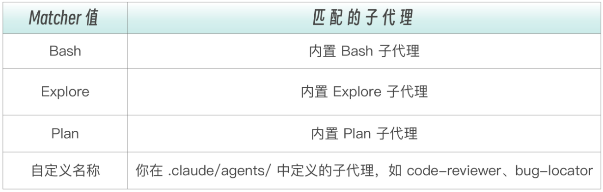


SubagentStart 接收的输入数据包含子代理的标识信息：

```json
{
  "session_id": "abc123",
  "cwd": "/project/root",
  "hook_event_name": "SubagentStart",
  "agent_id": "agent-def456",
  "agent_type": "code-reviewer"
}
```


**SubagentStart 不能阻止子代理启动** （这是设计决策：启动子代理是主会话的明确意图，不应该被 Hook 否决），但可以通过 `additionalContext` 向子代理注入上下文信息

```json
{
  "hookSpecificOutput": {
    "hookEventName": "SubagentStart",
    "additionalContext": "当前分支是 feature/payment-refactor，请特别关注支付相关的代码变更"
  }
}
```


#### SubagentStop：验证子代理的工作成果

`SubagentStop` 在子代理完成工作后触发。它的决策控制和 `Stop` 事件完全一致：**可以阻止子代理停止，强制它继续工作**


SubagentStop 的输入数据有一个独特的字段，`agent_transcript_path`：

```json
{
  "session_id": "abc123",
  "cwd": "/project/root",
  "hook_event_name": "SubagentStop",
  "stop_hook_active": false,
  "agent_id": "agent-def456",
  "agent_type": "code-reviewer",
  "transcript_path": "~/.claude/projects/.../main-session.jsonl",
  "agent_transcript_path": "~/.claude/projects/.../subagents/agent-def456.jsonl"
}
```

- `transcript_path` 是主会话的对话记录
- `agent_transcript_path` 是子代理自己的对话记录

这意味着 Hook 脚本可以**读取子代理的完整对话历史** 来判断质量，不是只看最终结果，而是能看到子代理是怎么得出结论的


SubagentStop 的决策控制和 Stop 事件一样，可以用 `decision: "block"` 阻止子代理完成，强制它继续工作：

```json
{
  "decision": "block",
  "reason": "Code review is incomplete: you found 3 issues but only provided fixes for 2. Please complete the review."
}
```


#### 实战：用 SubagentStop 验证代码审查质量

通过脚本验证 `code-reviewer` 子代理的审查是否完整。如果它发现了问题但没有给出修复建议，就强制它继续工作


> 05-Hooks/04-subagent-hooks/hooks/verify-review-quality.sh

```sh
#!/bin/bash
# verify-review-quality.sh
# 验证 code-reviewer 子代理的审查是否完整

INPUT=$(cat)
AGENT_TYPE=$(echo "$INPUT" | jq -r '.agent_type')
STOP_HOOK_ACTIVE=$(echo "$INPUT" | jq -r '.stop_hook_active')
TRANSCRIPT=$(echo "$INPUT" | jq -r '.agent_transcript_path')

# 只检查 code-reviewer
if [ "$AGENT_TYPE" != "code-reviewer" ]; then
    exit 0
fi

# 防止死循环
if [ "$STOP_HOOK_ACTIVE" = "true" ]; then
    exit 0
fi

# 读取子代理的输出，检查是否包含必要的审查要素
if [ -f "$TRANSCRIPT" ]; then
    HAS_ISSUES=$(grep -c "issue\|问题\|bug\|warning" "$TRANSCRIPT" || true)
    HAS_SUGGESTIONS=$(grep -c "suggest\|建议\|recommend" "$TRANSCRIPT" || true)

    if [ "$HAS_ISSUES" -gt 0 ] && [ "$HAS_SUGGESTIONS" -eq 0 ]; then
        cat <<EOF
{
    "decision": "block",
    "reason": "You found issues but didn't provide suggestions. Please add actionable suggestions for each issue."
}
EOF
        exit 0
    fi
fi

exit 0
```

这个脚本的逻辑分为三层防护：

- **第一层**：只检查 `code-reviewer` 类型的子代理，其他子代理直接放行
- **第二层**：检查 `stop_hook_active`，防止死循环
- **第三层**：读取子代理的对话记录，用关键词匹配检查是否包含问题和建议两类内容。如果只有问题没有建议，就阻止子代理完成


配置 hook：

```json
{
  "hooks": {
    "SubagentStop": [
      {
        "matcher": "code-reviewer",
        "hooks": [
          {
            "type": "command",
            "command": "./hooks/verify-review-quality.sh"
          }
        ]
      }
    ]
  }
}
```


用关键词匹配来判断审查质量是比较粗糙的。对于更精细的质量验证，可以用 Prompt 或 Agent 类型的 Hook，让 LLM 来评估子代理的输出：

```json
{
  "hooks": {
    "SubagentStop": [
      {
        "matcher": "code-reviewer",
        "hooks": [
          {
            "type": "prompt",
            "prompt": "Evaluate this code review result: $ARGUMENTS. Check that: 1) All issues have severity levels 2) Each issue has a concrete suggestion 3) No false positives. Respond with {\"ok\": true} or {\"ok\": false, \"reason\": \"what's missing\"}."
          }
        ]
      }
    ]
  }
}
```


### 高级模式与最佳实践


#### 多 Hook 链

可以为同一事件配置多个 Hook，它们会按顺序执行：

```json
{
  "hooks": {
    "PostToolUse": [
      {
        "matcher": "Write",
        "hooks": [
          { "type": "command", "command": "./hooks/format.sh" },
          { "type": "command", "command": "./hooks/lint.sh" },
          { "type": "command", "command": "./hooks/log.sh" }
        ]
      }
    ]
  }
}
```

**需要注意执行顺序和中断语义**。三个 Hook 按数组顺序依次执行：先格式化，再 Lint，最后记日志。如果任何一个 Hook 返回阻止决策（比如 lint.sh 返回 `exit 2`），后续的 Hook（log.sh）不会执行。所以应该把“不能失败”的 Hook（如日志记录）放在最前面，或者确保它们不会互相干扰


#### 环境变量

Hooks 可以访问多个环境变量，让脚本更加灵活

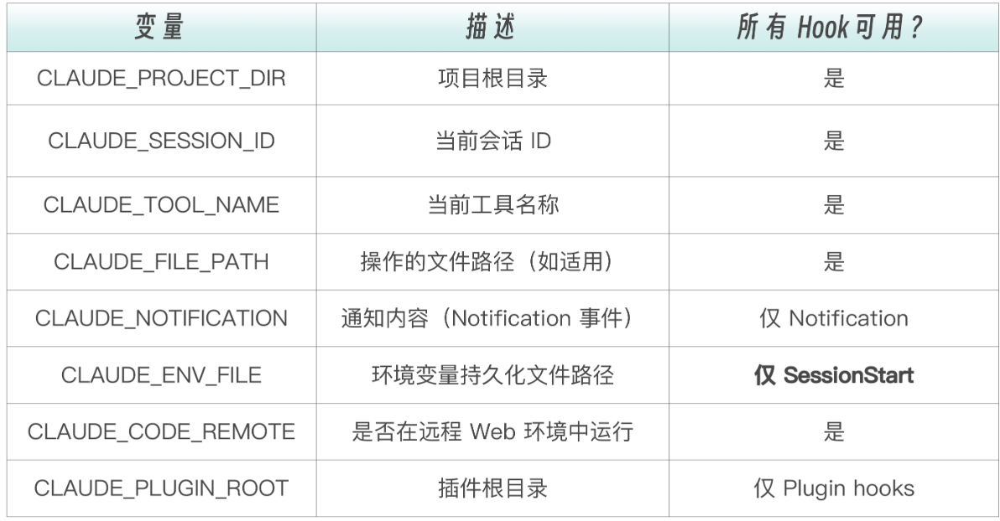

其中 `CLAUDE_ENV_FILE` 是一个特别有用的变量。SessionStart Hook 可以向这个文件写入 `export` 语句，这些环境变量会在后续所有 Bash 命令中生效，相当于在会话开始时，就设置了全局环境

```sh
#!/bin/bash

# session-setup.sh - SessionStart hook
if [ -n "$CLAUDE_ENV_FILE" ]; then
    echo 'export NODE_ENV=development' >> "$CLAUDE_ENV_FILE"
    echo 'export DEBUG_LOG=true' >> "$CLAUDE_ENV_FILE"
fi

exit 0
```


利用 `CLAUDE_FILE_PATH` 可以让 Hook 只在特定目录下生效，比如只对 `src/` 目录下的文件运行 Lint：

```sh
#!/bin/bash

# 只在 src/ 目录执行 lint
if [[ "$CLAUDE_FILE_PATH" == */src/* ]]; then
    npm run lint "$CLAUDE_FILE_PATH"
fi
```

这种条件过滤让 Hook 更精准，不需要对配置文件、文档、测试文件都跑同样的检查


#### 在 Commands 和 Skills 中定义临时 Hooks

Commands 和 Skills 可以在 frontmatter 中包含临时 Hooks（仅在该命令/技能执行期间有效）

```markdown
---
description: Deploy with safety checks
hooks:
  - event: PreToolUse
    matcher: Bash
    command: |
      if [[ "$TOOL_INPUT" == *"production"* ]]; then
        echo "Production deployment detected" >&2
      fi
  - event: PostToolUse
    matcher: Edit
    command: npx prettier --write "$FILE_PATH"
    once: true
---

Deploy the application to staging environment.
```

`once: true` 表示 Hook 只触发一次。这适合“完成后运行一次测试”这类不需要重复执行的场景。`once` 仅在 Skill 中可用，子代理中不支持


#### 子代理 frontmatter 内置 Hooks

子代理的 frontmatter 可以定义各种配置字段，其中包括 hooks 字段


场景：有一个 `db-reader` 子代理，它可以执行 SQL 查询。想在它每次执行 Bash 命令前检查 SQL 注入风险


**方案一：全局 settings.json**

```json
{
  "hooks": {
    "PreToolUse": [
      {
        "matcher": "Bash",
        "hooks": [
          {
            "type": "command",
            "command": "./hooks/check-sql-injection.sh"
          }
        ]
      }
    ]
  }
}
```

问题：**所有** Bash 命令都会被 SQL 注入检查：包括 `npm install`、`git status`、`ls -la` 这些和 SQL 毫无关系的命令。这既浪费性能（每次 Bash 命令多执行一个脚本），又可能误拦截（脚本中某个字符串碰巧匹配了 SQL 注入模式）


**方案二：子代理 frontmatter Hooks**

```markdown
---
name: db-reader
description: Read-only database explorer for analyzing data patterns
tools: Read, Grep, Glob, Bash
permissionMode: plan
hooks:
  PreToolUse:
    - matcher: "Bash"
      hooks:
        - type: command
          command: "./hooks/check-sql-injection.sh"
  Stop:
    - hooks:
        - type: prompt
          prompt: "Check if any query results contain PII (names, emails, phone numbers). If so, respond with {\"ok\": false, \"reason\": \"Results may contain PII, please redact before returning\"}."
---

You are a database analysis specialist. Execute read-only SQL queries to help understand data patterns.

## Rules
- ONLY execute SELECT queries
- NEVER use INSERT, UPDATE, DELETE, DROP, or any data-modifying SQL
- Limit results to 100 rows unless explicitly requested
```

这样，SQL 注入检查只在 `db-reader` 子代理的 Bash 命令上触发。主会话和其他子代理的 Bash 命令完全不受影响


两种方案的对比：

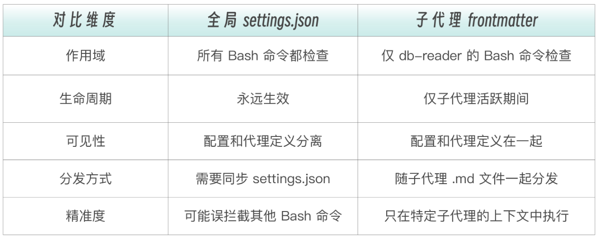


frontmatter Hooks 的关键规则：

- **支持所有事件类型** ：PreToolUse、PostToolUse、Stop 等都可以用
- **Stop 会自动转换为 SubagentStop** ：在子代理 frontmatter 中定义的 `Stop` Hook，实际触发的是 `SubagentStop` 事件，因为子代理完成时触发的是 SubagentStop 而非 Stop
- **生命周期绑定** ：Hook 在子代理启动时激活，子代理完成时自动清理
- **格式与 settings.json 一致** ：YAML 格式，但字段名和结构完全相同


一个更复杂的例子，这是一个带安全检查的部署子代理：

```markdown
---
name: deploy-checker
description: Verify deployment readiness with safety checks
tools: Read, Grep, Glob, Bash
hooks:
  PreToolUse:
    - matcher: "Bash"
      hooks:
        - type: command
          command: |
            INPUT=$(cat)
            CMD=$(echo "$INPUT" | jq -r '.tool_input.command // ""')
            # 阻止任何直接操作生产环境的命令
            if echo "$CMD" | grep -qi "production\|prod-db\|deploy.*--force"; then
              echo '{"hookSpecificOutput":{"hookEventName":"PreToolUse","permissionDecision":"deny","permissionDecisionReason":"Direct production operations are not allowed in this agent. Use the deployment pipeline instead."}}'
            fi
  Stop:
    - hooks:
        - type: agent
          prompt: "Review the deployment check results. Verify that: 1) All health checks pass 2) No breaking API changes detected 3) Database migrations are backward-compatible. $ARGUMENTS"
          timeout: 60
---

You are a deployment readiness checker...
```

这个子代理有两层保护：

- **PreToolUse Hook** 用确定性规则阻止直接操作生产环境的命令，这是“硬规则”，不需要判断力，只需要模式匹配
- **Stop Hook** （实际触发为 SubagentStop）用 Agent 类型验证部署检查结果。这需要判断力和代码检查能力，所以用了 Agent 类型


**frontmatter Hooks 与 全局 Hooks 的使用时机判断**：

```yaml
判断流程：
├── 这个 Hook 是否只与特定子代理相关？
│   ├── 是 → frontmatter Hooks
│   │   例：db-reader 的 SQL 注入检查、deploy-checker 的生产环境保护
│   └── 否 → 全局 settings.json
│       例：所有 Write 操作后的格式化、所有 Bash 命令的危险命令拦截
│
├── 这个 Hook 是否需要随子代理定义一起分发？
│   ├── 是 → frontmatter Hooks
│   │   例：开源项目中的子代理，使用者不需要额外配置 settings.json
│   └── 否 → 全局 settings.json
│
└── 这个 Hook 是否需要在子代理外也生效？
    ├── 是 → 全局 settings.json
    └── 否 → frontmatter Hooks
```


#### 调试技巧

**1. 使用 stderr 输出调试信息**

```sh
# 调试信息输出到 stderr（不影响 JSON 响应）
echo "DEBUG: Processing file $FILE_PATH" >&2

# 正常输出到 stdout
echo '{"decision": "allow"}'
```

**stdout 是给 Claude 读的 JSON，stderr 是调试信息**，不要混淆两者


**2. 手动测试 Hook 脚本**

手动构造 JSON 输入，通过管道传给脚本：

```sh
# 创建测试输入
echo '{
  "tool_name": "Bash",
  "tool_input": {
    "command": "rm -rf /tmp/test"
  }
}' | ./hooks/block-dangerous.sh


# 检查退出码
echo "Exit code: $?"
```


**3. 使用**`claude --debug`**查看完整执行细节**

```bash
[DEBUG] Executing hooks for PostToolUse:Write
[DEBUG] Found 1 hook matchers in settings
[DEBUG] Matched 1 hooks for query "Write"
[DEBUG] Hook command completed with status 0: <stdout output>
```


**4. 常见问题排查清单**

- **Hook 不触发**：检查 matcher 是否正确（区分大小写）；如果直接编辑了 settings 文件，需要在 `/hooks` 菜单中确认或重启会话才能生效。
- **权限问题**：确保脚本有执行权限：`chmod +x hooks/*.sh`
- **JSON 解析错误**：确保输出是有效 JSON。注意：如果 shell profile。（`~/.zshrc` 或 `~/.bashrc`）中有无条件的 `echo` 语句，它会污染 stdout 导致 。JSON 解析失败。解决方法是用 `[[ $- == *i* ]]` 包裹 echo，只在交互式 shell 中输出
- **Stop Hook 死循环**：检查是否遗漏了 `stop_hook_active` 判断


#### 异步 Hook：后台执行不阻塞

默认情况下，Hook 会阻塞 Claude 的执行直到完成。这在大多数场景下是合理的：安全检查必须在操作前完成，格式化必须在下一步操作前完成。

但对于耗时操作（运行完整测试套件、发送通知、调用外部 API），阻塞会显著拖慢 Claude 的响应速度


`async: true` 让 Hook 在后台运行，不阻塞主流程：

```json
{
  "hooks": {
    "PostToolUse": [
      {
        "matcher": "Write|Edit",
        "hooks": [
          {
            "type": "command",
            "command": "./hooks/run-tests-async.sh",
            "async": true,
            "timeout": 300
          }
        ]
      }
    ]
  }
}
```


异步 Hook 的三个限制：

- 只有 `type: "command"` 支持异步，prompt 和 agent 类型不支持，因为它们需要实时影响 Claude 的决策
- 异步 Hook **不能阻止操作** ，因为操作在 Hook 完成前就已经继续了
- Hook 完成后的输出会在**下一个对话轮次**传递给 Claude，这是有延迟的

所以异步 Hook 适合“不需要立即知道结果”的场景，在后台跑测试、发送 Slack 通知、写日志到远程服务


#### HTTP Hook：对接外部服务

有些场景下，Hook 的处理逻辑不在本地，而是在一个远程服务上，比如：团队共享的审计服务、集中式的安全扫描平台、公司内部的合规检查 API

这时候就该用 `type: "http"`。HTTP Hook 把事件数据**以 POST 请求**发送到指定 URL，由远程服务处理后返回决策结果：

```json
{
  "hooks": {
    "PostToolUse": [
      {
        "hooks": [
          {
            "type": "http",
            "url": "http://localhost:8080/hooks/tool-use",
            "headers": {
              "Authorization": "Bearer $MY_TOKEN"
            },
            "allowedEnvVars": ["MY_TOKEN"]
          }
        ]
      }
    ]
  }
}
```

远程服务收到的 JSON 和 command Hook 从 stdin 读到的完全一样，返回的响应体也遵循相同的 JSON 格式。要阻止工具调用，在响应体里返回对应的 `hookSpecificOutput` 字段即可

> 注意：HTTP 状态码（如 403）不能阻止操作，必须在 2xx 响应体里用 JSON 表达决策。 `headers` 中的值支持 `$VAR_NAME` 语法做环境变量插值，但只有 `allowedEnvVars` 列表中的变量才会被解析，其他 `$VAR` 引用会保持为空。这是一个安全设计，防止意外泄露环境变量


#### 安全最佳实践

在生产环境中的安全建议：

- **使用绝对路径引用脚本**：用 `"$CLAUDE_PROJECT_DIR"/.claude/hooks/xxx.sh`，比相对路径更可靠。相对路径在子代理中可能解析到错误的目录
- **最小权限原则**：PreToolUse 只检查必要的条件。检查越多，误拦截的概率越高，用户绕过 Hook 的冲动也越强
- **快速失败**：Hook 应该快速返回，避免长时间阻塞。如果确实需要耗时操作，用 `async: true`
- **优雅降级**：格式化工具不存在时应跳过而不是报错。Hook 的失败不应该阻碍正常工作流
- **输入校验**：永远不要盲目信任 stdin 输入，用 `jq` 解析并验证
- **引号包裹变量**：使用 `"$VAR"` 而非 `$VAR`，防止路径中的空格导致问题
- **路径遍历防护**：检查文件路径中是否有 `..`，防止恶意路径逃逸


### Hook 工程设计方法论

上面的知识都是：Hooks 能做什么、怎么配置。那么面对一个具体需求，如何系统地设计 Hook 方案呢？


#### 三维决策框架

设计一个 Hook 方案，需要想清楚三个问题：

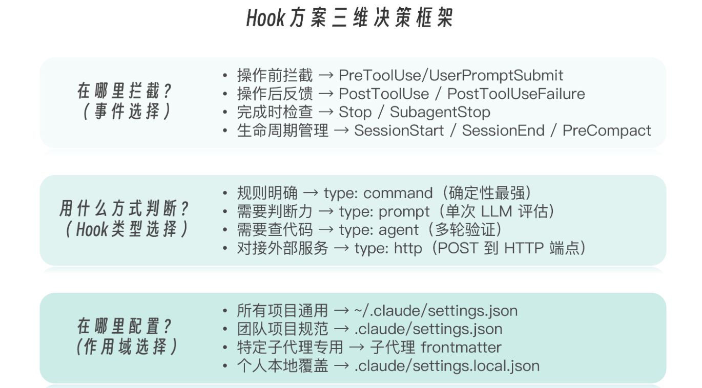


#### Hook + SubAgent 组合模式

一个完整的组合案例，一个带质量门控的代码审查子代理：

```yaml
子代理定义（.claude/agents/code-reviewer.md）
├── frontmatter
│   ├── tools: Read, Grep, Glob
│   ├── permissionMode: plan
│   └── hooks:
│       └── Stop: prompt hook 检查审查是否完整
│
全局 settings.json
├── SubagentStart hook（matcher: code-reviewer）
│   └── 注入当前分支的变更列表
└── SubagentStop hook（matcher: code-reviewer）
    └── 验证审查报告格式和质量
```

这三层保护各司其职：

- **frontmatter Hook**：子代理内部的自检，检测我的输出完整是否完整
- **SubagentStart Hook**：外部注入，给它必要的上下文
- **SubagentStop Hook**：外部验收，判断它的工作是否达标


### 总结

Stop Hook：任务完成时的质量门控，的核心能力是让 Claude 继续工作，这个能力来源于它的 `continue` 字段


可以通过 `stop_hook_active` 字段防止 Stop Hook 死循环


子代理事件：

- `SubagentStart` 在子代理被启动时触发，它不能阻止子代理启动，但可以通过 `additionalContext` 向子代理注入上下文信息
- `SubagentStop` 在子代理完成工作后触发，**可以阻止子代理停止，强制它继续工作**


## MCP 协议与外部工具连接


### MCP——AI 的 USB-C 接口

把 MCP 想象成 AI 应用的 USB-C 接口。就像 USB-C 提供了连接设备与各种外设的标准化方式，MCP 提供了连接 AI 模型与各种数据源和工具的标准化方式：

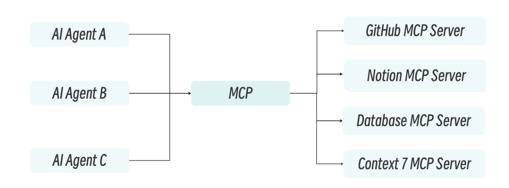


一个协议，通用连接。每个 AI 助手只需要实现一次 MCP Client，每个服务只需要实现一次 MCP Server，然后任意组合即可工作


### MCP 架构与核心概念

MCP 采用经典的客户端--服务器架构。Claude Code 充当 MCP Client，负责发现和调用工具；MCP Server 则暴露工具和资源，作为外部服务的代理。两者之间通过 JSON-RPC 2.0 协议通信。

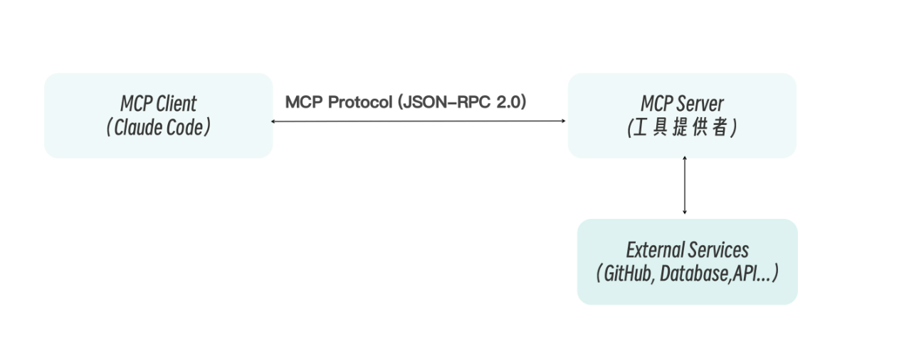

这个架构的关键组件：

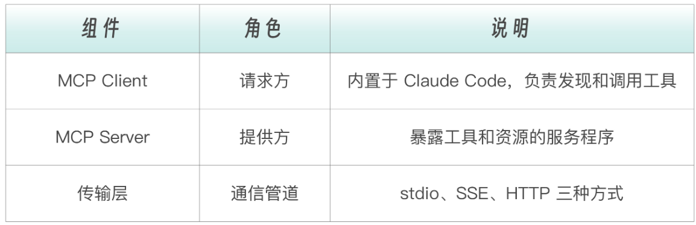


MCP Server 并不只是简单地“暴露一个函数”。它可以向 Client 提供三种不同类型的能力：

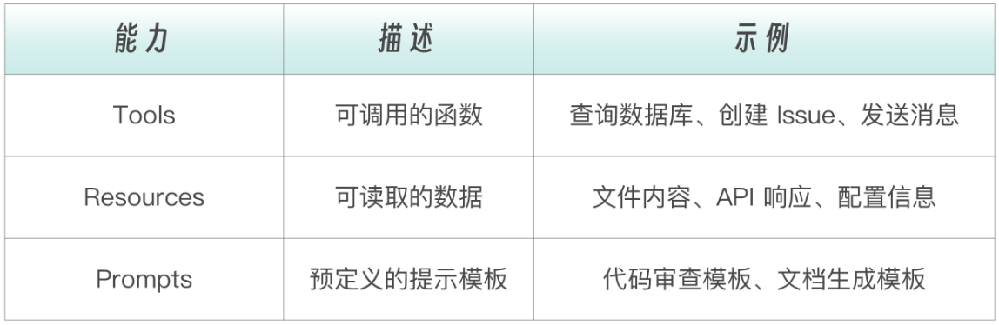

- Tools 是最常用的能力类型，它让 Claude 能够“做事情“
- Resources 提供只读数据，让 Claude 能够“看到东西”而不仅仅依赖粘贴的文本
- Prompts 则是一种便捷机制，让服务器预定义好特定场景的交互模板


**Claude Code 在启动时会自动发现所有配置的 MCP Server 及其提供的能力**。当你说“帮我查一下数据库里的用户数量”时，Claude 会自动找到数据库 MCP Server，调用对应的查询工具，解析结果并返回。整个过程对用户完全透明


### MCP 的三种传输方式

MCP 支持三种传输方式，适用于不同场景


第一种：**Stdio 传输（本地进程）**是最简单的方式。MCP Server 作为本地子进程启动，通过标准输入（stdin）接收请求，通过标准输出（stdout）返回响应。零网络开销、零配置复杂度，适合本地工具和开发测试

```json
{
  "mcpServers": {
    "filesystem": {
      "type": "stdio",
      "command": "npx",
      "args": ["@modelcontextprotocol/server-filesystem", "/home/user/projects"]
    }
  }
}
```


第二种方式是**HTTP 传输（推荐用于远程）**。当 MCP Server 运行在远程服务器上时的推荐方式。通过标准 HTTP 请求/响应通信，支持 TLS 加密和 Bearer Token 认证。GitHub、Notion、Sentry 等云服务通常直接提供 HTTP 类型的 MCP 端点：

```json
{
  "mcpServers": {
    "github": {
      "type": "http",
      "url": "https://api.githubcopilot.com/mcp/",
      "headers": {
        "Authorization": "Bearer ${GITHUB_TOKEN}"
      }
    }
  }
}
```


第三种方式是 **SSE 传输（Server-Sent Events）**。基于 HTTP 的单向推送技术，建立持久连接，服务器可以主动向客户端推送数据。适合实时监控和流式数据场景。在实践中使用较少，大多数场景用 stdio 或 HTTP 就够了


三种方式的对比：

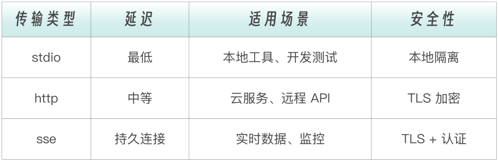

**本地用 stdio，远程用 HTTP，实时用 SSE**。实际上，stdio（本地服务器）或 HTTP（远程服务），这两个基本覆盖了 95% 的场景


### MCP 的配置与管理

MCP 配置可以放在多个位置，每个位置的作用域和可见性不同：

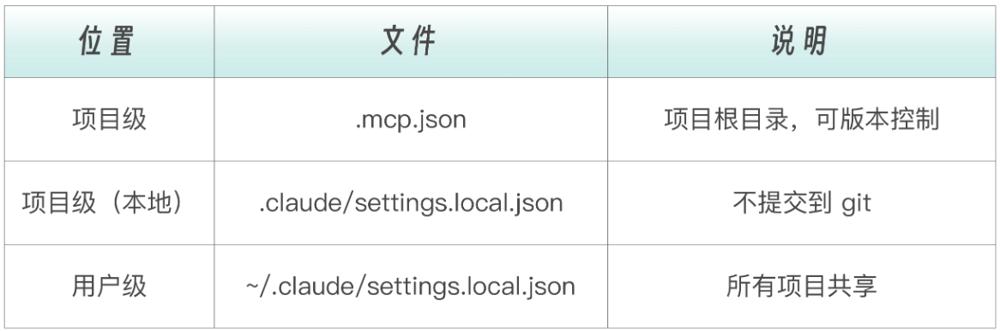

- **团队共享的服务配置** 放到 `.mcp.json`，提交到 git，团队成员共享
- **敏感凭证** 放到 `.claude/settings.local.json`，不提交，本地保存
- **个人常用服务** 放到 `~/.claude/settings.local.json`，跨项目可用


不论使用哪种传输方式，MCP 配置都遵循同一个 JSON 结构。`mcpServers` 是顶层键，每个子键是服务器名称（可自由命名）。`type` 指定传输方式，剩余字段根据传输类型不同。stdio 需要 `command` 和 `args`，HTTP/SSE 需要 `url` 和 `headers`

```json
{
  "mcpServers": {
    "server-name": {
      "type": "stdio | sse | http",
      "command": "...",        // stdio 专用
      "args": ["..."],         // stdio 专用
      "url": "...",            // sse/http 专用
      "headers": {},           // sse/http 专用
      "env": {}                // 环境变量
    }
  }
}
```


Claude Code 还提供了命令行工具来管理 MCP 服务器：

```bash
# 添加 HTTP 服务器
claude mcp add --transport http github https://api.githubcopilot.com/mcp/

# 添加 stdio 服务器
claude mcp add filesystem -- npx @modelcontextprotocol/server-filesystem /path

# 添加到用户级别（所有项目可用）
claude mcp add --transport http --scope user github https://api.githubcopilot.com/mcp/

# 带认证头添加
claude mcp add --transport http --header "Authorization: Bearer ${TOKEN}" api https://api.example.com/mcp

# 列出所有服务器
claude mcp list

# 查看服务器详情
claude mcp get github

# 移除服务器
claude mcp remove github
```


### 创建自定义 MCP 服务器

当现有的 MCP 服务器无法满足需求时，可以创建自己的。MCP 官方提供了 TypeScript 和 Python 两套 SDK，开发一个基本的 MCP Server 只需要几十行代码


#### TypeScript SDK

TypeScript SDK 是使用最广泛的 MCP 开发工具


> 示例项目在：06-MCP/01-custom-mcp


安装依赖：

```bash
npm install @modelcontextprotocol/sdk zod

npm install -D typescript @types/node  
```

 - @modelcontextprotocol/sdk：官方 MCP TypeScript SDK                                                                                        
 - zod：定义和校验工具输入                                                                                                                                                                                                                           
 - typescript、@types/node：编译和 Node.js 类型 


一个最简单的 MCP Server 主要是三步：

```typescript
import { McpServer } from '@modelcontextprotocol/sdk/server/mcp.js';
import { StdioServerTransport } from '@modelcontextprotocol/sdk/server/stdio.js';

// 1.创建 Server                                                                        
const server = new McpServer({                                                           
  name: "my-mcp",                                                                          
  version: "1.0.0",                                                                       
});                                                                                      

// 2.注册工具                                                                             
server.registerTool("tool_name", options, handler);

// 3.连接传输层                                                                           
const transport = new StdioServerTransport();                                             
await server.connect(transport); 
```


Todo 管理 MCP Server 例子：

> src/index.ts

```typescript
import { McpServer } from '@modelcontextprotocol/sdk/server/mcp';
import { StdioServerTransport } from '@modelcontextprotocol/sdk/server/stdio';
import { z } from 'zod';

interface Todo {
  id: string;
  text: string;
  done: boolean;
  createdAt: Date;
}

interface Note {
  id: string;
  title: string;
  content: string;
  createdAt: Date;
}

// 内存存储
const todos: Todo[] = [];
const notes: Note[] = [];

// 生成唯一 id
function generateId(): string {
  return Math.random().toString(36).substring(2, 9);
}

// 创建 mcp 服务器
const server = new McpServer({
  name: 'custom-mcp',
  version: '1.0.0',
});

// ---------- Todo 工具 ----------

// 添加待办事项
server.registerTool(
  'todo_add',
  {
    title: '添加新的待办事项',
    description: '添加新的待办事项到列表中',
    inputSchema: z.object({
      text: z.string().describe("待办事项内容"),
    }),
  },
  async ({ text }) => {

    const todo: Todo = {
      id: generateId(),
      text,
      done: false,
      createdAt: new Date(),
    };

    todos.push(todo);

    return {
      content: [
        {
          type: 'text',
          text: `Added todo: ${todo.id} - ${todo.text}`,
        }
      ]
    };
  }
);

// 列出待办事项
server.registerTool(
  'todo_list',
  {
    title: '列出所有待办事项',
    description: '列出列表中的所有待办事项',
    inputSchema: {
      showDone: z.boolean().optional().describe("包含已完成的事项"),
    },
  },
  async ({ showDone = true}) => {
    const filtered = showDone ? todos : todos.filter(todo => !todo.done);

    const text = 
      filtered.length === 0
        ? '没有待办事项'
        : filtered
            .map((todo) => `[${todo.done ? "x" : " "}] ${todo.id}: ${todo.text}`)
            .join("\n");

    return {
      content: [
        {
          type: 'text',
          text: `Todos:\n${text}`,
        },
      ],
    };
  }
);

// 完成待办事项
server.registerTool(
  'todo_complete',
  {
    title: '标记待办事项为已完成',
    description: '标记待办事项为已完成',
    inputSchema: {
      id: z.string().describe("待办事项 ID"),
    },
  },
  async ( { id } ) => {
    const todo = todos.find(todo => todo.id === id);

    if (!todo) {
      return {
        content: [
          {
            type: 'text',
            text: `未找到任务: ${id}`,
          },
        ],
        isError: true,
      };
    }

    todo.done = true;

    return {
      content: [
        {
          type: 'text',
          text: `已完成：${todo.text}`,
        },
      ],
    };
  }
);

// 删除待办事项
server.registerTool(
  'todo_delete',
  {
    title: '删除待办事项',
    description: '从列表中删除待办事项',
    inputSchema: {
      id: z.string().describe("待办事项 ID"),
    },
  },
  async ( { id } ) => {
    const index = todos.findIndex(todo => todo.id === id);

    if (index === -1) {
      return {
        content: [
          {
            type: 'text',
            text: `未找到任务: ${id}`,
          },
        ],
        isError: true,
      };
    }

    const [ deleted ] = todos.splice(index, 1);

    return {
      content: [
        {
          type: 'text',
          text: `已删除任务: ${deleted.text}`,
        },
      ],
    };
  }
);

// ---------- 启动服务器 ---------
async function main() {
  const transport = new StdioServerTransport();
  await server.connect(transport);
  console.error("MCP Server started");
}

main().catch(console.error);
```


#### Python SDK


#### 配置自定义 MCP

将自定义 mcp 添加到 claude code：


Typescript 版本：

```json
{
  "mcpServers": {
    "custom-mcp": {
      "type": "stdio",
      "command": "node",
      "args": ["/绝对路径/custom-mcp/dist/index.js"]
    }
  }
}
```


Python 版本：

```json
{
  "mcpServers": {
    "custom-mcp": {
      "type": "stdio",
      "command": "python",
      "args": ["/绝对路径/custom-mcp/server.py"]
    }
  }
}
```


如果处于开发阶段，也可以直接使用 tsx，前提需要先安装 tsx

```bash
npm install -D tsx
```

```json
{
  "mcpServers": {
    "custom-mcp": {
      "type": "stdio",
      "command": "npx",
      "args": [
        "tsx",
        "/绝对路径/custom-mcp/src/index.ts"
      ]
    }
  }
}
```


### MCP 安全原则

MCP 的强大能力也带来了安全风险。它本质上是在给 AI Agent 开放访问外部系统的权限。使用第三方 MCP 服务器需自担风险


下面是五条 MCP 使用的安全原则：

- **验证服务器来源**。只使用官方或知名来源的 MCP 服务器。一个恶意的 MCP Server 可以在你不知情的情况下读取敏感文件、窃取环境变量中的密钥

- **限制权限范围**。遵循最小权限原则，只给必要的目录和资源访问

  ```json
  {
    "mcpServers": {
      "filesystem": {
        "type": "stdio",
        "command": "npx",
        "args": [
          "@modelcontextprotocol/server-filesystem",
          "/safe/directory/only"
        ]
      }
    }
  }
  ```

- **使用只读凭证**。对于数据库等关键系统，永远不要给 MCP Server 写权限，除非明确需要 Claude 修改数据

- **保护敏感凭证**。绝对不要在配置文件中硬编码 Token。使用环境变量引用，将敏感值存在不提交到 git 的文件中

- **审计 MCP 服务器代码**。对于开源服务器，在使用前检查其代码：它请求哪些权限？它如何处理用户数据？花十分钟审计代码，可能避免一次严重的安全事故


### 调试与故障排除

MCP 配置好之后，可能不会一次就跑通。Claude Code 内置了调试工具：

```bash
# 列出所有配置的服务器
claude mcp list

# 查看服务器详细信息
claude mcp get my-server

# 启用调试模式查看 MCP 连接详情
claude --debug
```


同时，可以使用 `tsx` 接入开发中的 mcp 服务，实现边开发，边调试


## Tools 工具系统内核剖析

Claude Code 内置的那些工具本身是怎么回事？ Read、Write、Bash、Grep、Glob、Edit、Agent……这十几个“原生工具”是怎么组织的？为什么偏偏是这几个？它们和 MCP 扩展的外部工具又是什么关系


### Agentic Loop 工具驱动的智能循环

如果 Claude 没有工具，只能做一件事：**输出文本**

```bash
用户: 帮我修复 src/api.js 中的 bug

Claude:（思考）这应该是一个 JavaScript 文件...
       （继续思考）用户想让我修复 bug...
       （输出文本）"您好，请提供 src/api.js 的内容，我来帮您分析问题。"
```

它能思考、能分析、能给建议，但**不能行动**


有了工具，情况完全不同：

```bash
用户: 帮我修复 src/api.js 中的 bug

Claude:（思考）让我先读取这个文件
       （调用 Read 工具）→ 获取文件内容
       （思考）我发现了问题，第 42 行的 null 检查缺失
       （调用 Edit 工具）→ 修改文件
       （思考）让我运行测试确认修复成功
       （调用 Bash 工具）→ 执行 npm test
       （输出）"我已经修复了问题，测试全部通过。"
```

工具让 Claude 从顾问变成了**执行者**


Claude Code 的工作循环，Agentic Loop 可以分为三个阶段，根据任务需要灵活切换

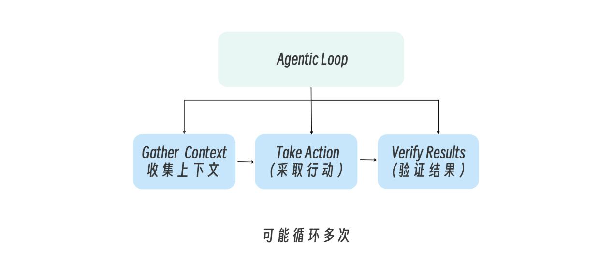


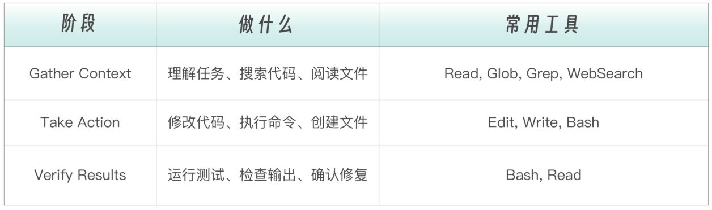

简单任务可能只需要一轮，复杂任务可能循环几十次。**每一次工具调用的返回结果，都会反馈给 Claude，影响下一步的决策**

Claude（模型）负责**推理** ，Tools 负责**行动**。而 Claude Code 扮演的角色是 **Agentic Harness**，它把模型和工具连接起来，提供执行环境、上下文管理、权限控制等基础设施

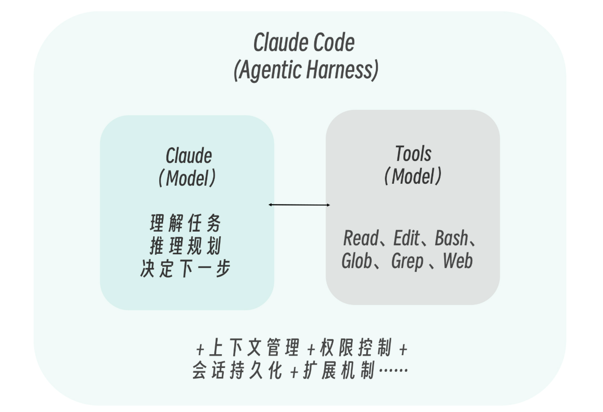


### Claude Code 内置工具

claude code 内置工具最新列表在[Tools reference](https://code.claude.com/docs/en/tools-reference)，按功能分为六个类别


**文件操作类**，Claude 与代码交互的最基本方式。Read 是只读的，不需要额外授权；Edit、Write、MultiEdit 会修改文件系统，因此需要用户确认


**搜索类**，Claude 的“眼睛”。在动手之前先看清楚代码库的全貌。Glob 按文件名模式定位文件，Grep 按内容搜索定位代码行，两者都是只读操作，无需授权

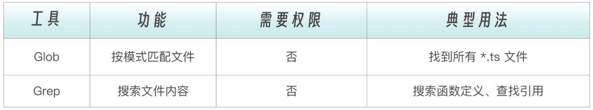


**执行类**，整个工具集里能力最强也最危险的一个。Bash 可以执行操作系统能做的一切。正因如此，它始终需要用户授权

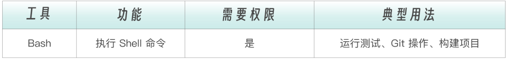


**网络类，** 让 Claude 突破本地文件系统的边界，访问互联网上的信息。查文档、搜报错、获取 API 响应都靠这两个工具

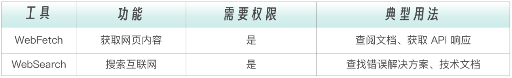


**编排类**，这组工具不直接操作代码，而是管理 Agent 的工作流程：把复杂任务委派给子代理、在需要时向用户提问、用任务清单跟踪多步骤进度

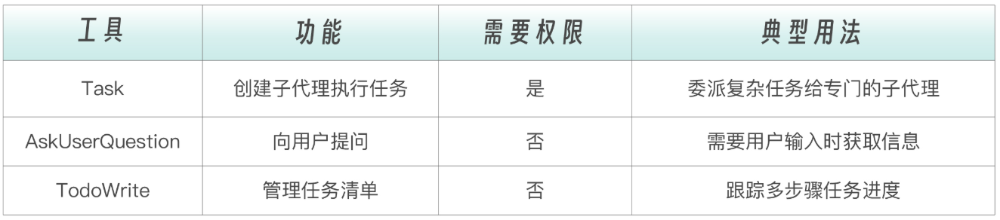


**辅助类**，支撑性工具，用于管理后台任务和系统状态切换。日常使用中不常直接接触，但在自动化场景下不可或缺

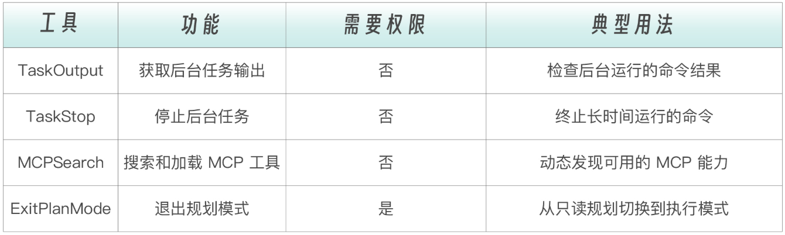


这些工具相互组合，几乎覆盖了所有软件工程任务。例子：修复用户登录时偶尔出现的 500 错误

```bash
第 1 步：Grep("500", "error", "login")
         → 找到 3 个文件中有相关错误日志
         → Claude 推理："日志显示错误出现在 auth-service.js"

第 2 步：Read("src/auth-service.js")
         → 读取 200 行代码
         → Claude 推理："第 87 行的 token 验证没有 null 检查"

第 3 步：Grep("validateToken", type: "files_with_matches")
         → 找到 5 个文件引用了这个函数
         → Claude 推理："需要同时检查调用方是否有防御性处理"

第 4 步：Read("src/middleware/auth.js")
         → 读取调用方代码
         → Claude 推理："调用方也没有 null 检查，需要在源头修复"

第 5 步：Edit("src/auth-service.js", line 87)
         → 添加 null 检查

第 6 步：Bash("npm test -- --grep 'auth'")
         → 运行测试，2 个失败
         → Claude 推理："测试用例需要更新"

第 7 步：Edit("tests/auth.test.js")
         → 更新测试用例

第 8 步：Bash("npm test")
         → 全部通过
```


### 工具的风险等级

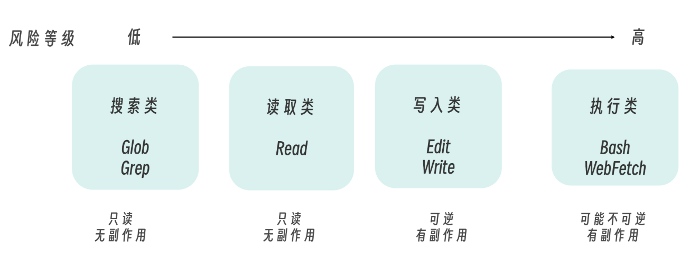

通过风险等级：

- 为子代理配置**最小权限**（只读任务只给 Read/Grep/Glob）
- 设计**防护机制**（高风险工具加 Hook 检查）
- 理解**权限提示的逻辑**（低风险工具不弹窗，高风险工具要确认）


### 权限控制体系

如果说工具定义了“Claude 能做什么”，那么权限系统决定了“Claude 可以做到什么程度”。 同一组工具，在不同权限边界下，其行为能力和风险等级会呈现出完全不同的形态，这也是 Agent 系统**从“可用”走向“可控”**的关键一环

从工程角度看，Claude Code 并不是简单地“给或不给权限”，而是构建了一套分层的权限控制体系：既保证低风险操作的流畅执行，又对高风险行为进行精细约束，从而在效率与安全之间取得平衡


#### 权限分层

Claude Code 使用分层权限系统来平衡能力和安全

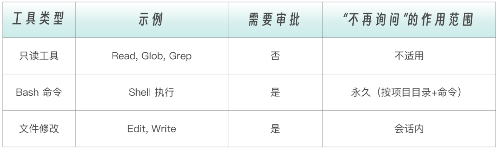

Bash 命令点“Yes, don’t ask again”后**永久生效** （该项目目录下），文件编辑的授权**只在当前会话有效** 


#### 权限模式

Claude Code 支持多种权限模式，通过 `Shift+Tab` 循环切换

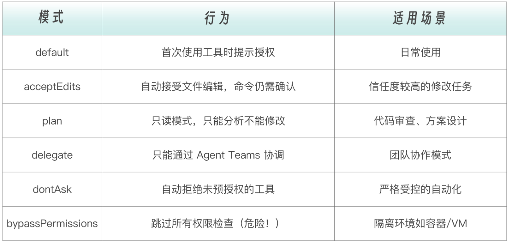


#### 权限规则语法

在 `settings.json` 中可以精细配置工具权限

三种权限规则：

 ```json                                                                                                                                     
 {                                        
   "permissions": {                                                                       
     "allow": [],                                                                         
     "ask": [],                                                                           
     "deny": []                                                                           
   }                                                                                       
 }
 ```

规则优先级：`deny` → `ask` → `allow`。deny 规则总是优先


示例：

```json
{
  "permissions": {
    "allow": [
      "Bash(npm run *)",
      "Bash(git status)",
      "Bash(git diff *)",
      "Read"
    ],
    "deny": [
      "Bash(rm -rf *)",
      "Bash(curl *)",
      "Edit(.env)"
    ]
  }
}
```


**Bash 规则通配符**：

```bash
Bash(npm run build)     # 精确匹配 "npm run build"
Bash(npm run *)         # 匹配 "npm run" 后跟任意内容
Bash(git * main)        # 匹配 "git checkout main", "git merge main" 等
```

> 注意空格边界：Bash(ls \*) 匹配 ls -la 但不匹配 lsof；Bash(ls\*) 两者都匹配


**Read/Edit 规则路径语法**：

```json
{
  "permissions": {
    "allow": [
      "Read",
      "Edit(/src/**/*.ts)"
    ],
    "deny": [
      "Read(./.env)",
      "Edit(//etc/passwd)",
      "Read(~/.ssh/*)"
    ]
  }
}
```

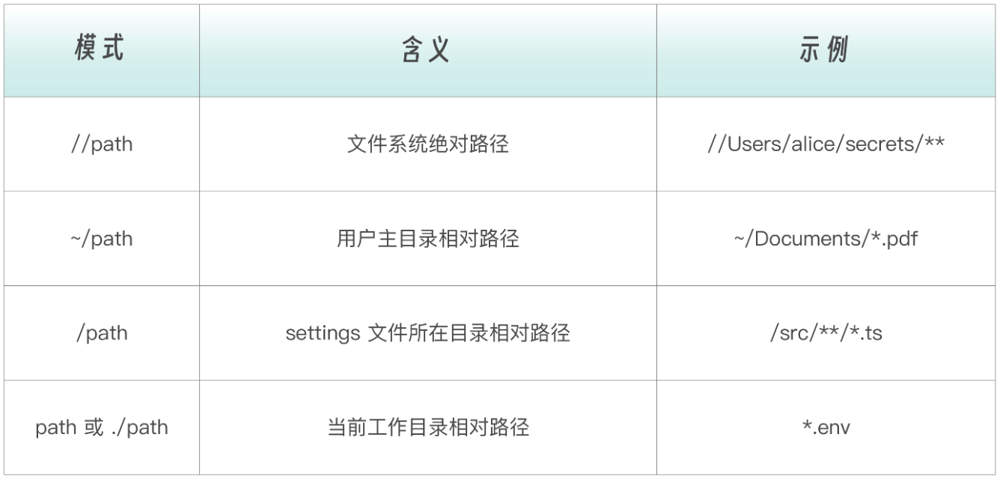


**WebFetch 和 MCP 工具规则**：

```json
{
  "permissions": {
    "allow": [
      "WebFetch(domain:github.com)",
      "mcp__puppeteer",
      "mcp__database__query"
    ],
    "deny": [
      "WebFetch(domain:internal.company.com)",
      "mcp__database__drop_table"
    ]
  }
}
```

格式是：                                                                                                                                
 ```text                                                                                                                                     
 mcp__<MCP 服务名>__<工具名>
 ```

如果后面不加工具名，或者使用 `*` 匹配，表示 mcp 服务的所有工具：

```json
{
 "permissions": {                                                                     
   "allow": ["mcp__github"]                                                           
 }                                                                                   
}


{
 "permissions": {                                                                     
   "allow": ["mcp__github__*"]                                                           
 }                                                                                   
}
```


按工具名前缀匹配：

```json
{
 "permissions": {                                                                     
   "allow": [
     "mcp__github__get_*",
     "mcp__github__list_*"
   ]
 }
}
```


#### 配置文件层级

权限配置可以在多个层级设置，高优先级的配置覆盖低优先级。按从高到低的优先级排序，如下表：

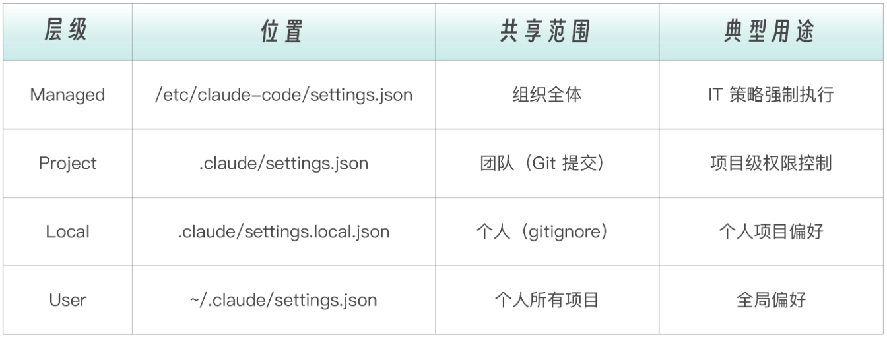


#### CLI 工具控制

除了配置文件，还可以通过 CLI 参数临时控制工具权限：

```bash
# 限制可用工具集
claude --tools "Read,Grep,Glob"

# 预授权特定命令（执行时不弹窗）
claude --allowedTools "Bash(npm run *)" "Bash(git diff *)" "Read"

# 禁用特定工具（从上下文中完全移除）
claude --disallowedTools "Bash(curl *)" "Edit"
```

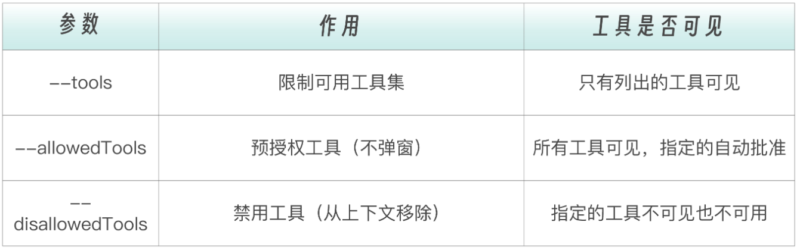


### 工具扩展与架构定位

内置工具覆盖了大部分编码任务，但连接外部系统时需要扩展。工具能力可以分为三个层次：从**内置工具 --> Bash 可达 --> MCP 扩展**，每一层都在前一层的基础上拓展能力边界

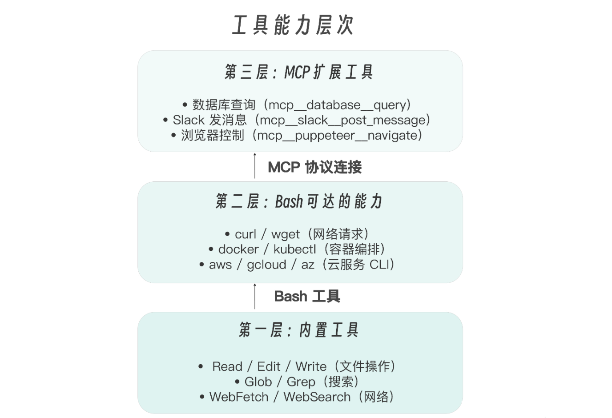


通过 Bash，Claude 已经可以运行任何命令行工具。那为什么还需要 MCP？三个理由：

- **结构化输入输出**。MCP 返回结构化数据，不需要解析文本
- **工具发现**。连接一个 MCP Server，所有工具自动可用
- **安全隔离**。MCP 在 Server 端做访问控制，比 `Bash(curl *)` 精细得多


工具是基础，其他机制是上层建筑，SubAgents、Skills、Commands、Hooks、MCP，都建立在 Tools 基础上

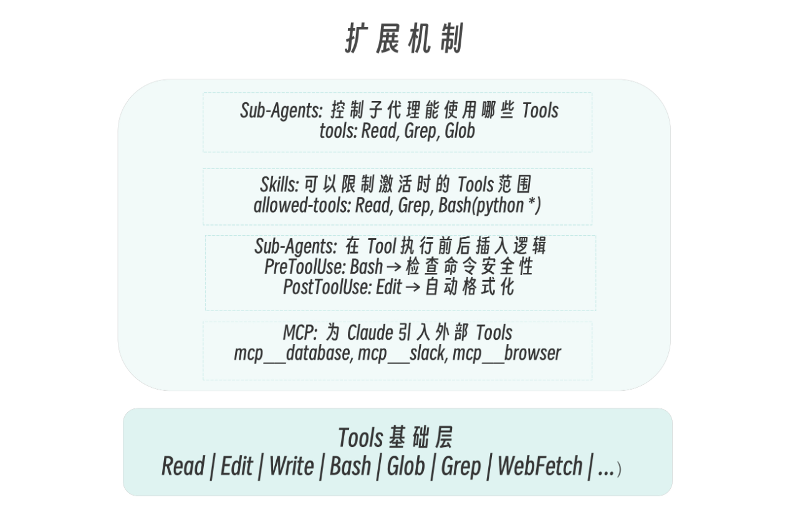


