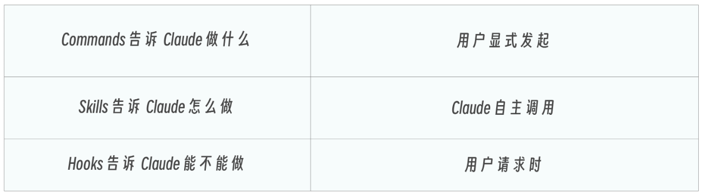
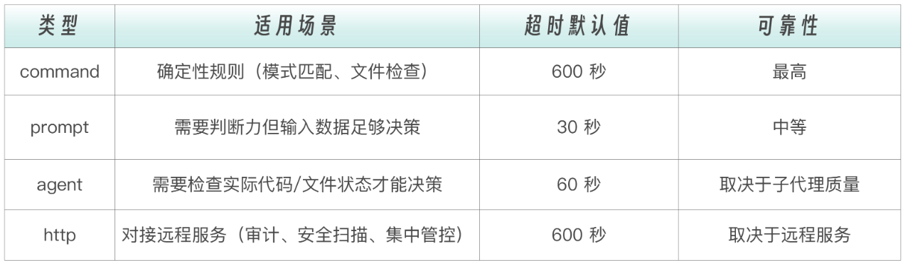

# Claude Code 核心机制与组件


## Hooks 事件驱动自动化

Hooks，是 Claude Code 三大扩展机制中唯一能**拦截和修改** Claude 行为的机制，也是工程化实践中安全防线的最后一道闸门


### Hooks 的本质——AI 时代的中间件

```yaml
请求 → 中间件1 → 中间件2 → 中间件3 → 处理函数
                    ↓
              认证、日志、限流
```

中间件在请求到达最终处理函数之前插入检查和处理，实现横切关注点（Cross-cutting Concerns）。这些逻辑不属于任何一个业务功能，但又必须贯穿所有请求。认证要每个接口都检查，日志要每个操作都记录，限流要每个入口都控制


Claude Code 的 Hooks 机制与此异曲同工，但它针对的不是 HTTP 请求，而是 **AI Agent 的工具调用**

```yaml
用户请求 → Claude 决策 → [PreToolUse Hook] → 工具执行 → [PostToolUse Hook] → 响应
                              ↓                            ↓
                         权限检查、拦截             格式化、验证、日志
```


**Hooks 是 AI 助手的中间件：拦截、监控、增强每一次交互**

中间件解决的核心问题是“业务代码不应该操心安全和日志”，Hooks 解决的核心问题也一样。**Claude 不应该操心格式化和权限检查，它只管写好代码就行**。安全防线、质量守卫、审计日志，交由 Hooks 在“幕后”自动完成


和 Commands 和 Skills 相比，**Hooks 是三者中唯一能拦截和修改 Claude 行为的机制**。这三者构成了一个完整的控制谱系：




### Hook 事件

Claude Code 支持差不多 30 种事件，涵盖：会话级、用户轮次级、工具调用级、 生命周期/异步/显示相关等四大类


按照能否阻止 claude 来划分，整个事件体系分为三大阵营：

- **控制点：能阻止的事件**（如：PreToolUse、UserPromptSubmit、Stop、SubagentStop 等）：可以通过它们改变 Claude 的执行路径，拦截危险操作、拒绝不合理的输入、强制 Claude 继续修复。它们是 Hooks 系统的肌肉。
- **接管点：替代默认行为的事件**（如：PermissionRequest）：它不是简单地阻止，而是接管了原本由用户手动处理的权限弹窗，脚本可以自动批准或拒绝权限请求，替代人类的决策。它是 Hooks 系统的自动驾驶。
- **观察点：不能阻止的事件**（如：SessionStart、PostToolUse、PostToolUseFailure、Notification 等）：只能在这些时刻做记录、做反馈、做后处理，但不能改变已经发生的事情。它们是 Hooks 系统的眼睛

工具执行前可以拦截，因为操作还没发生，拦截不会造成不一致状态。工具执行后不能拦截，因为操作已经完成。不能“取消”一个已经写入磁盘的文件。但可以观察它、记录它、反馈它


在实际中，最常用的就 3 个，基本涵盖了 80% 以上的自动化需求：

- PreToolUse（守门员）
- PostToolUse（质量守卫）
- Stop（质量门控）


### Hook 配置

Hooks 可以在多个位置配置，每个位置有不同的作用域和共享策略。**Hooks 可以直接定义在子代理的 frontmatter 中** ，只在该子代理执行期间生效。这比在全局 settings.json 中配置更精准


hook 的配置位置：

- **用户级** （`~/.claude/settings.json`：个人习惯。比如自己的日志格式、桌面通知方式。这些配置只影响你自己，不需要和团队同步
- **项目级** （`.claude/settings.json`：团队约定。比如代码格式化规则、敏感文件保护列表。这些配置应该提交到 git，让团队所有成员共享
- **本地覆盖** （`.claude/settings.local.json`：当需要在本地临时覆盖团队配置时使用，比如调试时关闭某个 Hook
- **子代理 frontmatter**：子代理专属的 Hook。比如 `db-reader` 的 SQL 注入检查。这个检查只和数据库操作相关，不应该影响其他场景


一个 hook 配置：

```json
{
  "hooks": {
    "PreToolUse": [
      {
        "matcher": "Bash",
        "hooks": [
          {
            "type": "command",
            "command": "./hooks/block-dangerous.sh"
          }
        ]
      }
    ],
    "PostToolUse": [
      {
        "matcher": "Write",
        "hooks": [
          {
            "type": "command",
            "command": "prettier --write $CLAUDE_FILE_PATH"
          }
        ]
      }
    ]
  }
}
```


基本结构为：三层嵌套

```yaml
hooks                            
├── PreToolUse                     ← 第一层：事件类型（什么时候触发）
│   └── [第一组规则]
│       ├── matcher: "Bash"      ← 第二层：匹配器（针对哪个工具）
│       └── hooks: [...]         ← 第三层：Hook 列表（执行什么）
│           └── type: "command"
│           └── command: "..."
└── PostToolUse
    └── [第二组规则]
        ├── matcher: "Write"
        └── hooks: [...]
```


**Matcher 匹配**用于指定 Hook 应用于哪些工具。支持四种匹配模式：

```yaml
# 精确匹配单个工具
"matcher": "Write"

# 匹配多个工具（用竖线分隔）
"matcher": "Edit|Write|MultiEdit"

# 匹配所有工具
"matcher": "*"

# 空匹配（用于生命周期事件）
"matcher": ""
```

精确匹配是最常用的模式。通常知道要保护的是哪个工具。竖线分隔适合“同类工具组”的场景，比如 `Edit|Write|MultiEdit` 都涉及文件修改，用同一个保护策略。通配符 `*` 要谨慎使用，它会匹配所有工具，适合审计日志这类无差别记录的场景


### Hook 执行类型

当一个 Hook 被触发后，其具体执行方式有四种，前三种能力和代价逐级递增，第四种面向远程服务场景


#### Command 类型：执行 Shell 脚本

这是最常用、最可靠的类型。`command`可以是任何 shell 命令或脚本路径

Command 类型的优势在于**确定性** ——同样的输入永远产生同样的输出，不存在 LLM 的随机性。一个正则表达式匹配 `rm -rf /`，要么匹配到，要么没匹配到，没有“可能”“大概”的中间地带

```json
{
  "type": "command",
  "command": "./hooks/check-security.sh",
  "timeout": 30000
}
```

`timeout` 指定超时时间（毫秒），默认 60 秒


#### Prompt 类型：LLM 评估

当规则无法用确定性脚本表达时，就需要 LLM 的判断力。Prompt 类型会用一个小型 LLM（通常是 Haiku）来评估当前情况。比如“这段代码是否有安全隐患”。这种判断需要理解代码语义，不是简单的模式匹配能解决的。但 Prompt 类型只能“看一眼就判断”，无法主动去读取更多文件来辅助决策

```json
{
  "type": "prompt",
  "prompt": "Evaluate if this task was completed correctly. Check for any errors or incomplete work."
}
```


#### Agent 类型：子代理评估

这是最强大也最“重”的评估方式。**Agent Hook 会启动一个子代理** ，这个子代理可以使用 Read、Grep、Glob 等工具来验证条件。不只是“看一眼就判断”，而是可以“翻代码确认”。比如验证“所有公共 API 都有文档注释”，需要子代理实际遍历代码文件才能做出准确判断

```json
{
  "type": "agent",
  "prompt": "Verify that all unit tests pass. Run the test suite and check the results. $ARGUMENTS",
  "timeout": 120
}
```


#### HTTP 类型：远程服务

不在本地执行逻辑，而是把事件数据以 POST 请求发送到远程 HTTP 端点，由远程服务返回决策结果。适合团队共享审计服务、集中式安全扫描等场景


#### 选择策略

四种类型的选择策略：**能用 command 的不用 prompt，能用 prompt 的不用 agent，需要对接远程服务时用 http** 。确定性规则永远比 LLM 判断更可靠，LLM 判断比子代理执行更快




### PreToolUse：工具执行前的守门员

PreToolUse 能**阻止**工具执行。PreToolUse Hook 可以做三件事：

- **允许** （allow，放行）
- **拒绝** （deny，拦截）
- **修改** （updatedInput，改写输入参数后再执行）

第三种能力特别有趣，不仅能“放行或拦截”，还能“偷偷改参数”。比如用户要执行 `rm -rf /tmp/test`，可以把它改成 `rm -rf /tmp/test --dry-run`，先看看会删什么再说


要写出有效的 PreToolUse Hook，需要理解它的通信协议。脚本从 stdin 读入什么数据、向 Claude 返回什么决策


每个 Hook 脚本通过 stdin 接收一个 JSON 对象，包含做出判断所需的全部上下文：

```json
{
  "session_id": "abc123",
  "transcript_path": "/path/to/transcript.jsonl",
  "cwd": "/project/root",
  "permission_mode": "default",
  "hook_event_name": "PreToolUse",
  "tool_name": "Bash",
  "tool_input": {
    "command": "rm -rf /tmp/test"
  }
}
```

这些字段清晰反映：**谁** 在执行（session_id），**在哪里** 执行（cwd），**什么权限** 模式（permission_mode），要执行**什么工具** （tool_name），**什么参数** （tool_input）。有了这些信息，脚本就能精准判断这个操作是否安全


Hook 脚本通过退出码和 stdout JSON 告诉 Claude 下一步做什么。`exit 0` 表示放行，`exit 2` 表示阻止，其他非零退出码表示脚本出错但不阻止

这个区分很重要：**脚本出错不应该阻止正常工作流**。安全检查脚本因为 `jq` 没安装而报错退出码 1，这不应该阻止 Claude 执行一个完全安全的命令。只有退出码 2 才表示“检查过了，这个操作确实危险”


需要更精细的控制时，通过 stdout 输出 JSON 决策。官方推荐的 `hookSpecificOutput` 格式支持四种响应方式：

- **允许执行**：检查通过，放行（`exit 0` 就等于默认允许，输出 JSON 让意图更明确）

  ```json
  {
    "hookSpecificOutput": {
      "hookEventName": "PreToolUse",
      "permissionDecision": "allow"
    }
  }
  ```

- **拒绝执行**：发现危险操作，直接拦截。`permissionDecisionReason` 会反馈给 Claude

  ```json
  {
    "hookSpecificOutput": {
      "hookEventName": "PreToolUse",
      "permissionDecision": "deny",
      "permissionDecisionReason": "This command is not allowed"
    }
  }
  ```

- **交给用户确认**：操作不是明确的“安全”或“危险”，而是“需要人类判断”

  ```json
  {
    "hookSpecificOutput": {
      "hookEventName": "PreToolUse",
      "permissionDecision": "ask",
      "permissionDecisionReason": "This command modifies production data"
    }
  }
  ```

- **修改输入后执行**：不拦截操作，而是改写参数后放行

  ```json
  {
    "hookSpecificOutput": {
      "hookEventName": "PreToolUse",
      "permissionDecision": "allow",
      "updatedInput": {
        "command": "rm -rf /tmp/test --dry-run"
      }
    }
  }
  ```


实际设计中，优先选择最温和的响应：**能 allow 的不 ask，能 ask 的不 deny** 


> 注意：updatedInput 的修改对 Cloude 是不透明的，Coude 以为自己执行了 `rm-f/tmp/test`，但实际执行的是加了`--dy-run` 的版本
>
> 
>
> 这意味着 Claude 对执行结果的理解是错的，后续决策可能基于错误认知（比如它以为文件已删除，实际上还在）。适合用在降级保护场景（如强制 dry-run、自动补全安全参数），不适合用在路径重写、输出重定向等会根本性改变操作语义的场景


### PreToolUse 实战


#### 案例一：阻止危险命令

每个工程团队都有一些“绝对不能执行”的命令：

- `rm -rf` 会删除整个文件系
- `git push --force origin main` 会覆盖远程主分支的历史
- `DROP DATABASE` 会销毁整个数据库

这些命令的共同特点是：**一旦执行就无法挽回**


下面通过一个脚本用模式匹配来拦截这些灾难性命令：

> 05-Hooks/01-pretooluse-hooks/hooks/block-dangerous.sh

```sh
#!/bin/bash
# block-dangerous.sh
# 阻止危险的 Bash 命令
#
# 检查命令是否匹配危险模式，如果匹配则阻止执行

export PATH="$HOME/bin:/usr/local/bin:$PATH"

set -e

# 读取 stdin 输入
INPUT=$(cat)

# 提取命令
COMMAND=$(echo "$INPUT" | jq -r '.tool_input.command // ""')

# 调试输出（到 stderr）
echo "DEBUG: Checking command: $COMMAND" >&2

# 危险命令模式
DANGEROUS_PATTERNS=(
    "rm -rf ./"
    "rm -rf ~"
    "rm -rf \$HOME"
    "rm -rf ./*"
    "> /dev/sd"
    "mkfs."
    "dd if="
    ":(){:|:&};:"
    "chmod -R 777 /"
    "chown -R"
    "git push --force origin main"
    "git push --force origin master"
    "git reset --hard origin"
    "DROP DATABASE"
    "DROP TABLE"
    "TRUNCATE"
    "curl.*| sh"
    "curl.*| bash"
    "wget.*| sh"
    "wget.*| bash"
)

# 检查每个危险模式
for pattern in "${DANGEROUS_PATTERNS[@]}"; do
    if [[ "$COMMAND" == *"$pattern"* ]]; then
        echo "BLOCKED: Command matches dangerous pattern: $pattern" >&2
        cat <<EOF
{
    "hookSpecificOutput": {
        "hookEventName": "PreToolUse",
        "permissionDecision": "deny",
        "permissionDecisionReason": "Blocked dangerous command pattern: $pattern. This command could cause irreversible damage."
    }
}
EOF
        exit 2
    fi
done

# 命令安全，允许执行
echo '{"decision": "allow"}'
exit 0

```

这个脚本的设计思路：

- `INPUT=$(cat)` 从 stdin 读取 Claude 传入的 JSON 数据
- `jq -r '.tool_input.command'` 从中提取要执行的命令字符串。`// ""` 是 jq 的空值保护，如果字段不存在，返回空字符串而不是报错
- `echo "DEBUG: ..." >&2` 这一行需要特别说明：**调试信息必须输出到 stderr（文件描述符 2），而不是 stdout**。因为 stdout 被 Claude 用来读取 JSON 决策——如果你往 stdout 打了一行调试文本，Claude 会因为 JSON 解析失败而报错。这是 Hook 脚本开发中最常见的坑
- `DANGEROUS_PATTERNS` 数组定义了所有需要拦截的命令模式
- 最后的`curl.*| sh` 和 `wget.*| bash`。这是一种常见的攻击手法：从网络下载脚本并直接执行，绕过任何安全审查

整个脚本的逻辑就是一个黑名单匹配，命中任何一个危险模式就拦截，否则放行


> 注意，要给这个脚本权限，否则没权限是不会执行的
>
> chmod +x ./hooks/block-dangerous.sh
>
> 
>
> 同时这个脚本使用了 jq，需要安装 jq


hook 配置方式如下：

```json
{
  "hooks": {
    "PreToolUse": [
      {
        "matcher": "Bash",
        "hooks": [
          {
            "type": "command",
            "command": "./hooks/block-dangerous.sh"
          }
        ]
      }
    ]
  }
}
```


> 有缺点，比如 claude code 执行 `rm -rf` 被拦截，但通过生成一段 python 代码执行删除，这属于被 claude 使用语义等价命令绕过了
>
> 
>
> 主要原因：permissionDecisionReason 返回的是 Blocked dangerous command pattern: rm -rf ./，这只是说明 rm -rf 命令是危险的，但是却没有改变“清理临时文件”这个目标，Claude Code 的默认行为是“被拒后调整方案”


#### 案例二：保护敏感文件

保护敏感文件（如`.env` 文件）不被 Claude 修改或读取，即使 Claude 出于好意想“帮你整理一下配置文件”，敏感文件也绝对不能被触碰

这种保护需要覆盖两个维度：**文件本身** （.env、credentials.json 等配置文件）和**密钥文件** （.pem、.key、id_rsa 等加密文件）。前者包含运行时密钥，后者包含身份认证凭据。两者泄露的后果都是灾难性的


> 05-Hooks/01-pretooluse-hooks/hooks/protect-files.sh

```sh
#!/bin/bash
# protect-files.sh
# 保护敏感文件不被修改
#
# 阻止对配置文件、密钥文件等敏感文件的写入操作

export PATH="$HOME/bin:/usr/local/bin:$PATH"
set -e

# 读取 stdin 输入
INPUT=$(cat)

# 提取文件路径
FILE_PATH=$(echo "$INPUT" | jq -r '.tool_input.file_path // ""')

# 如果没有文件路径，允许执行
if [ -z "$FILE_PATH" ]; then
    echo '{"decision": "allow"}'
    exit 0
fi

echo "DEBUG: Checking file: $FILE_PATH" >&2

# 获取文件名
FILENAME=$(basename "$FILE_PATH")

# 受保护的文件模式
PROTECTED_PATTERNS=(
    ".env"
    ".env.local"
    ".env.production"
    ".env.development"
    "credentials.json"
    "secrets.yaml"
    "secrets.json"
    "config.production.json"
    "id_rsa"
    "id_ed25519"
    "*.pem"
    "*.key"
    "*.p12"
    "*.pfx"
    ".git/config"
    ".gitconfig"
    "package-lock.json"
    "yarn.lock"
    "pnpm-lock.yaml"
)

# 受保护的目录
PROTECTED_DIRS=(
    ".git/"
    "node_modules/"
    ".ssh/"
)

# 检查受保护的目录
for dir in "${PROTECTED_DIRS[@]}"; do
    if [[ "$FILE_PATH" == *"$dir"* ]]; then
        cat <<EOF
{
    "hookSpecificOutput": {
        "hookEventName": "PreToolUse",
        "permissionDecision": "deny",
        "permissionDecisionReason": "Cannot modify files in protected directory: $dir"
    }
}
EOF
        exit 2
    fi
done

# 检查受保护的文件模式
for pattern in "${PROTECTED_PATTERNS[@]}"; do
    # 处理通配符模式
    if [[ "$pattern" == \** ]]; then
        # 通配符匹配（如 *.pem）
        extension="${pattern#\*}"
        if [[ "$FILENAME" == *"$extension" ]]; then
            cat <<EOF
{
    "hookSpecificOutput": {
        "hookEventName": "PreToolUse",
        "permissionDecision": "deny",
        "permissionDecisionReason": "Cannot modify protected file type: $pattern"
    }
}
EOF
            exit 2
        fi
    else
        # 精确匹配
        if [[ "$FILENAME" == "$pattern" ]]; then
            cat <<EOF
{
    "hookSpecificOutput": {
        "hookEventName": "PreToolUse",
        "permissionDecision": "deny",
        "permissionDecisionReason": "Cannot modify protected file: $pattern"
    }
}
EOF
            exit 2
        fi
    fi
done

# 文件不受保护，允许执行
echo '{"decision": "allow"}'
exit 0

```

结构和 `block-dangerous.sh` 很像，都是黑名单匹配。但注意一个细节：它检查的是 `tool_input.file_path` 而不是 `tool_input.command`

不同的工具传入不同的参数字段：Bash 工具传 `command`，Write 和 Edit 工具传 `file_path`


配置 hook 需要同时配置 `Write|Edit`

```json
{
  "hooks": {
    "PreToolUse": [
      {
        "matcher": "Write|Edit",
        "hooks": [
          {
            "type": "command",
            "command": "./hooks/protect-files.sh"
          }
        ]
      }
    ]
  }
}
```


### PostToolUse：工具执行后的质量守卫

PostToolUse 在工具**成功执行后** 运行。它不能阻止已经发生的操作（文件已经写入了，命令已经执行了）

但它可以做三件同样重要的事情：

- **后处理** （格式化、清理）
- **反馈** （向 Claude 提供 lint 结果、警告）
- **记录** （写入审计日志）


PostToolUse 接收的 JSON 比 PreToolUse 多一个关键字段——`tool_response`，即工具执行的结果


PostToolUse 最强大的能力在于通过 `additionalContext` 向 Claude 反馈信息

```json
{
  "hookSpecificOutput": {
    "hookEventName": "PostToolUse",
    "additionalContext": "ESLint found 3 errors in the file you just wrote."
  }
}
```

`additionalContext` 的内容会被注入到 Claude 的上下文中，Claude 会看到这条反馈并据此调整行为。比如告诉它“ESLint 发现了 3 个错误”，它就会主动去修复这些错误。**这不是简单的日志记录，而是一个闭环反馈机制——Hook 观察到问题，反馈给 Claude，Claude 自动修复**


### PostToolUse实战


#### 案例一：自动格式化

> 05-Hooks/02-posttooluse-hooks/hooks/auto-format.sh

```sh
#!/bin/bash
# auto-format.sh
# 自动格式化代码文件
#
# 作为 PostToolUse hook，在文件写入后自动运行格式化工具

export PATH="$HOME/bin:/usr/local/bin:$PATH"
set -e

# 读取 stdin 输入
INPUT=$(cat)

# 提取文件路径
FILE_PATH=$(echo "$INPUT" | jq -r '.tool_input.file_path // ""')

# 如果没有文件路径，跳过
if [ -z "$FILE_PATH" ] || [ ! -f "$FILE_PATH" ]; then
    echo '{}'
    exit 0
fi

echo "DEBUG: Formatting file: $FILE_PATH" >&2

# 获取文件扩展名
EXTENSION="${FILE_PATH##*.}"

# 根据文件类型选择格式化工具
case "$EXTENSION" in
    js|jsx|ts|tsx|json|md|css|scss|html)
        # 使用 Prettier
        if command -v npx &> /dev/null; then
            if npx prettier --write "$FILE_PATH" >&2; then
                echo '{"hookSpecificOutput": {"hookEventName": "PostToolUse", "additionalContext": "Formatted with Prettier"}}'
            else
                echo '{"hookSpecificOutput": {"hookEventName": "PostToolUse", "additionalContext": "Prettier formatting failed"}}'
            fi
        else
            echo '{"hookSpecificOutput": {"hookEventName": "PostToolUse", "additionalContext": "Prettier not available"}}'
        fi
        ;;
    py)
        # 使用 Black
        if command -v black &> /dev/null; then
            if black "$FILE_PATH" >&2; then
                echo '{"hookSpecificOutput": {"hookEventName": "PostToolUse", "additionalContext": "Formatted with Black"}}'
            else
                echo '{"hookSpecificOutput": {"hookEventName": "PostToolUse", "additionalContext": "Black formatting failed"}}'
            fi
        else
            echo '{"hookSpecificOutput": {"hookEventName": "PostToolUse", "additionalContext": "Black not available"}}'
        fi
        ;;
    go)
        # 使用 gofmt
        if command -v gofmt &> /dev/null; then
            if gofmt -w "$FILE_PATH" >&2; then
                echo '{"hookSpecificOutput": {"hookEventName": "PostToolUse", "additionalContext": "Formatted with gofmt"}}'
            else
                echo '{"hookSpecificOutput": {"hookEventName": "PostToolUse", "additionalContext": "gofmt formatting failed"}}'
            fi
        else
            echo '{"hookSpecificOutput": {"hookEventName": "PostToolUse", "additionalContext": "gofmt not available"}}'
        fi
        ;;
    rs)
        # 使用 rustfmt
        if command -v rustfmt &> /dev/null; then
            if rustfmt "$FILE_PATH" >&2; then
                echo '{"hookSpecificOutput": {"hookEventName": "PostToolUse", "additionalContext": "Formatted with rustfmt"}}'
            else
                echo '{"hookSpecificOutput": {"hookEventName": "PostToolUse", "additionalContext": "rustfmt formatting failed"}}'
            fi
        else
            echo '{"hookSpecificOutput": {"hookEventName": "PostToolUse", "additionalContext": "rustfmt not available"}}'
        fi
        ;;
    *)
        # 未知文件类型，跳过
        echo '{"hookSpecificOutput": {"hookEventName": "PostToolUse", "additionalContext": "No formatter configured for this file type"}}'
        ;;
esac

exit 0
```

这个脚本有几个值得注意的设计决策：

- **多语言策略**：通过文件扩展名自动选择格式化工具。JavaScript/TypeScript 用 Prettier，Python 用 Black，Go 用 gofmt，Rust 用 rustfmt。这意味着在一个多语言项目中，只需要一个 Hook 脚本就能覆盖所有文件类型
- **优雅降级**：每种工具的调用都先用 `command -v` 检查是否安装。如果 Prettier 没装，脚本不会报错崩溃，而是优雅地跳过并通过 `additionalContext` 告诉 Claude “Prettier not available”。这很重要：**Hook 的失败不应该阻碍正常工作流**
- **反馈闭环**：格式化完成后，通过 `additionalContext` 告诉 Claude 用了什么工具格式化的。这不仅是日志记录，还让 Claude 知道格式化已经发生，它不需要自己再做一次

这个 Hook 的优点是：**Claude 不需要知道项目用什么格式化工具**。无论是 Prettier、Black、gofmt 还是 rustfmt，只要本地安装了，就会自动应用。这就是中间件的力量：业务逻辑（Claude 写代码）和横切关注点（格式化）完全解耦


#### 案例二：自动 Lint 检查

一个完整的代码质量反馈循环：Claude 写代码 → 自动格式化 → 自动 Lint → 发现问题 → Claude 收到反馈 → Claude 修复


> 05-Hooks/02-posttooluse-hooks/hooks/lint-check.sh

```sh
#!/bin/bash
# lint-check.sh
# 检查代码质量并向 Claude 反馈
#
# 作为 PostToolUse hook，在文件写入后运行 linter

export PATH="$HOME/bin:/usr/local/bin:$PATH"

# 读取 stdin 输入
INPUT=$(cat)

# 提取文件路径
FILE_PATH=$(echo "$INPUT" | jq -r '.tool_input.file_path // ""')

# 如果没有文件路径，跳过
if [ -z "$FILE_PATH" ] || [ ! -f "$FILE_PATH" ]; then
    echo '{}'
    exit 0
fi

echo "DEBUG: Linting file: $FILE_PATH" >&2

# 获取文件扩展名
EXTENSION="${FILE_PATH##*.}"

# 存储 lint 结果
LINT_RESULT=""
LINT_PASSED=true

case "$EXTENSION" in
    js|jsx|ts|tsx)
        # 使用 ESLint
        if command -v npx &> /dev/null; then
            LINT_RESULT=$(npx eslint "$FILE_PATH" 2>&1) || LINT_PASSED=false
        fi
        ;;
    py)
        # 使用 flake8 或 pylint
        if command -v flake8 &> /dev/null; then
            LINT_RESULT=$(flake8 "$FILE_PATH" 2>&1) || LINT_PASSED=false
        elif command -v pylint &> /dev/null; then
            LINT_RESULT=$(pylint "$FILE_PATH" 2>&1) || LINT_PASSED=false
        fi
        ;;
    go)
        # 使用 golint 或 go vet
        if command -v golint &> /dev/null; then
            LINT_RESULT=$(golint "$FILE_PATH" 2>&1) || LINT_PASSED=false
        elif command -v go &> /dev/null; then
            LINT_RESULT=$(go vet "$FILE_PATH" 2>&1) || LINT_PASSED=false
        fi
        ;;
    *)
        # 未知文件类型，跳过
        echo '{}'
        exit 0
        ;;
esac

# 转义 JSON 特殊字符
LINT_RESULT_ESCAPED=$(echo "$LINT_RESULT" | jq -Rs '.')

if [ "$LINT_PASSED" = true ]; then
    # Lint 通过
    cat <<EOF
{
    "hookSpecificOutput": {
        "hookEventName": "PostToolUse",
        "additionalContext": "Lint check passed"
    }
}
EOF
else
    # Lint 失败，提供反馈让 Claude 修复
    cat <<EOF
{
    "hookSpecificOutput": {
        "hookEventName": "PostToolUse",
        "additionalContext": $LINT_RESULT_ESCAPED
    }
}
EOF
fi

exit 0
```

- `|| true`：ESLint 发现错误时会返回非零退出码，但一般不希望脚本因此中断（`set -e` 会让脚本在任何非零退出码时终止）。`|| true` 确保 ESLint 的退出码被捕获但不会触发脚本退出
- `head -30` 限制了反馈的长度。ESLint 的输出可能非常长，但我们只需要把前 30 行（通常包含了最关键的错误信息）反馈给 Claude 就够了


#### 案例三：审计日志

对于一些合规性要求高的场景，可能需要记录 Claude 的所有操作。**不是为了阻止什么，而是为了事后追溯**。谁在什么时间修改了什么文件？执行了什么命令？这些信息在安全事件调查和合规审计中至关重要


> 05-Hooks/02-posttooluse-hooks/hooks/audit-log.sh

```sh
#!/bin/bash
# audit-log.sh
# 记录所有工具调用到审计日志
#
# 作为 PostToolUse hook，记录每次工具调用的详细信息

export PATH="$HOME/bin:/usr/local/bin:$PATH"

# 读取 stdin 输入
INPUT=$(cat)

# 确定日志目录
if [ -n "$CLAUDE_PROJECT_DIR" ]; then
    LOG_DIR="$CLAUDE_PROJECT_DIR/.claude/logs"
else
    LOG_DIR="./.claude/logs"
fi

# 创建日志目录
mkdir -p "$LOG_DIR"

# 日志文件（按日期分割）
LOG_FILE="$LOG_DIR/audit-$(date +%Y-%m-%d).log"

# 提取关键信息
TIMESTAMP=$(date -Iseconds)
TOOL_NAME=$(echo "$INPUT" | jq -r '.tool_name // "unknown"')
SESSION_ID=$(echo "$INPUT" | jq -r '.session_id // "unknown"')

# 提取工具输入（简化版本）
TOOL_INPUT=$(echo "$INPUT" | jq -c '.tool_input // {}')

# 提取工具响应状态
TOOL_SUCCESS=$(echo "$INPUT" | jq -r '.tool_response.success // true')

# 写入日志
cat >> "$LOG_FILE" << EOF
================================================================================
Timestamp: $TIMESTAMP
Session: $SESSION_ID
Tool: $TOOL_NAME
Success: $TOOL_SUCCESS
Input: $TOOL_INPUT
================================================================================

EOF

# 输出空 JSON（不阻止后续操作）
echo '{}'
```


审计日志的价值不在当下，而在未来。当某天需要回答“上周三 Claude 到底改了什么导致了这个 bug”时，审计日志就是时光机


### 总结

Claude Code 支持差不多 30 种 Hook 事件，但是主要常用的是三个：

- PreToolUse（守门员）
- PostToolUse（质量守卫）
- Stop（质量门控）


四种 Hook 类型：

- `command`：确定性规则，最可靠。能用脚本解决的问题不要用 LLM
- `prompt`：单次 LLM 评估，需要判断力时使用。快但不能查代码
- `agent`：多轮验证，需要翻代码才能决策时使用。最强也最慢
- `http`：POST 事件数据到 HTTP 端点，适合对接外部服务（审计、通知、集中管控）


注意点：

- Hook 脚本需要给权限，否则没权限是不会执行的

- Hook 容易被 claude 使用语义等价命令绕过了

  主要原因：permissionDecisionReason 返回的是 Blocked dangerous command pattern: rm -rf ./，这只是说明 rm -rf 命令是危险的，但是却没有改变“清理临时文件”这个目标，Claude Code 的默认行为是“被拒后调整方案”

  解决：使用的时候，明确就是要使用 Bash 命令。或者 permissionDecisionReason 强制返回不能清理


