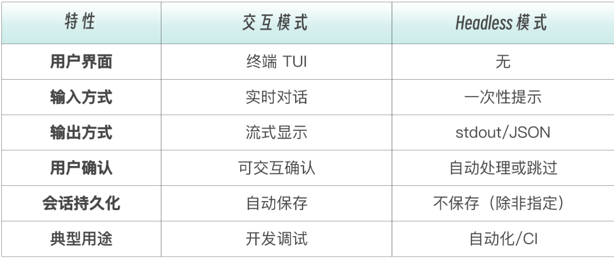
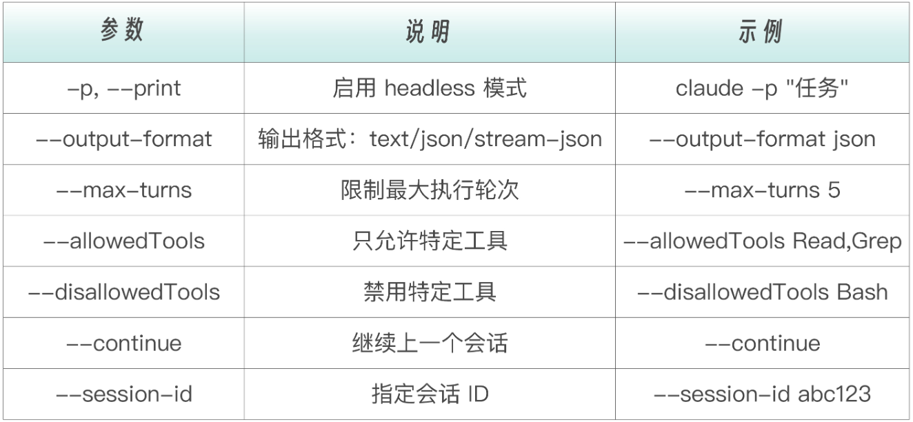
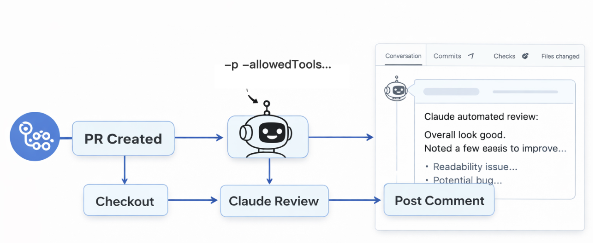
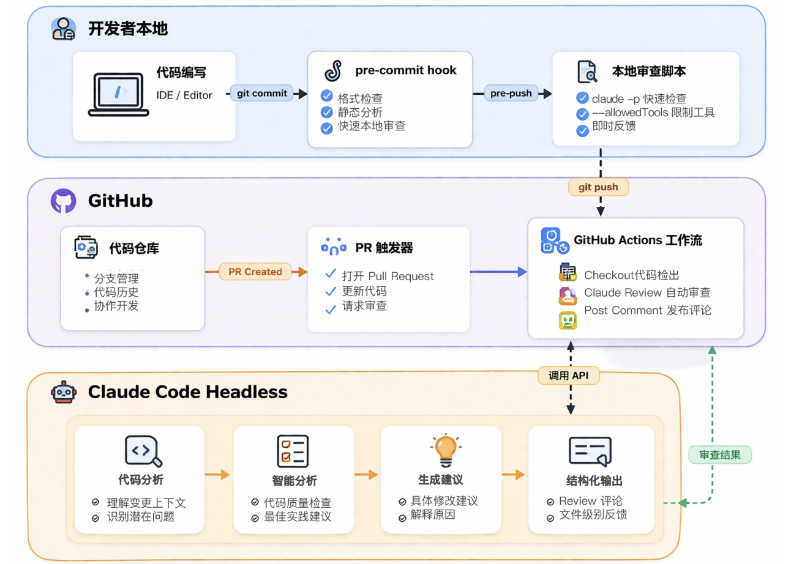
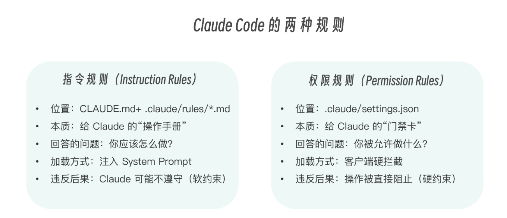
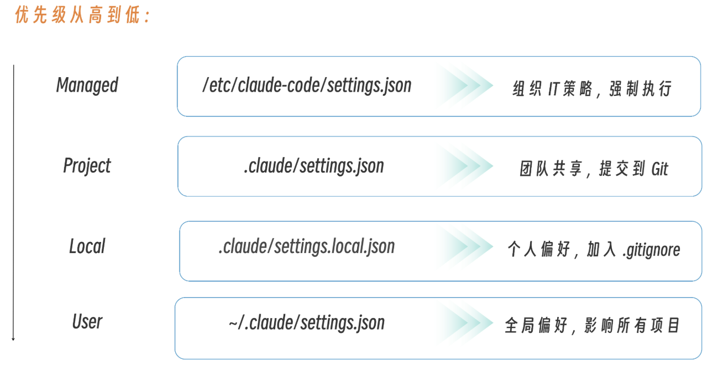
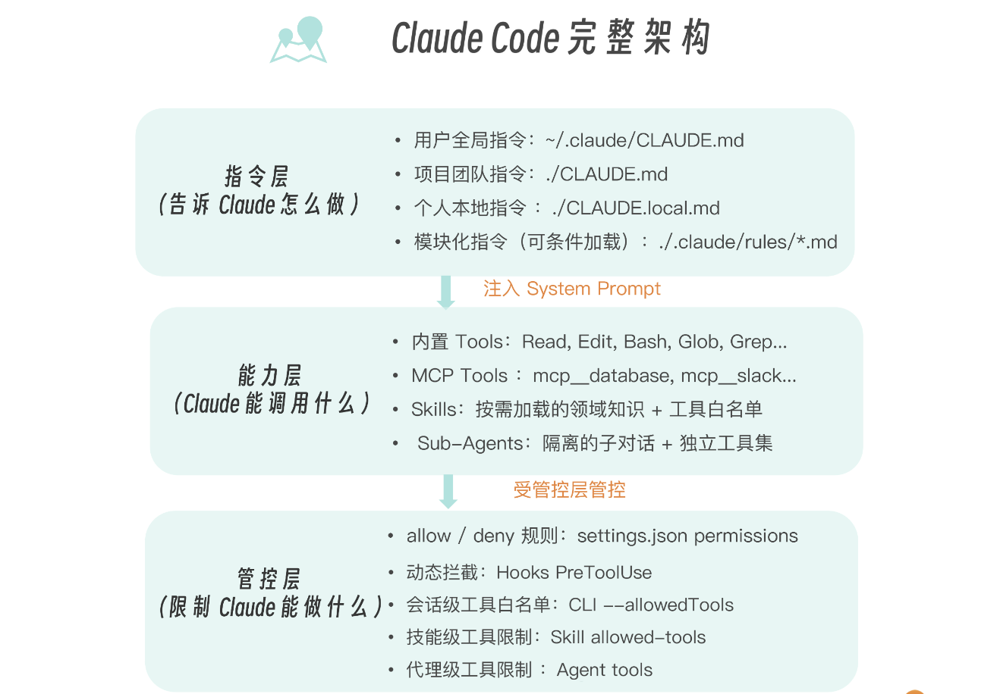
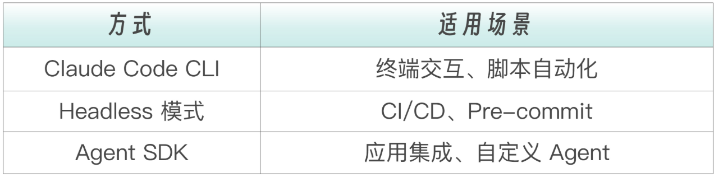
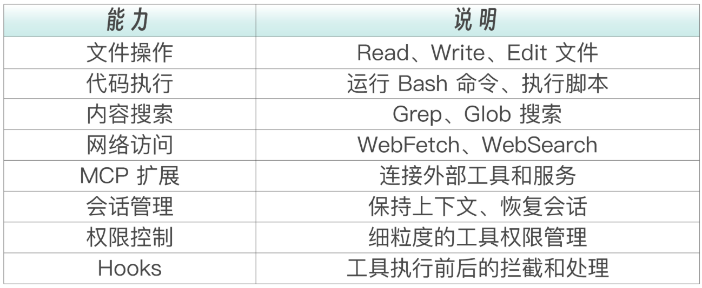
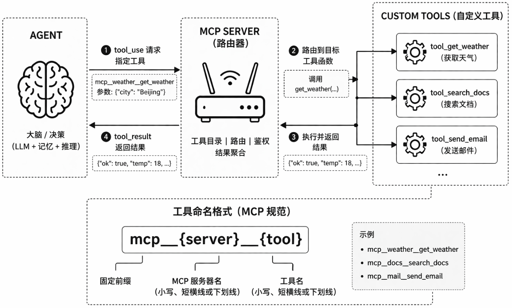

# Claude Code 工程化


## Headless 模式与 CI/CD 集成

要让 Claude Code 在完全没有人工干预的情况下自动运行。在 CI/CD 流水线中审查代码，在 pre-commit hook 里检查提交，在定时任务中生成报告。这就是 Headless 模式的核心：**从“有人值守”到“无人值守”**


Headless 模式的价值：让 Claude Code 在**没有人工干预的情况下自动工作**。它并不是取代人类审查者，而是在人类不在线的时候先行一步，把基础工作做好。

举例：每当 PR 创建或更新时，Claude Code 会自动进行初步审查：检查代码风格、潜在 Bug、安全问题。这样当审查员打开 PR 时，就可以直接从 AI 的审查报告出发，聚焦于需要人类判断力的高层问题：架构合理性、业务逻辑正确性、团队规范一致性；而不是把时间花在检查缩进和命名规范上


### Headless 模式核心机制

Headless 这个词来自“无头浏览器”（Headless Browser）的概念：没有图形界面，但功能完整。同样，Headless 模式下的 Claude Code 没有交互式终端界面，但拥有和交互模式完全相同的代码分析能力、工具调用能力和推理能力。唯一的区别是：输入变成了一次性的 prompt，输出变成了 stdout 上的文本或 JSON，不再有来回对话


启用 Headless 模式的关键是 `-p`（或 `--print`）标志。print，意思是“把结果打印出来就行，不要打开交互界面”。`-p` 不只改变了输出方式，更重要的是它改变了 Claude Code 的整个运行模型，从**“持续对话”变成了“单次执行”** 

```bash
# 基本 headless 执行
claude -p "解释这段代码是做什么的"

# 从 stdin 读取输入
cat code.py | claude -p "分析这段代码"

# 结合文件内容
claude -p "找出这个文件中的 Bug" < buggy.js
```

`-p` 告诉 Claude Code：不要打开交互界面，直接执行任务，把结果输出到 stdout，然后退出。这种“执行即退出”的模式，正是脚本和流水线所需要的，它们不需要等待用户输入，只需要一个确定性的输入--输出流程


交互模式与Headless模式的区别：




Headless 模式提供了一组命令行参数来精细控制执行行为。这些参数是在自动化脚本和 CI 配置中最常用的控制手段：



特别值得注意的是 `--allowedTools` 和 `--max-turns` 这两个参数，它们是安全防护的第一道防线，能有效限制 Claude 在无人监管环境中的行为边界

> 在 CI/CD 环境中，建议总是同时设置--allowedTools 和 --max-turns.


### 输出格式与管道集成

Headless 模式支持三种输出格式，适用于不同的自动化场景。选择哪种格式，取决于下游消费者是谁：是人类读者、是程序解析器、还是实时监控系统


#### Text 格式

Text 是默认格式，也是最简单的格式。适用场景为日志记录、简单脚本、人工审查。它直接输出 Claude 的回复文本，没有任何元数据包装。如果只是想在终端里看结果，或者将结果写入日志文件，Text 格式就够了

```bash
claude -p "生成一个 Python hello world 函数" --output-format text


输出：

Here's a simple hello world function:

def hello_world():
    print("Hello, World!")
```


#### JSON 格式

当需要在程序中解析 Claude 的输出时，JSON 格式是更好的选择。它不仅包含回复文本本身，还包含执行的元数据：耗时多久、花了多少钱、用了多少 tokens

这些元数据对于成本监控和性能调优至关重要。在生产环境的 CI/CD 流水线中，几乎总是使用 JSON 格式，因为它能够**用程序化的方式验证执行结果、追踪成本、检测异常**

```bash
claude -p "列出当前目录文件" --output-format json


输出：

{
  "type": "result",
  "subtype": "success",
  "session_id": "abc123",
  "is_error": false,
  "duration_ms": 1500,
  "duration_api_ms": 1200,
  "num_turns": 1,
  "total_cost_usd": 0.005,
  "usage": {
    "input_tokens": 150,
    "output_tokens": 200
  },
  "result": "文件列表：\n- file1.py\n- file2.js\n..."
}
```


在 js 脚本中调用 Claude Code 并提取结构化结果：

```javascript
const { spawnSync } = require("node:child_process");

const result = spawnSync(
	"claude",
	["-p", "列出当前目录文件", "--output-format", "json"], {
		encoding: "utf8",
	}
);

if (result.error) {
	throw result.error;
}

if (result.status !== 0) {
	throw new Error(
		`Claude 执行失败，退出码 ${result.status}：\n${result.stderr}`
	);
}

const data = JSON.parse(result.stdout);

console.log(`结果: ${data.result}`);
console.log(`耗时: ${data.duration_ms}ms`);
console.log(`费用: $${data.total_cost_usd}`);
```


#### Stream-JSON 格式

Stream-JSON 格式以 JSONL（每行一个 JSON 对象）的方式实时输出执行过程中的每个事件：Claude 的每段回复、每次工具调用、每个工具返回结果

对于长时间运行的任务，一般不想等到执行完成才看到输出，因此这种格式适用于实时进度显示、长时间任务监控、流式处理

比如在 CI 日志中实时展示 Claude 正在做什么

```bash
claude -p "分析代码" --output-format stream-json


输出里（每行一个事件）：

{"type":"assistant","message":{"role":"assistant","content":[{"type":"text","text":"正在分析..."}]}}
{"type":"tool_use","tool":"Read","input":{"file_path":"/path/to/file"}}
{"type":"tool_result","tool":"Read","result":"file content..."}
{"type":"assistant","message":{"role":"assistant","content":[{"type":"text","text":"分析完成。"}]}}
{"type":"result","session_id":"abc123","is_error":false,"result":"最终结果"}
```


Bash 脚本逐行读取 Stream JSON 输出，并根据事件类型做出不同响应

```sh
claude -p "分析代码" --output-format stream-json | while IFS= read -r line; do
  type=$(echo "$line" | jq -r '.type')
  if [ "$type" = "result" ]; then
    echo "最终结果: $(echo "$line" | jq -r '.result')"
  elif [ "$type" = "tool_use" ]; then
    echo "正在使用工具: $(echo "$line" | jq -r '.tool')"
  fi
done
```


#### Unix 管道集成

Claude Code 的一个独特优势是可以**无缝融入 Unix 管道**，成为工具链中的一环，通过标准输入输出与其他命令行工具互联互通

管道的核心思想是：前一个命令的输出，成为后一个命令的输入，如 `cat foo.txt | claude -p "query"`）

当 Claude Code 站在管道中间时，它接收上游数据，用 AI 理解和处理这些数据，然后把结果传给下游。这意味着你可以把 Claude 插入到任何现有的 Shell 工作流中，而不需要改变工作流的结构

```bash
# 分析日志文件
cat server.log | claude -p "找出所有错误并总结原因"

# 解析 JSON
curl https://api.example.com/data | claude -p "提取所有用户的邮箱地址"
```


管道的真正威力在于**组合**

```bash
# 结合 find 和 xargs 批量处理
find src -name "*.py" | xargs -I {} claude -p "检查 {} 中的类型提示是否完整"

# 结合 git 工作流
git diff HEAD~1 | claude -p "总结这次提交的变更"

# 结合 grep 预过滤
grep -r "TODO" src/ | claude -p "将这些 TODO 转换为 GitHub Issue 格式"
```


Claude 不仅可以接收管道输入，输出同样可以**通过管道流向下游**。这样就能构建完整的自动化链路：数据获取 -> AI 分析 -> 结果处理 -> 通知或存储

```bash
# Claude 输出 -> jq 解析 -> 下游处理
claude -p "列出所有函数名" --output-format json | jq -r '.result' | sort | uniq

# Claude 生成代码 -> 直接写入文件
claude -p "生成一个 Express 路由处理函数" --output-format text > routes/user.js

# Claude 分析 -> 发送通知
claude -p "检查是否有安全漏洞" --output-format json | \
  jq -r '.result' | \
  mail -s "安全扫描报告" security@company.com
```


#### 批量处理模式

当需要对大量文件执行相同的 AI 分析任务时，就需要用到批量处理模式

Claude Code 的批处理（headless 模式）允许直接从命令行执行 AI 功能，无需使用交互式 UI。通过集成到 CI/CD 流水线和自动化脚本中，可以高效执行大规模处理任务


示例：批量代码审查脚本。遍历 `src` 目录下的所有 TypeScript 文件，对每个文件运行 Claude 审查，并将结果保存到独立的报告文件中

```bash
#!/bin/bash
# batch-review.sh - 批量代码审查

RESULTS_DIR="review-results"
mkdir -p "$RESULTS_DIR"

# 遍历所有源文件
find src -name "*.ts" | while IFS= read -r file; do
  echo "Reviewing: $file"

  OUTPUT_FILE="$RESULTS_DIR/$(basename "$file").review.md"

  claude -p "Review $file for bugs and best practices. Be concise." \
    --output-format text \
    --max-turns 3 \
    --allowedTools Read > "$OUTPUT_FILE"

  echo "  -> $OUTPUT_FILE"
done

echo "Reviews complete. Results in $RESULTS_DIR/"
```


### GitHub Actions 集成

GitHub Actions 是 Headless 模式最常见的应用场景。Claude Code 与 GitHub Actions 的集成，让“AI驱动的代码审查”不再停留于概念，而是几行YAML配置就能实现




#### 集成方式

Anthropic 提供了[官方 GitHub Action](https://github.com/anthropics/claude-code-action)，让集成变得极其简单。相比于手动安装 Claude Code 然后编写 Shell 命令调用，官方 Action 封装了安装、认证、权限管理等底层细节，只需要提供 API Key 和 prompt 就能开始使用


官方 Action 支持两种模式，对应不同的使用场景：

- **Tag Mode** 适合开发者主动请求帮助的场景。在 PR 评论中 @claude，就会响应
- **Agent Mode** 适合完全自动化的场景。每次 PR 创建时自动触发，不需要人工干预


**Tag Mode 示例**：

在 PR 评论中输入 `@claude 帮我审查这段代码`，Claude 会自动响应并提供审查意见


**Agent Mode 示例**：

```yaml
- uses: anthropics/claude-code-action@v1
  with:
    anthropic_api_key: ${{ secrets.ANTHROPIC_API_KEY }}
    prompt: "审查这个 PR 的所有变更，检查安全漏洞"
```


最简单的设置方式是在 Claude Code 终端中运行 `/install-github-app`，它会引导完成整个配置过程，包括创建 GitHub App、配置 Webhook、设置权限等


手动配置定制化的工作流：

1. 第一步是在 GitHub 仓库的 Settings -> Secrets -> Actions 中添加 `ANTHROPIC_API_KEY`。这是唯一需要的密钥

2. 第二步是创建工作流文件，定义触发条件和执行步骤。创建 `.github/workflows/claude.yml`：

   ```yaml
   name: Claude Code
   
   on:
     issue_comment:
       types: [created]
     pull_request_review_comment:
       types: [created]
   
   jobs:
     claude:
       runs-on: ubuntu-latest
       # 只在 @claude 提及时触发
       if: contains(github.event.comment.body, '@claude')
   
       permissions:
         contents: read
         pull-requests: write
         issues: write
   
       steps:
         - uses: actions/checkout@v4
   
         - uses: anthropics/claude-code-action@v1
           with:
             anthropic_api_key: ${{ secrets.ANTHROPIC_API_KEY }}
   ```

这份配置只有二十几行，但实现了一个完整的 AI 审查工作流：

- 监听 PR 和 Issue 中的评论，在检测到 @claude 提及时触发，检出代码，然后让 Claude 分析并回复
- `permissions` 部分遵循最小权限原则：`contents: read` 只允许读取代码，`pull-requests: write` 和 `issues: write` 允许发表评论


#### 自动化 PR 审查

自动化 PR 审查是最常见的用例：每次 PR 创建或更新时自动审查。这个工作流稍微复杂，因为它需要获取变更文件列表、构建审查 prompt、运行 Claude、然后将结果发布为 PR 评论

```yaml
name: Claude PR Review

on:
  pull_request:
    types: [opened, synchronize, reopened]

# 取消正在运行的重复工作流
concurrency:
  group: ${{ github.workflow }}-${{ github.event.pull_request.number }}
  cancel-in-progress: true

jobs:
  review:
    runs-on: ubuntu-latest

    permissions:
      contents: read
      pull-requests: write

    steps:
      - name: Checkout code
        uses: actions/checkout@v4
        with:
          fetch-depth: 0  # 需要完整历史以获取 diff

      - name: Setup Node.js
        uses: actions/setup-node@v4
        with:
          node-version: "20"

      - name: Install Claude Code
        run: npm install -g @anthropic-ai/claude-code

      - name: Get changed files
        id: changed
        run: |
          FILES=$(git diff --name-only origin/${{ github.base_ref }}...HEAD)
          echo "files=$(echo "$FILES" | tr '\n' ' ')" >> $GITHUB_OUTPUT

      - name: Run Claude Review
        env:
          ANTHROPIC_API_KEY: ${{ secrets.ANTHROPIC_API_KEY }}
        run: |
          claude -p "Review this PR for code quality, bugs, security issues.

          Changed files: ${{ steps.changed.outputs.files }}

          Provide specific, actionable feedback with file:line references." \
            --output-format json \
            --max-turns 10 \
            --allowedTools Read,Grep,Glob > review.json

      - name: Post Review Comment
        uses: actions/github-script@v7
        with:
          script: |
            const fs = require('fs');
            const review = JSON.parse(fs.readFileSync('review.json', 'utf8'));

            const comment = `## Claude Code Review\n\n${review.result}\n\n---\n*Automated review by Claude Code*`;

            await github.rest.issues.createComment({
              issue_number: context.issue.number,
              owner: context.repo.owner,
              repo: context.repo.repo,
              body: comment
            });
```

- `fetch-depth: 0` 确保 checkout 时拉取完整的 git 历史，这样才能正确计算 diff。

- `concurrency` 配置确保同一个 PR 上不会同时运行多个审查，当开发者快速连续推送多个 commit 时，旧的审查会被取消，只保留最新的

- `--allowedTools Read,Grep,Glob` 限制 Claude 只能使用只读工具，确保审查过程不会意外修改任何文件

- `secrets.ANTHROPIC_API_KEY` 这个变量是在 github 仓库中配置，配置路径：

  ```
  github 仓库 → Settings → Secrets and variables → Actions → Secrets
  ```

  同时，可以配置变量 variables，路径：

  ```
  github 仓库 → Settings → Secrets and variables → Actions → Variables
  ```


#### 自动修复 Lint 错误

除了只读审查，Headless 模式还可以用于自动修复

```yaml
name: Auto Fix Lint Errors

on:
  push:
    branches: [main, develop]

jobs:
  fix:
    runs-on: ubuntu-latest
    permissions:
      contents: write

    steps:
      - uses: actions/checkout@v4

      - name: Setup
        run: |
          npm ci
          npm install -g @anthropic-ai/claude-code

      - name: Run lint
        id: lint
        continue-on-error: true
        run: npm run lint 2>&1 | tee lint-output.txt

      - name: Fix with Claude
        if: steps.lint.outcome == 'failure'
        env:
          ANTHROPIC_API_KEY: ${{ secrets.ANTHROPIC_API_KEY }}
        run: |
          claude -p "Fix the lint errors in lint-output.txt. Make minimal changes." \
            --max-turns 20

      - name: Commit fixes
        run: |
          git config user.name "Claude Bot"
          git config user.email "claude@bot.local"
          git add -A
          git diff --staged --quiet || git commit -m "fix: auto-fix lint errors"
          git push
```

> 当 lint 检查失败时，让 Claude 自动修复错误并提交。这种模式适合风格类的 lint 规则（缩进、分号、import 排序等），对于逻辑类的 lint 规则则需要更谨慎
>
> 
>
> 自动修复 lint 错误听起来很美好，但要谨慎使用。对于纯格式问题（如 Prettier 规则），可以让 Cloude 自动修复并推送；对于可能影响语义的规则（如n0- unused-Vars、no-implicit-ony），让Cloude修复，但不要自动推送，而是创建一个新的 PR 供人类审查。


### Pre-commit Hook 集成

Pre-commit Hook 是另一个常见的 Headless 应用场景。与 CI/CD 流水线不同，Pre-commit Hook 运行在开发者的本地机器上，在代码提交之前进行检查。它的优势是即时反馈：不需要等到代码推送到远端才知道有问题，在 `git commit` 的那一刻就能得到 AI 的审查意见


#### 基本 Pre-commit Hook

下面这个 Hook 脚本在每次 `git commit` 时自动运行：获取暂存区的文件列表，让 Claude 快速检查有没有明显问题。如果 Claude 回复“OK”，提交正常进行；如果发现问题，提交会被阻止，并显示问题列表


创建一个 git hook，比如：

```bash
cd .git/hooks

touch pre-commit


# 最后设置权限：（不设置权限，git 会忽略）
chmod +x .git/hooks/pre-commit
```


但是更推荐使用 husky 进行管理，因为手动创建的 hooks 存在 `.git` 目录中，**不会被版本控制**。Husky 等工具解决了这个问题

```bash
npm install husky -D
npx husky init
```


> .husky/pre-commit

```sh
#!/bin/bash
# Pre-commit hook: Claude Code 快速审查

# 获取暂存的文件
STAGED_FILES=$(git diff --cached --name-only --diff-filter=ACM)

if [ -z "$STAGED_FILES" ]; then
  exit 0
fi

echo "Running Claude Code review on staged files..."

# 运行审查（只读工具，快速模式）
RESULT=$(claude -p "Quick review these staged files for obvious issues:
$STAGED_FILES

Focus on: syntax errors, security issues, obvious bugs.
Reply with 'OK' if no issues, or list the problems." \
  --output-format text \
  --max-turns 3 \
  --allowedTools Read,Grep)

# 检查结果
if echo "$RESULT" | grep -qi "OK"; then
  echo "Claude review passed"
  exit 0
else
  echo "Claude found issues:"
  echo "$RESULT"
  echo ""
  echo "Commit blocked. Fix the issues or use --no-verify to skip."
  exit 1
fi
```


#### 自动生成 Commit Message

另一个实用的 Hook 是自动生成 commit message。在写 commit message 时都很头疼，要么写得太笼统（ix bug），要么干脆放弃思考（update）。这个 Hook 可以利用 Claude 分析 diff 内容，自动生成符合 Conventional Commits 规范的 commit message


> .husky/prepare-commit-msg

```sh
#!/bin/bash
# 自动生成 commit message

# 如果用户通过 -m 提供了 commit message，跳过
# $2 表示 commit message 的来源：message(-m)、template、merge、squash
if [ -n "$2" ]; then
  exit 0
fi

# 获取 diff
DIFF=$(git diff --cached)

if [ -z "$DIFF" ]; then
  exit 0
fi

# 生成 commit message
MESSAGE=$(
  claude -p "Generate a concise commit message for these changes:

$DIFF

Format: <type>: <description>
Types: feat, fix, docs, style, refactor, test, chore
Reply with ONLY the commit message, nothing else." \
    --output-format text \
    --max-turns 1
)

# 将生成的 message 写入文件开头，保留 Git 的注释模板
TEMP_FILE=$(mktemp)
echo "$MESSAGE" > "$TEMP_FILE"
echo "" >> "$TEMP_FILE"
cat "$1" >> "$TEMP_FILE"
mv "$TEMP_FILE" "$1"
```


### 实战：完整的 CI/CD 审查系统

主要涵盖从本地开发到远程 CI 的完整链路：




> 具体实现：07-Headless/04-headless-workflow

```yaml
headless-workflow/
├── .github/
│   └── workflows/
│       └── claude-review.yml    # GitHub Action 配置
├── scripts/
│   └── review.sh                # 本地审查脚本
├── .husky/
│   └── pre-commit               # Pre-commit Hook
└── CLAUDE.md                    # Claude 记忆文件
```

- `.github/workflows/` 下是 GitHub Actions 配置
- `scripts/` 下是本地审查脚本
- `.husky/` 下是 pre-commit hook
- `CLAUDE.md` 则为所有环节提供统一的审查规范


### 安全与成本控制

在 CI/CD 中运行 Claude Code 时应该限制权限。**最小权限原则** 的核心思想是：

- 只给 Claude 完成任务所需的最少权限，不多给一分
- 对于只读审查任务，只允许 Read、Grep、Glob 三个工具就够了
- 如果不需要执行任意命令，明确禁用 Bash 工具
- 对于简单任务，限制执行轮次以防止无限循环

```bash
# 只读操作
claude -p "分析代码" --allowedTools Read,Grep,Glob

# 禁用危险工具
claude -p "任务" --disallowedTools Bash

# 限制执行轮次
claude -p "快速任务" --max-turns 3
```


API Key 是访问 Claude 服务的凭证，泄露它意味着别人可以用你的账号消耗 API 额度。在 CI/CD 配置中，**永远不要硬编码 API Key** ，而是使用平台提供的 Secrets 管理机制

```sh
# 不要这样做
env:
  ANTHROPIC_API_KEY: "sk-ant-xxx"  # 硬编码

# 正确做法
env:
  ANTHROPIC_API_KEY: ${{ secrets.ANTHROPIC_API_KEY }}
```


每次 CI 运行都会消耗 API tokens，而 tokens 意味烧钱。在高频迭代的项目中，如果每次推送都触发完整的 AI 审查，成本可能会快速累积。通过合理的触发条件和并发控制，可以在保持审查覆盖率的同时有效控制成本

```yaml
# 只在特定条件下运行
on:
  pull_request:
    types: [opened]  # 不包括 synchronize，减少运行次数
    paths:
      - 'src/**'     # 只在 src 目录变更时运行

# 限制并发
concurrency:
  group: claude-${{ github.event.pull_request.number }}
  cancel-in-progress: true
```


### 其它 CI 平台集成

虽然 GitHub Actions 有官方支持，但 Headless 模式可以在任何 CI 平台上工作。因为 Headless 模式的本质就是命令行调用。只要平台能运行 `npm install` 和 `claude -p`，就能集成


**GitLab CI：** GitLab CI 使用 `.gitlab-ci.yml` 配置文件，语法与 GitHub Actions 的 YAML 不同但概念相似。注意变量引用方式的差异：GitLab 使用 `$VARIABLE_NAME`，而不是 GitHub 的 `${{ secrets.VARIABLE_NAME }}`

```yaml
claude-review:
  image: node:20
  script:
    - npm install -g @anthropic-ai/claude-code
    - claude -p "Review the changes in this MR" --output-format text
  variables:
    ANTHROPIC_API_KEY: $ANTHROPIC_API_KEY
  only:
    - merge_requests
```


**Jenkins：** Jenkins 使用 Groovy DSL 定义 Pipeline，风格与上面两个 YAML 驱动的系统截然不同。但核心逻辑是一样的，安装 Claude Code，设置环境变量，运行 headless 命令

```
pipeline {
    agent any
    environment {
        ANTHROPIC_API_KEY = credentials('anthropic-api-key')
    }
    stages {
        stage('Review') {
            steps {
                sh 'npm install -g @anthropic-ai/claude-code'
                sh 'claude -p "Review this code" --output-format text'
            }
        }
    }
}
```


### 总结

Headless 模式的核心是 `-p` 标志。它告诉 Claude Code 不要打开交互界面，直接执行任务并输出结果。配合 `--output-format` 可以选择 text、json 或 stream-json 三种输出格式，分别适用于人类阅读、程序解析和实时监控


Claude Code 的一个独特优势是它能无缝融入 Unix 管道。可以用 `cat file | claude -p "分析"` 将文件内容传给 Claude，也可以将 Claude 的输出通过管道传给其他工具。这种设计让 Claude 成为工具链中的一环，而不是一个孤立的应用


GitHub Actions 是 Headless 模式最常见的应用场景。Anthropic 提供了官方 Action，支持 @claude 提及触发和自动化 prompt 两种模式。通过配置工作流，可以实现 PR 自动审查、lint 错误自动修复、文档自动生成等功能


安全是 CI/CD 集成的关键考量。应该限制 Claude 可用的工具（用 `--allowedTools`）、控制执行轮次（用 `--max-turns`）、使用 Secrets 管理 API Key，并在让 Claude 自动修改代码前加入人工审查步骤


## Rules 规则系统

Headless 模式，让 Claude Code 在无人值守的情况下嵌入 CI/CD 流水线自动运行。但也让一个追问变得更加尖锐，**没人盯着的时候，谁来定规矩？**

这就需要：**规则系统（rules）**来解决


### Claude Code 的两种规则

Claude Code 中的“规则”分布在两个完全不同的层面：



**指令规则是 Claude 的认知约束，权限规则是客户端的行为约束**


### 指令规则：.claude/rules/

`.claude/rules/` 目录下的每个 `.md` 文件，本质上就是一段会被注入 System Prompt 的文本。它和 CLAUDE.md 没有本质区别，都是 Claude 在每轮 API 调用中“看到”的指令。唯一的结构化优势是，它**可以按主题拆分成多个文件，还支持条件加载**

```yaml
.claude/
└── rules/
    ├── typescript.md       # TypeScript 编码规范
    ├── testing.md          # 测试规范（有 paths 条件）
    ├── api-design.md       # API 设计规范（有 paths 条件）
    └── security.md         # 安全规范（全局生效）
```


#### 两种加载模式

**模式一：全局加载（无 paths 字段）**

security.md，没有 YAML 头部，或有头部但不含 paths：

```markdown
## 安全规范
- 不在代码中硬编码密码或 API Key
- 所有用户输入必须做 sanitize
- SQL 查询使用参数化，不拼接字符串
```

这种 rule 在会话启动时就加载进上下文，行为和写在 CLAUDE.md 里完全一样。拆出来的唯一好处是文件组织更清晰


**模式二：条件加载（有 paths 字段）**

```markdown
---
paths:
  - "src/**/*.test.ts"
  - "tests/**/*.ts"
---

# 测试规范

## 命名
- 单元测试: `*.test.ts`
- 集成测试: `*.integration.test.ts`

## 结构
使用 Arrange-Act-Assert 模式
```

这种 rule 在会话启动时**不加载** 。只有当 Claude 读取或编辑匹配 `paths` 模式的文件时，才会被注入上下文


有一个关键细节，**一旦加载，就不会卸载。** paths 控制的是何时加载，不是何时生效。如果在会话中先编辑了一个测试文件，testing.md 被加载了，然后去改 CSS，testing.md 仍然在上下文里


#### 什么时候该从 CLAUDE.md 拆到 rules

判断标准很简单，可以根据长度决策：

```yaml
CLAUDE.md 的总长度如何？
│
├── < 200 行 → 不用拆，CLAUDE.md 一把梭
│               简单就是好，不要为了组织而组织
│
├── 200-500 行 → 考虑拆
│   │
│   └── 有没有"只和特定文件类型相关"的内容？
│       ├── 有 → 拆出来，加 paths
│       │       （如测试规范、前端规范、API 规范）
│       └── 没有 → 拆出来，不加 paths
│                 （纯粹为了文件组织清晰）
│
└── > 500 行 → 必须拆
                CLAUDE.md 太长会稀释重要信息的权重
                把领域规范拆到 rules，CLAUDE.md 只留核心约定
```


**拆几个 rules文件合适？**

比较合适的是3-5个。少于3个说明项目规范不复杂，大概率不需要拆。多于7-8个就要警惕可能在过度组织。规则系统本身也需要管理成本，拆分是为了降低认知负担，不是为了制造新的认知负担


### 权限规则：行为管控的硬约束

指令规则告诉 Claude“应该怎么做”，权限规则告诉 Claude“被允许做什么”

权限规则写在 `.claude/settings.json` 或 `.claude/settings.local.json` 中，由 Claude Code 客户端在工具调用前**硬拦截**


#### 基本结构

```json
{
  "permissions": {
    "allow": [
      "Bash(npm run *)",
      "Bash(git status)",
      "Bash(git diff *)",
      "Read"
    ],
    ask: [
      "Bash(git add *)",
      "Bash(git commit *)"
    ]
    "deny": [
      "Bash(rm -rf *)",
      "Bash(curl *)",
      "Edit(.env)"
    ]
  }
}
```

权重顺序：**deny → ask → allow**，deny 权重最高


#### 权限规则覆盖的工具范围

```yaml
Bash(command pattern)      → 控制 Shell 命令的执行
Read(file pattern)         → 控制文件的读取
Edit(file pattern)         → 控制文件的编辑
Write(file pattern)        → 控制文件的创建

WebFetch(domain:pattern)   → 控制网页抓取的域名范围
WebSearch                  → 控制是否允许网络搜索

mcp__server__tool          → 控制 MCP 工具的使用
Skill(skill-name)          → 控制 Skill 的调用
Task(agent-name)           → 控制子代理的调用
```


#### 配置层级体系

权限配置可以在四个层级设置，高优先级覆盖低优先级：



**关键规则：高层级的 deny 不可被低层级覆盖。**如果组织策略禁止了 `Bash(curl *)`，项目配置和个人配置都无法解除这个限制。这是企业级安全管控的基石


#### 权限规则在扩展机制中的渗透

权限规则不仅存在于 settings.json 中，还渗透到了 Claude Code 的各个扩展机制里


**Skills 中的 allowed-tools**，Skill 被触发时只能使用白名单中的工具：

```yaml
---
name: code-reviewing
description: Review code for quality and security issues
allowed-tools:
  - Read
  - Grep
  - Glob
---
```


**Sub-Agents 中的 tools**，子代理的工具集更加严格，甚至拿不到主对话的 CLAUDE.md：

```yaml
---
name: code-reviewer
tools: Read, Grep, Glob
model: sonnet
---
```


**Hooks 中的动态拦截**，最灵活的权限控制，可以根据动态条件决定是否放行：

```json
{
  "hooks": {
    "PreToolUse": [
      {
        "matcher": "Bash",
        "hooks": [
          {
            "type": "command",
            "command": "./hooks/block-dangerous.sh"
          }
        ]
      }
    ]
  }
}
```


这三者共同构成了**权限纵深防御体系**

```yaml
工具调用请求
  ↓
第一关：settings.json 的 deny 规则
  → 命中？直接拦截，不可绕过
  ↓
第二关：Hooks 的 PreToolUse 拦截
  → 脚本返回非零？拦截，可自定义逻辑
  ↓
第三关：Skill/Agent 的 allowed-tools 限制
  → 不在白名单？拦截
  ↓
第四关：settings.json 的 allow 规则 / 用户交互审批
  → 在白名单？自动放行
  → 不在任何规则中？弹窗询问用户
  ↓
工具执行
```


### 两种规则的协同

用一个真实场景把两种规则串起来：团队有一个支付服务项目，既需要编码规范（指令规则），也需要安全管控（权限规则）


**指令规则部分**

`CLAUDE.md`（精简版，~60 行）：

```markdown
# 支付服务
Node.js + TypeScript + Stripe API，处理用户支付流程。

# 命令
- `pnpm dev` — 启动开发服务器
- `pnpm test` — 运行测试
- `pnpm lint` — 代码检查

# 核心约定
- 所有金额用 cents（整数），不用浮点数
- 日志必须包含 requestId，便于追踪
- 不在日志中打印卡号、CVV 等敏感信息
```


`rules/stripe.md`：

```markdown
---
paths:
  - "src/payments/**"
  - "src/webhooks/**"
---

# Stripe 集成规范

## Webhook 处理
- 始终验证 webhook 签名（stripe.webhooks.constructEvent）
- 幂等处理：用 event.id 去重
- 先返回 200，再异步处理业务逻辑

## 错误处理
- StripeCardError → 返回用户友好消息
- StripeRateLimitError → 指数退避重试
- 其他 Stripe 错误 → 记录日志 + 告警
```


**权限规则部分**

`.claude/settings.json`

```json
{
  "permissions": {
    "allow": [
      "Bash(pnpm *)",
      "Bash(git status)",
      "Bash(git diff *)",
      "Bash(git log *)",
      "Read",
      "Glob",
      "Grep"
    ],
    "deny": [
      "Bash(curl *)",
      "Bash(wget *)",
      "Read(./.env)",
      "Read(./.env.*)",
      "Edit(./.env)",
      "Edit(./.env.*)",
      "Bash(rm -rf *)",
      "Bash(* --force)",
      "Bash(stripe *)"
    ]
  }
}
```

- 禁止 `curl/wget`。防止 Claude 自行调用外部 API（包括 Stripe API）
- 禁止读写 `.env`。保护 Stripe Secret Key 等敏感配置
- 禁止 `stripe *`。防止 Claude 用 Stripe CLI 直接操作生产环境
- 禁止 `rm -rf` 和 `--force`。防止破坏性操作


**两种规则各司其职，**指令规则告诉 Claude“处理 webhook 要验签、金额用 cents”，这是认知层面的约束，让 Claude 写出正确的代码。权限规则告诉客户端“不许读 .env、不许执行 stripe CLI”，这是行为层面的约束，从系统层面堵住安全漏洞


### 架构定位与最佳实践


#### Rules 在架构中的定位

Rules 不是架构中的一个方块，而是**渗透在每一层中的横切关注点**



- **指令层** 有指令规则（CLAUDE.md、.claude/rules/）
- **能力层** 有能力规则（Skills 的 allowed-tools、Agent 的 tools）
- **管控层** 有权限规则（settings.json、Hooks、CLI 参数）

这就像安全不是软件中的一个模块，而是贯穿所有模块的设计原则


### 实用模板

**rules 目录的标准结构**：

```yaml
.claude/
├── settings.json          ← 权限规则（团队共享）
├── settings.local.json    ← 个人权限覆盖（.gitignore）
└── rules/
    ├── coding.md          ← 全局编码规范（无 paths）
    ├── frontend.md        ← 前端规范（paths: src/components/**)
    ├── backend.md         ← 后端规范（paths: server/**)
    ├── testing.md         ← 测试规范（paths: **/*.test.*)
    └── security.md        ← 安全规范（无 paths，全局生效）
```


**权限规则的安全基线**：

```
{
  "permissions": {
    "allow": [
      "Read",
      "Glob",
      "Grep",
      "Bash(npm run *)",
      "Bash(pnpm *)",
      "Bash(git status)",
      "Bash(git diff *)",
      "Bash(git log *)",
      "Bash(node *)",
      "Bash(npx *)"
    ],
    "deny": [
      "Bash(rm -rf *)",
      "Bash(* --force)",
      "Bash(curl *)",
      "Bash(wget *)",
      "Read(./.env)",
      "Read(./.env.*)",
      "Edit(./.env)",
      "Edit(./.env.*)",
      "Read(~/.ssh/*)",
      "Read(~/.aws/*)"
    ]
  }
}
```


#### 常见错误权限设置

```
错误 1: 在 rules/*.md 中写权限控制
  ❌ .claude/rules/security.md 里写："禁止执行 rm -rf 命令"
  → Claude 可能遵守，也可能忘记。这是软约束。
  ✅ 在 settings.json 的 deny 中写：Bash(rm -rf *)
  → 客户端硬拦截，Claude 连尝试的机会都没有。


错误 2: 在 settings.json 中写编码规范
  ❌ settings.json 无法表达"用 TypeScript 写代码"这样的指令
  → 它只能控制 allow/deny，不能传递知识
  ✅ 在 CLAUDE.md 或 rules/*.md 中写编码规范


错误 3: rules 文件之间互相矛盾
  ❌ coding.md 说"缩进用 2 空格"，frontend.md 说"缩进用 4 空格"
  → Claude 会困惑，行为不可预测
  ✅ 全局规范放 coding.md，领域规范只写领域特有的


错误 4: paths 写得太宽或太窄
  ❌ paths: ["**/*"] → 等于没写 paths，不如去掉
  ❌ paths: ["src/components/UserProfile.tsx"] → 太窄，基本不会触发
  ✅ paths: ["src/components/**"] → 合理粒度


错误 5: 以为子代理能继承 rules
  ❌ 期望子代理自动遵守 .claude/rules/ 中的规范
  → 子代理看不到主对话的任何记忆文件
  ✅ 把关键规范写进子代理的 Markdown body 或通过 Skills 注入
```


### 综合案例

> 08-Rules/01-rules-example


### 总结

**两种规则，两个世界**，明白两个规则的本质是用对它们的前提。指令规则（CLAUDE.md、.claude/rules/）是认知约束，注入 System Prompt 让 Claude 知道该怎么做；权限规则（settings.json permissions）是行为约束，由客户端硬拦截让 Claude 做不了不该做的事


**指令规则有两种加载模式**，无 paths 字段的全局加载，有 paths 字段的条件加载。条件加载省 token 又精准，但加载后不会卸载。CLAUDE.md 超过 200 行就考虑拆分，超过 500 行必须拆分。3-5 个 rules 文件是最佳规模


**权限规则重点掌握它的纵深防御设计**， settings.json deny → Hooks PreToolUse → Skill/Agent allowed-tools → settings.json allow / 用户审批，四层拦截逐级递进。高层级 deny 不可被低层级覆盖


**Rules 不是独立组件，是横切关注点**，渗透在 Memory、Tools、Skills、SubAgents、Hooks 中。指令规则让 Claude 做对，权限规则让 Claude 做不了错。两者协同，才是完整的规则体系


## Agent SDK 基础

Claude Agent SDK 把 Claude Code 的所有能力封装成了可编程的接口。使得可以用 Python 或 TypeScript 编写代码，像调用普通函数一样调用 AI Agent


### Agent SDK


#### 什么是 Agent SDK

Claude Agent SDK 提供了**可编程的 Claude Code** 。它不是一个新的模型 API，而是对 Claude Code 这个 Agent 系统的完整封装。通过 SDK 调用的不是一个简单的文本生成接口，而是一个完整的 Agent 循环。Claude 会自主决定使用哪些工具、读取哪些文件、执行哪些命令，然后把结果返回


Claude Agent SDK 能够构建自主运行的 AI Agent。它们可以读取文件、执行命令、搜索网络、编辑代码等。SDK 提供了驱动 Claude Code 的相同工具、代理循环和上下文管理能力


CLI 是手动操作，Headless 是自动化脚本，SDK 是可编程集成。每一步都在降低人工干预的程度，提升集成的灵活性




Agent SDK 支持两种语言：

- **Python** ：`pip install claude-agent-sdk`
- **TypeScript** ：`npm install @anthropic-ai/claude-agent-sdk`


#### Agent SDK 能力



Agent 可以用 Read 读取文件、用 Grep 搜索模式、用 Glob 遍历目录、用 Bash 运行测试。所有这些操作都在应用后端自动完成，用户只需要等待报告生成


#### 安装与环境配置

TypeScript 版本，SDK 以 npm 包的形式分发，兼容 Node.js 18+ 环境：

```bash
npm install @anthropic-ai/claude-agent-sdk
```


验证安装：

```typescript
import { query } from '@anthropic-ai/claude-agent-sdk';
console.log("Claude Agent SDK installed successfully!");
```


SDK 需要 Anthropic API Key 才能运行。或者使用第三方

```yaml
最常见的配置方式是通过环境变量：
export ANTHROPIC_API_KEY="sk-ant-api03-..."


或者在代码中设置，适用于需要动态切换 Key 的场景（比如多租户 SaaS 应用，每个客户有自己的 Key）：
import os
os.environ["ANTHROPIC_API_KEY"] = "sk-ant-api03-..."


如果在 CI/CD 中使用，可以用 Secrets 管理：
env: 
  ANTHROPIC_API_KEY: ${{ secrets.ANTHROPIC_API_KEY }}
```


### 使用方式

Agent SDK 提供了两种使用方式，适用于不同场景


#### query() 函数

`query()` 是最简单的方式，适合轻量级用例。接收一个 Prompt 字符串，返回一个异步迭代器，可以逐条接收 Agent 产生的消息。整个过程不需要手动管理连接、配置选项或处理会话状态

好处：当只想快速验证一个想法、写一个脚本、或者做一次性的分析时，不需要写二十行初始化代码。一个函数调用就够了

> 09-AgentSDK/01-query-agent-sdk

```typescript
import { query } from '@anthropic-ai/claude-agent-sdk';

async function main() {
  for await (const message of query({ prompt: '解释什么是递归' })) {
    if (message.type === 'result') {
      if (message.subtype === 'success') {
        console.log('Result:', message.result);
      } else {
        console.error('Error:', message.errors);
      }
    }
  }
}

main();
```

query 的特点：

- 一行代码即可调用
- 自动处理工具调用循环
- 适合单次、简单的任务


#### query 函数精细化控制

当需要更精细的控制时，比如限制 Agent 只能使用特定工具、设置最大执行轮次、管理多轮会话，就需要使用 `query` `optiosn` 参数。它提供了完整的配置能力，使得可以像搭积木一样组合 Agent 的行为


> 09-AgentSDK/02-query-option

```typescript
import {
  query,
  type Options,
  type Query,
 } from '@anthropic-ai/claude-agent-sdk';

async function main() {
  const options: Options = {
    allowedTools: ['Read', 'Grep', 'Glob'],
    maxTurns: 10,
    permissionMode: 'plan',
  };

  const agent: Query = query({
    prompt: '分析 src/ 目录的代码结构',
    options,
  });

  for await (const message of agent) {
    if (message.type === 'result') {
      if (message.subtype === 'success') {
        console.log('Result:', message.result);
      } else {
        console.error('Error:', message.errors);
      }
    }
  }
}

main();
```


#### query 的 option 配置

query 的 option 告诉 Agent 该用什么模型、能用什么工具、最多跑几轮、在什么目录下工作。每一个配置项都会直接影响 Agent 的行为和成本

最常用的几个：`allowed_tools`、`permission_mode`、`max_turns`、`model`

其他：

```typescript
option = {
    model: "sonnet",  // "sonnet" | "opus" | "haiku",

    // === 工具控制 ===
    allowedTools: ["Read", "Write", "Bash", "Grep", "Glob"],
    disallowedTools: ["Task"],

    // === 权限模式 ===
    permission_mode: "default",  //"default" | "acceptEdits" | "plan" | "bypass",

    // === 执行控制 ===
    maxTurns: 20,
    cwd: "/path/to/project",

    // === 输出格式 ===
    outputFormat: "stream-json",  //"text" | "json" | "stream-json"

    // === 会话管理 ===
    continueConversation: true,
    resume: "session-id",

    // === 系统提示 ===
    systemPrompt: "You are a helpful coding assistant.",

    // === MCP 服务器 ===
    mcpServers: {
        "my-server": {...}
    },

    // === Hooks ===
    hooks: {
        "PreToolUse": [...],
        "PostToolUse": [...]
    },

    // === 技能 ===
    skills: string[] | 'all',
    
    // ....
}
```


### 会话管理

让 Agent 分析一个项目的代码结构，分析完之后想让它基于分析结果生成文档。如果没有会话管理，Agent 在第二次调用时完全不记得它之前分析过什么，那么就得重新传一遍所有上下文

因此，通过会话管理保持对话上下文，或者恢复之前的会话。这对于长时间运行的任务或需要分阶段完成的工作特别有用


在同一个 `ClaudeSDKClient` 实例中，可以进行多轮对话。Agent 会自动记住之前的上下文，它知道自己读过哪些文件、执行过哪些命令、做过哪些分析。每次新的 `query()` 调用都是在之前的上下文基础上继续，而不是从零开始

```typescript
async function main() {

  const agent: Query = await query({
    prompt: '分析 src/ 目录的代码结构',
  });

  for async (const message of agent) {
    console.log(message);
    
    // 获取会话 id
    const session_id = message.session_id;
    
    // 继续上一轮对话
    await nextAgent: Query = await query({ prompt: '继续' });
  }
}
```


有时候需要在不同的程序运行之间保持对话连续性。比如，Agent 在一次 CI 运行中分析了代码，想在下一次 CI 运行中让它继续从上次的结论出发。这时候就需要保存 `session_id`，然后在下次启动时通过 `resume` 参数恢复会话

一个完整的会话持久化方案。会把 `session_id` 保存到本地 JSON 文件中，支持按名称存取多个会话。这个方案适用于开发环境和小型项目

在生产环境中，你可能需要把会话 ID 存到 Redis 或数据库中，并设置过期时间，长时间不活跃的会话应该被清理，否则会累积大量上下文，导致 Token 消耗急剧增加

```typescript
import { existsSync, readFileSync, writeFileSync } from "node:fs";
import { query, Options } from '@anthropic-ai/claude-agent-sdk';

type Sessions = Record<string, string>;

const SESSIONS_FILE = 'sessions.json';

function saveSession(name: string, sessionId: string) {
  let sessions: Sessions = {};

  if (existsSync(SESSIONS_FILE)) {
    sessions = JSON.parse(readFileSync(SESSIONS_FILE, 'utf-8'));
  }

  sessions[name] = sessionId;
  writeFileSync(SESSIONS_FILE, JSON.stringify(sessions, null, 2), 'utf-8');
}

function loadSession(name: string) {
  if (!existsSync(SESSIONS_FILE)) {
    return undefined;
  }

  const sessions = JSON.parse(readFileSync(SESSIONS_FILE, 'utf-8'));
  return sessions[name];
}

async function main() {
  // 尝试恢复会话
  const sessionId = loadSession('project-review');

  const options: Options = sessionId ? { resume: sessionId } : {};

  for await (const message of query({prompt: '继续代码审查', options})) {
    if (message.type === "result") {
      // 保存会话，以便下次恢复
      saveSession("project-review", message.session_id);
    }
  }
}

main().catch((error) => {
  console.error('Error:', error);
  process.exit(1);
});
```


### 实战：代码分析 Agent

需求：构建一个 Agent，能够完成以下任务。

1. 扫描指定目录的代码
2. 识别项目结构和技术栈
3. 发现潜在问题
4. 生成分析报告

> 09-AgentSDK/04-code-analyzer


### 成本监控与控制

每一次 Agent 调用都会消耗 Token，产生费用。在生产环境中，如果不对成本进行监控，很容易拿到一份高额账单，一个失控的 Agent 循环可能在几分钟内消耗数十美元


控制 Agent 成本的核心手段有三个：**限制轮次** 、**选择更便宜的模型** 、**限制工具** 。这三个手段可以组合使用，根据具体场景找到性能和成本的最佳平衡点

```yaml
# 1. 限制轮次
options = {
    maxTurns: 10  # 最多 10 轮
}

# 2. 使用更便宜的模型
options = {
    model: "haiku"  # Haiku 比 Sonnet 便宜得多
}

# 3. 限制工具（减少读取的文件数）
options = {
    allowedTools: ["Read", "Glob"],  # 不用 Grep
    maxTurns: 5
}
```


### 总结

Claude Agent SDK，用代码驱动 Claude Code 的能力。通过 Agent SDK，可以在自己的应用中调用 Claude Code 的能力，为用户提供智能代码分析服务。从命令行工具到可编程 SDK，Claude Code 的应用边界被大大拓展


`Options` 是控制 Agent 行为的核心。

- 通过 `allowed_tools` 和 `disallowed_tools` 可以精确控制 Agent 能使用哪些工具
- 通过 `permission_mode` 可以设置权限级别，从完全只读的 `plan` 模式到自动接受编辑的 `acceptEdits` 模式
- 通过 `max_turns` 可以限制执行轮次，控制成本
- ...


会话管理让 Agent 能够保持上下文。你可以在一个会话中进行多轮对话，也可以保存 `session_id` 以便后续恢复会话。这对于长时间运行的任务或需要分阶段完成的工作特别有用


## Agent SDK 高级应用

要在真实的工程环境中使用 `Claude Agent SDK`，仅靠基础 API 还远远不够。需要扩展 Agent 的能力边界，需要在关键节点插入安全控制，需要管理多轮交互的上下文状态，更需要一套完整的生产级运维策略


### 在 Agent 中注入和使用自定义工具

Claude Agent SDK 内置了文件操作、命令执行、网络搜索等工具。但在实际项目中，往往需要领域特定的能力：

- 查询数据库
- 调用内部 API
- 发送通知
- 执行特定的业务逻辑
- ...

这就需要自定义工具，让 Agent 能够调用定义的函数。SDK 的自定义工具本质上是运行在应用进程内的 MCP 服务器。与需要单独进程的常规 MCP 服务器不同，SDK 工具直接在应用中运行，消除了进程管理和 IPC 开销。这种设计让工具调用的延迟极低，同时还能共享应用的内存空间和数据库连接池等资源




这个架构就是 **Agent → MCP Server → Tools 的三层解耦调用链**：

- 左侧的 Agent（大模型 + 记忆 + 推理）并不直接调用具体工具，而是通过统一的 `tool_use` 请求，将意图表达为标准化的工具调用（如 `mcp__{server}__{tool}`）。
- 中间的 MCP Server 相当于一个“工具路由中枢”，负责根据命名规范解析请求、完成权限控制与路由分发，并调用对应的工具函数

- 右侧的各类自定义工具只专注于执行具体能力（如查询、搜索、发送等），执行完成后将结果返回给 MCP Server，再统一回传给 Agent

通过标准命名 + 中间层路由，实现 Agent 与工具的解耦、可扩展和可治理，从而让系统可以像“插 USB 设备”一样动态接入新能力


#### 使用 tool 函数定义工具

tool 函数是定义自定义工具的最简单方式。只需要指定工具名称、描述和参数，然后把业务逻辑写在函数体内。SDK 会自动将这个函数注册为一个可被 Agent 调用的工具，Agent 在推理过程中会根据工具描述决定何时调用它


示例：天气查询工具

```typescript
import { tool } from '@anthropic-ai/claude-agent-sdk';
import { z } from 'zod';

const getWeather = tool(
  'get_weather',
  'Get current weather for a city',
  {
    city: z.string(),
  },
  async ({ city }) => {
    const weather = await fetch(`https://api.openweathermap.org/data/2.5/weather?q=${city}&appid=YOUR_API_KEY`);
    const weatherData = await weather.json();
    return {
      content: [
        {
          type: 'text',
          text: `The current weather in ${city} is ${weatherData.main.temp}°C.`,
        }
      ]
    }
  }
);
```

其中，tool 函数的第二个参数是：description，尤为关键，它不是给人看的注释，而是给 AI 看的使用指南。写得清晰准确，Agent 才能在正确的时机调用正确的工具


#### 创建 SDK MCP 服务器承载工具

定义好工具函数之后，下一步是创建一个 MCP 服务器来承载它们。可以把多个工具注册到同一个服务器中，服务器会统一管理这些工具的生命周期和调用路由

```typescript
import { tool, createSdkMcpServer } from '@anthropic-ai/claude-agent-sdk';
import { z } from 'zod';

const getWeather = tool(
  'get_weather',
  'Get current weather for a city',
  {
    city: z.string(),
  },
  async ({ city }) => {
    const weather = await fetch(`https://api.openweathermap.org/data/2.5/weather?q=${city}&appid=YOUR_API_KEY`);
    const weatherData = await weather.json();
    return {
      content: [
        {
          type: 'text',
          text: `The current weather in ${city} is ${weatherData.main.temp}°C.`,
        }
      ]
    }
  }
);

// 创建 MCP 服务器承载工具
const tools_server = createSdkMcpServer({
  name: 'tools_server',
  version: '1.0.0',
  tools: [getWeather],
});
```

服务器创建后，还不能直接使用。你需要把它注入到 Agent 的配置中，Agent 才能“看到”并调用这些工具


#### 注入并使用自定义工具

将 MCP 服务器注入 Agent 的方式很直观，通过 `mcpServers` 选项传入服务器实例，然后在 `allowedTools` 中声明允许使用的工具。工具名称遵循 `mcp__{服务器名}__{工具名}` 的命名格式，这个双下划线的命名规则确保了不同服务器之间的工具名不会冲突

```typescript
import {
  tool,
  createSdkMcpServer,
  query,
  type Query,
  type Options,
} from '@anthropic-ai/claude-agent-sdk';
import { z } from 'zod';

const getWeather = tool(
  'get_weather',
  'Get current weather for a city',
  {
    city: z.string(),
  },
  async ({ city }) => {
    const weather = await fetch(`https://api.openweathermap.org/data/2.5/weather?q=${city}&appid=YOUR_API_KEY`);
    const weatherData = await weather.json();
    return {
      content: [
        {
          type: 'text',
          text: `The current weather in ${city} is ${weatherData.main.temp}°C.`,
        }
      ]
    }
  }
);

const toolsServer = createSdkMcpServer({
  name: 'tools_server',
  version: '1.0.0',
  tools: [getWeather],
});

const main = async () => {
  const options: Options = {
    maxTurns: 5,
    mcpServers: { 'weather': toolsServer },
    allowedTools: ['mcp__weather__get_weather'],
  };
  
  const agent: Query = query({
    prompt: 'What is the weather in Shenzhen?',
    options,
  });

  for await (const message of agent) {
    if (message.type === 'result') {}
  }
}

main();
```


### Agent SDK Hooks 

Hooks 能够在 Agent 执行的各个阶段插入自定义逻辑。如果说自定义工具是扩展了 Agent 能做什么，那么 Hooks 就是控制 Agent 怎么做。它提供对 Agent 行为的确定性控制，不是建议 Agent 遵守某个规则，而是在系统层面强制执行


下面以 `PreToolUse` 事件为例，它在工具执行前触发。可以在这里做三件事，允许执行、拒绝执行、或修改输入参数。这给了你对 Agent 行为的完全控制权。

下面的例子展示了一个 Bash 命令安全检查器：拦截所有 Bash 工具调用，检查命令是否包含危险模式（如 `rm -rf`、`sudo`），如果发现危险则拒绝执行。对于不在白名单中的命令，要求用户手动确认：

```typescript
import type {
  HookCallback,
  Options,
} from "@anthropic-ai/claude-agent-sdk";

const checkBashCommand: HookCallback = async (
  inputData,
  _toolUseId,
  _context,
) => {
  // HookCallback 可能接收不同事件，先完成类型收窄
  if (
    inputData.hook_event_name !== "PreToolUse" ||
    inputData.tool_name !== "Bash"
  ) {
    return {};
  }

  const toolInput = inputData.tool_input as Record<string, unknown>;
  const command =
    typeof toolInput.command === "string" ? toolInput.command : "";

  // 阻止危险命令
  const dangerousPatterns = [
    "rm -rf",
    "sudo",
    "chmod 777",
  ];

  for (const pattern of dangerousPatterns) {
    if (command.includes(pattern)) {
      return {
        hookSpecificOutput: {
          hookEventName: "PreToolUse",
          permissionDecision: "deny",
          permissionDecisionReason: `Blocked dangerous command: ${pattern}`,
        },
      };
    }
  }

  // 只允许特定命令
  const allowedPrefixes = [
    "npm",
    "git",
    "ls",
    "cat",
  ];

  if (
    !allowedPrefixes.some((prefix) =>
      command.trim().startsWith(prefix),
    )
  ) {
    return {
      hookSpecificOutput: {
        hookEventName: "PreToolUse",
        permissionDecision: "ask",
        permissionDecisionReason: `Command requires approval: ${command}`,
      },
    };
  }

  return {}; // 允许执行
};

const options: Options = {
  hooks: {
    PreToolUse: [
      {
        matcher: "Bash",
        hooks: [checkBashCommand],
      },
    ],
  },
};
```


### canUseTool：运行时权限控制

除了 Hooks，SDK 还提供了 `canUseTool` 回调作为另一种权限控制方式。它比 Hooks 更简单，只负责回答一个问题：“这个工具调用是否被允许？”不涉及输入修改、日志记录等复杂逻辑，适合纯粹的权限判断场景


示例：保护敏感文件和限制网络操作。当 Agent 试图读写受保护的文件或执行网络命令时，回调会返回拒绝并附带原因说明

```typescript
import type { Options } from "@anthropic-ai/claude-agent-sdk";

// 受保护的文件列表
const PROTECTED_FILES = [
  ".env",
  "secrets.json",
  "config/production.yaml",
  "database/migrations/",
] as const;

const canUseTool: NonNullable<Options["canUseTool"]> = async (
  toolName,
  toolInput,
  _context,
) => {
  // 检查文件操作
  if (["Write", "Edit", "Read"].includes(toolName)) {
    const filePath =
      typeof toolInput.file_path === "string"
        ? toolInput.file_path
        : "";

    for (const protectedPath of PROTECTED_FILES) {
      if (filePath.includes(protectedPath)) {
        return {
          behavior: "deny",
          message: `Access to ${protectedPath} is not allowed`,
        };
      }
    }
  }

  // 检查 Bash 命令
  if (toolName === "Bash") {
    const command =
      typeof toolInput.command === "string"
        ? toolInput.command
        : "";

    // 禁止网络操作
    const networkCommands = ["curl", "wget", "nc", "ssh"];

    for (const cmd of networkCommands) {
      if (command.includes(cmd)) {
        return {
          behavior: "deny",
          message: `Network command '${cmd}' is not allowed`,
        };
      }
    }
  }

  return {
    behavior: "allow",
    updatedInput: toolInput,
  };
};

export const options: Options = {
  canUseTool,
};
```


**Hooks 与 canUseTool 的选择**

简单来说，只需要权限检查，用 `canUseTool`；需要修改输入、记录日志、执行后处理，用 Hooks。在实际项目中，两者经常配合使用，`canUseTool` 负责快速的权限判断，Hooks 负责更复杂的拦截和处理逻辑


### Agent SDK 权限管理

安全是构建生产级 Agent 的核心议题。Agent SDK 提供了四种互补的权限控制机制，**权限模式、canUseTool 回调、Hooks、settings.json 中的权限规则。**它们构成了一个分层防御体系


#### 权限模式：全局基调

权限模式是最粗粒度的控制，它设定了整个会话的安全基调。一共有五个选项：

| **模式**          | **说明**                                   |
| :---------------- | :----------------------------------------- |
| default           | 标准模式，危险操作需确认                   |
| acceptEdits       | 自动接受文件编辑，其他操作仍需确认         |
| plan              | 只读模式，禁止所有修改                     |
| bypassPermissions | 跳过所有权限检查（极度危险，仅限受控环境） |
| dontAsk           | 不要提示请求权限；如果未预先批准则拒绝     |

```typescript
const options: Options = {
  permissionMode: "plan",
};
```


#### 工具的准入控制

通过 `allowedTools` 和 `disallowedTools`，可以精确控制 Agent 能使用哪些工具。这比权限模式更细粒度，可以允许文件读取但禁止网络搜索，或者只允许运行特定的 Bash 命令

```typescript
const options: Options = {
  // 只允许这些工具
  allowedTools: ["Read", "Grep", "Glob"],
  // 禁用这些工具
  disallowedTools: ["curl", "wget", "nc", "ssh"],
};
```


#### 动态权限检查（`canUseTool`）

```typescript
const options: Options = {
  canUseTool: canUseTool,
};
```


#### Hooks 控制

```typescript
const options: Options = {
  hooks: {
    PreToolUse: [
      {
        matcher: "Bash",
        hooks: [checkBashCommand],
      },
    ],
  },
};
```


### 流式会话

在生产环境中，往往需要多轮对话、中途干预、动态调整参数。这就流需要式会话（Streaming Session）。流式输入模式是使用 Claude Agent SDK 的首选方式。它允许 Agent 作为长时间运行的进程，接收用户输入、处理中断、显示权限请求、管理会话


流式会话的核心优势是保持上下文。可以发送多次查询，每次查询都能“看到”之前的对话历史。这让 Agent 能够执行复杂的多步骤任务，而不需要手动管理上下文


#### continue 字段

通过 `continue: true` 可以实现

```typescript
import { query, type Options } from "@anthropic-ai/claude-agent-sdk";

const options: Options = {
  allowedTools: ["Read", "Write", "Bash"],
  permissionMode: "default",
};

async function ask(prompt: string, continueConversation = false) {
  for await (const message of query({
    prompt,
    options: {
      ...options,
      continue: continueConversation,
    },
  })) {
    if (message.type === "result" && message.subtype === "success") {
      console.log(message.result);
    }
  }
}

async function main() {
  await ask("列出当前目录的 Python 文件");
  await ask("分析第一个文件的代码质量", true);
  await ask("修复发现的问题", true);
}

main().catch(console.error);
```


#### 处理权限请求

在流式模式中，当 Agent 试图执行需要权限的操作时，SDK 不会自动处理，而是将权限请求发送给代码。然后可以根据工具类型、命令内容等信息做出自动决策，也可以将决策权交给用户


